# 第三章：均值-方差投资（Mean-Variance Investing）

> **核心思想：** 分散化是均值-方差世界的免费午餐，但实现它要靠简单策略而不是复杂优化，因为参数估计误差会吃掉理论上的最优性。

---

## 1. 引言：挪威与沃尔玛的故事

2006年6月6日，挪威主权财富基金宣布清仓沃尔玛，理由是沃尔玛存在"严重且系统性的人权和劳工权利侵犯"——童工、超时工作、低于最低工资、阻止工会等。美国驻挪威大使抱怨这一决定是"基于不可靠的研究而做出的武断决定"，沃尔玛也派出两名高管向财政部申诉。

### 挪威基金的背景

挪威1969年发现北海石油，但石油收入导致了"荷兰病"——制造业萎缩、经济过度依赖石油。1980年代中期油价暴跌时，过度依赖石油收入导致经济增长放缓。1990年挪威设立"政府石油基金"，把石油财富转化为全球金融资产组合，服务两个目的：

1. **分散化**：把单一资产（石油）换成多元化的国际证券组合，改善风险-收益权衡。
2. **隔离荷兰病**：把财富隔离在海外，只让石油收入缓慢流入国内经济。

基金最初只投资政府债券。1998年允许40%配置股票，2007年提高到60%，2010年允许最多5%投资房地产。挪威一直坚持社会责任投资（SRI），2005年正式立法规定基金不得投资涉及严重人权侵犯、严重腐败或严重环境破坏的公司。

### 核心问题

剔除沃尔玛、剔除烟草公司，意味着缩小投资范围，损失分散化收益。这个损失有多大？值不值得为了伦理付出这个代价？

要回答这个问题，我们需要一个量化框架——这就是**均值-方差投资**。它能帮我们精确计算：加入或移除一个资产，对组合的风险-收益权衡到底有多大影响。

---

## 2. 均值-方差前沿

均值-方差前沿描绘了投资者能够获得的最优组合集合（只考虑均值和波动率的情况下）。

### 2.1 从美国和日本开始：看数据

Figure 3.1 画了1970年1月至2011年12月美日股票的累计收益（MSCI数据）：

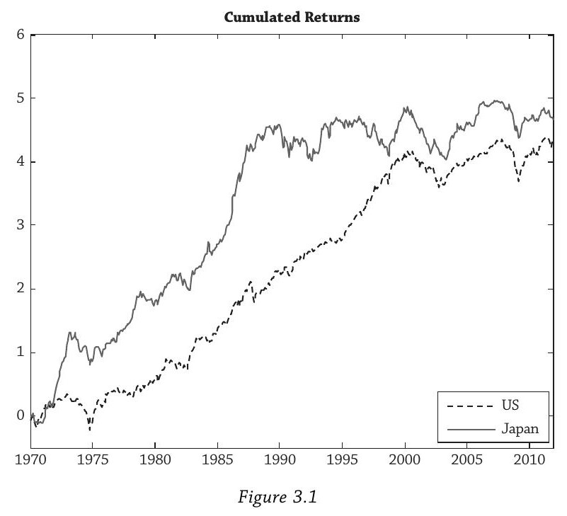

两个关键观察：

- **1980年代**：日本火箭式上涨，远超美国。当时日本企业疯狂收购美国资产——索尼买了哥伦比亚唱片，三菱买了洛克菲勒中心，1990年著名的Pebble Beach高尔夫球场也卖给了日本商人。
- **1990年后**：日本泡沫破裂，Nikkei在1989年达到顶峰后股市一直躺平；美国反过来起飞。2000年以后两国开始更多地同步波动。

关键点：美日两国的走势在很长时间内**不同步**。这种"不同步"就是分散化的来源。

### 2.2 均值-标准差空间

把美日各自的平均收益和波动率画在一张图上（Figure 3.2）：

- 美国：均值 10.3%，波动率 15.7%
- 日本：均值 11.1%，波动率 21.7%

x轴是标准差（风险），y轴是期望收益（回报）。美国是方块，日本是圆圈。

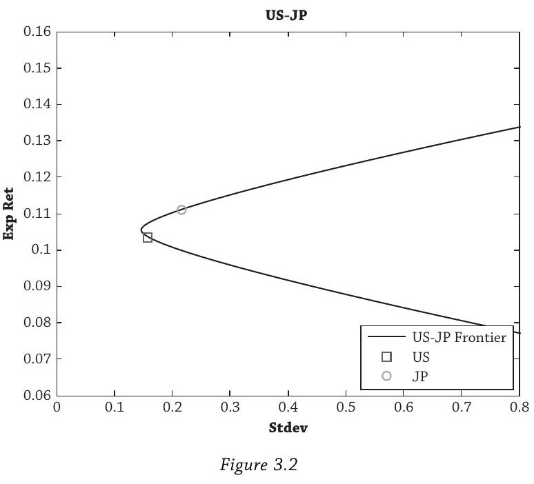

### 2.3 什么是均值-方差前沿

连接美日两点的那条**子弹形曲线**就是均值-方差前沿。曲线上每一个点代表美日的一种混合比例——100%美国在方块处，100%日本在圆圈处，中间是各种混合组合。圆圈右侧的部分代表杠杆组合（做空美国、超配日本）。

这条曲线有几个重要性质：

1. **上半部分是"有效的"**：上半段曲线上的组合，在同样的风险水平下，没有任何组合能获得更高的收益。投资者应该选上半段。
2. **美国落在了曲线的下半部分**：这意味着100%持有美国是**无效的**——存在另一个组合，风险相同但收益更高。所以没有人应该只持有100%美国。
3. **最左端的点是"最小方差组合"（Minimum Variance Portfolio）**：这个组合的波动率比美国和日本单独持有都低。这就是分散化的魔力。

### 2.4 分散化的数学原理

两资产组合的方差（公式3.1）：

$$\text{var}(r_p) = w_{US}^2 \, \text{var}(r_{US}) + w_{JP}^2 \, \text{var}(r_{JP}) + 2 \, w_{US} \, w_{JP} \, \rho_{US,JP} \, \sigma_{US} \, \sigma_{JP}$$

其中 $w_{US} + w_{JP} = 1$（组合权重之和为100%）。关键在第三项（交叉项）：当相关系数 $\rho_{US,JP}$ 较低时，这个交叉项很小甚至为负，组合方差就会被显著压低。美日的相关系数只有 **35%**（2000年后为59%，仍远低于1），所以混合持有能大幅降低风险。

经济直觉也很简单：相关性低意味着日本更可能在美国表现差的时候表现好，像一份"保险"——而且这份保险不仅不花钱，还能提高收益。当美国表现差时（如1980年代），日本可能表现好；反过来也一样。分散化的优势意味着我们不能孤立地看单个资产，必须考虑资产之间如何互动。**这是本章最重要的收获。**

莎士比亚在《威尼斯商人》中就表达了分散化的思想——商人Antonio说他的货物不押在同一艘船上，也不只去同一个地方，所以不用担心。

### 2.5 相关系数对前沿的影响

Figure 3.3 画了不同相关系数下的前沿。**这不是说投资者可以选择相关系数**——实际的相关系数是35.4%，由数据决定，改不了。这是一个**思想实验**，帮你建立直觉：

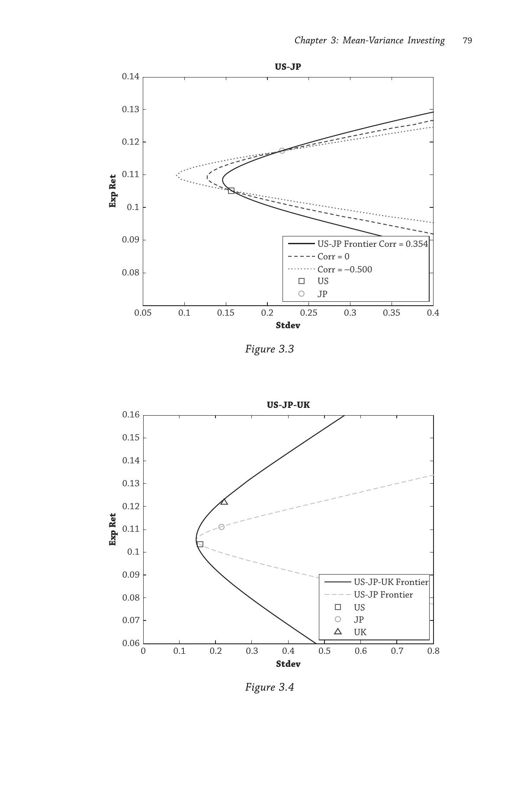

- 实线：实际相关系数 35.4%
- 虚线：相关系数 0%
- 点线：相关系数 -50%

相关系数越低，子弹头越尖、越往左凸——分散化效果越强。如果相关系数接近1（完全同涨同跌），前沿退化成一条直线，分散化就完全没用了。

书里的比喻：均值-方差前沿像**弥勒佛的肚子，肚子越大，投资者越富裕**。

投资者不能选择相关系数，但可以**选择投哪些资产**。如果你找到一个和现有持仓相关性很低的资产加入组合，就能让前沿大幅向左膨胀。这就是为什么挪威要把石油财富转化为全球股票和债券——它们和石油的相关性远低于1。反过来，剔除资产的成本取决于那个资产和组合中其他资产的相关性有多低。

### 2.6 加入更多国家：边际分散化收益递减

**从G2到G3（加入英国）**

Figure 3.4（上图下半部分）在美日（G2）基础上加入英国。实线是G3前沿（美日英），虚线是G2前沿（美日）。两个变化：

1. **前沿大幅向外扩张**：弥勒佛的肚子明显更大了。在同样风险水平下能获得更高收益。多了英国这个"保险"——当美国和日本同时表现差时，英国有可能表现好。
2. **所有单个资产都落在前沿内部**：任何单一国家都被"支配"了。分散化组合总能做得更好。

**从G3到G5（加入德国和法国）**

Figure 3.5 再加入德国和法国，得到G5前沿：

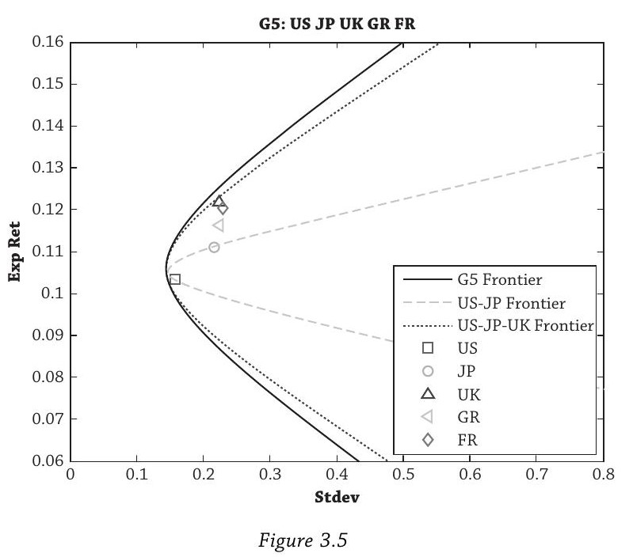

G5前沿是最胖的，G2和G3前沿都被包在里面。但注意一个重要现象：**从G3到G5的扩张幅度，明显小于从G2到G3的扩张幅度。**

这就是**边际分散化收益递减**。直觉很好理解：当你已经有三个国家的时候，再加两个国家，它们能提供的"独特保险"就没那么多了——因为德国、法国和已有的英国之间本身就有不少相关性，新增的独立信息有限。

两条核心规律：

1. **加资产，前沿扩张；减资产，前沿收缩。** 这就是为什么挪威剔除沃尔玛会损失分散化收益。
2. **边际收益递减。** 当你已经有很多资产时，再加一个或减一个的影响很小。这暗示了挪威剔除沃尔玛的成本可能微乎其微。

### 2.7 前沿的数学构造方法

书中给出了前沿的正式构造方法（公式3.2）：

$$\min_{\{w_i\}} \text{var}(r_p) \quad \text{s.t.} \quad E(r_p) = \mu^* \quad \text{and} \quad \sum_i w_i = 1$$

意思是：给定一个目标收益 $\mu^*$，找到方差最小的那个组合权重。然后不断改变 $\mu^*$，把每个目标收益对应的最小方差点连起来，就是前沿。Figure 3.6 画了这个过程——分别取 $\mu^* = 10\%$ 和 $\mu^* = 12\%$，找到对应的最小方差点（标记为X），连起来就是前沿。

这是一个**二次规划问题（Quadratic Programming）**，有非常高效的算法可以求解，这也是均值-方差框架如此流行的一个重要原因。

### 2.8 加约束：禁止做空

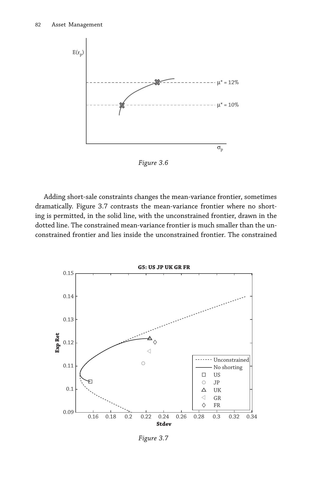

Figure 3.7 比较了有无做空约束的前沿。虚线是无约束前沿，实线是禁止做空（$w_i \geq 0$）的前沿。

禁止做空后，前沿**大幅收缩**，而且不再是完美的子弹形。约束限制了投资者的操作空间——做空本质上是"借来一个资产卖掉，用钱去多买另一个资产"，禁止做空就砍掉了这种杠杆操作。

不过，即使有约束，分散化的核心逻辑不变：组合仍然优于单一资产。在Figure 3.7中可以看到，有些区域约束前沿和无约束前沿重合——说明投资者在那些区域本来就不需要做空，约束不产生额外成本。

---

## 3. 不分散化的代价

### 3.1 集中持仓的惨痛教训

书里列举了大量案例，核心信息就一个：**把鸡蛋放在一个篮子里，篮子掉了就全完了。**

**个人层面：**

- Poterba（2003）研究发现，大型企业DC养老金计划中，员工约40%的资产是自家公司股票。通常来自打折购买，目的是增强员工忠诚度。
- **安然**（2001年破产）：员工退休账户超过60%是安然股票。
- **雷曼**（2008年破产）：同样的故事。
- **Lucent**：1996年从AT&T分拆后螺旋下跌，2006年被阿尔卡特以极低价格收购。
- 即使公司没破产，集中持仓也有代价。Poterba估算，如果一半资产是公司股票，相比持有分散化的S&P 500，确定性等价大约只有后者的**80%**。这是巨大的效用损失。
- Employee Benefits Research Institute数据显示，2009年有股票敞口的401(k)参与者中，12%只持有本公司股票；60岁以上的参与者中，17%的股票敞口全部来自雇主股票。

**富豪层面：**

- JP Morgan 2004年白皮书标题："改善15%留富概率"——第一批福布斯400富豪中，一代人后仍在榜上的不到**15%**。首要原因：过度集中。
- Kennickell（2011）报告：2007年最富有的1%美国家庭中，两年后大约三分之一跌出了这个群体。
- 企业家和通过单一业务创造财富的人往往觉得分散化违反直觉——毕竟不正是集中持仓让他们富起来的吗？但分散化消除的是管理者无法控制的公司特有风险：监管风险、宏观风险、技术变革、主权风险。
- 1990年S&P 500的500家公司，到2000年只有一半还在指数里。道琼斯1896年初始的30只成分股，到写书时只剩**通用电气**一家。

**机构层面：**

- **罗切斯特大学**：1971年捐赠基金排全美私立大学第四（5.8亿美元），重仓本地公司尤其是柯达。1970–1992年只赚了7%，而简单的60/40组合回报11%。如果按60/40基准投资，1992年应排第十。到2011年排名跌到第三十。柯达2012年破产。
- **波士顿大学**：1987年捐赠基金1.42亿美元，往本地生物科技公司Seragen砸了至少1.07亿。Seragen上市后遭遇挫折，1997年那笔投资只值400万。Seragen最终在1998年被Ligand Pharmaceuticals以3000万收购。

与这些反面教材相反，挪威主权财富基金恰恰是为了收获分散化收益而设立的——把高度集中的石油资产转换为分散化的金融组合。

### 3.2 本土偏好之谜（Home Bias）

均值-方差理论说：没有人应该只持有本国资产。但现实中绝大多数投资者恰恰这么做。

数据有多夸张：

- 美国投资者组合中外国股票只占12%，但全球市场中非美国股票占约50%
- 英国投资者组合中外国资产占30%，但全球非英国权重为92%
- 日本更极端：外国股票不到10%，但非日本股票占全球90%以上

五个解释：

**1. 相关性时变：** 全球熊市时各国相关性飙升（如1987年股灾、1998年俄罗斯危机、2008年金融危机），分散化在最需要的时候反而失效。但Ang和Bekaert（2002）发现即使考虑了这一点，国际分散化仍然有显著好处。

**2. 汇率风险：** 投资海外多了一层汇率波动。但Fidora等人（2007）表明汇率只能解释一小部分本土偏好。

**3. 交易成本：** 过去确实很高，但随着ADR（美国存托凭证）和国际基金的普及已经大幅下降。本土偏好率从1980年代初的近1.0降到2000年代初的0.8以下。但Glassman和Riddick（2001）估算，要解释观察到的本土偏好程度，交易成本需要高达每年**12%以上**——这完全不现实。

**4. 信息不对称：** 本地投资者可能更了解本地公司。Coval和Moskowitz（2001）发现美国基金经理投资本地区公司表现更好（"本土偏好的本土偏好"）。但其他研究（Grinblatt和Keloharju (2000)等）发现反而是外国投资者在本地市场表现更优。实证证据是混合的。

**5. 行为偏差：** Huberman（2001）认为"人们就是喜欢投资熟悉的东西"。Morse和Shive（2011）发现爱国主义程度越高的国家，本土偏好越严重。

书的态度很明确：不管原因是什么，本土偏好是**非理性的**。"你的钱应该像急着离家的叛逆青少年——出去投资海外，享受分散化的好处。"

### 3.3 分散化真的是免费午餐吗？

书里给了一个诚实的回答：**在均值-方差框架下，是的。**

方差在资产不完全相关时一定会降低（见公式3.1）。但如果关心方差以外的风险度量——比如下行风险、偏度——分散化不一定免费。组合可能比单个资产有更大的负偏度（更严重的尾部损失）。技术上说，高阶风险度量不一定满足次可加性。

另外，分散化也杀死了"中彩票"的可能。如果你想靠押注下一个谷歌成为亿万富翁，分散化不适合你。但对于风险厌恶的投资者来说，消除集中风险带来的好处远大于放弃极端收益的损失。

总体信息：**分散化是好的。它消除可避免的特异风险，整体性地看待资产之间的互动。通过分散化，投资者能持有严格更优的组合——更高的单位风险收益或更低的给定目标收益下的风险。**

---

## 4. 均值-方差优化：如何选最优组合

分散化告诉我们应该选前沿上的组合，但前沿上有无数个点，具体选哪个？这取决于投资者的**风险厌恶程度 $\gamma$**。

### 4.1 没有无风险资产的情形

投资者的目标是最大化均值-方差效用（公式3.3）：

$$\max_{\{w_i\}} E(r_p) - \frac{\gamma}{2} \text{var}(r_p)$$

$\gamma$ 是风险厌恶系数，因人而异。$\gamma$ 越大，越怕风险，越偏好低波动的组合。

Figure 3.8 用三张子图解释了求解过程：

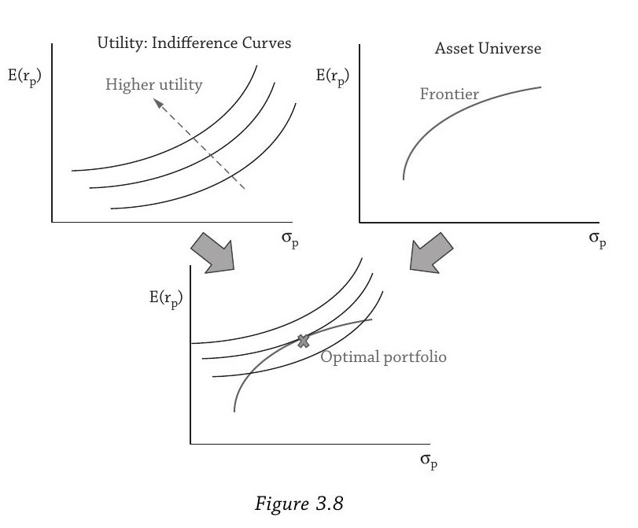

**左上——无差异曲线：** 每条曲线上的所有组合对投资者来说效用相同——他"无所谓"选哪个。越往左上方的曲线代表越高的效用。

**右上——均值-方差前沿：** 这是资产世界决定的，和投资者的偏好无关。

**下方——两者叠加：** 把无差异曲线和前沿画在同一张图上，找**最高的那条无差异曲线刚好和前沿相切的点**，标记为X。这就是最优组合。

为什么是切点？比切点更高的无差异曲线虽然效用更高，但不和前沿相交——不可实现。比切点更低的曲线和前沿有交集，但既然可以往上移，为什么不移？所以最优就是刚好相切的那个点。

Figure 3.9 给出了 $\gamma = 3$ 的G5投资者的具体结果：

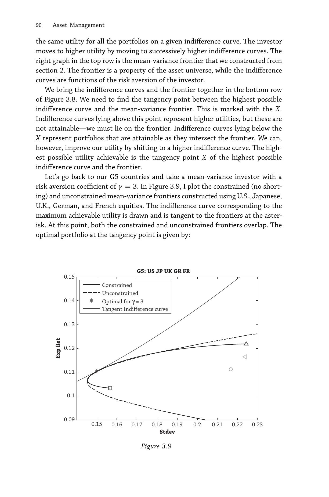

最优权重（Sharpe比率0.669）：

| US | JP | UK | GR | FR |
|---|---|---|---|---|
| 0.45 | 0.24 | 0.16 | 0.11 | 0.04 |

这个组合以美国和日本为主（合计69%），权重和这些国家的市值权重比较接近。由于没有无风险资产，所有权重加总为1。

### 4.2 有无风险资产的情形：两基金分离

加入无风险资产（如T-bill）后，投资者的选择空间大幅扩展。James Tobin（1958，1981年诺贝尔奖）提出了一个优雅的**两步法**：

**第一步：找到最优风险资产组合（MVE）**

MVE（Mean-Variance Efficient portfolio），也叫切线组合（tangency portfolio），是所有纯风险资产组合中**Sharpe比率最高**的那个。它和投资者的风险厌恶无关——所有投资者共享同一个MVE。

在Figure 3.10中，从y轴上无风险利率（1%）画一条直线，使它和前沿相切。切点就是MVE，这条直线就是**资本配置线（CAL, Capital Allocation Line）**。CAL的斜率就是最大可达Sharpe比率。

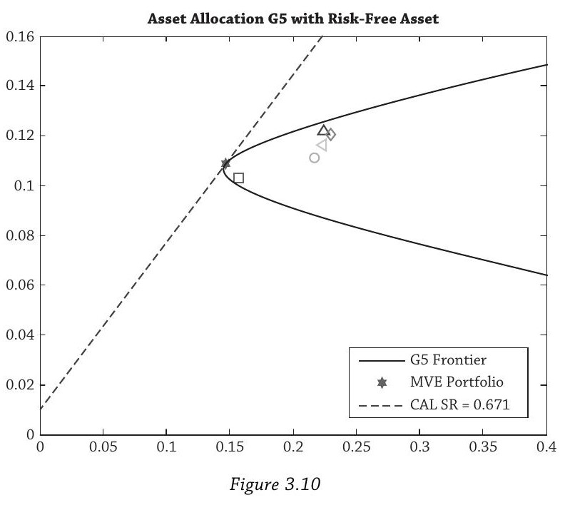

为什么是切线？任何更陡的线（更高Sharpe）不与前沿相交——实现不了。任何更平的线虽然可行但Sharpe更低——不是最优。所以最大Sharpe比率就是切线的斜率。

MVE权重（Sharpe比率0.671）：

| US | JP | UK | GR | FR |
|---|---|---|---|---|
| 0.53 | 0.24 | 0.12 | 0.10 | 0.02 |

CAL上所有组合都具有相同的Sharpe比率（除了100%无风险的端点）。

**第二步：在MVE和无风险资产之间分配**

这一步才和个人风险厌恶 $\gamma$ 有关。保守的投资者多放钱在无风险资产里（位于MVE左侧的CAL上），激进的投资者借钱加杠杆买MVE（位于MVE右侧的CAL上）。

Figure 3.11 展示了 $\gamma = 3$ 的投资者的选择。他的最优点（三角形）在MVE的**右边**，意味着他**做空无风险资产（以1%利率借钱）**，加杠杆投入风险资产：

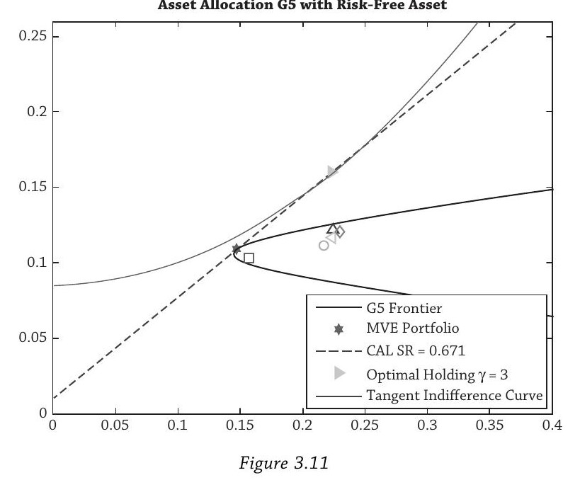

| US | JP | UK | GR | FR | Risk-Free |
|---|---|---|---|---|---|
| 0.80 | 0.37 | 0.18 | 0.15 | 0.03 | -0.52 |

注意风险资产之间的比例和MVE**完全相同**。比如美国的比例：$0.80 / (0.80+0.37+0.18+0.15+0.03) = 0.53$，正好是MVE中美国的权重。

**这就是两基金分离的含义：所有投资者持有相同的风险资产组合（MVE），区别只在于和无风险资产的混合比例。**

### 4.3 两基金分离带来多大改善？

有无风险资产时，确定性等价为0.085；没有时为0.077。多了80个基点的"免费"效用提升，仅仅因为可以借贷无风险资产。

### 4.4 股市非参与之谜

理论说，除了无限风险厌恶的人，所有人都应该持有一些股票。但现实中（Table 3.12），只有大约一半的美国家庭持有股票（包含退休账户时），欧洲更低，意大利、希腊、西班牙只有约10%。

解释包括：

1. **非均值-方差效用**：失望厌恶（disappointment aversion）等效用函数可以导致理性地完全不参与股市。
2. **参与成本**：不仅包括交易成本，还包括学习金融知识的成本和克服恐惧的"心理成本"。Vissing-Jørgensen（2002）估计仅50美元（2000年价格）就能解释一半非参与者。但Andersen和Nielsen（2010）发现，因亲人突然去世而继承股票的家庭（零参与成本进入市场）大多直接卖掉所有股票换成债券。
3. **社会因素**：是否投资取决于邻居是否投资、是否政治活跃、是否信任市场、以往是否在股市亏过。Grinblatt等（2012）发现智商越高越可能投资股票。

书的建议很直接：**不要做非参与者。投资股市，获取股权风险溢价。但要作为分散化组合的一部分。**

---

## 5. "垃圾进，垃圾出"：均值-方差优化的致命弱点

前面的理论很漂亮，但到了实践中，均值-方差优化的表现往往令人失望。原因很简单：**输入参数（均值、波动率、相关系数）的微小误差，会导致输出权重的剧烈变化。**

### 5.1 一个触目惊心的例子

Figure 3.13：用G5数据，美国的样本均值是10.3%。把它改成13.0%——这个改动完全在统计上两个标准误范围内，无法判断哪个更"对"。

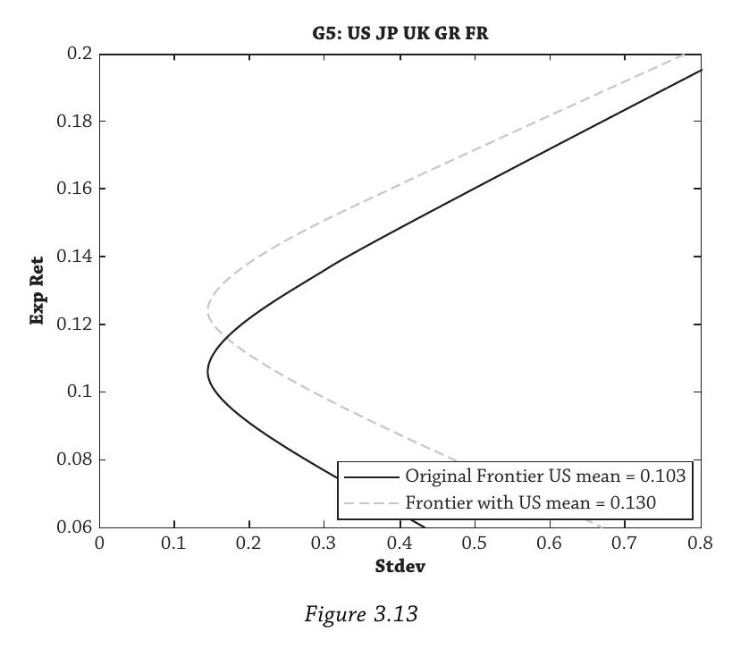

看看目标收益12%对应的前沿组合权重怎么变：

| | US | JP | UK | GR | FR |
|---|---|---|---|---|---|
| 美国均值 = 10.3% | -0.09 | 0.21 | 0.48 | 0.18 | 0.23 |
| 美国均值 = 13.0% | 0.41 | 0.39 | 0.05 | 0.20 | -0.05 |

美国从做空9%变成做多41%，英国从48%暴跌到5%，法国从23%变成做空5%。一个输入参数的小幅调整，导致整个组合面目全非。

这就是为什么Michaud（1989）管均值-方差优化叫**"误差最大化组合"（error maximizing portfolios）**——优化器不是在最大化收益，而是在最大化你估计误差的影响。

### 5.2 怎么办？六个应对策略

**1. 换效用函数**

投资者实际上还怕下行风险、关心相对业绩（追上邻居）、厌恶损失。更现实的效用函数（如第2章介绍的习惯效用、失望厌恶等）能产生更稳健的组合。遗憾的是，当时市面上几乎没有针对这些效用函数的商业优化器。

**2. 加约束**

Jagannathan和Ma（2003）证明加约束对稳健性帮助很大。比如禁止做空、限制单个资产权重上限。约束的本质是把那些极端的、不合理的权重拉回来，可以被理解为一种**稳健估计器（robust estimator）**——和机器学习里的L1/L2正则化思想一样，防止过拟合。

**3. 用稳健统计方法**

最重要的一类是**贝叶斯收缩估计（Bayesian shrinkage）**（James-Stein, 1961）。核心思想：不要直接用样本统计量，把它往一个"先验"方向拉：

- 用CAPM隐含的均值代替样本均值
- 假设同行业的股票有相似的波动率和相关性（Ledoit和Wolf, 2003）
- 收缩inverse covariance而不只是covariance（Kourtis等, 2009）

极端的估计值会被拉回合理范围。但再好的统计方法也救不了垃圾数据。

**4. 不要只用历史数据**

用短期滚动样本估计输入参数是最危险的做法，因为它导致**顺周期性（pro-cyclicality）**：

- 过去收益高 → 估计的未来均值也高 → 但实际上高价格预示着低未来收益
- 2007年之前波动率很低 → 估计的风险也低 → 但低波动率时期恰恰是风险积聚的时期

书里引用英格兰银行Andrew Crockett爵士的名言：*"传统观点认为风险在衰退中上升、在繁荣中下降。但也许更准确的说法是：**风险在上升期积聚，在衰退中释放**。"*

**5. 用经济模型**

书里特别推荐了**Black-Litterman（1991）**方法。它的逻辑很精巧：

- 我们观察得到市场市值权重
- 根据CAPM，市场组合是均值-方差有效的
- 从市值权重**反推**出市场隐含的期望收益（这些是不可观测的）
- 然后允许投资者在此基础上加入自己的观点，用收缩估计融合两者

这样产生的期望收益比纯样本均值合理得多，因为它锚定在市场价格（可观测的）上。

另一个框架是**因子投资**（第14章）：不要看资产类别标签（"私募股权""对冲基金"），而是看穿到底层的因子风险敞口。很多表面不同的资产类别实际上有相同的因子风险，2008年它们一起崩盘就是证据。

**6. 保持简单（KISS原则）**

**这是书里最强调的建议。** 简单的分散化策略往往比复杂的二次规划优化做得更好。最简单的等权组合 $1/N$ 就是最强的选手之一。简单策略也提供了强基准，用来衡量复杂模型到底有没有附加价值。

---

## 6. 策略赛马：简单打败复杂

这是全章最精彩的实证部分。

### 6.1 实验设计

四类资产：美国国债（Barcap US Treasury）、美国公司债（Barcap US Credit）、美股（S&P 500）、国际股票（MSCI EAFE）。时间：1978年1月至2011年12月，月度数据。滚动5年窗口（t-60到t）估计参数，每月调仓。做空限制在每类资产-100%。无风险利率用一月期T-bill。

书里坦言，用短期滚动样本正犯了上一节批评的错误——故意这样做是为了凸显问题，帮助理解为什么某些特殊情况表现好而另一些表现差。

### 6.2 参赛选手

- **均值-方差权重**：完整优化，最大化Sharpe比率。最复杂。
- **市值权重**：按各资产类别的市值比例持有。完全被动，不需要估计。
- **多样化权重**：市值权重的幂变换（Fernholz等, 1998），向小市值资产倾斜。
- **等权（1/N）**：每类资产各25%。不需要估计但需要定期再平衡。1500年前巴比伦塔木德就推荐过："三分之一土地、三分之一商品、三分之一现金"。
- **风险平价（方差版）**：权重和方差成反比。不估均值和相关系数，只估波动率。桥水基金1996年的"全天候"策略就基于此。创始人Ray Dalio 2011年赚了39亿美元。
- **风险平价（波动率版）**：权重和波动率成反比。Martellini (2008)等人提倡。
- **最小方差**：前沿最左端。不估均值但估波动率和相关系数。
- **等风险贡献**：让每个资产对组合总方差的贡献相等。
- **Kelly法则**：最大化期望对数收益，长期最大化财富。
- **Sharpe比率成正比**：过去5年Sharpe高的资产多配。

### 6.3 结果

| 策略 | 收益率 | 波动率 | Sharpe比率 |
|---|---|---|---|
| 均值-方差权重 | 6.06% | 11.59% | **0.07** |
| 市值权重 | 10.25% | 12.08% | 0.41 |
| 多样化权重 | 10.14% | 10.48% | 0.46 |
| 等权 1/N | 10.00% | 8.66% | 0.54 |
| 风险平价（方差） | 8.76% | 5.86% | 0.59 |
| 风险平价（波动率） | 9.39% | 6.27% | **0.65** |
| 最小方差 | 7.96% | 5.12% | 0.52 |
| 等风险贡献 | 7.68% | 7.45% | 0.32 |
| Kelly法则 | 7.97% | 4.98% | 0.54 |
| Sharpe比率成正比 | 9.80% | 9.96% | 0.45 |

最复杂的均值-方差优化Sharpe只有**0.07**，惨不忍睹。最简单的等权有**0.54**。风险平价（波动率）最高达到**0.65**。作为参考，100%美股的Sharpe是0.35，被除均值-方差外的所有分散化策略碾压。

De Miguel, Garlappi, and Uppal (2009) 发现简单的1/N规则跑赢了大量更复杂的均值-方差实现方式，包括贝叶斯稳健估计、组合约束、组合的最优组合等。

Figure 3.15 把市值权重、等权、风险平价和均值-方差四个策略的累计收益画在一起（调整到相同波动率后），等权和风险平价的优势一目了然，风险平价的回撤还最小：

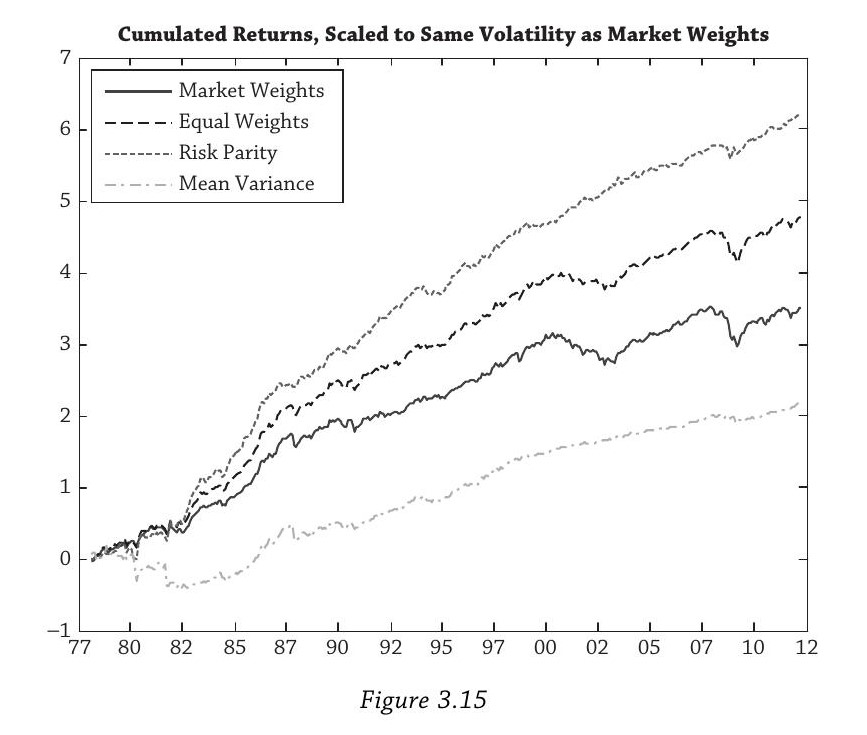

### 6.4 为什么简单策略赢了？——参数估计的层次结构

Table 3.16 给出了关键洞察——从上到下，需要估计的参数越来越少：

| 策略 | 均值假设 | 波动率假设 | 相关系数假设 | 需要估计的东西 |
|---|---|---|---|---|
| 均值-方差 | 自由估计 | 自由估计 | 自由估计 | 最多，最容易出错 |
| 最小方差 | 假设相等 | 自由估计 | 自由估计 | 去掉了最难估的均值 |
| 风险平价 | 假设相等 | 自由估计 | 假设为零 | 只估波动率 |
| 等权 1/N | 假设相等 | 假设相等 | 假设相等 | 什么都不估 |
| 市值权重 | — | — | — | 什么都不估（被动） |

三个参数的估计难度排序：**均值 >> 相关系数 > 波动率**

- **均值最难估**：提高采样频率（日频、周频）对估计均值**毫无帮助**——只有延长样本期才能提高精度（Merton, 1980）。对S&P 500来说，长期均值本质上只取决于期初和期末的指数水平，中间怎么走都无关。预测收益因此极其困难。最小方差组合砍掉了均值估计，所以比全优化好。
- **波动率比均值好估得多**：高频数据能显著提高波动率估计精度，而且波动率永远为正，不会像相关系数那样翻转符号。有很好的预测模型（GARCH、随机波动率模型）。
- **相关系数比波动率难估**：可正可负，小幅变化就能导致权重大幅摆动。Green和Hollifield (1992) 提供了平均相关系数的界限。风险平价假设相关系数为零，砍掉了这个噪声源，所以比最小方差更好。

四类资产只有14个参数要估计（4个均值 + 4×5/2 = 10个协方差矩阵元素），均值-方差就已经崩了。如果是100只股票，参数数量是**5,510个**；5000只股票则超过**12,000个**。灾难可想而知。

**本质上这和机器学习里的偏差-方差权衡（bias-variance tradeoff）是同一回事**：简单模型偏差大但方差小，复杂模型偏差小但方差大。当数据有限、噪声大时，简单模型往往泛化得更好。等权的假设（所有资产均值、波动率、相关系数都相同）显然是"错的"，但它避免了估计误差，所以在样本外表现更稳健。

### 6.5 对资产所有者的实操建议

不要一上来就用全优化。先问自己：**我有能力准确估计哪些参数？**

1. **什么都估不好，且不能再平衡？→ 持有市值权重**，完全被动。赛马结果显示你会做得不错（Sharpe 0.41），远好于全优化。
2. **能再平衡，但不能估计任何参数？→ 用等权**。你会跑赢市值权重（Sharpe 0.54 vs 0.41）。事实上任何固定权重的分散化组合都表现不错（Jacobs等 (2010) 分析了超过5000种组合构建方法）。等权对大型投资者可能难以实施（大额交易会移动价格），但原则上任何well-balanced的固定权重配置都行。
3. **能准确估计波动率，但估不好相关系数和均值？→ 考虑风险平价**。理想情况下要用未来波动率的预测（GARCH等模型），而不仅是历史波动率。
4. **还能准确估计相关系数？→ 考虑最小方差**。放松风险平价的零相关假设。
5. **三个参数都能准确估计（极罕见）？→ 才考虑全优化**。

**关键洞察：每放松一个假设，如果你的估计质量不够好，不仅不会改善组合，反而会因为引入噪声而拖累表现。**

### 6.6 风险平价的警告

Table 3.14第二面板报告了各策略的平均权重。风险平价在样本里表现好，很大程度上因为它**大幅超配了债券**：

- 风险平价（方差版）：平均51%美国国债 + 36%公司债（vs 市值权重的14% + 8%）
- 风险平价（波动率版）：债券比例更高

1980年代初到2011年利率持续下行，债券表现极好，这是风险平价高Sharpe的重要来源。

更深层的问题：风险平价超配低波动资产，但过去波动率低的时候往往**价格高、未来收益低**。书里引用对冲基金经理Howard Marks的话：*"价值投资者认为高风险和低预期收益不过是同一枚硬币的两面，两者都源于高价格。"*

写书时（2013年），国债收益率在历史低位，债券价格极高。"无风险"的美国国债可能因为价格太高反而成为最危险的投资。风险平价如果忽视估值，长期会有**顺周期性**问题，而且这种顺周期性因为利率的缓慢均值回归，会在**数十年**的尺度上表现出来。

---

## 7. 回到挪威：剔除资产的实际成本

### 7.1 实验设计

用FTSE全球指数（2012年6月底，39个行业，2871只股票）做实验。协方差用基于CAPM beta的贝叶斯收缩估计器（Ledoit和Wolf, 2003），期望收益用Black-Litterman（1991）变体，无风险利率2%，限制行业权重为正（不做空）。

逐步剔除行业：

- 起点：全部39个行业
- 剔除烟草（挪威2010年起排除所有烟草股）
- 再剔除航空航天与国防（挪威自动排除涉及核武器和集束弹药制造的公司，截至2012年6月已排除19家国防制造商）
- 再剔除银行（伊斯兰教法禁止以衍生品和债务作为盈利手段，一些Sharia合规基金不持有银行）

### 7.2 结果

| | 最小波动率 | 最大Sharpe比率 |
|---|---|---|
| 全部行业 | 12.05% | 0.4853 |
| 剔除烟草 | 12.10% | 0.4852 |
| 剔除烟草+国防 | 12.10% | 0.4852 |
| 剔除烟草+国防+银行 | 12.10% | 0.4843 |

最小波动率从12.05%变到12.10%，几乎没动。最大Sharpe从0.4853降到0.4843，变化在**万分之一**的量级。Figure 3.17 画了四条前沿，在图上**完全无法区分**：

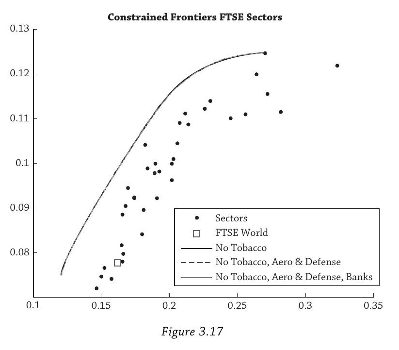

### 7.3 为什么损失这么小？

损失小**不是因为**那些被剔除的行业本来就没被持有。在全行业组合中，最大Sharpe组合里烟草占**1.53%**，国防占**1.19%**，银行占**9.52%**。即使是接近10%的银行持仓被剔除，对分散化收益的影响也微乎其微。

原因是**边际分散化收益递减**（第2.6节）：从38个行业到39个行业，新增的独立"保险"价值极为有限——那个被剔除的行业在其他38个行业同时暴跌时独自表现优异的可能性很低。

回到沃尔玛：挪威的投资组合包含数千只股票，剔除一只公司的影响比剔除一个行业还小得多。**挪威剔除沃尔玛的分散化成本实质上为零。**

注意：这里计算的是**事前（ex-ante）分散化收益的损失**，而不是事后收益差异或跟踪误差。

### 7.4 社会责任投资（SRI）的更广泛讨论

**作为分散化策略：SRI必然亏钱**

从均值-方差角度，任何约束都只能让前沿收缩或不变，不可能扩张。SRI通过排除公司缩小投资范围，数学上必然损失分散化收益。但从高度分散的起点出发，这个损失极小。

**作为主动管理策略：SRI可能赚钱**

一些SRI评分高的公司往往更透明、治理更好、管理层侵占股东利益更少、库存管理高效、少用会计花招。Gompers, Ishii, and Metrick (2003) 创建治理指数，发现治理好的"共和国"型公司比治理差的"独裁"型公司回报更高。如果SRI标准恰好捕捉了这些和收益相关的公司特征，它可以作为选股因子产生超额收益。

但也有反面证据：

- Geczy等 (2004)：SRI共同基金每月跑输同行30个基点。
- Hong和Kacperczyk (2009)："罪恶"股票（烟草、枪械、赌博）的风险调整收益反而**高于**可比股票。
- Hong等 (2012)：企业社会责任对企业来说是有成本的，只有不受资金约束的企业才会"做好事"。

凯恩斯1936年写道：*"没有明确的证据表明，对社会有利的投资政策与最赚钱的投资政策是一致的。"* 作者认为这句话到2013年仍然适用。

**SRI的真正价值**

SRI最重要的功能可能不是投资回报，而是**反映资产所有者的偏好**。挪威践行SRI让主权基金在国民眼中具有合法性。SRI是资产所有者的选择，但成本应该被量化——而从高度分散化的组合出发，这个成本可以忽略。

**重要区分**：通过排除公司来做SRI（缩小投资范围，有成本）vs 通过积极选择SRI特征好的公司来做SRI（不限制投资范围，可能产生alpha）。后者更有希望，但和所有主动策略一样，很难持续跑赢因子策略。

---

## 全章总结

整章的逻辑链条是完整的：

1. **分散化是好的**——加资产扩张前沿，减资产收缩前沿（第2节）
2. **分散化的数学基础**——低相关性降低组合方差（公式3.1）
3. **不分散化的真实代价**——安然、雷曼、罗切斯特、波士顿大学的惨痛教训（第3节）
4. **最优组合的选择**——无差异曲线与前沿的切点；有无风险资产时的两基金分离（第4节）
5. **实践中的陷阱**——参数估计误差被优化器放大，"垃圾进垃圾出"（第5节）
6. **简单策略胜出**——等权和风险平价比全优化好得多，因为估计的参数少（第6节）
7. **剔除少量资产的成本极小**——边际分散化收益递减，挪威做ESG几乎没有代价（第7节）

> **一句话浓缩：** 分散化是均值-方差世界的免费午餐，但实现它要靠简单策略而不是复杂优化，因为参数估计误差会吃掉理论上的最优性。所有策略的共同特征是分散化——这才是本章的核心信息。
