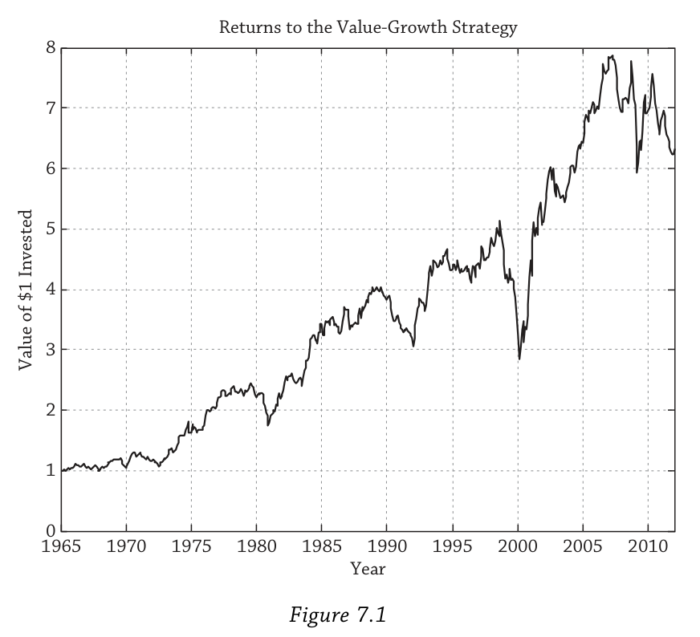
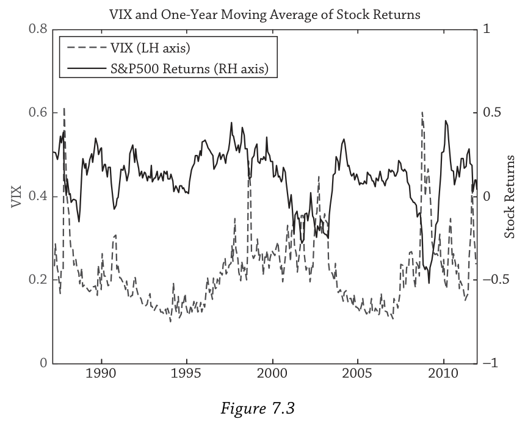
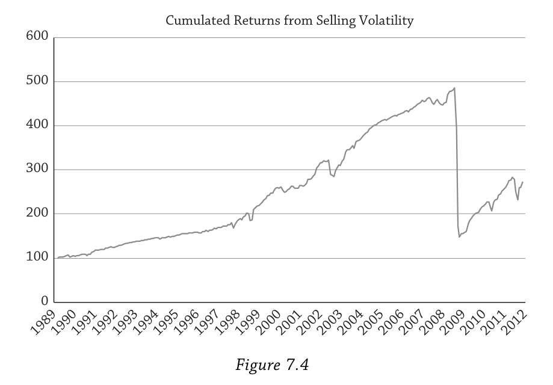
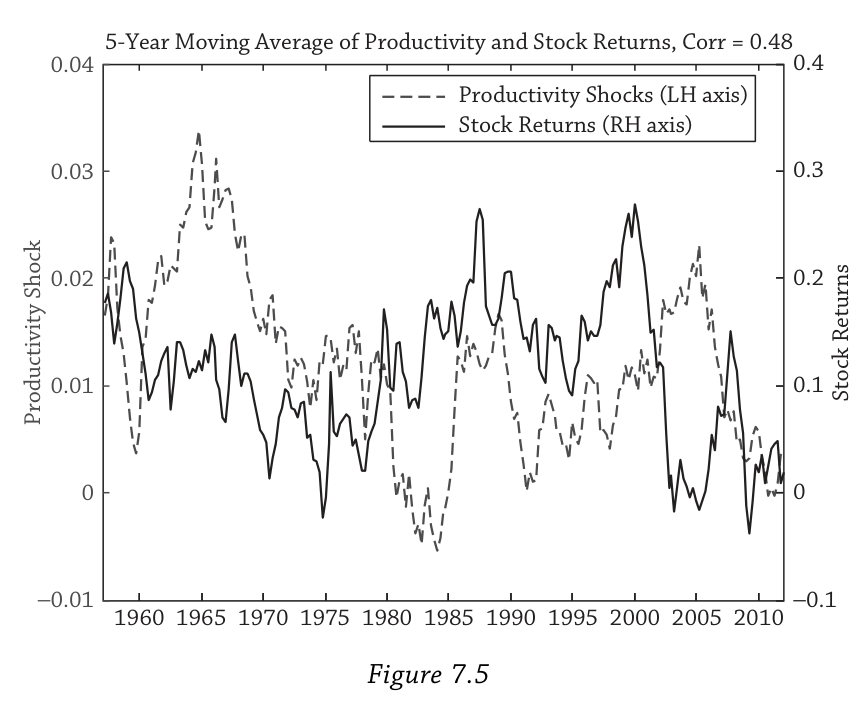
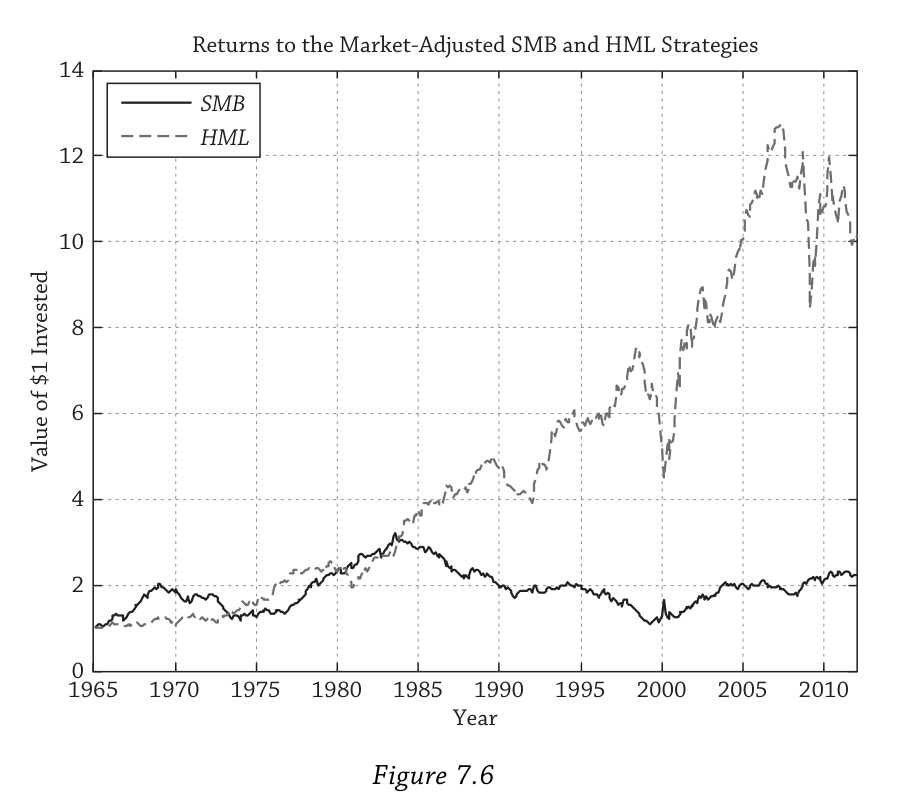
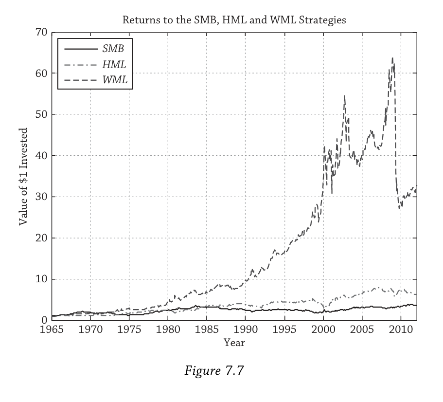

# Chapter 7: Factors（因子）

## 0. 从一个问题开始：价值投资为什么有效？

假设你从1965年开始执行一个简单的策略：每个月买入那些"便宜"的股票（价格相对于账面价值低，即高账面市值比），同时做空那些"昂贵"的股票（低账面市值比）。你会赚多少钱？

Figure 7.1给出了答案——1美元在近五十年里增长到了将近8美元。价值投资，长期来看，确实有效。

但这条曲线远不是一路向上的。注意2000年前后那个深深的回撤——那是科技泡沫最疯狂的时期，成长股把价值股打得体无完肤。2008年金融危机中价值策略也遭受了重创。所以这个策略虽然长期赚钱，但短期可以亏很多。

这就引出了本章的核心问题：价值策略的超额收益到底来自哪里？它是对某种系统性风险的合理补偿，还是投资者犯了系统性的错误？更广泛地说——**是什么驱动了资产的风险溢价？**

答案是：**因子（Factors）**。

上一章建立了因子定价的抽象理论框架，本章把它落地。因子分为两大类：一类是宏观因子，包括经济增长、通胀、波动率等经济体层面的变量；另一类是投资风格因子，包括市场、价值、规模、动量等可交易的策略。两类因子并非割裂——投资风格因子的表现往往反映了底层的宏观风险。比如价值策略在衰退期容易亏钱，说明它暗含了对经济增长的暴露。

贯穿全章的核心逻辑只有一句话：**任何风险溢价之所以存在，是因为它补偿了投资者在"坏时期"（bad times）承受的损失。不同因子定义了不同的坏时期。** 理解了这一点，因子投资的所有故事就都串起来了。

我们先从宏观因子讲起。

---

## 1. 宏观因子：什么定义了"坏时期"？

宏观因子之所以重要，是因为它们从根本上定义了"坏时期"是什么。当经济增长放缓、通胀飙升或市场波动率暴涨时，几乎所有投资者都会受到影响——只是程度不同。这些因子像潮汐一样影响着所有资产的价格。

有一个细节值得提前说明：**真正影响资产价格的不是宏观变量的水平，而是它的"意外变化"。** 宏观变量通常很有持续性——这个月通胀低，下个月大概率还是低。月末通胀依然很低并不构成意外。但如果通胀突然跳升，这个unexpected shock才是让资产价格剧烈反应的原因。

### 1.1 经济增长：最直觉的坏时期

经济增长是最直觉的因子：经济好时企业盈利好、股票涨；经济差时企业盈利差、股票跌。但不同资产对增长风险的反应方向截然不同，这正是Table 7.2告诉我们的核心信息。

#### Table 7.2 条件于因子状态的收益均值与波动率

**均值**

| | 大盘股 | 小盘股 | 政府债券 | 投资级公司债 | 高收益债 |
|---|---|---|---|---|---|
| 全样本 | 11.3% | 15.3% | 7.0% | 7.0% | 7.6% |
| **经济周期（NBER）** | | | | | |
| 衰退期 | 5.6% | 7.8% | 12.3% | 12.6% | 7.4% |
| 扩张期 | 12.4% | 16.8% | 5.9% | 6.0% | 7.7% |
| **实际GDP增速** | | | | | |
| 低增长 | 8.8% | 12.2% | 10.0% | 9.7% | 7.0% |
| 高增长 | 13.8% | 18.4% | 3.9% | 4.4% | 8.2% |
| **消费增速** | | | | | |
| 低消费 | 5.6% | 5.6% | 9.6% | 9.1% | 7.1% |
| 高消费 | 17.1% | 25.0% | 4.4% | 5.0% | 8.2% |
| **通胀** | | | | | |
| 低通胀 | 14.7% | 17.6% | 8.6% | 8.8% | 9.2% |
| 高通胀 | 8.0% | 13.0% | 5.4% | 5.3% | 6.0% |

**波动率**

| | 大盘股 | 小盘股 | 政府债券 | 投资级公司债 | 高收益债 |
|---|---|---|---|---|---|
| 全样本 | 16.0% | 23.7% | 10.6% | 9.8% | 9.5% |
| **经济周期** | | | | | |
| 衰退期 | 23.7% | 33.8% | 15.5% | 16.6% | 18.1% |
| 扩张期 | 14.0% | 21.2% | 9.3% | 7.8% | 6.8% |
| **实际GDP增速** | | | | | |
| 低增长 | 16.9% | 23.7% | 12.2% | 11.8% | 12.1% |
| 高增长 | 14.9% | 23.7% | 8.5% | 7.0% | 6.0% |
| **消费增速** | | | | | |
| 低消费 | 17.5% | 23.8% | 11.9% | 11.6% | 11.8% |
| 高消费 | 13.8% | 22.7% | 8.9% | 7.4% | 6.6% |
| **通胀** | | | | | |
| 低通胀 | 15.5% | 21.9% | 9.6% | 8.2% | 7.7% |
| 高通胀 | 16.4% | 25.4% | 11.5% | 11.1% | 11.0% |

*数据来源：Ibbotson Morningstar，季度频率，样本区间1952Q1–2011Q4。经济周期按NBER衰退/扩张划分；实际GDP和消费为季度环比增速，按中位数分为高低两组；通胀为季度环比CPI。*

这张表里藏着几个关键事实。首先，**股票在衰退期收益大幅下降**：大盘股从扩张期的12.4%跌到衰退期的5.6%，风险更高的小盘股更极端——从16.8%跌到7.8%。其次，**政府债券恰好相反**：衰退期收益12.3%，扩张期只有5.9%。这背后的逻辑是衰退时央行倾向于降息，同时投资者涌向安全资产推高债券价格。第三，**高收益债几乎看不出周期差异**（7.4% vs 7.7%），因为它本质上更像股票，信用风险高，表现介于股票和政府债券之间。

波动率那半张表揭示了一个更残酷的事实：**坏时期不仅收益低，波动还更大。** 大盘股衰退期波动率23.7%，扩张期只有14.0%。这是双重打击——你既亏钱，而且亏多亏少还更加不确定。政府债券虽然在衰退期收益更高，但波动也更大（15.5% vs 9.3%），所以它也不是完美的避风港。

这些数据直接指向了因子定价的核心含义：如果你能承受衰退期的损失——比如你有稳定的工资收入、没有短期负债——你应该更多配置风险资产，长期收获增长风险溢价。如果你在衰退期需要用钱，就应该多持有政府债券。你的组合在坏时期表现更好，但长期平均收益更低。这就是规避增长风险的代价。

### 1.2 通胀：股债双杀的坏时期

通胀因子有一个让很多人意外的特点：**高通胀对股票和债券都不利。**

再看Table 7.2的通胀行：大盘股在低通胀期均值14.7%，高通胀期只有8.0%；政府债券从8.6%降到5.4%；高收益债从9.2%降到6.0%。所有资产在高通胀期表现都更差。

债券怕通胀很好理解——它支付固定的名义现金流，通胀越高实际购买力越低。但股票为什么也怕通胀？股票代表对实体企业的所有权，企业理论上可以提价来对冲通胀，它应该是"实际"资产才对。然而数据表明并非如此——这个谜题在后面的章节会进一步讨论。

这里更重要的是理解通胀风险和增长风险的一个关键区别。面对增长风险，股票和政府债券是**负相关**的——股票跌时债券涨，所以债券可以对冲增长下行的风险。但面对通胀风险，股票和债券**同时受损**。这意味着你认为理所当然的"股债搭配就能分散风险"这个逻辑，在高通胀环境下会大打折扣。传统的60/40组合在通胀冲击面前是脆弱的。

### 1.3 波动率：最危险的因子

波动率是本章讨论最深入的宏观因子，因为它对资产价格的影响最剧烈、最即时。作者用VIX指数（S&P 500的期权隐含波动率）来衡量波动率风险。

VIX变化与股债收益的月度相关系数（1986–2011）如下：

| | VIX变化 | 股票收益 | 债券收益 |
|---|---|---|---|
| VIX变化 | 1.00 | −0.39 | 0.12 |
| 股票收益 | −0.39 | 1.00 | −0.01 |
| 债券收益 | 0.12 | −0.01 | 1.00 |

−0.39这个数字说明：**波动率上升时股票大跌**。而债券与VIX的相关系数只有+0.12，提供的保护非常有限——债券并不总是波动率飙升时的安全港。

为什么波动率上升会伴随股价下跌？有两个解释。第一个是**杠杆效应**：股价下跌导致企业股权市值缩水，而债务大致不变，财务杠杆上升，权益变得更有风险，波动率自然上升。因果方向是"股价跌→波动率升"。第二个是**时变风险溢价**：波动率上升意味着投资者要求更高的折现率，股价必须下跌使得未来的预期收益率更高。这对应CAPM框架中的公式：

$$E(r_m) - r_f = \bar{\gamma} \sigma_m^2$$

其中 $\bar{\gamma}$ 代表平均投资者的风险厌恶程度，$\sigma_m^2$ 是市场方差。理论上 $\bar{\gamma}$ 应该为正（更高的风险要求更高的补偿），但实证研究给出了从正到负到零的各种估计——Glosten, Jagannathan, and Runkle (1993)甚至在同一篇论文里就得出了三种不同的结果。

Figure 7.3直观地展示了波动率与收益的反向关系。VIX（虚线，左轴）在大部分时间处于低位，然后被一次次剧烈的飙升打断——1987年股灾、1990年代初衰退、1998年俄罗斯违约、2001年9/11事件、2008年雷曼倒闭。每一次VIX的飙升都精确对应着股票收益（实线，右轴）的大幅下跌。

把样本按波动率变化分成高低两组，对比更加触目惊心：高波动期大盘股平均收益 $-4.6\%$，低波动期 $+24.9\%$。对比全样本的 $11.3\%$，波动率因子的解释力远超想象。

#### 1.3.1 卖波动率：捡硬币在压路机前面

波动率是一个特殊的因子——它有一个**负的风险价格**。大多数因子溢价你通过"买入"来获取（比如买入股票赚取市场溢价），但波动率溢价你要通过"卖出"波动率保护来获取，比如卖出看跌期权。VIX隐含波动率平均比实际实现波动率高出2%–3%——期权在平均意义上是"贵的"，卖期权的人就收割了这个价差。

Figure 7.4展示了卖波动率策略的累积收益。在2007年之前，这个策略简直像印钞机——稳稳向上，只在1998年（俄罗斯违约）和2001年（9/11）有小幅回撤。但2008年9月到11月，三个月里策略亏损接近70%。那是金融危机最黑暗的月份，几乎所有风险资产的全年亏损都集中在这段时间。

整个策略的偏度为 $-8.26$。但如果只看2007年之前的数据，偏度温和得多，只有 $-0.37$。换句话说，在危机到来之前，卖波动率看起来像免费的午餐。这也是很多投资者在危机前大量卖出波动率保护却未曾预见到2008年那样的崩溃的原因。但历史上大萧条时期波动率就曾飙升到过类似的水平——而且持续时间比2008–2009年更长。

作者还指出了一个微妙的联系：**再平衡本质上也是一种做空波动率的策略**（这是Chapter 4的结论）。执行再平衡的投资者在长期中收割波动率溢价——但也承担着类似Figure 7.4的左尾风险，只不过程度更轻，因为再平衡交易的是实物资产而非衍生品，而且再平衡投资者还能从均值回复中获得额外收益。

底线很清楚：**卖波动率就是卖保险——正常时期收取保费，每隔十年左右支付一次巨额赔付。只有能承受极端亏损的投资者才应该参与。** 而不幸的是，很多对冲基金在总体上正是在卖波动率（Chapter 17会讨论这一点）。

### 1.4 其他宏观因子

除了增长、通胀和波动率这三个核心因子之外，还有几个值得资产所有者关注的宏观因子。

**生产率风险**来自真实商业周期（RBC）模型的传统。这类模型认为经济波动不是市场失灵或需求不足的结果，而是企业和消费者对真实冲击的理性反应——其中最重要的就是生产率冲击，也叫全要素生产率（TFP）冲击或索洛残差。Figure 7.5画出了TFP冲击与股票收益的五年滚动平均（用五年是因为商业周期频率约3–6年）。两者的相关系数高达48%：1960–1970年代生产率下降，股票低迷；1980–1990年代计算机革命带来正的生产率冲击，股票大涨。现代DSGE模型（动态随机一般均衡模型）将生产率冲击与另外六种冲击——投资、偏好、劳动供给、通胀、政府支出、货币政策——整合在一起，描述它们如何通过企业、消费者、央行和政府的交互影响资产价格。生产率风险主要和长期投资者相关——养老基金、主权财富基金、家族办公室。

**人口风险**是一个变化极其缓慢的因子。在世代交叠模型（OLG）中，一个人经历青年、中年、退休三个阶段，各世代同时共存。人口冲击——战争、婴儿潮、大规模传染病——改变各世代的相对规模。人口结构影响资产收益有两个渠道：一是当退休人口相对过大时，他们大量抛售金融资产来消费，买方不足导致价格下跌；二是人越老越厌恶风险，人口老龄化推高整个经济体的风险厌恶，从而推高股权风险溢价。研究人口风险必须使用跨国数据——单一国家的人口变化太缓慢，样本量不够。

**政治风险**传统上被认为只与新兴市场有关。但2008年金融危机改变了这一认知——发达国家政府的政策反应（救助方案、货币政策干预）对资产价格产生了决定性影响，欧洲主权债务危机更是把政治风险推上了发达市场的舞台中央。这个因子的一个有趣特征是它在后面讨论动量崩溃时会再次出现——政府干预恰恰是动量策略最大的敌人。

把所有宏观因子放在一起看，它们各有各的变化节奏和影响模式：

| 因子 | 变化速度 | 主要影响 |
|---|---|---|
| 经济增长 | 中（商业周期频率） | 股票负暴露，政府债券正暴露 |
| 通胀 | 中 | 股债双杀 |
| 波动率 | 快（可突然飙升） | 几乎所有风险资产负暴露 |
| 生产率 | 慢（长周期） | 与股票长期收益高度相关 |
| 人口 | 非常慢 | 影响长期风险溢价水平 |
| 政治风险 | 不规则（事件驱动） | 危机时影响巨大 |

现在我们知道了什么定义了"坏时期"。接下来的问题是：如何把这些风险溢价转化为可交易的策略？这就引出了投资风格因子。

---

## 2. 投资风格因子：把风险溢价装进组合

宏观因子虽然在理论上定义了坏时期，但有一个实际问题：它们大多不能直接交易。你没法在市场上买入"GDP增长"或卖出"通胀"（波动率通过VIX相关产品是个例外）。投资风格因子解决了这个问题——它们是可交易的策略，用可以买卖的证券构建，但其收益在深层次上反映了宏观风险。

### 2.1 Fama-French三因子模型

投资风格因子最经典的框架是Fama and French (1993)的三因子模型。Robert Merton (1973)和Stephen Ross (1976)在1970年代就发展了多因子理论框架，但直到1990年代才有大量实证研究证明CAPM市场因子之外还有哪些因子在经验上真正重要。Fama和French并没有发现规模效应和价值效应——这些效应此前已被别人发现——他们只是提供了一个简洁的模型来同时捕捉这些效应。但不幸的是（对原始发现者而言），如今大多数人把功劳都归给了Fama和French。

模型的形式很简洁：

$$E(r_i) = r_f + \beta_{i,MKT} E(r_m - r_f) + \beta_{i,SMB} E(SMB) + \beta_{i,HML} E(HML)$$

在CAPM的市场因子之外，加入了两个新因子。**SMB（Small Minus Big）** 是小盘股收益减去大盘股收益，捕捉规模效应。**HML（High Minus Low）** 是高账面市值比股票收益减去低账面市值比股票收益，捕捉价值效应。正如作者所说，Fama和French显然不是营销高手——这些名字起得相当平庸。

这些因子有几个重要性质。它们是**因子模仿组合**——多空组合，做多一组股票、做空另一组，通过在很多股票上取平均来确保因子捕捉的是系统性的规模/价值效应而非个股噪音。SMB和HML的beta**以零为中心**：市场组合本身既不偏向小盘也不偏向价值，它是规模中性和价值中性的。这和CAPM的深刻洞见完全一致——平均投资者持有市场组合。

用作者的例子来理解：假设一只价值股叫"Huffet"（影射巴菲特），它有正的 $\beta_{i,HML}$。在Fama-French模型下，Huffet的预期收益被上调了 $\beta_{i,HML} \times E(HML)$——它的"价值属性"带来额外的风险溢价。反过来，一只成长股"Inron"（影射安然）有负的 $\beta_{i,HML}$，预期收益被下调。市场组合两者兼有，HML暴露为零。

一个重要的假设是beta恒定不变。但实证证据表明beta会随时间变化，特别是在坏时期倾向于增大。2008年金融危机中，很多资产的beta在危机期间放大，导致实际亏损比基于"正常"beta预测的更大。Beta本身的不稳定性也是一种风险来源。

### 2.2 规模因子：一个消失的溢价

规模效应由Banz (1981)发现：在调整CAPM beta之后，小盘股的收益仍然显著高于大盘股。Reinganum (1981)得出了类似结论。

但作者用了过去时态来描述这个效应，理由很充分：**自1980年代中期以来，纯规模效应基本消失了。**

Figure 7.6的证据非常清晰。SMB策略（去除市场效应后）的累积收益在1980年代初达到顶峰——恰好是Banz和Reinganum研究发表之后——此后将近三十年几乎没有增长。国际证据也同样疲弱。Dimson, Marsh, and Staunton (2011)直言：如果今天才发现规模效应，"其溢价的大小不会引起特别关注，当然也不会让人认为投资小盘股存在重大的'免费午餐'"。

对规模效应的消失有两种解释，它们代表了金融学中两种对立的世界观。

第一种解释是**数据挖掘**。Fischer Black在1993年——也就是Fama-French论文发表的同年——就提出了这个尖锐的质疑。这涉及Rosenthal (1979)所说的"文件抽屉问题"（作者调侃说现在应该叫"硬盘问题"，很快会变成"云端问题"）：研究者把95%统计上不显著的结果存在抽屉里，只发表那5%恰好显著的。Banz也许只是运气好，碰巧落入了那5%。数据挖掘的典型症状是效应在样本内（被发现的时期）显著，但在样本外（被发现之后）消失。规模效应完美地符合这个模式——它可能从来就不存在。

第二种解释则更乐观：**规模效应真的存在过，但被理性投资者套利掉了。** 论文发表后，主动投资者买入小盘股、推高价格，直到超额收益消失。如果这个解释正确，规模效应的消失恰好是Grossman-Stiglitz (1980)近有效市场假说的最好例证——任何异常一旦被公开发现，就会被迅速消除。从这个角度看，规模不配作为系统性因子。

不管哪种解释正确，结论是一样的：**资产所有者不应仅为追求更高的风险调整收益而偏向小盘股。** 当然，小盘股的绝对收益确实高于大盘股（Table 7.2中15.3% vs 11.3%），而且价值和动量效应在小盘股中更强，小盘股通常也更缺乏流动性。但消失的是纯规模效应——调整市场暴露后的超额收益——这才是投资者真正关心的。

### 2.3 价值因子：一个持久的谜题

与规模效应形成鲜明对比的是，**价值溢价是稳健的**。

回到Figure 7.6，HML策略的累积收益在过去五十年持续上升。虽然中间有几段明显的亏损——1990年代初衰退、1990年代末互联网泡沫、2007–2008年金融危机——但每次回撤之后价值策略都恢复了。价值策略的风险在于：虽然长期跑赢，但短期内价值股可以大幅跑输成长股。

价值投资的理念其实比学术研究早得多。Graham和Dodd在1934年就出版了《证券分析》，教投资者寻找价格低于内在价值的股票。学术界的现代研究始于Basu (1977)。此后几十年涌现了大量论文试图解释价值溢价的来源，形成了两大阵营：理性解释和行为解释。这场争论至今未有定论，但对资产所有者来说，两种解释都指向了同样有用的实践启示。

#### 2.3.1 理性解释：价值股确实更危险

理性阵营的核心主张是：价值股之所以有更高的平均收益，是因为它们确实承担了更大的风险。这不是免费的午餐，而是对"在坏时期亏更多钱"的合理补偿。

在理性框架下，价值股之间存在很强的共同运动——控制市场暴露后，价值股倾向于同涨同跌，而且与成长股负相关。这种共同运动不能通过分散化完全消除。根据APT（套利定价理论），不能被分散掉的风险在均衡中必须被定价，这就产生了价值溢价。

但Fama-French模型本身**没有解释为什么**价值有溢价——它只是描述了因子的存在。要回答"为什么"，需要更深的经济理论来定义价值策略的坏时期到底是什么。而这里出现了一个微妙的问题：价值的坏时期不总是和经济的坏时期重合。回看Figure 7.6，1970年代末衰退时价值确实亏钱，2008年金融危机也是。但1990年代末经济一片繁荣，价值策略却遭到重创——成长股/科技股狂飙，价值股被抛弃。所以理性解释必须定义属于价值策略自己的、独特的"坏时期"。

文献中提出了几种方案。**Berk, Green, and Naik (1999)** 的企业投资风险模型认为企业由现有资产加上一组投资期权构成，经理人在市场低迷时行使这些期权，这些期权与账面市值比动态关联，从而产生价值溢价。**Zhang (2005)** 基于Cochrane (1991, 1996)的生产型资产定价框架，从企业的生产技术角度解释：价值股和成长股的关键区别在于灵活性。价值股就像生产笨重零件的老工厂——坏时期来了无法转型，想缩减产能却卖不掉专用设备（高且不对称的调整成本）。成长股的资本主要是人力资本——年轻精英员工——可以灵活调整。所以价值股从根本上比成长股更脆弱，长期溢价就是对这种脆弱性的补偿。

对资产所有者来说，学术界争论哪种坏时期定义"正确"并不是最重要的事。真正重要的是拿每一种理论定义的坏时期问自己：**这对我来说真的是坏时期吗？** 如果某种坏时期对你的冲击比对普通投资者更小——比如你有稳定收入，不需要在投资增长低迷时削减消费——那你就有比较优势去持有价值股，收割价值溢价。其他投资者因为无法承受这种坏时期的亏损而回避价值股。平均来看，所有投资者加总持有的就是市场组合。

#### 2.3.2 行为解释：价值股只是被低估了

行为阵营的核心主张完全不同：**价值股不是真的更有风险，它们只是被市场错误定价了。**

标准故事由Lakonishok, Shleifer, and Vishny (1994)提出。投资者有一个根深蒂固的心理偏差：**过度外推（overextrapolation）**。他们把过去的增长率当成未来的增长率。成长股过去增长快，投资者就认为它未来也会继续高速增长，把价格推得过高。当预期的增长没有兑现时，价格下跌，成长股的收益就低于价值股。反过来，价值股过去增长慢，投资者就低估了它的增长前景，价格被压得过低。

Barberis and Huang (2001)用另外两种心理偏差也能产生价值效应。**损失厌恶**——亏损带来的痛苦大于等额盈利带来的快乐，而且连续亏损比单次亏损更加痛苦。**心理账户**——投资者逐只股票评估盈亏，而不是看整体组合。高账面市值比的股票之所以便宜，是因为之前表现糟糕。被这只股票烧过的投资者现在认为它更有风险，需要更高的收益率才愿意持有——于是它的预期收益确实更高了。

行为模型面临一个根本性的反驳：**如果价值溢价真的是定价错误，为什么没有被套利掉？** 规模溢价似乎已经消失了（至少按一种解释），为什么价值溢价还在？Graham和Dodd的价值投资理念从1930年代就传播开了，巴菲特每年的伯克希尔股东大会更是把价值投资变成了一场狂热的朝圣——为什么还有这么多"便宜货"等着被捡？

作者列举了几种可能。也许投资者觉得价值投资太难？但简单的账面市值比排序策略连散户都能用免费的股票筛选工具实现。也许是有效市场理论的惯性？但主动管理者从未真正相信市场完全有效。最有说服力的答案可能是：**没有足够多的机构拥有足够长的投资期限。** 虽然这里讨论的价值效应只是3–6个月的效应（不同于巴菲特式的5–10年深度价值投资），但也许连这个期限对大多数自称"长期"的投资者来说都太长了。

#### 2.3.3 价值在所有资产类别中都存在

价值的本质非常简单：**买入高收益率（低价格）的资产，卖出低收益率（高价格）的资产。** 在不同的资产类别中，这个策略有不同的名字，但本质完全一样：

| 资产类别 | 价值策略名称 | 具体操作 |
|---|---|---|
| 股票 | 价值-成长投资 | 做多高B/M股票，做空低B/M股票 |
| 固定收益 | 骑乘收益率曲线（duration premium） | 买入长久期债券 |
| 大宗商品 | 展期收益（roll return） | 取决于期货曲线形状 |
| 外汇 | 套息交易（carry） | 做多高利率货币，做空低利率货币 |

外汇中的carry交易可以写成与股票价值因子完全平行的形式：

$$E(FX_i) = \beta_{i,FX} E(HML_{FX})$$

其中 $HML_{FX}$ 做多高利率货币（传统上是澳大利亚、新西兰），做空低利率货币（日本，以及近年来的美国）。跨资产类别的价值策略确实存在共同成分（Koijen et al., 2012; Asness, Moskowitz, and Pedersen, 2013），虽然跨市场价值溢价的统一理论仍然缺乏。价值因子的普遍性意味着大型投资者可以低成本、大规模地跨市场实施价值策略——这在Chapter 14讨论因子投资时会详细展开。

### 2.4 动量因子：最强大也最危险的策略

如果说价值投资是一个稳健但有时让人痛苦的策略，那么动量就是一个让人兴奋但偶尔让人破产的策略。

动量由Jegadeesh and Titman (1993)学术性地确立——和Fama-French三因子模型同年发表。但实务界的Richard Driehaus等人已经做了几十年。Jegadeesh和Titman自己也提到，金融数据供应商Value Line从1980年代起就在其出版物中提供价格动量信号了。

策略的定义极其简单：**买入过去六个月左右涨幅最大的股票（赢家），做空跌幅最大的股票（输家）。** 动量效应是指赢家继续赢、输家继续输。因子记作WML（Winners Minus Losers）或UMD（Up Minus Down）。和价值一样，动量是一个截面策略——它比较一组股票相对另一组的表现，赢家和输家是相对的，整个市场可以同时上涨或下跌。

#### 2.4.1 动量收益的惊人规模

Figure 7.7把SMB、HML和WML三个策略的累积收益画在同一张图上。这张图不需要太多解释——**动量的累积收益是规模和价值的一个数量级以上。** 1美元投入WML最终增长到将近70美元，HML约14美元，SMB几乎原地踏步。

而且动量在几乎所有资产类别中都存在：国际股票、大宗商品、政府债券、公司债券、行业板块、房地产。在大宗商品领域动量和商品交易顾问基金（CTA）本质上是同一回事。动量也被叫做"趋势投资"——"趋势是你的朋友"。

#### 2.4.2 动量与价值：一对矛盾的搭档

动量和价值不是简单的反面——Figure 7.7中HML和WML的相关系数只有 $-16\%$。但两者有一个深层的哲学对立。

**价值是负反馈策略**：股价下跌到够便宜时，价值投资者逆势买入。这是一种天然稳定市场的力量——它在价格偏离基本面时将其拉回。**动量是正反馈策略**：过去涨得好的股票，动量投资者继续追入，推动它继续涨。正反馈策略本质上是不稳定的——它放大了市场的偏离，推动泡沫膨胀，直到崩溃。

这也解释了为什么很多自称"成长型"的投资者其实是动量投资者——纯成长策略长期跑输价值，但如果你不断追逐近期涨幅最大的股票，你做的其实是动量。

加入动量后，Fama-French模型扩展为四因子模型（Carhart, 1997首先这样做）：

$$E(r_i) = r_f + \beta_{i,MKT} E(r_m - r_f) + \beta_{i,SMB} E(SMB) + \beta_{i,HML} E(HML) + \beta_{i,WML} E(WML)$$

动量的存在不和Chapter 4中的再平衡建议矛盾。动量主要是资产类别**内部**的截面策略，而再平衡在资产类别或策略**之间**进行。动量可以是长期投资者机会主义组合的一部分。

#### 2.4.3 动量的崩溃：政策干预的风险

尽管平均收益极高，但Figure 7.7清楚展示了动量的致命弱点：**周期性的剧烈崩溃**。Daniel and Moskowitz (2012)详细研究了这些崩溃事件。在最大的11次动量崩溃中，7次发生在1930年代大萧条，1次在2001年，3次在2008年金融危机。

2008年的故事特别有说服力。当时动量策略做空的"输家"是花旗、美国银行、高盛、摩根士丹利等暴跌的金融股，还有通用汽车。按照动量逻辑，这些输家应该继续输。但美国政府出手了——大规模救助方案给这些濒死的公司兜了底，它们的股价随后暴涨。动量策略空着这些股票，遭受了巨额亏损。

有趣的是，其他几次大的动量崩溃也集中在政策制定者对市场进行大规模干预的时期。这揭示了动量因子一个独特的风险暴露：**它在极端时期反映了货币政策和政府干预的风险。** 还记得前面讨论政治风险时留下的伏笔吗？这就是它发挥作用的地方——当政府打断了价格的自然运动轨迹时，正反馈策略最脆弱。

#### 2.4.4 动量的行为解释

动量最被广泛引用的理论是行为解释，分为两个子阵营。假设一只股票发布了好消息：

**过度反应阵营**认为投资者对好消息反应过度，但这个过度反应不是一次性完成的，而是持续地推高价格，产生动量。Barberis, Shleifer, and Vishny (1998)的模型中投资者有保守主义偏差（doggedly sticking to prior beliefs）导致过度反应。Daniel, Hirshleifer, and Subrahmanyam (1998)的模型中投资者过度自信加上自我归因偏差——赚了归功自己的能力，亏了归咎运气——导致他们在看到正面信号后更加自信，进一步推高股价。

**反应不足阵营**则认为价格对好消息的初始反应不够充分。Hong and Stein (2000)的模型中有两类有限理性的投资者："新闻观察者"接收基本面信号但忽略价格历史，"趋势交易者"只看价格信号但忽略基本面。新闻观察者获取信息有延迟，信息首次到达时只被部分纳入价格。

无论过度反应还是反应不足，两种模型都预测最终价格会**反转**——当价格在长期回归基本面时，动量利润消失。区分这两种机制非常困难，至今仍困扰着学术文献。

#### 2.4.5 动量的风险底线

动量策略的偏度为 $-1.43$——大部分时间赚取稳定的正收益，但偶尔遭遇极端负收益。这和卖波动率策略（偏度 $-8.26$）在本质上是类似的风险形态——只是程度更轻。底线是：**你至少要能承受动量策略的大幅回撤。** 历史上这些回撤集中在政策制定者打断动量自然运行的时期——大萧条和金融危机。如果你在这些时期需要用钱或无法承受大幅亏损，动量策略不适合你。

---

## 3. 回到起点：价值投资为什么有效？

全章从价值投资的一个简单问题出发，最终构建了一幅完整的图景。

因子风险代表了投资者的"坏时期"。两类因子——宏观因子和投资风格因子——从不同维度定义了坏时期是什么。资产对因子的暴露越高（beta越大），预期收益越高——这是对在坏时期承受更大损失的补偿。

回到价值策略：在**理性视角**下，价值股在坏时期确实更脆弱——它们被困在僵化的资产中无法灵活调整，在经济下行时亏损更大。投资者要求溢价来持有它们。在**行为视角**下，价值股便宜不是因为风险大，而是因为投资者犯了错——他们低估了价值股的增长前景，高估了成长股的前景。

无论你更认同哪种解释，作为资产所有者需要回答的问题是同一个：

> **在每一种因子定义的"坏时期"中，我的处境是比一般投资者更好还是更差？**

如果某种坏时期对你的冲击比对普通投资者更小，你就有比较优势去收割对应的因子溢价。反之则应该回避。平均来看，所有投资者加总持有的永远是市场组合——有人偏好价值，有人偏好成长，有人敢卖波动率，有人宁愿买保险。你属于哪一类，取决于你自己在各种坏时期中的真实处境。
