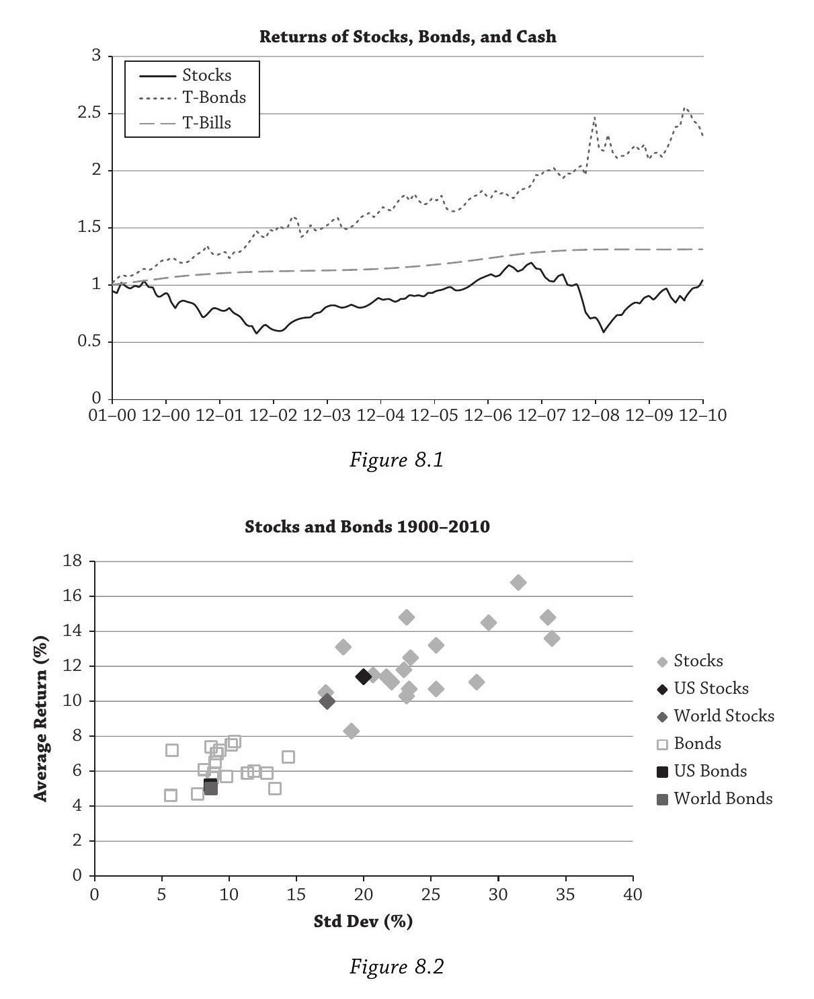
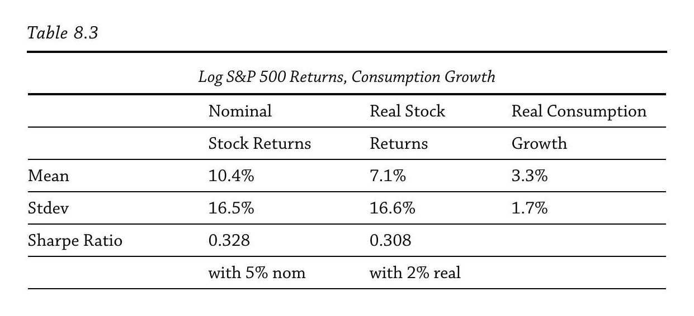
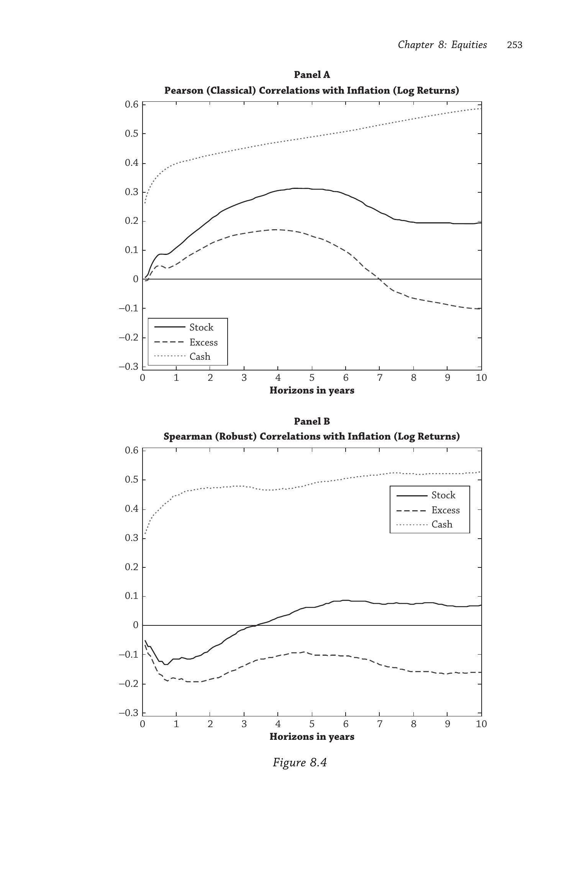
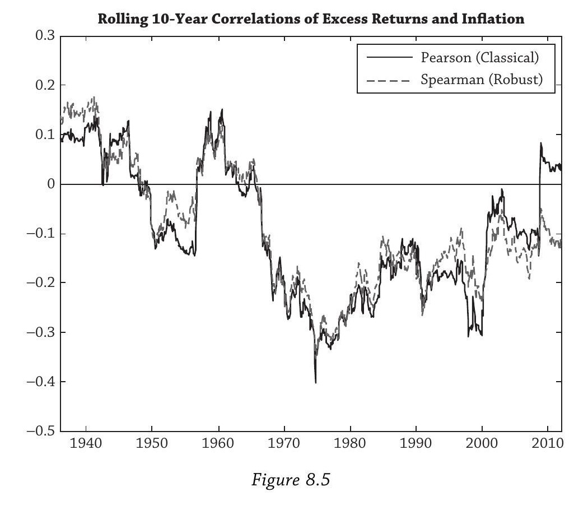
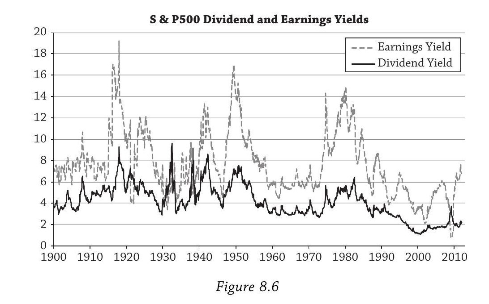
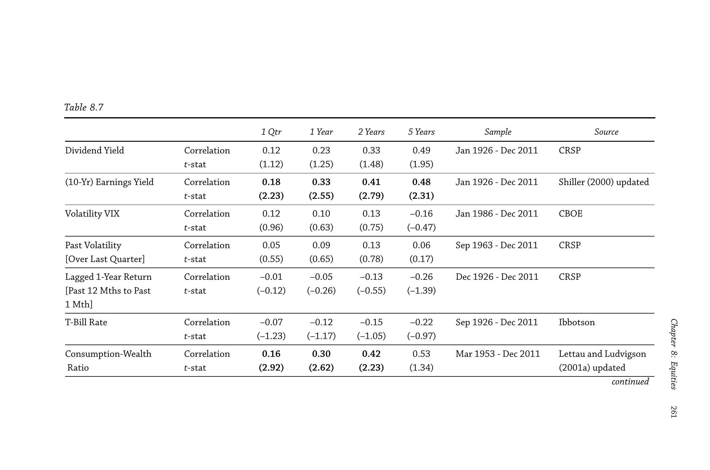
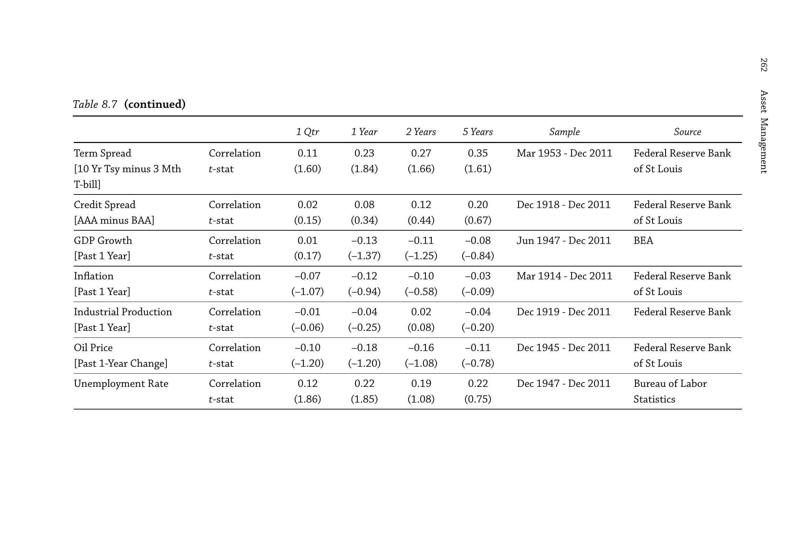
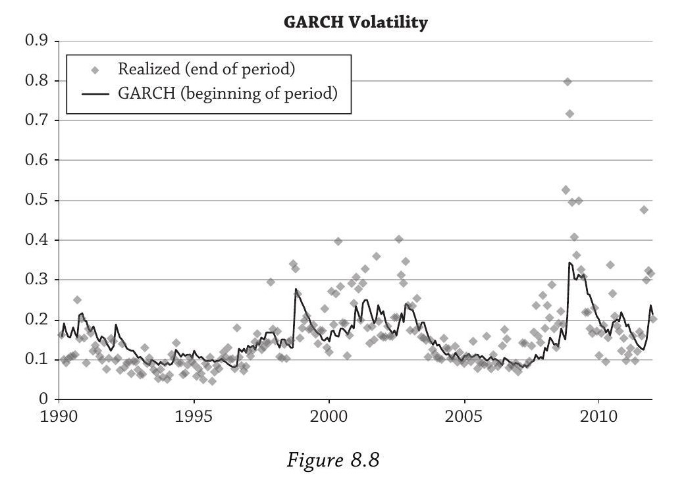
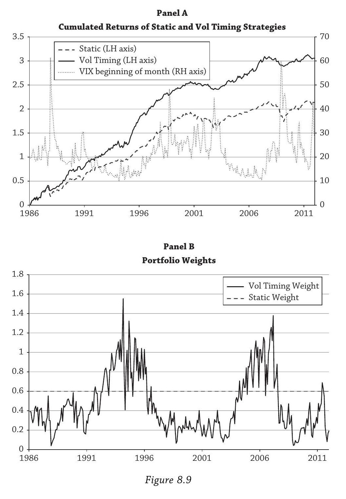

# Chapter 8: Equities — 学习笔记

> 基于 Andrew Ang, *Asset Management* 第八章的讨论整理。

---

## 全章概览

这一章围绕一个核心问题展开：**股票的高回报从何而来，未来是否会持续？**

全章以2000年代"失去的十年"开篇，提出问题；接着用消费资产定价模型建立理论基准，引出股权风险溢价之谜；然后给出四种解释（时变风险厌恶、灾难风险、长期风险、异质投资者）；再讨论两个重要的实证主题（通胀对冲、收益可预测性与波动率预测）；最后回到开篇的问题给出结论。

贯穿全章的一个实操问题始终是：**在坏时候，你比市场上的边际投资者处境更好吗？如果是，多持有股票。**

---

## 1. 失去的十年（The Lost Decade）

这一节是全章的引子，用一个令人震撼的事实抓住读者：2000年代，股票跑输了现金。

Figure 8.1 画的是2000年1月1日投入 \$1，分别放在三种资产里到2010年底的累计回报曲线；Figure 8.2 画的是19个国家1900–2010年股票与债券的收益-波动率散点图。

Figure 8.1 的结果是：

- **股票（S&P 500）**：\$1 → \$1.05。十年几乎没赚钱。中间经历了两次大跌——2000–2002年互联网泡沫破裂（累计亏损超过40%）和2008年金融危机（当年跌37%）。
- **国债（T-Bonds）**：\$1 → \$2.31。债券大获全胜。
- **现金（T-Bills）**：\$1 → \$1.31。连无风险的短期国库券都跑赢了股票。

这对"股票长期总是赢"的信念是一记重击。

但 Ang 马上把视野拉远。Figure 8.2 用 Dimson, Marsh, and Staunton (2011) 的数据画了19个国家1900–2010年的收益-波动率散点图，呈现出一个非常清晰的模式：

- 各国**股票**聚集在右上角——高收益、高波动
- 各国**债券**聚集在左下角——低收益、低波动

美国的数字：股票年均回报11.4%、波动率20.0%；债券年均5.2%、波动率8.6%。所以长期来看，股权溢价（equity premium）是巨大的，但代价是承受高得多的波动。

这一节设下全章的问题：既然长期溢价这么高，2000年代的惨淡表现是暂时的噩运，还是某种新常态的开始？要回答这个问题，必须理解溢价背后的经济机制。

---

## 2. 股权风险溢价之谜（The Equity Premium Puzzle）

这一节建立全章的理论基准：在最简单的消费资产定价模型里，股权溢价应该很低，但数据里它很高。

### 基本框架

所有风险溢价都是对"坏时候承受损失"的补偿。在最基本的消费模型里，"坏时候"的唯一定义就是**人均实际消费增长低**。整个经济体被压缩成一个代表性代理人（representative agent），他的效用函数是CRRA（常相对风险厌恶），风险厌恶系数为 $\gamma$。

在这个世界里，只有一个因子——消费增长。一项资产的风险溢价取决于它与消费增长的协变关系：如果消费下降时这项资产也跌，那它在"坏时候"帮不了你，你需要溢价才愿意持有。

### 谜在哪里

Mehra & Prescott (1985) 算了一笔账：对于合理的风险厌恶水平（$\gamma$ 在1到10之间），模型预测的股权溢价远低于1%。但历史数据（1900–2010）显示美国股票超额于债券6.2%，超额于T-bills 7.4%。差距是数量级的。

Table 8.3 揭示了为什么模型失败（1947年6月–2010年12月，S&P 500数据）：

|  | 均值 | 标准差 |
|---|---|---|
| 名义股票收益 | 10.4% | 16.5% |
| 实际股票收益 | 7.1% | 16.6% |
| 实际消费增长 | 3.3% | 1.7% |

两个关键数字：

1. **波动率不匹配**：股票波动率约17%，消费增长波动率仅约1.7%。差了十倍。
2. **相关性很低**：股票收益与消费增长的相关系数不到15%。

这意味着当消费下降（"坏时候"来了）的时候，股票并不怎么跌。既然股票在坏时候不会给你造成大损失，按模型逻辑，你不需要多少溢价就愿意持有它——但现实中溢价却很高。

### Hansen-Jagannathan 下界

要让模型匹配数据中的 Sharpe Ratio（约0.3），需要：

$\gamma > \frac{\text{Sharpe Ratio}}{\sigma_c} \approx \frac{0.3}{0.017} \approx 18$

如果精确用对数正态假设去算，隐含的 $\gamma$ 超过120。而 Mehra & Prescott 认为"合理"的上界是10。

### 为什么这个谜重要

很多投资者基于历史高回报大量配置股票。如果我们不理解高溢价的来源，就无法判断它未来是否持续。搞清楚机制，才能在理性基础上决定该持有多少股票——而不是仅仅因为"过去一直这么做"。

---

## 3. 四种解释

### 3.1 解释一：时变风险厌恶与习惯效用（Habit Utility）

上一节的困境是：要匹配数据需要 $\gamma > 120$，但没有人的风险厌恶真有那么高。第一种解释的思路是：**风险厌恶不是常数，它在衰退时会暂时飙升到极高水平。**

#### 直觉：习惯的力量

Ang 用了一个生动的例子。想象一个刚毕业的大学生，习惯了睡沙发、合租公寓、开二手车。她找了份咖啡师的工作，然后被裁了。这当然不好，但伤害不大——因为她本来就过得很节俭，消费相对于她的"习惯水平"没有下降多少。

现在换一个场景：她毕业后拿到了华尔街的高薪工作，搬进景观公寓，买新车，穿名牌。她的消费习惯大幅提升。然后她被裁了。虽然她可能比当咖啡师时存款还多，但她的消费要从高水平骤降到低水平——相对于习惯的落差巨大。这时候每多一块钱对她的价值极高（边际效用极高），她变得极度厌恶风险。

这就是 Campbell & Cochrane (1999) 习惯效用模型的核心：**重要的不是消费绝对水平的下降，而是消费相对于习惯水平的下降。**

#### 模型机制

**衰退时**——消费逼近习惯水平，效用函数的曲率变得极陡。局部风险厌恶可以飙到20甚至100以上，远超 Mehra-Prescott 认为"不合理"的水平。代理人极度害怕再失去任何一点消费，要求很高的溢价才肯持有股票。股价下跌，未来预期回报升高。

**繁荣时**——消费远高于习惯水平，效用函数很平坦。风险厌恶低，代理人不太在乎风险，股权溢价小。股价高企，未来预期回报低。

关键点：虽然消费本身在衰退中只下降一点点（波动率才1.7%），但这微小的下降就足以把消费推到危险地逼近习惯的位置，引发风险厌恶的剧烈跳升。这解决了"消费波动率太低"的问题——不需要消费大幅下降，只需要它相对于习惯下降。

长期来看，衰退时的极高风险厌恶在时间平均上占据主导，产生了高的长期股权溢价。这个模型还自然地产生了收益可预测性：坏时候溢价高、好时候溢价低，意味着预期收益随经济周期变化。

#### 对投资者的含义

Ang 从这个模型抽出的实操问题是：**在坏时候，你的风险厌恶比市场（代表性代理人）低吗？** 如果答案是"是"，你就应该多持有股票。例子包括：挪威主权财富基金（现金流稳定，没有迫在眉睫的负债），最高法院大法官（收入流无风险），以及一些私人财富客户（经济衰退对他们的冲击小于平均投资者）。

---

### 3.2 解释二：灾难风险（Disaster Risk）

习惯效用的思路是"坏时候风险厌恶飙升"。灾难风险的思路更直接：**坏时候不只是坏，而是灾难性的坏。** 溢价是对罕见但毁灭性崩溃的补偿。

#### 基本想法

这个解释最早由 Rietz (1988) 提出，被 Mehra & Prescott (1988) 当即否定（缺乏实证证据），但 Barro (2008) 用更全面的跨国长期数据让这个理论强势回归。逻辑很简单：如果存在一个很小的概率消费会发生灾难性崩溃，理性投资者就会要求很高的溢价来持有股票。

#### 实证：灾难确实发生过

Mehra & Prescott 只看了美国数据。美国除了大萧条，确实没有经历过真正的消费灾难。但 Barro & Ursua (2011) 的跨国证据显示灾难性崩溃并不罕见：

- **德国**：1945年消费下降41%
- **日本**：二战期间消费下降50%
- **俄罗斯**：一战和俄国革命期间消费下降71%，二战期间又下降58%
- **中国**：1936–1946年GDP下降50%
- **土耳其**：二战期间消费下降49%

美国和英国相对温和（美国最大跌幅16%在1921年，英国17%在1945年），但它们是例外而非常态。

#### 比索问题（Peso Problem）

如果灾难概率很低但非零，而你的样本期恰好没有观察到灾难，那么你会觉得溢价"太高了"——但其实它是对那个你还没看到的灾难的合理补偿。"比索问题"这个名字来自1970年代早期的墨西哥比索远期市场：当时比索远期价格有大幅折价，看起来像是定价错误，但市场参与者预期到了一次贬值——这次贬值最终在1976年8月发生了。

类似地，美国的股权溢价可能看起来"太高"，仅仅因为我们还没观察到那场灾难。

#### 存活偏差（Survivorship Bias）

Jorion & Goetzmann (1999) 指出：我们计算溢价时用的都是存活下来的市场。20世纪初投资中国或俄罗斯的股票会血本无归。如果把这些消失的市场纳入计算，平均溢价会低得多。

但 Ang 认为这个论点反而**加深了**谜团。因为溢价是相对于债券度量的，而在很多经历结构性断裂的国家，债券比股票更惨。德国股市虽然经历了多次关闭，最终存活且回报尚可；但德国债券先是被1920年代的恶性通胀摧毁，然后在1948年引入德国马克时违约归零。如果股权溢价 = 股票回报 − 债券回报，而债券在灾难中表现更差，那存活偏差实际上让溢价之谜更极端了。

#### 对投资者的含义

灾难模型强化了关注下行尾部风险的重要性。核心问题：在一场严重的经济崩溃中，你的相对处境如何？所有人都会受损，问题是受损程度。在灾难中相对最好的投资者，最适合大量持有股票。俄国革命和现代中国的例子也是跨国分散投资的强力论据。

---

### 3.3 解释三：长期风险（Long-run Risk）

前两种解释改变的是效用函数的性质或数据生成过程的尾部。长期风险模型两边都动了：既改变了消费过程的设定，又改变了偏好结构。

#### 消费过程的修改

Mehra-Prescott 假设消费增长是 i.i.d. 的。Bansal & Yaron (2004) 的关键洞察是：**消费增长的均值本身可能在缓慢漂移，但漂移得如此之慢，以至于在统计上几乎无法和 i.i.d. 过程区分开。** 这就是"长期风险"——消费增长中有一个微小但极其持久的可预测成分。

直觉上：某个欧元区国家议会的一次混乱投票，不仅影响当期的经济增长预期，还可能影响十到二十年后的增长路径。如果这次投票降低了当前生产率，而低生产率让经济锁定在一条低增长轨道上，那么一个看似短期的冲击就有了长期后果。股票作为永续证券，对这种长期增长路径的变化特别敏感。

#### 偏好的修改：Epstein-Zin 效用

标准CRRA效用有一个限制：风险厌恶和跨期替代弹性（EIS）被一个参数绑在一起——$\text{EIS} = 1/\gamma$。高风险厌恶意味着低EIS，即代理人强烈偏好平滑消费路径，这会推高无风险利率，产生 Weil (1989) 的无风险利率之谜。

Bansal & Yaron 采用 Epstein & Zin (1989) 偏好，将风险厌恶和EIS解绑。代理人可以同时具有高风险厌恶（要求高溢价）和高EIS（不需要极高的无风险利率来平滑消费）。更重要的是，在这种偏好下，代理人对长期风险赋予的权重远大于对短期冲击的权重。

#### 第二个通道：时变消费波动率

Bansal-Yaron 模型还引入了消费增长波动率本身随时间变化。代理人厌恶波动率的增加，当波动率上升时，资产估值下降。因此模型有两个独立的风险补偿通道：消费增长风险（长期增长路径的不确定性）和消费波动率风险（增长波动率本身的不确定性）。

#### Cochrane vs Bansal-Yaron 的分歧

在"股息率变动来自折现率还是现金流"的争论中，两者站在对立面。Cochrane认为几乎全部变动来自折现率，现金流不可预测。Bansal-Yaron 的世界里恰恰相反：几乎全部变动来自现金流。Ang 自己的立场是真相在两个极端之间。

#### 对投资者的三个教训

1. **短期亏损是标准风险。** 这是传统的风险评估。
2. **短期看起来安全的东西，长期可能很危险。** 市场在乎长期风险，今天的微小调整可能在二三十年后产生巨大影响。价值股和外汇套利交易都具有高的长期风险 beta。
3. **波动率本身是一个独立的风险因子。** 波动率风险和消费（宏观）风险不同，它携带自己独立的风险溢价。

---

### 3.4 解释四：异质投资者（Heterogeneous Investors）

前三种解释都保留了代表性代理人的框架。第四种解释质疑框架本身：现实中投资者是异质的，代表性代理人可能根本不"代表"任何人。

#### 代表性代理人的问题

Jerison (1984) 和 Kirman (1992) 证明了一个令人不安的结果：在某些情况下，代表性代理人的偏好不是个体偏好的（加权）平均。如果经济中所有人都偏好香蕉胜过苹果，你可以构造出一个偏好苹果胜过香蕉的代表性代理人，而这个代理人产生的均衡价格和所有人偏好香蕉时完全一致。

关键的重新诠释：代表性代理人不应理解为**平均**代理人，而应理解为**边际**代理人（marginal agent）。价格由边际代理人对因子冲击的反应决定。

#### Constantinides & Duffie (1996)：收入不平等与不可对冲风险

这是异质代理人文献中最有影响力的模型之一。核心设定：代理人之间的异质性在于劳动收入；代理人无法完全对冲失业风险（和现实一致）；衰退时收入不平等加剧。

逻辑链条：衰退来了 → 失业概率上升 → 同时股票也在跌 → 股票在你最需要钱（被老板解雇、需要吃饭）的时候偏偏不给你回报 → 股票作为对冲失业风险的工具极差 → 均衡中必须有很高的溢价才能诱使投资者持有股票。

关键概念是**市场不完备性**（market incompleteness）——有些风险在总量上无法对冲或消除，实际上增加了所有代理人面对的总风险量。

#### 约束的类似效果

类似的机制也可以通过约束产生，比如借贷约束。坏时候，一些投资者面临绑定的融资约束，被迫以极度风险厌恶的方式行事——被迫卖出股票（投行无法滚动债务，资产管理公司遭遇赎回）。这些情况在坏时候会抬高经济体的总风险厌恶。少数被约束的投资者被迫抛售，他们虽然人数不多，但在定价时影响巨大。

#### 异质模型产生的新因子

在异质代理人模型中，一个新的因子出现了：**代理人特征的截面分布**本身成为定价因子。这和前三种解释有本质区别——前三种的因子是总量变量（消费增长、消费波动率、灾难概率），而这里的因子是截面变量。

#### 对投资者的含义

你不仅要思考自己和市场（代表性/边际代理人）的差异，还要思考你在整个投资者分布中的位置。在坏时候，你能比被迫以 fire-sale 价格清仓的资产管理人更好地吸收损失吗？你面临和对冲基金一样的保证金追缴吗？

但 Ang 也坦率地承认这类模型的实操困难：世界太异质了，究竟该强调哪个维度并不清楚。他的实际建议是：用前三种解释的框架来思考自己和市场的差异就够了，异质模型的额外启示是"市场"既可以理解为平均投资者，也可以理解为边际投资者。

---

## 4. 股票与通胀

### 4.1 股票是糟糕的通胀对冲工具

股票代表对企业实物资产和未来利润的所有权。当物价上涨时，企业的名义收入和资产价值应该同步上涨，所以直觉上股票应该是天然的通胀对冲工具。而且企业普遍发行名义债务，高通胀会侵蚀债务的实际价值，这对股东有利。

但数据完全不支持这个故事。

Figure 8.4 画了1926–2010年间，股票收益、超额股票收益（扣除T-bills）、T-bill收益分别与通胀的相关系数，横轴是以年为单位的投资期限。

**Panel A（Pearson 经典相关）：** 股票与通胀的短期（1年以内）相关性低于10%，4–5年处达到峰值约30%，之后回落到约20%。T-bills与通胀的相关性则从短期的20%以上稳步上升到10年处约60%。超额股票收益与通胀的相关性更低——1年以内接近零，7年之后转为负值。

**Panel B（Spearman 稳健秩相关）：** 情况比 Panel A 更糟。Spearman 相关对异常值稳健，去除异常值的影响后，超额股票收益与通胀的稳健相关性在**所有期限上都为负**，1年之后大约在 −20% 到 −10% 之间。

Figure 8.5 画了超额股票收益与通胀的滚动10年相关系数，展示了这种关系的时变性。

1940–1950年代部分时期是正的，但从1950年代起基本为负。2000年后经典相关勉强转正（仍低于10%），但稳健相关仍为负。历史上这个相关系数从未超过20%，甚至一度低于 −40%。

这里有一个重要的概念区分：**对冲是关于协变（co-movement），不是关于平均回报水平。** T-bills 平均回报3.5%仅勉强跑赢长期平均通胀率2.9%，但它和通胀同步移动，所以是好的对冲工具。股票平均回报9.3%轻松跑赢通胀，但不和通胀同步移动，所以不是对冲工具。

Bekaert & Wang (2010) 的跨国研究进一步确认：发达市场的股票通胀 beta 普遍为负，平均 −0.25。北美 −0.42，欧盟 +0.27（正但远低于完美对冲的1）。有趣的是，新兴市场的股票通胀 beta 平均为1.01，接近完美对冲。

### 4.2 为什么股票是糟糕的通胀对冲工具

Ang 在 Ang & Ulrich (2012) 的框架下给出两种理性解释和一种行为解释：

**现金流效应：** 高通胀降低企业未来盈利能力。虽然企业可以把成本上涨转嫁给消费者，但只能分阶段做（菜单成本，menu costs）。Nakamura & Steinsson (2008) 证实价格刚性在实证上很普遍。所以高通胀挤压利润率。

**折现率效应：** 高通胀时期往往是风险高企的坏时候（滞胀）。坏时候预期收益上升（折现率上升），这压低股价。如果这是唯一的力量，相关性应该是 −1。实际没到 −1，是因为还有其他因子在驱动股价。

**行为解释（Modigliani & Cohn, 1979）：** 投资者犯了"货币幻觉"的错误——用名义折现率去折现实际股息。高通胀时名义折现率升高，导致市场被低估，已实现收益低。

三种解释的共同结论一致：**高通胀时股票表现差。** 如果你预期未来通胀会高于市场共识，应该减持股票。

---

## 5. 预测股权风险溢价

### 5.1 理论说溢价可预测

出发点是 Gordon (1963) 股息折现模型：

$P = \frac{D}{E(r) - g}$

其中 $P$ 是股价，$D$ 是下期预期股息，$E(r)$ 是折现率（投资者要求的预期收益率），$g$ 是股息恒定增长率。这个模型假设股息以恒定速率永续增长，且 $E(r) > g$。本质上它是一个永续增长年金的现值公式。

直觉上：$D$ 越大（公司分的钱越多）→ $P$ 越高；$g$ 越大（未来增长越快）→ $P$ 越高；$E(r)$ 越大（风险越高）→ $P$ 越低。

Gordon 模型可以等价改写为：

$E(r) = \frac{D}{P} + g$

这直接说明：**如果你观察到今天的股息率 $D/P$ 很高（即股价相对于股息很低），那么要么未来预期收益 $E(r)$ 高，要么未来增长 $g$ 低，或两者兼有。** 这就是为什么股息率可能能预测未来股票收益。

#### 方差分解

对股息率公式 $D/P = E(r) - g$ 两边取方差，忽略协方差项：

$\text{var}\!\left(\frac{D}{P}\right) \approx \text{var}\big(E(r)\big) + \text{var}(g)$

"股息率变动的来源是什么"和"什么预测收益"是同一个问题。如果现金流不可预测（i.i.d.），全部变动来自折现率，股息率直接预测未来收益。如果折现率恒定，变动全来自现金流。

Figure 8.6 画了 S&P 500 的股息率和盈利收益率（1900–2011），两者相关性73%。

学界对此有尖锐分歧。Cochrane (2011, AFA主席演讲) 认为全部变动来自折现率。Bansal & Yaron (2004) 认为几乎全部变动来自现金流。Ang 自己的立场是真相在两个极端之间。

**过度波动率与这个争论的关系：** 股票收益波动率（16%）远大于股息增长波动率（9.6%）。如果股价纯粹是未来股息的被动反映（折现率恒定），股价的波动幅度不应该超过股息的波动幅度。多出来的波动只能来自折现率 $E(r)$ 本身在变——这至少部分支持了 Cochrane "折现率变动是主要来源"的观点。

### 5.2 理论也说可预测性很弱

Ross (2005) 和 Zhou (2010) 证明预测回归的 $R^2$ 受定价核方差约束。标准预测回归：

$r_{t+1} = c + b \cdot X_t + \varepsilon_{t+1}$

Ross 计算出 $R^2$ 上界约8%，Zhou 的界更紧。结论是：市场波动的95%以上应该不可预测。

Table 8.7 报告了一系列预测变量在不同期限上对未来超额收益的相关系数和稳健 $t$ 统计量（使用 Hodrick (1992) 标准误，这是少数真正具有正确统计性质的方法）。

| 预测变量 | 1季度相关 | 1年相关 | 2年相关 | 5年相关 |
|---|---|---|---|---|
| 股息率 | 0.12 (1.12) | 0.23 (1.25) | 0.33 (1.48) | 0.49 (1.95) |
| 十年盈利收益率 | **0.18 (2.23)** | **0.33 (2.55)** | **0.41 (2.79)** | **0.48 (2.31)** |
| VIX | 0.12 (0.96) | 0.10 (0.63) | 0.13 (0.75) | −0.16 (−0.47) |
| 过去波动率 | 0.05 (0.55) | 0.09 (0.65) | 0.13 (0.78) | 0.06 (0.17) |
| 滞后1年收益 | −0.01 (−0.12) | −0.05 (−0.26) | −0.13 (−0.55) | −0.26 (−1.39) |
| T-Bill利率 | −0.07 (−1.23) | −0.12 (−1.17) | −0.15 (−1.05) | −0.22 (−0.97) |
| 消费-财富比率 cay | **0.16 (2.92)** | **0.30 (2.62)** | **0.42 (2.23)** | 0.53 (1.34) |
| 期限利差 | 0.11 (1.60) | 0.23 (1.84) | 0.27 (1.66) | 0.35 (1.61) |
| 信用利差 | 0.02 (0.15) | 0.08 (0.34) | 0.12 (0.44) | 0.20 (0.67) |
| GDP增长 | 0.01 (0.17) | −0.13 (−1.37) | −0.11 (−1.25) | −0.08 (−0.84) |
| 通胀 | −0.07 (−1.07) | −0.12 (−0.94) | −0.10 (−0.58) | −0.03 (−0.09) |
| 工业生产 | −0.01 (−0.06) | −0.04 (−0.25) | 0.02 (0.08) | −0.04 (−0.20) |
| 油价 | −0.10 (−1.20) | −0.18 (−1.20) | −0.16 (−1.08) | −0.11 (−0.78) |
| 失业率 | 0.12 (1.86) | 0.22 (1.85) | 0.19 (1.08) | 0.22 (0.75) |

> 括号内为稳健 $t$ 统计量。**加粗**项在95%水平下显著（$|t| > 1.96$）。

结果非常惨淡。在95%显著性水平下，**只有两个变量显著**：Shiller 十年周期调整盈利收益率（各期限上最强）和消费-财富比率 cay（但有前瞻偏差，不能用于实际交易）。股息率在5年期限上勉强打擦边球（$t = 1.95$）。其他所有变量全部不显著。

#### 警惕长期限的 $R^2$

很多人看到5年期限上股息率相关0.49，算出 $R^2 = 0.49^2 = 24\%$，觉得预测能力很强。Ang 警告这是虚假的。问题出在长期限回归用的是重叠数据（overlapping observations），人为制造了依赖性。Valkanov (2003) 和 Boudoukh, Richardson & Whitelaw (2008) 推导了正确的小样本 $R^2$ 分布，发现简单 $R^2$ 严重向上偏倚。"小样本"在这里可以意味着数百甚至数千年的数据。稳健 $t$ 统计量是正确的修正方式；$R^2$ 不是。

#### 可预测性本身在变

Henkel, Martin & Nardari (2011) 发现预测能力是反周期的——扩张期很弱，衰退期很强。所以正好在你最需要预测（衰退来临时）的时候预测能力最强，但在平时它几乎消失了。

### 5.3 对投资者的建议

1. **使用好的统计技术。** 用错误的 $t$ 统计量虚高样本内拟合，会在样本外付出代价。Welch & Goyal (2008) 发现历史平均超额收益几乎比所有预测变量在样本外表现更好。
2. **使用经济模型。** Table 8.7 中最好的预测变量是估值比率，这有坚实的经济学基础。纯数据挖掘出来的预测变量大概率是过拟合。
3. **保持谦逊。** 择时很难。由于可预测性在统计上难以检测，你很容易因为一段好运就觉得自己是天才（自我归因偏差），而当运气耗尽时过度自信会造成伤害。

**基线建议：** 以 i.i.d. 为基准，执行向恒定权重再平衡的策略。再平衡天然是反周期的——股价跌了就买（此时预期收益高），涨了就卖（此时预期收益低）。这和最优策略的方向一致，只是最优策略会更激进。如果你连恒定再平衡都做不到，就更不可能执行真正的最优策略了。

---

## 6. 时变波动率

和收益的弱可预测性形成鲜明对比的是：**波动率具有很强的可预测性。**

### 过度波动率之谜

Shiller (1981) 指出股票收益的波动率远高于其基本面（股息）的波动率。1935–2010年：股票对数收益标准差16.0%，股息增长标准差9.6%。股价的波动幅度几乎是股息波动的两倍。如果股价只是未来股息的折现值，它不应该比股息本身波动更大。但换成盈利作为基本面（盈利增长标准差36.0%），就没有过度波动率了——不过盈利不能直接用来给股票估值，因为盈利属于债权人和股东共同，而股息只属于股东。

### GARCH 模型

Robert Engle (1982) 发明了 ARCH 模型，Bollerslev (1986) 推广为 GARCH（广义自回归条件异方差模型）。Engle 因此获2003年诺贝尔奖。基本 GARCH 条件方差方程：

$\sigma_t^2 = a + b\,\sigma_{t-1}^2 + c\,\varepsilon_{t-1}^2$

三项的含义：

- $a$：常数项，代表波动率的长期基准水平。
- $b\,\sigma_{t-1}^2$：上一期的条件方差。$b$ 接近1，意味着波动率高度持久——一旦升高，会在高位待很久才慢慢回落（"自回归"）。
- $c\,\varepsilon_{t-1}^2$：上一期的收益冲击的平方。大的冲击（无论正负）会推高未来波动率。这就是为什么1987年股灾、1998年俄罗斯违约、2008年雷曼倒闭之后波动率都会飙升并持续一段时间。

整个模型描述"波动率聚集"（volatility clustering）现象：平静期跟着平静期，动荡期跟着动荡期。

### Figure 8.8：GARCH 预测效果

Figure 8.8 画了1990–2012年月频的 GARCH 预测波动率与已实现波动率。

两条线的相关系数是 **63%**。对比 Table 8.7 中预测收益的相关系数（最好的也就十几个百分点，大部分不显著），63% vs 5% 的对比清楚地说明波动率比收益好预测得多。

### Figure 8.9：波动率择时策略

均值-方差最优权重公式：

$w = \frac{1}{\gamma} \cdot \frac{\mu - r_f}{\sigma^2}$

**静态策略**：$\mu - r_f$ 和 $\sigma^2$ 都用全样本均值，校准使平均权重为60%股票/40%现金。**波动率择时策略**：只把分母的 $\sigma$ 换成当月月初的 VIX，其他不变——不预测收益，只根据波动率调仓。

Figure 8.9 Panel A：1986–2011年，两个策略都缩放到目标波动率10%。波动率择时策略累计回报3.06，静态策略2.14。择时策略在2000年代初和2008年金融危机期间大幅减仓（VIX飙升），从而部分回避了暴跌。

但 Panel B 揭示了为什么不是所有人都这么做：波动率择时策略的股票仓位剧烈波动，从超过150%到接近零。大多数大型投资者没有能力如此频繁地进出。

### 更深层的问题

代表性代理人持有100%市场组合（$w = 1$），反推得到资本市场线 $\mu - r_f = \gamma \sigma^2$，意味着高波动率应对应高未来收益。但 Table 8.7 显示波动率对未来收益几乎没有预测能力。矛盾在于公式里缺了对冲项：

$w = \frac{1}{\gamma} \cdot \frac{\mu - r_f}{\sigma^2} + \text{对冲项}$

Guo & Whitelaw (2006) 表明对冲项完全主导了简单的线性风险-收益关系，抵消了波动率的效应。

Ang 认为风险管理和预期收益是同一枚硬币的两面。当波动率飙升时，价格下跌；但价格低时（$D/P$ 高），折现率高，预测未来收益高。高波动率时期同时是高风险时期和高溢价时期——从估值角度看，反而是买入机会。波动率和溢价之间的关系是非线性的，加上对冲项的存在，使得简单回归捕捉不到。

---

## 7. 失去的十年再审视（结论）

### 2000年代为什么不意外

Ang 的回答是：恰恰相反，2000年代的糟糕表现正是股权溢价存在的原因。股权溢价之所以高，是因为股票在坏时候会给你造成严重损失。如果股票永远稳赚不赔，就没有人需要额外的补偿来持有它。十年的低迷回报不是异常，而是这个机制正常运作的表现。

### 长期 vs 短期

Ang 预期股权溢价长期仍然会很高。但短期内投资者必须做好承受糟糕回报的心理准备。你赚取高长期回报的代价，就是接受短期内可能经历类似2000年代的痛苦。

### 最终建议

**可预测性存在但很弱。** 大多数投资者不应该尝试择时。基线策略是再平衡到恒定权重。这对应 i.i.d. 世界的最优策略，且天然是反周期的：股价跌了买入（此时预期收益高），涨了卖出（此时预期收益低）。真正的最优策略只会比这更激进。

如果坚持要择时：使用正确的统计方法，施加经济约束，保持谦逊，并建立好的治理结构来扛过不可避免的痛苦期。

**波动率是唯一实操可行的预测维度**，但要求极高的交易灵活性。

### 全章逻辑主线

**事实**（§1）：长期看股权溢价很高，但短期可以很惨 → **谜**（§2）：简单消费模型无法解释 → **四种解释**（§3）：时变风险厌恶、灾难风险、长期风险、异质投资者，核心信息统一——溢价是对坏时候承受损失的补偿 → **通胀**（§4）：股票不对冲通胀，高通胀是另一种坏时候 → **可预测性**（§5）：溢价理论上可预测但实际上极难利用 → **波动率**（§6）：波动率比收益好预测得多，是唯一实操可行的预测维度 → **结论**（§7）：长期持有、恒定再平衡、不要择时。

**贯穿全章的核心问题：在坏时候，你比市场上的边际投资者处境更好吗？如果是，多持有股票；如果不是，少持有。**
