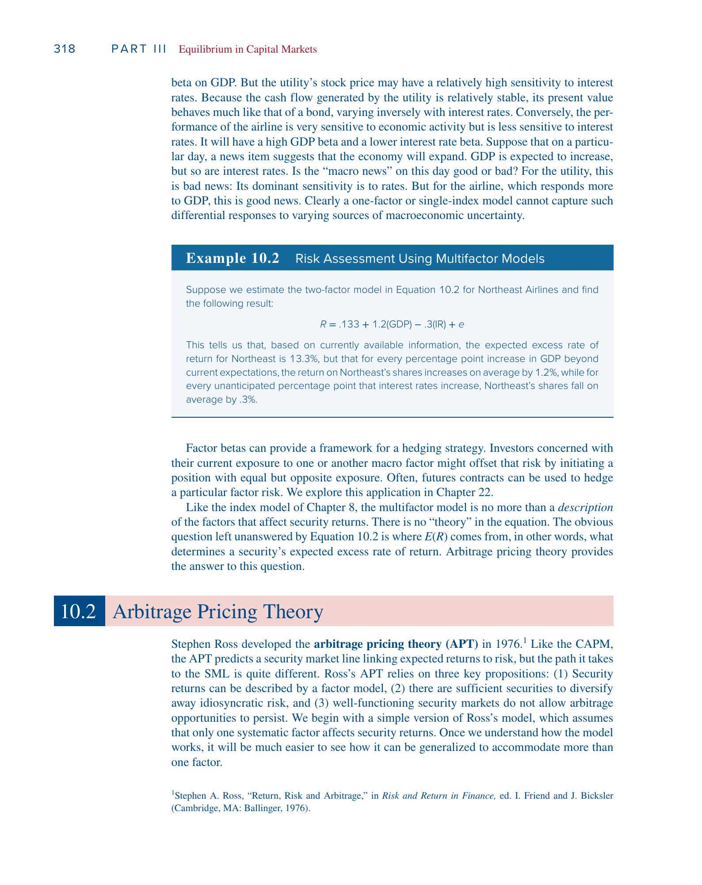
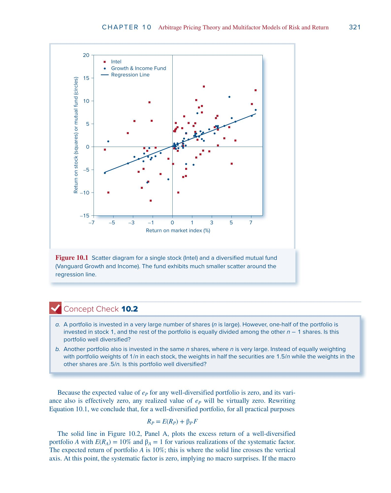
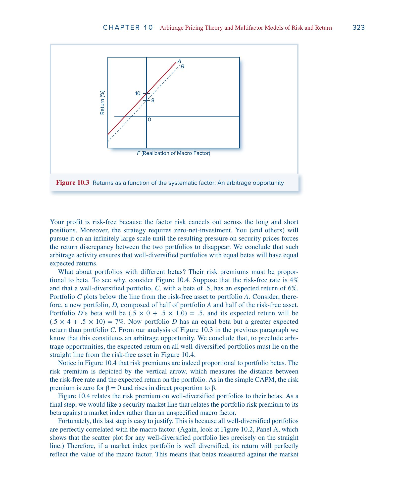
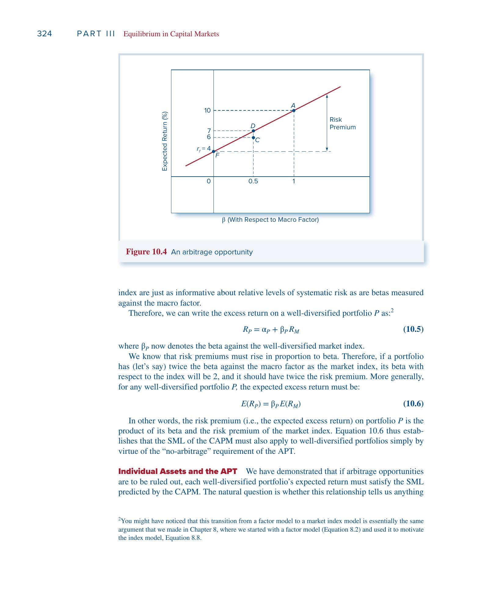
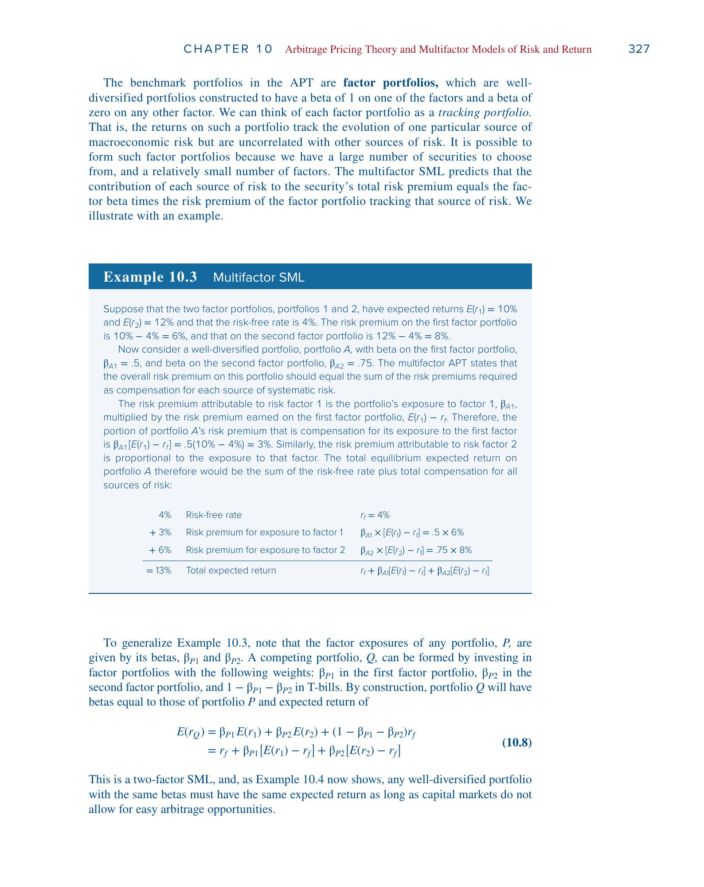
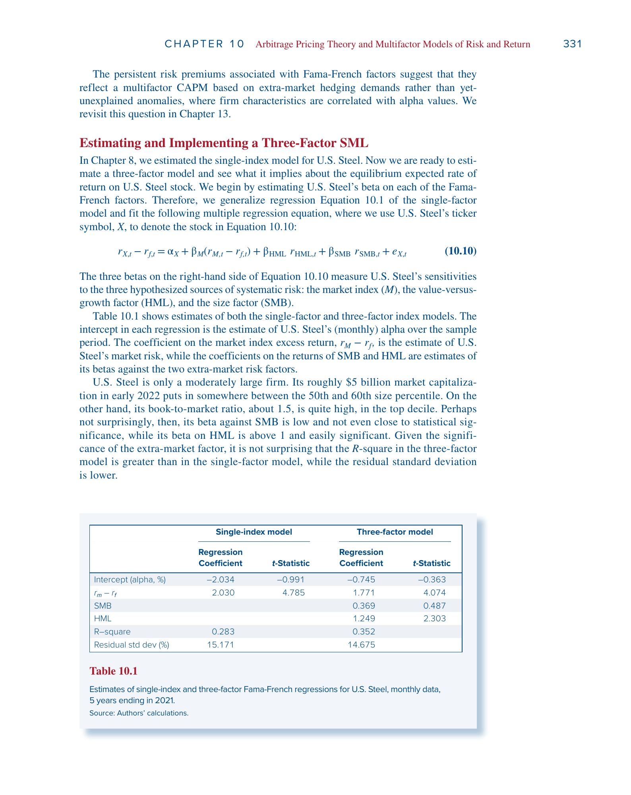

# 第10章 套利定价理论（APT）与多因子模型——完整学习笔记

> 本笔记基于 Bodie《Investments》第13版第10章，按照从零开始逐步推导的顺序整理。每一步在前一步的基础上展开，力求把"为什么"和"怎么来的"讲清楚。

---

## 一、起点：因子模型——股票收益到底从哪来？

### 1.1 一个最基本的问题

假设你持有一只股票。这个月它涨了5%，这5%是怎么来的？

你可以想到两类原因：

- **整个经济发生了什么事**——比如GDP增长超预期、央行降息、油价暴跌。这些事情影响几乎所有的股票，只是影响的程度不同。这叫**系统性风险**（systematic risk）。
- **这家公司自己发生了什么事**——比如发布了超预期的财报、CEO突然辞职、产品被召回。这些事件只影响这一家公司。这叫**非系统性风险**（idiosyncratic risk）或**公司特有风险**。

因子模型就是把这个直觉用一个公式写出来。

### 1.2 单因子模型

最简单的版本是**单因子模型**（Single-Factor Model）：

$R_i = E(R_i) + \beta_i F + e_i \tag{10.1}$

这个公式看起来简单，但每一项都值得仔细理解：

- $R_i$：股票 $i$ 在某个时期的**超额收益**（收益率减去无风险利率）。我们关心的不是收益本身，而是超过"无风险存银行"能拿到的那部分。
- $E(R_i)$：在这个时期**开始之前**，你**预期**这只股票能给你的超额收益。这是一个事前（ex ante）的数字。
- $F$：**宏观因子的意外变动**。注意，$F$ 不是宏观变量本身的值，而是"实际值 − 预期值"。如果大家预期GDP增长4%，实际也增长了4%，那 $F = 0$——没有意外。只有意外（surprise）才会导致股价波动，因为预期中的部分已经提前反映在价格里了。因此 $F$ 的期望值是零。
- $\beta_i$：股票 $i$ 对这个宏观因子的**敏感度**。$\beta_i$ 越大，宏观意外对这只股票的冲击越大。这就是所谓的"因子载荷"（factor loading）或"因子Beta"。
- $e_i$：**公司特有的随机扰动**。它的期望值也是零，并且和 $F$ 以及其他公司的 $e_j$ 都不相关——张三公司的丑闻和李四公司的新产品没有关系。

**用大白话说：** 这只股票的实际收益 = 你原来预期的收益 + 宏观经济给的惊喜（或惊吓）× 你对这个惊喜的敏感度 + 公司自己的随机波动。

### 1.3 一个具体的例子（Example 10.1）

假设宏观因子 $F$ 代表GDP增长的意外变化。市场共识是今年GDP增长4%。某股票的 $\beta = 1.2$。

如果GDP实际只增长了3%，那么：

$F = 3\% - 4\% = -1\%$

这是一个"坏消息"——GDP比预期少增长了1个百分点。这个坏消息对股票的影响是：

$\beta_i \times F = 1.2 \times (-1\%) = -1.2\%$

也就是说，**仅仅因为GDP不及预期**，这只股票的收益就比你原来的预期低了1.2个百分点。再加上公司自身的随机事件 $e_i$，就得到了实际收益与预期收益的总偏差。

反过来，如果GDP增长了5%（$F = +1\%$），这只股票会比预期多赚 $1.2\%$。

### 1.4 因子模型和CAPM是什么关系？

这是一个非常关键的问题。我们把两个公式放在一起对比。

**CAPM告诉你的是：** 在均衡状态下，一只股票的**期望**超额收益应该是多少。

$E(R_i) = \beta_i \, E(R_M)$

这是一个**定价理论**——它回答的是"$E(R_i)$ 应该等于多少"。

**因子模型告诉你的是：** 一只股票的**实际**超额收益等于什么。

$R_i = E(R_i) + \beta_i F + e_i$

这是一个**描述性模型**——它把已实现的收益拆分成几个来源，但不告诉你 $E(R_i)$ 应该等于多少。

| | CAPM | 因子模型 (10.1) |
|---|---|---|
| 性质 | **定价理论**（告诉你 $E(R_i)$ 应该等于多少） | **描述性模型**（把实际收益拆成几个来源） |
| 说的是什么 | 期望收益 | 已实现收益 |
| 有没有"理论" | 有，基于均衡推导 | 没有，只是统计分解 |

**它们的联系在于：CAPM可以"填入"因子模型中 $E(R_i)$ 的位置。**

因子模型说 $R_i = E(R_i) + \beta_i F + e_i$，但 $E(R_i)$ 等于多少？因子模型不知道。如果你接受CAPM，那么 $E(R_i) = \beta_i E(R_M)$，代入得到：

$R_i = \beta_i E(R_M) + \beta_i F + e_i = \beta_i \left[E(R_M) + F\right] + e_i$

注意 $E(R_M) + F$ 就是市场的**实际超额收益** $R_M$（期望值加上意外变动），所以：

$R_i = \beta_i R_M + e_i$

这就是你在第8章学过的**单指数模型**。如果再加上一个截距项 $\alpha_i$：

$R_i = \alpha_i + \beta_i R_M + e_i$

在CAPM均衡下 $\alpha_i = 0$。如果 $\alpha_i > 0$，说明股票被低估了（实际给的收益比理论上"应得"的多）；$\alpha_i < 0$ 说明被高估了。

**所以整个关系链是：**

> **因子模型（提供收益的结构/骨架）+ 定价理论（CAPM或APT，填入灵魂）= 可检验的资产定价模型**

---

## 二、为什么单因子不够——走向多因子模型

### 2.1 单因子模型的局限

单因子模型用一个宏观因子 $F$ 来概括**所有**的系统性风险。但现实中，影响股票的宏观风险来源不止一个——利率、通胀、能源价格、经济周期等等都在**独立地**发挥作用。而且不同的股票对不同的宏观风险的反应完全不同。

教材用了一个非常直观的对比来说明这一点。

### 2.2 电力公司 vs 航空公司

想象两只股票：

**电力公司**（住宅区供电的公用事业）：居民用电需求跟经济好不好关系不大——不管经济是繁荣还是衰退，你该开灯还是开灯，该开空调还是开空调。所以它对**GDP的 $\beta$ 很低**。但因为它的现金流非常稳定（像债券一样），它的股价对利率非常敏感——利率上升，它这种"类债券"资产的现值就会下降。所以它对**利率的 $\beta$ 是高的负值**。

**航空公司**：业绩高度依赖经济景气——经济好的时候大家飞来飞去出差旅游，经济差的时候首先砍的就是差旅预算。所以它对**GDP的 $\beta$ 很高**。但对利率的敏感度相对较低。

| | GDP敏感度（$\beta_{\text{GDP}}$） | 利率敏感度（$\beta_{\text{IR}}$） |
|---|---|---|
| 电力公司 | 低 | 高负值 |
| 航空公司 | 高 | 较低 |

现在假设某天新闻说：**经济将扩张（GDP预期上调），但利率也将上升。**

这个"宏观新闻"对谁是好消息，对谁是坏消息？

- 对**航空公司**：**好消息**！它主要看GDP，GDP要涨，它就受益。
- 对**电力公司**：**坏消息**！它主要看利率，利率要涨，它就受损。

**单因子模型完全无法区分这种差异。** 如果你只用一个市场指数来概括所有宏观风险，这两只股票对"市场"的 $\beta$ 可能差不多，但它们对不同风险源的反应截然相反。

### 2.3 双因子模型

为了捕捉这种差异，我们把模型扩展为两个因子：

$R_i = E(R_i) + \beta_{i,\text{GDP}} \cdot \text{GDP} + \beta_{i,\text{IR}} \cdot \text{IR} + e_i \tag{10.2}$

这里 GDP 和 IR 分别代表GDP增长和利率的**意外变化**（surprise），$\beta_{i,\text{GDP}}$ 和 $\beta_{i,\text{IR}}$ 分别衡量股票对两个因子的敏感度，叫做**因子载荷**（factor loadings）或**因子Beta**（factor betas）。

### 2.4 什么是Beta？——敏感度/传导系数

在我们继续之前，值得把 $\beta$ 这个概念彻底搞清楚。

$\beta$ 衡量的是：**当某个宏观因子意外变动1个单位时，这只股票的收益会变动多少。**

你可以把 $\beta$ 想象成一个**放大器**或**传导系数**：

- 宏观因子的意外变动是**输入信号**
- $\beta$ 决定了这个信号被**放大还是缩小**后传递到股票收益上
- $|\beta|$ 大 → 放大效应强 → 这只股票对该风险源的暴露大
- $|\beta|$ 小 → 放大效应弱 → 对该风险源不太敏感
- $\beta > 0$ → 同向反应（因子涨，股票也涨）
- $\beta < 0$ → 反向反应（因子涨，股票反而跌，比如利率上升对电力公司的影响）

在不同的模型里，$\beta$ 衡量的是对不同东西的敏感度：在CAPM里是对市场整体的敏感度，在多因子模型里是对各个宏观因子的敏感度。但本质都是同一个概念——**传导系数**。

### 2.5 Example 10.2：Northeast Airlines

对Northeast Airlines估计出的双因子模型是：

$R = 0.133 + 1.2 \cdot \text{GDP} - 0.3 \cdot \text{IR} + e$

这个公式告诉我们三件事：

1. 基于当前信息，Northeast的期望超额收益是13.3%
2. GDP每超预期增长1个百分点，Northeast的收益平均**多1.2%**（对经济敏感）
3. 利率每意外上升1个百分点，Northeast的收益平均**少0.3%**（利率上升是坏消息，系数为负）

### 2.6 多因子模型的地位

多因子模型是一个更精确的"收益分解工具"。但它仍然只是**描述**——它告诉你有哪些风险在影响股票，以及影响的程度，但它**不回答**一个关键问题：

> **承担这些风险，市场会给你多少风险溢价？也就是说，$E(R_i)$ 到底应该等于多少？**

这正是下面要讲的**套利定价理论（APT）**要回答的核心问题。

---

## 三、套利——APT的基石

在推导APT之前，我们需要先搞清楚一个最基本的概念：**套利（arbitrage）**。整个APT的推导都建立在一个假设上——市场不允许套利机会持续存在。

### 3.1 什么是套利？

套利是指：**不需要投入任何自有资金（零净投资），不承担任何风险（零风险），却能赚取确定的利润（正利润）。**

教材给了一个最简单的例子：假设微软的股票在NYSE（纽约证券交易所）卖\$310，但在NASDAQ只卖\$305。你可以：

- 在NASDAQ以\$305**买入**
- **同时**在NYSE以\$310**卖出**

净投入为零（买卖同时发生，卖出的钱刚好用来买入），风险为零（同一只股票），但你**确定赚\$5/股**。

这就是套利。它的三个特征缺一不可：

| 特征 | 要求 |
|---|---|
| 净投资 | 零 |
| 风险 | 零 |
| 利润 | 确定为正 |

### 3.2 一价定律（Law of One Price）

套利的存在本质上违反了**一价定律**：如果两个资产在所有经济意义上都等价，那它们的价格必须相同。

一价定律是由**套利者**执行的——一旦他们发现价格差异，就会低买高卖。这个过程会把低价处的价格**抬上去**（大家都在那里买），把高价处的价格**压下来**（大家都在那里卖），直到价格差异消失。所以我们期望市场满足**无套利条件**（no-arbitrage condition）。

### 3.3 头寸（Position）

这里插入一个基础术语的解释，后面会反复用到。

**头寸就是你在某个资产上持有的"仓位"**——你买了或者卖了多少。

- **多头头寸（Long Position）：** 你**买入**了某个资产。你拥有它，希望它涨价。
- **空头头寸（Short Position）：** 你**卖空**了某个资产。你借来股票先卖掉，希望它跌价后低价买回来还给别人。

套利策略通常涉及**同时建立多头和空头**——买入便宜的、卖空贵的——使得净投资为零，风险也互相抵消。

### 3.4 套利论证 vs CAPM的均衡论证——一个重要区别

这一点是理解APT相对于CAPM优势的关键。

**CAPM的逻辑（dominance argument）：** 如果某只股票定价不合理，**很多投资者**会各自做出**小幅度**的组合调整（多买一点被低估的，少买一点被高估的）。这些小幅调整**汇总起来**才能形成足够的买卖压力，推动价格回到均衡。这需要假设**大量投资者**都是均值-方差优化者。

**APT的逻辑（no-arbitrage argument）：** 如果存在套利机会——零风险、零投入、正利润——那**每一个发现它的投资者**都想把头寸做到**无限大**。为什么？因为没有风险也不需要本金，做100股赚\$500，做100万股赚\$500万，不做白不做。所以只需要**少数几个**套利者就能产生**巨大的**买卖压力，迅速恢复均衡。根本不需要假设所有人都是均值-方差优化者。

**结论：由无套利推导出的定价关系，比由均衡论证推导出的更强、更可靠。**

---

## 四、充分分散的组合——消灭非系统性风险

这一步是APT推导的基础。我们要理解：当一个组合包含足够多的股票时，公司特有风险会发生什么。

### 4.1 组合的收益分解

假设一个组合包含 $n$ 只股票，权重为 $w_i$（$\sum w_i = 1$）。根据单因子模型，组合的超额收益是：

$R_P = E(R_P) + \beta_P F + e_P \tag{10.3}$

其中 $\beta_P = \sum w_i \beta_i$，$E(R_P) = \sum w_i E(R_i)$，$e_P = \sum w_i e_i$——都是各个股票对应量的加权平均。

### 4.2 方差的分解

因为 $\beta_P F$ 和 $e_P$ 互不相关，组合的方差可以拆成两部分：

$\sigma_P^2 = \beta_P^2 \sigma_F^2 + \sigma^2(e_P)$

- 第一项 $\beta_P^2 \sigma_F^2$：**系统性风险**，来自宏观因子。它跟组合里有多少只股票**完全无关**，只取决于组合的 $\beta_P$。
- 第二项 $\sigma^2(e_P)$：**非系统性风险**，来自各个公司的特有事件。这一项是可以消除的。

### 4.3 分散化的数学魔力

非系统性方差具体等于多少？因为各公司的 $e_i$ 互不相关（张三公司的丑闻和李四公司的新产品没关系），所以没有交叉项：

$\sigma^2(e_P) = \sum w_i^2 \, \sigma^2(e_i)$

注意权重是 $w_i^2$（**平方**），不是 $w_i$。

如果组合是**等权重的**，即每只股票都投 $w_i = 1/n$：

$\sigma^2(e_P) = \sum \left(\frac{1}{n}\right)^2 \sigma^2(e_i) = \frac{1}{n} \cdot \frac{\sum \sigma^2(e_i)}{n} = \frac{1}{n} \, \bar{\sigma}^2(e_i) \tag{10.4}$

其中 $\bar{\sigma}^2(e_i)$ 是所有股票非系统性方差的**平均值**。

**关键结论：** 非系统性方差 = 平均非系统性方差 **÷ n**。$n$ 越大，$\sigma^2(e_P)$ 越小。当 $n$ 足够大时，$\sigma^2(e_P) \to 0$——非系统性风险被彻底消灭了。

### 4.4 Figure 10.1：眼见为实

教材Figure 10.1展示了这个效果。图中比较了Intel（单只股票，红色方块）和Vanguard Growth & Income Fund（分散化的共同基金，蓝色圆点）。

两者在样本期间的 $\beta$ 几乎相同——也就是说，它们对市场的系统性反应差不多。但它们的表现截然不同：

- Intel的散点**远离**回归线，散布非常广——这就是公司特有风险的体现，各种意外事件让它的实际收益偏离"应有"水平很远。
- 共同基金的散点**紧贴**回归线——因为它持有很多股票，各家公司的好消息和坏消息互相抵消，分散化消除了绝大部分非系统性风险。

### 4.5 什么是"充分分散的组合"（Well-Diversified Portfolio）

教材的定义是：每只股票的权重 $w_i$ 都足够小，使得组合的非系统性方差 $\sigma^2(e_P)$ **可以忽略不计**。

对于这样的组合，因为 $e_P$ 的期望为零、方差也几乎为零，所以 $e_P$ 的实际值也几乎为零。组合收益简化为：

$R_P = E(R_P) + \beta_P F$

**这是一个极其重要的结论：充分分散组合的收益完全由宏观因子决定，没有任何随机的公司特有噪声。** 它的收益是一条关于 $F$ 的直线——给定一个宏观因子的值，你就精确知道组合的收益。

### 4.6 怎样才算"充分分散"？两个Concept Check

教材Concept Check 10.2问了两个好问题：

**(a)** 一个组合有 $n$ 只股票（$n$ 很大），但其中**一半的资金**投在股票1上，剩下一半平均分配给其他 $n-1$ 只。这个组合充分分散吗？

**不是。** 股票1的权重始终是50%，不管 $n$ 多大都不会变小。你永远无法消除股票1的公司特有风险。"充分分散"的关键不是股票数量多，而是**每只股票的权重都足够小**。

**(b)** 另一个组合也有 $n$ 只股票，其中一半权重是 $1.5/n$，另一半是 $0.5/n$。充分分散吗？

**是的。** 虽然权重不完全相等（有的是另一些的3倍），但当 $n \to \infty$ 时，所有权重都趋于零。每只股票对组合的影响都变得微不足道。

### 4.7 这一步的核心信息

- 系统性风险：**不可分散**，只取决于 $\beta_P$，跟股票数量无关
- 非系统性风险：**可分散**，随股票数量增加趋于零
- 既然非系统性风险可以被消除，投资者**不应该因为承担它而获得补偿**——只有系统性风险才值得风险溢价

这就为下一步做好了铺垫。

---

## 五、APT证券市场线的推导

现在我们手上有两个工具：充分分散的组合只剩系统性风险（第四节），以及市场不允许套利（第三节）。把它们结合起来，就能推出期望收益和 $\beta$ 之间必须满足的关系。

推导分两步走。

### 5.1 第一步：相同 $\beta$ → 相同期望收益

#### Figure 10.3

假设有两个充分分散的组合，$\beta$ 都等于1，但期望收益不同：

- 组合A：$E(r_A) = 10\%$，$\beta_A = 1$
- 组合B：$E(r_B) = 8\%$，$\beta_B = 1$

因为都是充分分散的，它们的收益分别是（没有 $e_P$ 项）：

$R_A = 10\% + 1.0 \times F$

$R_B = 8\% + 1.0 \times F$

现在构造套利策略：买入\$100万的A（多头），同时卖空\$100万的B（空头）。

| 操作 | 收益 |
|---|---|
| 多头A | $(10\% + F) \times \$100$万 |
| 空头B | $-(8\% + F) \times \$100$万 |
| **合计** | $2\% \times \$100$万 $= \$2$万 |

检查这个策略的三个特征：

- **净投资**：买入\$100万，卖空收到\$100万 → **零**
- **风险**：多头的 $F$ 和空头的 $-F$ 完全抵消 → **零**
- **利润**：不管 $F$ 等于多少，确定赚\$2万 → **正**

完美的套利机会！每个发现它的人都会把头寸做到无限大。A被大量买入 → 价格上升 → 期望收益下降；B被大量卖空 → 价格下降 → 期望收益上升。这个过程持续到 $E(r_A) = E(r_B)$。

**结论：所有充分分散的、具有相同 $\beta$ 的组合，必须有相同的期望收益。**

### 5.2 第二步：期望收益必须与 $\beta$ 成正比

相同 $\beta$ 必须有相同期望收益。那不同 $\beta$ 呢？

#### Figure 10.4

假设 $r_f = 4\%$，组合A（$\beta = 1$, $E(r) = 10\%$），组合C（$\beta = 0.5$, $E(r) = 6\%$）。

组合C落在从无风险资产到A的连线**下方**。这意味着什么？我们来构造套利。

构造一个新组合D：50%投在A上，50%投在无风险资产上。

$\beta_D = 0.5 \times 0 + 0.5 \times 1.0 = 0.5$

$E(r_D) = 0.5 \times 4\% + 0.5 \times 10\% = 7\%$

现在比较D和C：

| | 组合D | 组合C |
|---|---|---|
| $\beta$ | 0.5 | 0.5 |
| $E(r)$ | 7% | 6% |

$\beta$ 相同，但D的期望收益更高！根据5.1的结论，这构成套利机会（买D、卖空C，赚1%的无风险利润）。

所以C的定价是不合理的。**为了排除套利，所有充分分散组合的期望收益必须落在从 $r_f$ 出发的一条直线上。**

从Figure 10.4可以看出，这条线从 $r_f = 4\%$ 出发，经过A（$\beta = 1$, $E(r) = 10\%$）。风险溢价与 $\beta$ 严格成正比：$\beta = 0$ 时风险溢价为零，$\beta = 0.5$ 时风险溢价应该是3%（$E(r) = 7\%$），$\beta = 1$ 时风险溢价是6%（$E(r) = 10\%$）。

### 5.3 APT的SML

写成公式：

$E(R_P) = \beta_P \, E(R_M) \tag{10.6}$

或等价地：

$E(r_P) = r_f + \beta_P \left[E(r_M) - r_f\right]$

**等一下，这不就是CAPM的SML吗？** 形式确实完全一样！但推导的路径截然不同。而且APT用的是一个可观测的充分分散市场指数，而不是CAPM中不可观测的"所有资产的市场组合"。

### 5.4 对个股的适用性

APT严格证明了SML对所有充分分散组合成立。那对**个股**呢？

教材的论证是这样的：如果只有**一只**股票违反了SML，它在任何充分分散组合中的权重都微乎其微，不会在组合层面产生可利用的套利机会。但如果**很多**股票都违反SML，那充分分散组合也会偏离SML，套利机会就会出现，市场就会纠正。

所以APT保证SML对**几乎所有**个股成立——可能有极少数例外，但不会是大面积的偏离。

### 5.5 为什么 $E(r_P)$ 可能不等于 $E(r_Q)$？

在推导过程中，我们构造了一个竞争组合Q，它和P有完全相同的因子暴露。Q的期望收益由公式直接算出来，没有悬念。但P是市场上实际存在的组合，它的期望收益取决于**市场对它的定价**。

如果市场暂时定价错误——比如投资者恐慌性抛售导致P太便宜（期望收益偏高），或者过度追捧导致P太贵（期望收益偏低）——就会出现 $E(r_P) \neq E(r_Q)$ 的情况。

APT并不假设市场永远正确。它说的是：**即使暂时错了，套利者会立刻发现并行动，把价格纠正回来。** 所以在均衡状态下，$E(r_P)$ 必须等于 $E(r_Q)$。

---

## 六、APT与CAPM的对比

两个模型最终都推出了同样的SML，但走了完全不同的路。

### 6.1 共同点

两者都认为：

- 只有**系统性风险**值得补偿，非系统性风险可以分散掉
- 期望收益与 $\beta$ 成线性关系
- 最终得到的SML形式相同

### 6.2 不同点

| | CAPM | APT |
|---|---|---|
| **核心假设** | 所有投资者都是均值-方差优化者 | 市场不存在套利机会 |
| **需要多少投资者** | 需要**大量**投资者各自做小幅调整 | 只需**少数几个**套利者 |
| **市场组合** | 需要包含**所有资产**的市场组合（理论上不可观测） | 只需一个充分分散的**可观测**指数组合 |
| **结论的强度** | 对**所有**证券都成立 | 对所有充分分散组合成立，对**几乎所有**个股成立 |

### 6.3 各自的优劣

**APT的优势：** 假设更弱、更现实——你不需要相信所有投资者都在做复杂的均值-方差优化，只要相信有一些聪明的套利者在市场中寻找机会就够了。而且APT不需要那个理论上包含所有资产（股票、债券、房地产、人力资本……）但实际上无法观测的"市场组合"。

**APT的劣势：** 结论不够"干净"——它不能排除少量个股偏离SML。而且"充分分散"在实践中只能近似达到。比如一个等权重的1000只股票组合，如果每只股票的残差标准差是40%，组合的残差标准差仍有 $40\%/\sqrt{1000} = 1.26\%$——很小，但不是零。

### 6.4 殊途同归

尽管路径不同，两个模型最终到达了同一个目的地。教材的总结是：两者都强调了**系统性风险与公司特有风险的区分**，这是所有现代风险-收益模型的核心。

---

## 七、多因子APT——推广到多个风险源

到目前为止，我们在单因子的世界里推导出了APT。现在我们把它推广到多因子情形——这才是现实世界的样子。

### 7.1 双因子模型

$R_i = E(R_i) + \beta_{i1} F_1 + \beta_{i2} F_2 + e_i \tag{10.7}$

比如 $F_1$ 是GDP增长的意外变化，$F_2$ 是利率的意外变化。每个因子期望值为零，$e_i$ 也是零期望且与因子不相关。

### 7.2 因子组合（Factor Portfolio）

这是多因子APT推导的关键工具。

因子组合是一个充分分散的组合，被特别构造成：

- 对**某一个因子**的 $\beta = 1$
- 对**所有其他因子**的 $\beta = 0$

你可以把它理解为一个**追踪组合**（tracking portfolio）——它的收益只追踪一个宏观风险源，与其他风险源完全无关。

比如在双因子经济中：因子组合1只暴露于GDP风险（$\beta_1 = 1, \beta_2 = 0$），因子组合2只暴露于利率风险（$\beta_1 = 0, \beta_2 = 1$）。

为什么能构造出这样的组合？因为市场上有大量的证券可以选择，而因子的数量相对很少，所以有足够的"自由度"来拼出想要的因子暴露组合。

### 7.3 多因子SML的推导

逻辑和单因子情形完全一样——用因子组合复制，再利用无套利条件。

假设你有一个组合P，因子暴露为 $\beta_{P1}$ 和 $\beta_{P2}$。你可以用因子组合和无风险资产**复制**出一个具有完全相同因子暴露的竞争组合Q：

- 投 $\beta_{P1}$ 的比例在因子组合1上
- 投 $\beta_{P2}$ 的比例在因子组合2上
- 剩余 $1 - \beta_{P1} - \beta_{P2}$ 投在无风险资产上

组合Q的期望收益是确定的：

$E(r_Q) = r_f + \beta_{P1}\left[E(r_1) - r_f\right] + \beta_{P2}\left[E(r_2) - r_f\right] \tag{10.8}$

因为Q和P有完全相同的因子暴露，如果 $E(r_P) \neq E(r_Q)$，就能构造零投资、零风险、正利润的套利。无套利条件要求 $E(r_P) = E(r_Q)$。

**用文字理解这个公式：**

$E(r_P) = \underbrace{r_f}_{\text{无风险利率}} + \underbrace{\beta_{P1} \left[E(r_1) - r_f\right]}_{\text{因子1的风险补偿}} + \underbrace{\beta_{P2} \left[E(r_2) - r_f\right]}_{\text{因子2的风险补偿}}$

你的期望收益 = 无风险利率 + 你承担的每种系统性风险**各自应得的补偿**。每种风险的补偿 = 你对该风险的**暴露程度**（$\beta$）× 市场对该风险给出的**单位价格**（因子风险溢价）。

### 7.4 Example 10.3：具体计算

假设：

- $r_f = 4\%$
- 因子组合1：$E(r_1) = 10\%$，风险溢价 $= 10\% - 4\% = 6\%$
- 因子组合2：$E(r_2) = 12\%$，风险溢价 $= 12\% - 4\% = 8\%$

现在有一个充分分散的组合A，$\beta_{A1} = 0.5$，$\beta_{A2} = 0.75$。它的期望收益应该是多少？

| 组成部分 | 公式 | 数值 |
|---|---|---|
| 无风险利率 | $r_f$ | $4\%$ |
| 因子1的风险补偿 | $\beta_{A1} \times [E(r_1) - r_f] = 0.5 \times 6\%$ | $3\%$ |
| 因子2的风险补偿 | $\beta_{A2} \times [E(r_2) - r_f] = 0.75 \times 8\%$ | $6\%$ |
| **总期望收益** | | **$13\%$** |

### 7.5 Example 10.4：如果定价不对怎么办？

假设组合A的实际期望收益是12%而不是模型预测的13%（A被高估了，太贵了，期望收益偏低）。

构造组合Q，使其因子暴露和A完全一样：投0.5在因子组合1上，0.75在因子组合2上，$-0.25$ 在无风险资产上（即借入25%的资金）。Q的期望收益是13%。

套利策略：买入\$1的Q（期望赚13%），卖空\$1的A（期望付出12%）。净投资为零，因子风险完全抵消（两者的 $\beta$ 完全相同），确定赚1%。

这就是套利机会。市场会迅速通过买Q卖A的压力把A的价格压低（即提高A的期望收益），直到 $E(r_A) = 13\%$。

### 7.6 Concept Check 10.3

用上面的因子组合数据，$\beta_1 = 0.2$，$\beta_2 = 1.4$ 的组合，均衡期望收益是多少？

$E(r) = 4\% + 0.2 \times (10\% - 4\%) + 1.4 \times (12\% - 4\%)$
$= 4\% + 0.2 \times 6\% + 1.4 \times 8\% = 4\% + 1.2\% + 11.2\% = 16.4\%$

---

## 八、Fama-French三因子模型——把理论用于实证

APT的理论框架告诉我们：期望收益由多个因子的 $\beta$ 决定。但APT本身**不告诉你具体应该用哪些因子**。实证研究中最有影响力的尝试是Fama和French的三因子模型。

### 8.1 选因子的两种思路

**思路一：从经济理论出发。** Merton的ICAPM认为，额外的风险因子来自投资者对消费风险或投资机会变化的对冲需求。比如投资者想对冲通胀风险、利率风险等。这个思路理论上很优美，但实操中"哪些对冲需求最重要"不容易确定。

**思路二：从实证数据出发。** 在历史数据中找到那些能够预测平均收益差异的公司特征，把它们当作因子的代理变量。Fama-French走的就是这条路。

### 8.2 两个CAPM无法解释的实证现象

长期的历史数据揭示了两个顽固的现象：

**规模效应：** 小市值公司的平均收益**高于**大市值公司，即使控制了市场 $\beta$ 之后仍然如此。按CAPM的说法，$\beta$ 相同的股票应该有相同的期望收益，但小公司明显多赚了。

**价值效应：** 高账面市值比（book-to-market ratio）的公司——所谓的"价值股"——平均收益**高于**低账面市值比的公司——所谓的"成长股"。

这两个现象提示我们：除了市场风险之外，还有**其他系统性风险源**在影响期望收益。

### 8.3 三因子模型

Fama和French提出：

$R_{it} = \alpha_i + \beta_{iM} R_{Mt} + \beta_{iSMB} \cdot \text{SMB}_t + \beta_{iHML} \cdot \text{HML}_t + e_{it} \tag{10.9}$

三个因子分别是：

| 因子 | 全称 | 含义 |
|---|---|---|
| $R_M$ | 市场超额收益 | 和CAPM一样，捕捉整体宏观风险 |
| SMB | Small Minus Big | 小市值股票组合的收益 **减去** 大市值股票组合的收益 |
| HML | High Minus Low | 高账面市值比股票组合的收益 **减去** 低账面市值比股票组合的收益 |

**SMB和HML到底是什么？** 它们都是**零净投资组合**的收益——做多一边，做空另一边。比如SMB就是买入一篮子小公司股票，同时卖空一篮子大公司股票。如果某个月SMB = 2%，意味着这个月小公司比大公司多赚了2%。

**为什么用这两个因子？** Fama和French的理由是经验性的：高账面市值比的公司往往更可能处于**财务困境**；小公司可能更容易受到**经济恶化**的打击。所以SMB和HML虽然本身不是明显的"风险因子"，但它们可能是某些更深层的、难以直接测量的宏观风险的**代理变量**（proxy）。投资者因为承担了这些风险，所以获得更高的平均收益作为补偿。

### 8.4 实证应用：U.S. Steel的回归

教材用美国钢铁公司（U.S. Steel，代码X）做了具体示范。

U.S. Steel是一个中等规模的公司（市值约\$50亿，排在50-60百分位），但账面市值比很高（约1.5，排在前10%）。所以：

- 它对SMB的 $\beta$ 只有0.369，而且统计上不显著——它不算特别小的公司，规模因子对它影响不大
- 它对HML的 $\beta$ 高达1.249，统计上显著——它是典型的高账面市值比"价值股"，价值因子对它影响很大
- 加入额外因子后，三因子模型的 $R^2$ 从0.283提升到0.352，残差标准差从15.171%降到14.675%——解释力明显提升

### 8.5 用三因子模型估计期望收益

历史平均的因子风险溢价大约是：市场 $8.8\%$，SMB $3.0\%$，HML $4.2\%$。假设 $r_f = 2\%$。

**三因子模型的估计：**

$E(r_X) = 2\% + 1.771 \times 8.8\% + 0.369 \times 3.0\% + 1.249 \times 4.2\%$
$= 2\% + 15.58\% + 1.11\% + 5.25\% = 23.9\%$

**单指数模型的估计：**

$E(r_X) = 2\% + 2.030 \times 8.8\% = 19.9\%$

三因子模型给出了更高的期望收益。虽然U.S. Steel在三因子模型中的市场 $\beta$ 更低（1.771 vs 2.030），但它对HML因子的高暴露**额外贡献了5.25%的风险溢价**——这是单指数模型完全忽略的部分。

### 8.6 一个重要的注意事项

教材特别强调：**计算均衡期望收益时，不要加上回归中估计出的 $\alpha$。**

为什么？因为均衡期望收益只取决于风险暴露（$\beta$）。$\alpha$ 反映的是样本期内的**过去超常表现**——某只股票可能碰巧在过去几年表现超好，但我们没有理由认为这种超常表现会持续到未来。事实上，实证研究发现个股的 $\alpha$ 几乎**没有持续性**。

---

## 九、三因子模型的扩展与"因子动物园"

### 9.1 动量因子（Momentum）

Carhart在1997年提出了第四个因子——**UMD**（Up Minus Down）：买入过去一年表现好的股票，卖空过去一年表现差的股票，收益差就是UMD。

实证发现，过去的赢家在短期内倾向于继续赢，过去的输家倾向于继续输。这种**惯性效应**是三因子模型无法解释的。加入后变成四因子模型：市场 + SMB + HML + UMD。

### 9.2 Fama-French五因子模型

Fama和French自己在2015年又扩展了模型，加入两个新因子：

| 因子 | 全称 | 含义 |
|---|---|---|
| RMW | Robust Minus Weak | 高盈利能力公司的收益 **减去** 低盈利能力公司的收益 |
| CMA | Conservative Minus Aggressive | 低投资率公司的收益 **减去** 高投资率公司的收益 |

### 9.3 所有因子的共同结构

你可能已经注意到一个规律——**所有因子都是以同样的方式构造的**：两个对立组合的收益之差，都是零净投资的多空组合。

| 因子 | 做多 | 做空 |
|---|---|---|
| $R_M - r_f$ | 市场组合 | 无风险资产 |
| SMB | 小市值股 | 大市值股 |
| HML | 价值股 | 成长股 |
| UMD | 过去赢家 | 过去输家 |
| RMW | 高盈利公司 | 低盈利公司 |
| CMA | 低投资公司 | 高投资公司 |

每一个因子都可以被理解为承担某种特定风险所获得的**风险溢价**。

### 9.4 因子动物园（Factor Zoo）

随着越来越多的研究者在数据中搜索新因子，文献中出现了**数百个**被声称具有预测力的因子。这种现象被称为**因子动物园**。

这引发了两个严重的问题：

**冗余：** 很多因子可能只是同一个基本风险的不同表现形式。比如某个"质量因子"和RMW可能在说同一件事。

**数据挖掘（Data Snooping）：** 如果你对同一组数据反复搜索，总能找到一些看起来显著但纯粹是偶然的"规律"。Fischer Black特别警告过这个问题。

Fama和French的回应是：规模效应和价值效应在**不同时间段**和**全球不同市场**中都存在，这减轻了数据挖掘的担忧。如果一个规律只在某一个国家的某一段时间出现，你应该怀疑它是偶然的；但如果它在各处反复出现，就更可能是真实的。

### 9.5 Smart Beta ETF：把理论变成产品

多因子模型不只是学术研究，它已经深刻影响了投资实践。

**普通指数ETF：** 按市值加权跟踪大盘指数，给你的是市场因子的暴露。

**Smart Beta ETF：** 按特定特征加权，给你对**特定因子**的暴露。比如价值型Smart Beta ETF偏重高账面市值比股票（HML暴露），小盘Smart Beta ETF偏重小市值股票（SMB暴露）。

这些产品让投资者可以方便地**定制自己的因子暴露**——想多承担哪种风险、少承担哪种风险，都可以通过买卖不同的Smart Beta ETF来实现。

**对业绩评估的影响：** 如果投资者可以廉价地获得多个因子的暴露，那评估基金经理就应该用**多因子alpha**。如果某个经理的高收益只是因为大量持有小盘价值股（高SMB和HML暴露），那不过是承担了更多因子风险的补偿，不是真正的选股能力。控制所有因子暴露后仍然存在的 $\alpha$，才是真正的投资技能。

---

## 十、全章总结

### 10.1 核心公式一览

**单因子模型：** $R_i = E(R_i) + \beta_i F + e_i$

**多因子模型（双因子）：** $R_i = E(R_i) + \beta_{i1} F_1 + \beta_{i2} F_2 + e_i$

**单指数模型：** $R_i = \alpha_i + \beta_i R_M + e_i$

**多因子SML（双因子）：**

$E(r_i) = r_f + \beta_{i1}\left[E(r_1) - r_f\right] + \beta_{i2}\left[E(r_2) - r_f\right]$

**Fama-French三因子模型：** $R_{it} = \alpha_i + \beta_{iM} R_{Mt} + \beta_{iSMB} \text{SMB}_t + \beta_{iHML} \text{HML}_t + e_{it}$

### 10.2 核心逻辑链

这是整章最重要的一条线，把所有内容串起来：

1. 股票收益可以分解为系统性风险和非系统性风险（**因子模型**）
2. 充分分散的组合消除了非系统性风险，只剩系统性风险（**分散化**）
3. 市场不允许套利机会持续存在（**无套利条件**）
4. 因此，承担可消除风险不应获得补偿；期望收益只取决于系统性风险暴露（$\beta$），且与 $\beta$ 成正比（**APT的SML**）
5. 多因子情形下，每个因子贡献的风险溢价 = $\beta_k \times$ 因子风险溢价（**多因子APT**）
6. 实证上，Fama-French用市场、规模（SMB）、价值（HML）三个因子，后扩展为五因子（**实证应用**）

### 10.3 关键术语表

| 术语 | 含义 |
|---|---|
| 因子载荷 / 因子Beta（$\beta$） | 股票对某个系统性风险因子的敏感度（传导系数） |
| 套利（Arbitrage） | 零投资、零风险、正利润的交易策略 |
| 一价定律（Law of One Price） | 经济上等价的资产必须有相同价格 |
| 风险套利（Risk Arbitrage） | 实践中带有一定风险的"套利"策略 |
| 头寸（Position） | 在某资产上的持仓。多头=买入，空头=卖空 |
| 充分分散组合（Well-Diversified Portfolio） | 每只股票权重足够小，非系统性风险可忽略的组合 |
| 因子组合（Factor Portfolio） | 对某一因子 $\beta=1$，对其他因子 $\beta=0$ 的充分分散组合 |
| SMB | 小市值减大市值的收益差 |
| HML | 高账面市值比减低账面市值比的收益差 |
| Smart Beta ETF | 提供特定因子暴露的指数型投资产品 |
| 因子动物园（Factor Zoo） | 文献中涌现的大量候选因子，其中很多可能是冗余或数据挖掘的产物 |
