# Chapter 5 · Risk, Return, and the Historical Record

## 风险、收益与历史记录

> 本文是 Bodie《Investments》第13版 第5章 的学习总结。
> 所有公式使用 LaTeX 格式书写。关键名词在首次出现时标注英文原文。

---

## 一、不同持有期的收益率度量 (§5.1)

### 1.1 持有期收益率 (Holding-Period Return, HPR)

你买入一项资产，持有一段时间后卖出或到期，赚了多少？

$\text{HPR} = \frac{\text{期末价格} - \text{期初价格} + \text{现金收入}}{\text{期初价格}} \tag{5.10}$

以零息债券（Zero-Coupon Bond）为例，面值（Face Value）100，买入价 $P(T)$：

$r(T) = \frac{100}{P(T)} - 1 \tag{5.1}$

> **例子**：花 95 块买了一张"一年后还你 100 块"的票据，收益率为：
> $r = \frac{100 - 95}{95} = \frac{5}{95} \approx 5.26\%$

### 1.2 有效年利率 (Effective Annual Rate, EAR)

不同期限的投资需要统一到"一年"来比较。EAR 定义为每年资金增长的百分比：

- 投资期 < 1 年：复利放大。$1 + \text{EAR} = (1 + r_{\text{短期}})^{\text{一年内的期数}}$
- 投资期 > 1 年：开方缩小。$1 + \text{EAR} = [1 + r(T)]^{1/T}$

> **例子**：半年赚 2.71%，EAR 不是简单乘以 2（那只得到 5.42%），而是：
> $(1 + 0.0271)^2 = 1.0549 \implies \text{EAR} = 5.49\%$
> 多出的 0.07% 就是前半年赚的钱在后半年"钱生钱"的复利效果。

> **例子**：25 年总收益 329.18%（1 块钱变成 4.2918 块），等价年化：
> $(1 + \text{EAR})^{25} = 4.2918 \implies \text{EAR} = 4.2918^{1/25} - 1 = 6\%$

### 1.3 年百分比利率 (Annual Percentage Rate, APR)

APR 用简单利息（不考虑复利）换算年利率：$\text{APR} = \text{单期利率} \times \text{期数}$。

APR 与 EAR 的换算：

$1 + \text{EAR} = \left(1 + \frac{\text{APR}}{n}\right)^n \tag{5.2}$

$\text{APR} = n \times [(1 + \text{EAR})^{1/n} - 1] \tag{5.3}$

其中 $n$ 为一年内的复利次数。复利越频繁，同样的 APR 对应的 EAR 越高。

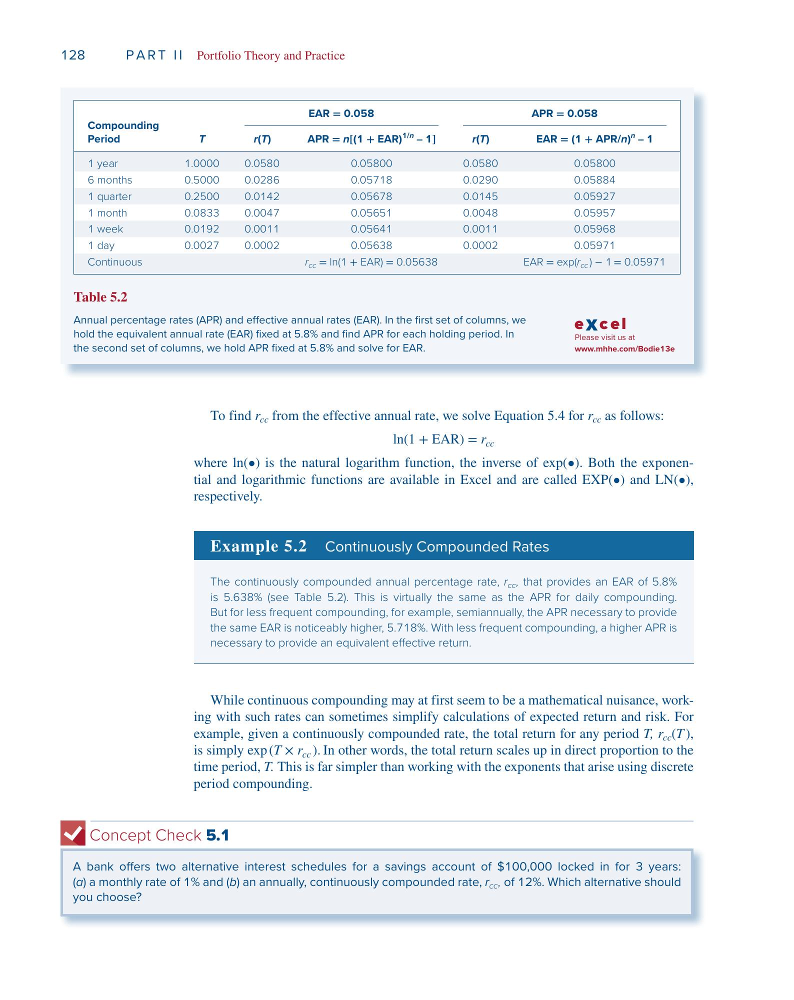

> **例子**：银行月利率 0.5%。
> - $\text{APR} = 0.5\% \times 12 = 6\%$
> - $\text{EAR} = 1.005^{12} - 1 = 6.17\%$
>
> 信用卡月利率 1.5%：
> - $\text{APR} = 1.5\% \times 12 = 18\%$
> - $\text{EAR} = 1.015^{12} - 1 = 19.56\%$（实际负担比报价高得多）

### 1.4 连续复利 (Continuous Compounding, CC)

当 $n \to \infty$ 时，达到连续复利。连续复利年利率记为 $r_{cc}$：

$1 + \text{EAR} = e^{r_{cc}} \tag{5.4}$

$r_{cc} = \ln(1 + \text{EAR})$

$r_{cc}$ 本质上是一个**数学变换工具**，将收益率从"乘法世界"映射到"加法世界"。现实中不存在"每时每刻结息"，但通过这个变换，多期收益率的计算从乘法变成加法，统计分析也更方便。

> **为什么好用？** 假设三年的实际收益率为 $r_1, r_2, r_3$：
> - 普通收益率算总收益：$(1+r_1)(1+r_2)(1+r_3)$（乘法）
> - 连续复利算总收益：$r_{cc,1} + r_{cc,2} + r_{cc,3}$（加法）
>
> 加法的好处：如果每期 $r_{cc}$ 服从正态分布（Normal Distribution），它们的和也服从正态分布——统计推断变得很简单。

> **大小关系**：以月利率 0.5% 为例，$\text{EAR} = 6.17\%$：
> $r_{cc} = \ln(1.0617) = 5.99\%$
> 始终有 $r_{cc} < \text{APR} < \text{EAR}$。

---

## 二、利率与通胀 (§5.2)

### 2.1 名义利率 (Nominal Interest Rate) 与实际利率 (Real Interest Rate)

- 名义利率 $r_{\text{nom}}$：你的**钱**增长了多少
- 实际利率 $r_{\text{real}}$：你的**购买力**增长了多少

精确关系：

$1 + r_{\text{real}} = \frac{1 + r_{\text{nom}}}{1 + i} \tag{5.5}$

近似公式（通胀率 $i$ 较小时）：

$r_{\text{real}} \approx r_{\text{nom}} - i \tag{5.7}$

> **例子**：存银行 1000 块，名义利率 10%，通胀 6%。
> - 一年后拿到 1100 块，但面包从 1 块涨到 1.06 块
> - 去年能买 1000 个面包，今年只能买 $1100/1.06 = 1038$ 个
> - 购买力只增长了 3.8%，不是 10%
> - 精确：$(1.10/1.06) - 1 = 3.8\%$
> - 近似：$10\% - 6\% = 4\%$（偏高 0.2%）

### 2.2 Fisher 假说 (Fisher Hypothesis)

Irving Fisher (1930) 提出，名义利率随预期通胀一一对应地变动：

$r_{\text{nom}} = r_{\text{real}} + E(i) \tag{5.8}$

如果实际利率稳定在 2%，预期通胀从 4% 升到 5%，名义利率应从 6% 升到 7%。

### 2.3 均衡实际利率的决定

实际利率由三个因素决定：
- **资金供给**：家庭储蓄意愿（利率越高 → 储蓄越多 → 供给曲线右上倾斜）
- **资金需求**：企业投资意愿（利率越低 → 投资越多 → 需求曲线右下倾斜）
- **政府政策**：财政政策和货币政策可以移动供给/需求曲线

均衡利率由供给和需求曲线的交点决定。

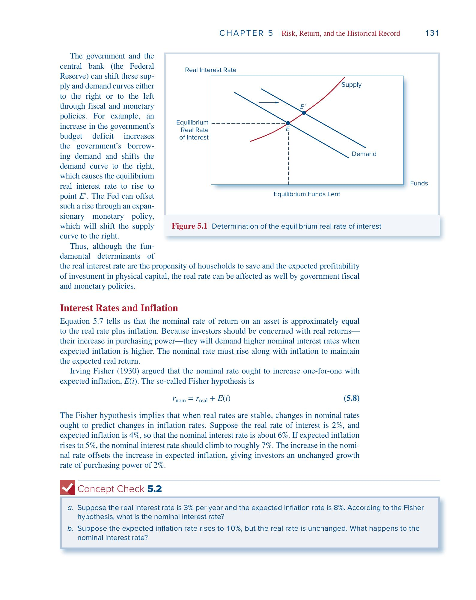

### 2.4 税收的侵蚀效应

税是按名义收入征收的，通胀部分也要交税：

$r_{\text{nom}}(1-t) - i = r_{\text{real}}(1-t) - it \tag{5.9}$

最后的 $-it$ 项就是通胀带来的额外税负。

> **例子**：名义利率 5%，预期通胀 2%，税率 25%。
> - 税后名义收益：$5\% \times 0.75 = 3.75\%$
> - 税后实际收益：$3.75\% - 2\% = 1.75\%$
> - 如果在"理想"的税制下（只对实际收益征税）：$(5\%-2\%) \times 0.75 = 2.25\%$
> - 通胀额外吃掉了 $it = 2\% \times 25\% = 0.5\%$ 的收益

### 2.5 历史实证

1927–2021 年美国 T-Bill（Treasury Bill，短期国债）数据显示：1952 年之后通胀波动性明显下降，名义利率对通胀的追踪更精确，实际利率更加稳定。

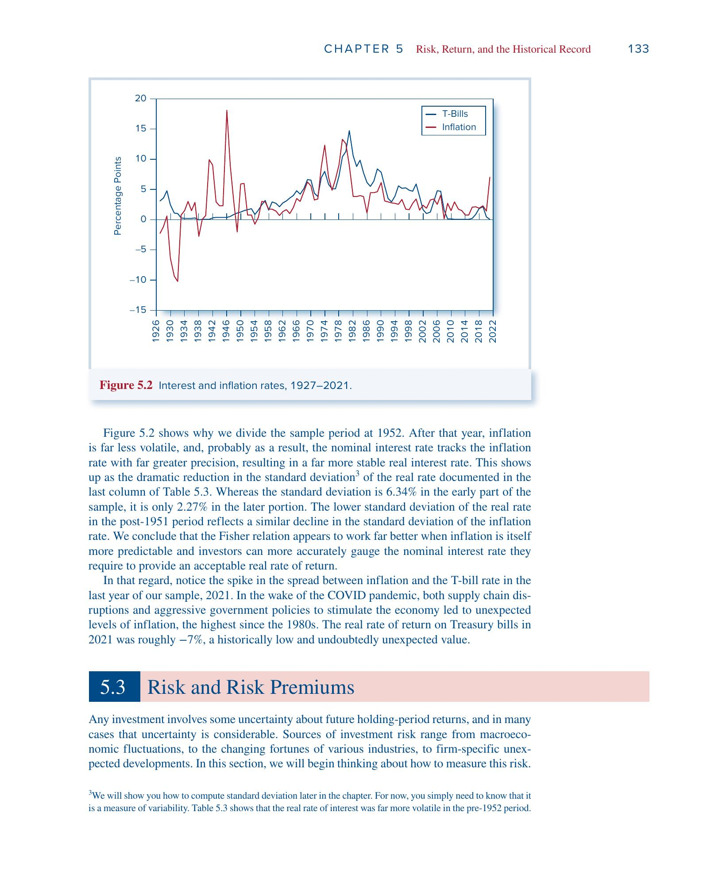

---

## 三、风险与风险溢价 (§5.3)

### 3.1 情景分析 (Scenario Analysis)

设定若干经济情景及其概率，计算各情景下的 HPR。

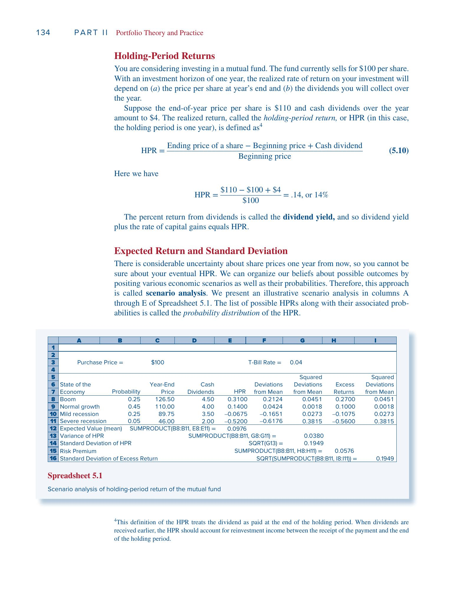

> **例子**：花 100 块买一只基金，一年后的收益取决于经济状态：
>
> | 经济状态 | 概率 | 年末价格 | 分红 | HPR |
> |---------|------|---------|------|-----|
> | 繁荣 | 0.25 | 126.50 | 4.50 | 31.0% |
> | 正常 | 0.45 | 110.00 | 4.00 | 14.0% |
> | 轻度衰退 | 0.25 | 89.75 | 3.50 | -6.75% |
> | 严重衰退 | 0.05 | 46.00 | 2.00 | -52.0% |
>
> 以繁荣为例：$\text{HPR} = (126.50 - 100 + 4.50)/100 = 31\%$

### 3.2 期望收益 (Expected Return)

$E(r) = \sum_s p(s) \cdot r(s) \tag{5.11}$

> 代入上面的数据：
> $E(r) = 0.25 \times 31\% + 0.45 \times 14\% + 0.25 \times (-6.75\%) + 0.05 \times (-52\%) = 9.76\%$

### 3.3 方差 (Variance) 与标准差 (Standard Deviation, SD)

方差度量收益率偏离均值的典型幅度——先算偏差，平方后加权求和：

$\sigma^2 = \text{Var}(r) = \sum_s p(s) \cdot [r(s) - E(r)]^2 \tag{5.12}$

标准差 $\sigma = \sqrt{\text{Var}(r)}$，单位与收益率一致。

> 接着上面的例子：
> - 繁荣的偏差：$31\% - 9.76\% = 21.24\%$
> - 严重衰退的偏差：$-52\% - 9.76\% = -61.76\%$
>
> $\sigma^2 = 0.25(0.2124)^2 + 0.45(0.0424)^2 + 0.25(-0.1651)^2 + 0.05(-0.6176)^2 = 0.0380$
> $\sigma = \sqrt{0.0380} = 19.49\%$
>
> 意思是：实际收益率在 9.76% 上下波动，典型波动幅度约 19.49 个百分点。

### 3.4 风险溢价 (Risk Premium) 与超额收益 (Excess Return)

- **风险溢价**：$E(r) - r_f$（期望收益减去无风险利率 Risk-Free Rate）
- **超额收益**：某一期的实际收益与无风险利率之差
- 风险溢价 = 超额收益的期望值

> 无风险利率 $r_f = 4\%$ 时，风险溢价 $= 9.76\% - 4\% = 5.76\%$。这是承担风险的"报酬"。

### 3.5 Sharpe 比率 (Sharpe Ratio)

每承担一单位风险，能获得多少超额收益：

$\text{Sharpe ratio} = \frac{E(r_P) - r_f}{\sigma_P} \tag{5.13}$

> $\text{Sharpe} = \frac{5.76\%}{19.49\%} = 0.30$
> 数字越高，投资的风险回报"性价比"越好。

---

## 四、正态分布 (Normal Distribution) (§5.4)

### 4.1 为什么正态分布重要？

美国股市 95 年（1927–2021）月收益率的频率直方图近似钟形曲线。正态分布有四个便利性质：

1. **对称性**：正偏差与负偏差等概率，$\sigma$ 足以描述风险
2. **稳定性**：正态资产的任意组合仍为正态
3. **两参数刻画**：只需均值 $\mu$ 和标准差 $\sigma$
4. **相关性简化**：证券间的统计依赖用单个相关系数（Correlation Coefficient）即可概括

### 4.2 关键概率

- 约 68.26% 的结果落在 $\mu \pm 1\sigma$ 之间
- 约 95.44% 的结果落在 $\mu \pm 2\sigma$ 之间
- 约 99.74% 的结果落在 $\mu \pm 3\sigma$ 之间

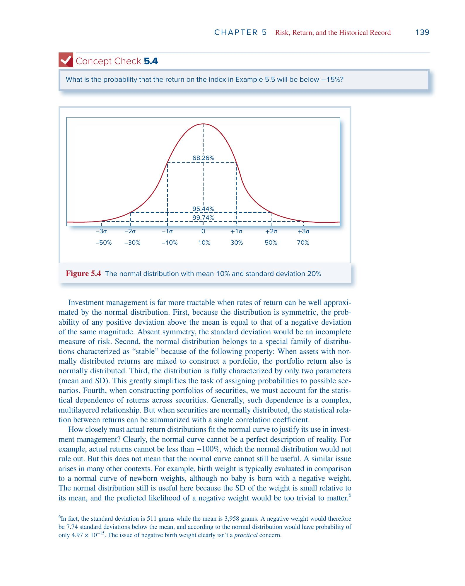

> **例子**：假设股市月收益率正态分布，$\mu = 1\%$，$\sigma = 6\%$。
> - "这个月亏钱"意味着收益率 < 0%，即偏离均值 $1/6$ 个标准差，概率约 43.4%
> - "收益率低于 -15%"则偏离均值 $16/6 \approx 2.67$ 个标准差，概率仅 0.38%——非常罕见

### 4.3 正态分布的局限

- 理论上允许收益率低于 -100%（现实不可能）
- 实际数据中极端事件（大涨大跌）比正态预测的更频繁

不过对短期（月度）收益率而言，正态是一个够用的近似——就像用正态分布评估新生儿体重，虽然理论上允许负体重，但那个概率小到可以忽略。

---

## 五、偏离正态与尾部风险 (Tail Risk) (§5.5)

### 5.1 偏度 (Skew)

衡量分布的不对称性。用三次方保留正负号：

$\text{Skew} = \text{Average}\left[\frac{(R - \bar{R})^3}{\hat{\sigma}^3}\right] \tag{5.14}$

- Skew ≈ 0：大致对称
- Skew < 0（负偏 / 左偏）：极端亏损更常见 → 标准差**低估**真实风险
- Skew > 0（正偏 / 右偏）：极端盈利更常见

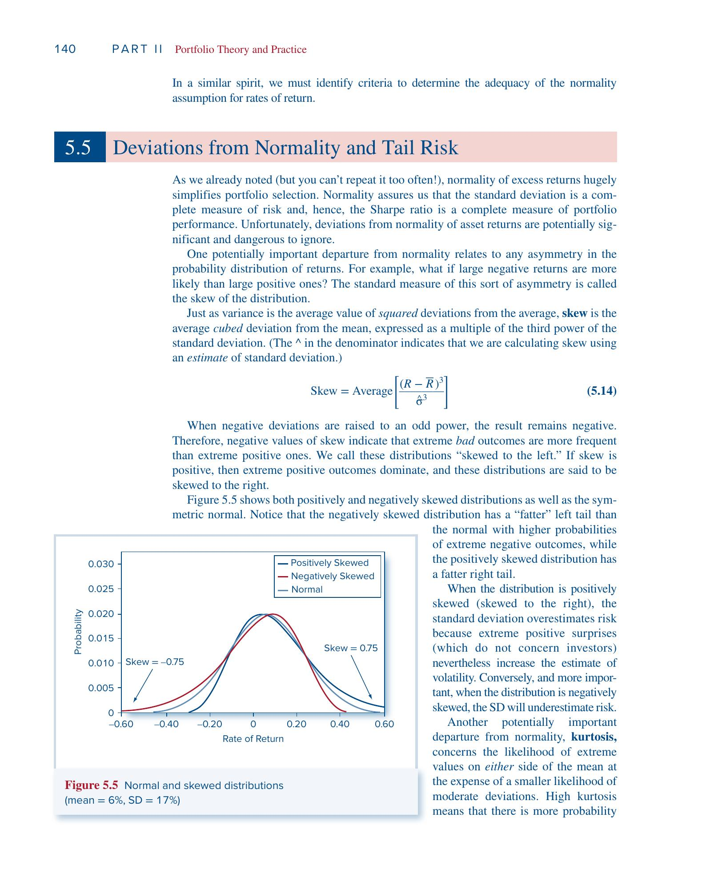

参见上图中负偏分布（红线）的左尾比正态更厚——极端亏损出现的概率更高。

### 5.2 峰度 (Kurtosis)

衡量尾巴的肥瘦。用四次方放大极端值的影响：

$\text{Kurtosis} = \text{Average}\left[\frac{(R - \bar{R})^4}{\hat{\sigma}^4}\right] - 3 \tag{5.15}$

减 3 是以正态分布为基准（正态的四阶矩比恰好为 3）。

- Kurtosis ≈ 0：尾部与正态相当
- Kurtosis > 0：肥尾（Fat Tails），极端事件比正态预测的更频繁

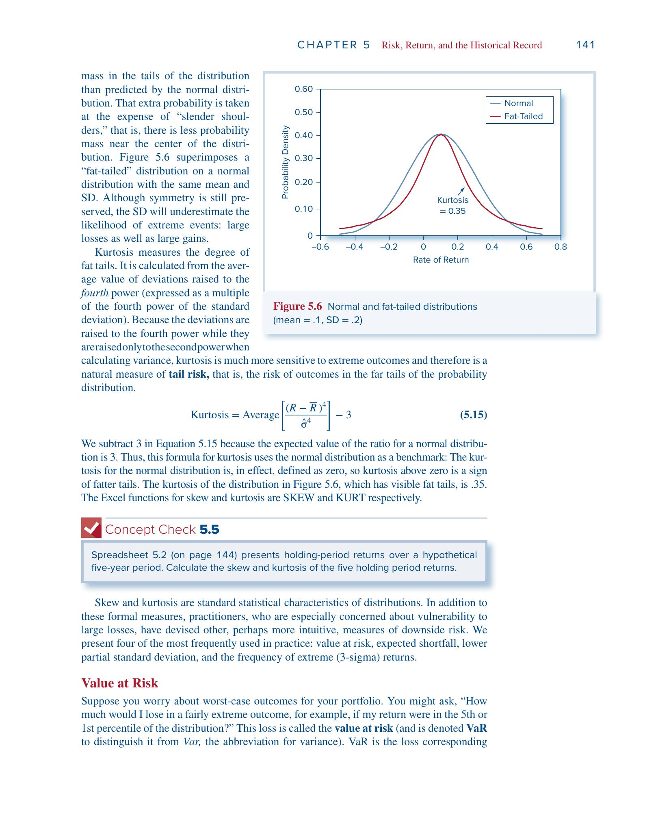

参见上图：肥尾分布的两端概率高于正态，中心处的概率反而更低（"瘦肩膀"）。

### 5.3 四种实务下行风险度量

**① VaR (Value at Risk, 在险价值)**

在给定概率下的最大损失门槛。1% VaR 意味着有 99% 的把握损失不超过该值。

$\text{VaR}(1\%, \text{normal}) = \mu - 2.33\sigma$

> 例：$\mu = 1\%$，$\sigma = 6\%$ 时，$\text{VaR}(1\%) = 1\% - 2.33 \times 6\% = -12.98\%$
> 即有 99% 的概率，月亏损不超过 12.98%。

**② ES (Expected Shortfall, 预期亏空)**

又称 CTE (Conditional Tail Expectation)。VaR 告诉你"最差 1% 的门槛在哪"，ES 告诉你"跌破门槛后平均亏多少"。ES 一定比 VaR 更差。

**③ LPSD (Lower Partial Standard Deviation, 下偏标准差)**

只用负超额收益（低于无风险利率的部分）计算的标准差，专门衡量下行波动。

**④ Sortino 比率 (Sortino Ratio)**

用 LPSD 替换标准差的 Sharpe 比率：$\text{Sortino} = \frac{E(r) - r_f}{\text{LPSD}}$。只惩罚下行波动。

**⑤ 极端负收益频率**

数一数低于 $\mu - 3\sigma$ 的月份占比。正态预测为 0.13%，若实际远高于此则说明存在肥尾。

**各指标的角色总结**：

| 指标 | 回答的问题 |
|------|----------|
| 标准差 $\sigma$ | 波动有多大？（上下都算） |
| 偏度 | 波动是否一边倒？ |
| 峰度 | 极端事件是否太多？ |
| VaR | 最坏情况的门槛在哪？ |
| ES | 最坏情况到底有多坏？ |
| LPSD / Sortino | 只看坏的那一边，风险回报比如何？ |

---

## 六、从历史数据中学习 (§5.6)

### 6.1 算术平均 (Arithmetic Average)

将 $n$ 个历史观测值视为等概率情景（每个概率 $1/n$），期望收益估计为：

$\bar{r} = \frac{1}{n}\sum_{s=1}^{n} r(s) \tag{5.16}$

用途：**预测未来单期期望收益**的无偏估计。

### 6.2 几何平均 (Geometric Average)

衡量过去实际的复合增长率：

$(1 + g)^n = (1 + r_1)(1 + r_2)\cdots(1 + r_n) \tag{5.17}$

$g = \left[\prod(1+r_s)\right]^{1/n} - 1$

用途：**衡量历史实际业绩**。

> **例子**：过去 5 年收益率为 -11.89%、-22.10%、28.69%、10.88%、4.91%。
> - 算术平均：$(-11.89 - 22.10 + 28.69 + 10.88 + 4.91)/5 = 2.10\%$
> - 终值：$0.8811 \times 0.7790 \times 1.2869 \times 1.1088 \times 1.0491 = 1.0275$
> - 几何平均：$1.0275^{1/5} - 1 = 0.54\%$

### 6.3 为什么几何平均总是更小？

$E[\text{几何平均}] \approx E[\text{算术平均}] - \frac{1}{2}\sigma^2 \tag{5.18}$

波动率越大，差距越大——这就是**波动率拖累 (Volatility Drag)**。

> **直觉**：亏 20% 后赚 20% 不能回本：$0.80 \times 1.20 = 0.96$。
> 正收益是在更小的基数上实现的，无法完全补偿之前的损失。
> 要从亏 20% 回本，需要赚 25%。要从亏 50% 回本，需要赚 100%。

### 6.4 样本方差的自由度修正 (Degrees of Freedom)

用 $\bar{r}$ 替代未知的 $E(r)$ 会使方差估计偏低。修正方法：分母从 $n$ 改为 $n-1$：

$\hat{\sigma}^2 = \frac{1}{n-1}\sum_{s=1}^{n}[r(s) - \bar{r}]^2 \tag{5.20}$

$n$ 很大时差别可忽略。Excel 中 `STDEV.S` 用 $n-1$（修正），`STDEV.P` 用 $n$（不修正）。

### 6.5 观测频率 vs 样本长度

一个反直觉的结论：

- **均值估计精度**：取决于样本跨度（年数），与观测频率无关。10 年年度 ≈ 10 年月度
- **标准差估计精度**：更高频的观测有帮助（更多的偏差信息）

### 6.6 标准差的时间换算

若各期收益率不相关，$T$ 期的标准差 $= \sigma_{\text{单期}} \times \sqrt{T}$：

$\sigma_{\text{年}} = \sqrt{12} \times \sigma_{\text{月}}$

方差按时间线性增长，标准差按 $\sqrt{T}$ 增长。

---

## 七、历史实证 (§5.7)

### 7.1 三大类资产的风险收益（1927–2021）

| | T-Bills（短期国债） | T-Bonds（长期国债） | 股票 |
|---|---|---|---|
| 平均年收益率 | 3.30% | 5.96% | 12.17% |
| 风险溢价 (Risk Premium) | — | 2.66% | 8.87% |
| 标准差 | 3.10% | 11.58% | 19.89% |
| 最好的一年 | 14.71% | 41.68% | 57.35% |
| 最差的一年 | -0.02% | -25.96% | -44.04% |

**核心规律：风险越高，收益越高。** T-Bill 几乎无风险，收益也最低；股票风险最大，但平均每年比 T-Bill 多赚 8.87%。

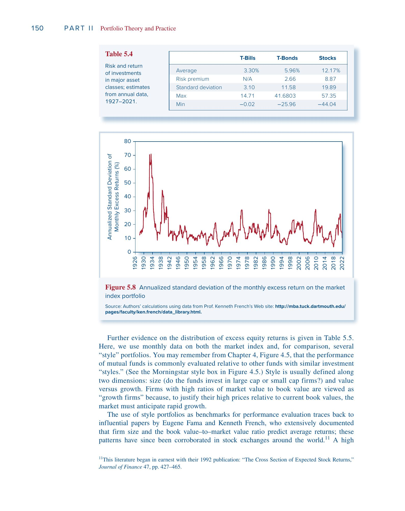

下图展示了三类资产年收益率的频率分布。股票的分布最"摊开"（高波动），T-Bill 几乎集中在一个窄区间：

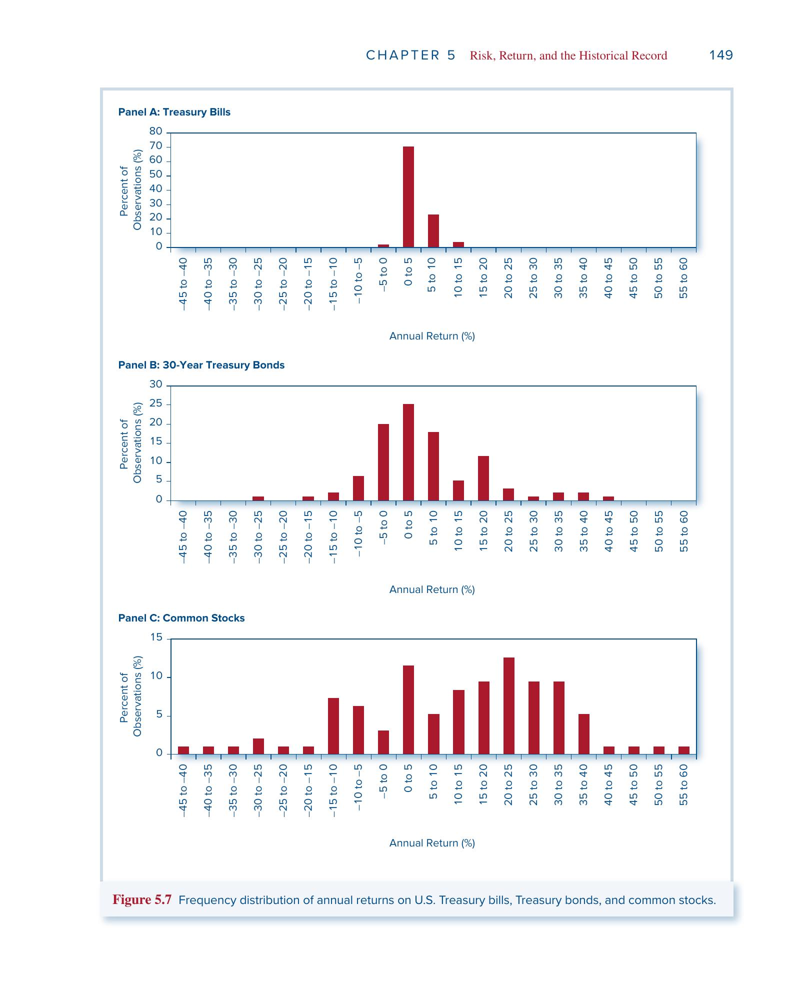

### 7.2 风格组合 (Style Portfolios)

按 Fama-French 分类，将股票按**规模**和**账面市值比 (Book-to-Market Ratio, B/M)** 分组：

- **大盘 (Big)**：市值（Market Capitalization）高于中位数的公司，如苹果、微软
- **小盘 (Small)**：市值低于中位数的公司，通常规模小、知名度低
- **价值股 (Value，高 B/M)**：股价相对账面资产便宜，增长前景一般，市场给的估值低
- **成长股 (Growth，低 B/M)**：股价远高于账面资产，市场预期高速增长（典型如科技股）

1927–2021 年数据（年化）：

| 组合 | 超额收益 | 标准差 | Sharpe 比率 |
|---|---|---|---|
| 市场指数 | 8.86% | 18.52% | 0.48 |
| 大盘成长 | 8.79% | 18.35% | 0.48 |
| 大盘价值 | 12.02% | 24.83% | 0.48 |
| 小盘成长 | 9.60% | 25.97% | 0.37 |
| 小盘价值 | 15.54% | 28.23% | 0.55 |

主要发现：

- **小盘价值股**的平均超额收益最高（15.54%），Sharpe 比率也最高（0.55），风险回报比最优
- **小盘成长股**的 Sharpe 比率最低（0.37），风险大但回报不够
- 峰度普遍远高于 0，说明存在肥尾
- 低于 $\mu - 3\sigma$ 的极端负收益频率约为正态预测（0.13%）的 5–7 倍
- 1952 年之后各项风险指标均明显改善

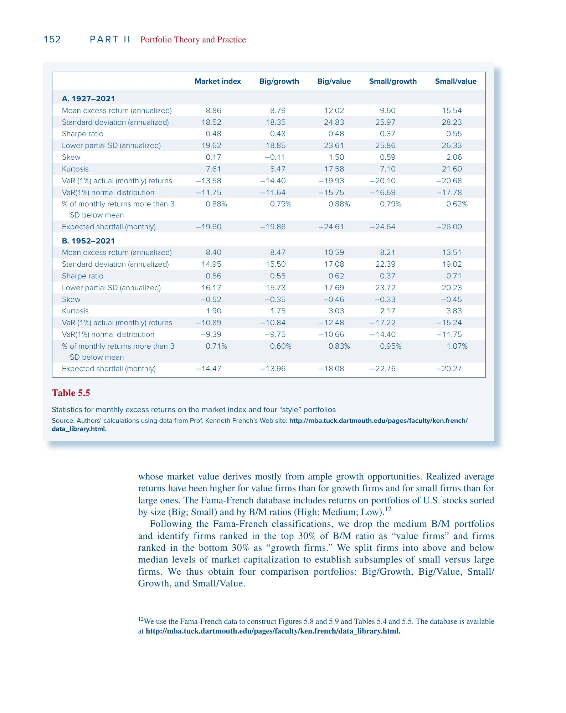

### 7.3 全球比较

1900–2020 年国际数据（见书中 Figure 5.10）：

- 美国股票年均超额收益 7.7%，全球（不含美国）平均仅 5.3%
- 美国 Sharpe 比率 0.40，全球平均仅 0.29，美国仅次于澳大利亚

美国的优异表现可能包含**事后偏差**——20 世纪初无人能预测美国会成为全球最强经济体，科技巨头的崛起也多属意外。因此用美国历史数据估计未来风险溢价时，可能需要向下修正。

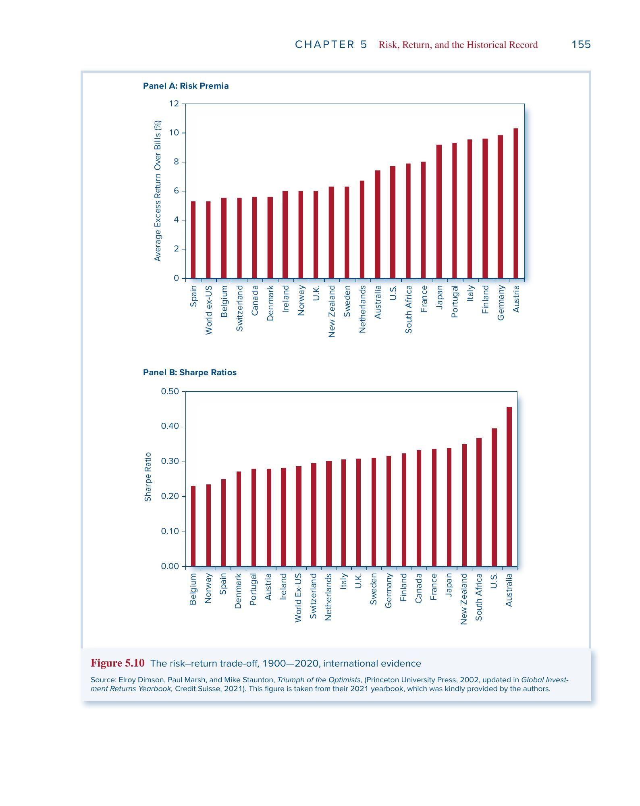

---

## 八、正态性与长期投资 (§5.8)

### 8.1 复利导致对数正态分布 (Lognormal Distribution)

短期收益率近似正态，但多期复合终值：

$W_T = W_0 \times (1+r_1)(1+r_2)\cdots(1+r_T)$

是随机变量的乘积，服从对数正态分布——正偏，右尾更长。

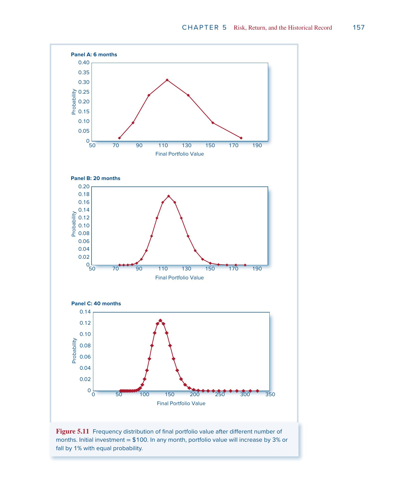

上图展示了 6、20、40 个月后终值分布的演变：随着期限增长，分布越来越右偏。

使用连续复利可保持正态的可加性：多期累计 $r_{cc}$ 为各期之和，仍服从正态。

### 8.2 长期投资更安全吗？

假设年化连续复利收益率 $\mu = 5\%$，$\sigma = 30\%$：

| | 1 年 | 10 年 | 30 年 |
|---|---|---|---|
| 累计期望收益 | 5% | 50% | 150% |
| 累计标准差 | 30% | 94.9% | 164.3% |
| 亏损概率 | 43.4% | 29.9% | 18.1% |
| 1% VaR 终值（1元变成） | 0.523 | 0.181 | 0.098 |

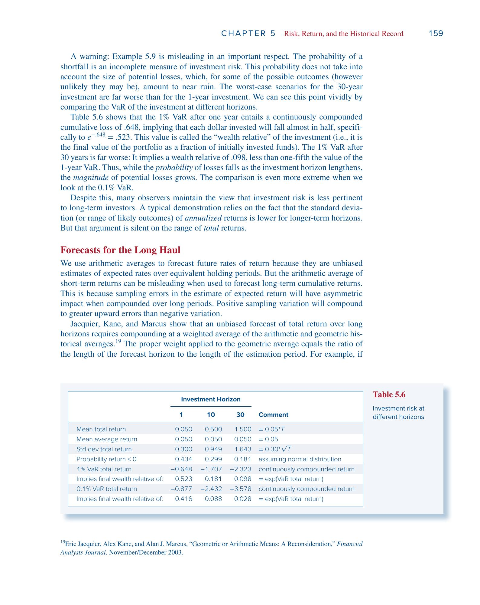

**亏损概率在下降**——因为期望收益按 $T$ 增长，标准差仅按 $\sqrt{T}$ 增长。

**但亏损幅度在上升**——1% VaR 终值从 0.52（亏一半）恶化到 0.098（只剩不到一毛钱）。

> **类比**：两种赌博——
> - A：40% 概率亏 100 块
> - B：10% 概率亏 10000 块
>
> B 的亏损概率更低，但你不会觉得 B 更安全。
> **只看概率不看幅度是不完整的风险评估。** 长期投资并不一定更安全。

根本原因是复利的不对称性：

> 亏 50% 后赚 50% 不能回本：$0.5 \times 1.5 = 0.75$。
> 要从亏 50% 回本，需要赚 100%。时间越长，这种不对称的累积效应越大。

### 8.3 长期预测的利率选择

Jacquier, Kane, Marcus 的修正方法——对长期预测，应以算术平均和几何平均的加权作为复合利率：

$\text{预测利率} = g \times \frac{T}{N} + \bar{r} \times \frac{N-T}{N}$

其中 $g$ 为几何平均，$\bar{r}$ 为算术平均，$T$ 为预测期限，$N$ 为历史样本长度。预测期越长，几何平均权重越大。

---

## 关键公式速查

| 公式 | 表达式 |
|------|--------|
| 持有期收益率 | $\text{HPR} = \frac{P_{\text{end}} - P_{\text{begin}} + D}{P_{\text{begin}}}$ |
| EAR ↔ APR | $1 + \text{EAR} = (1 + \text{APR}/n)^n$ |
| 连续复利 | $r_{cc} = \ln(1 + \text{EAR})$ |
| 实际利率（精确） | $1 + r_{\text{real}} = \frac{1 + r_{\text{nom}}}{1 + i}$ |
| 实际利率（近似） | $r_{\text{real}} \approx r_{\text{nom}} - i$ |
| Fisher 假说 | $r_{\text{nom}} = r_{\text{real}} + E(i)$ |
| 期望收益 | $E(r) = \sum p(s) \cdot r(s)$ |
| 方差 | $\sigma^2 = \sum p(s) \cdot [r(s) - E(r)]^2$ |
| Sharpe 比率 | $S = \frac{E(r_P) - r_f}{\sigma_P}$ |
| 几何 vs 算术平均 | $E[g] \approx E[\bar{r}] - \frac{1}{2}\sigma^2$ |
| 标准差时间换算 | $\sigma_T = \sigma_1 \times \sqrt{T}$ |
| VaR (1%, 正态) | $\text{VaR} = \mu - 2.33\sigma$ |

---

## 关键术语表

| 缩写 | 英文全称 | 中文 |
|------|---------|------|
| HPR | Holding-Period Return | 持有期收益率 |
| EAR | Effective Annual Rate | 有效年利率 |
| APR | Annual Percentage Rate | 年百分比利率 |
| CC | Continuous Compounding | 连续复利 |
| SD | Standard Deviation | 标准差 |
| VaR | Value at Risk | 在险价值 |
| ES | Expected Shortfall | 预期亏空 |
| CTE | Conditional Tail Expectation | 条件尾部期望 |
| LPSD | Lower Partial Standard Deviation | 下偏标准差 |
| B/M | Book-to-Market Ratio | 账面市值比 |
| CPI | Consumer Price Index | 消费者价格指数 |

---

> 参考文献：Bodie, Kane, Marcus. *Investments*, 13th Edition, Chapter 5.
