# 第2章 因子投资方法论（重编版）

> 本文是对《因子投资：方法与实践》第2章的重新编排。原章节内容完整保留，按更清晰的逻辑线索重新组织：先建立核心问题，再准备计量工具，然后依次解决"构建因子→检验模型→检验异象→比较模型"四个任务，最后讨论前沿话题和统一框架。

---

## 1. 核心问题：资产预期收益率的截面差异

### 1.1 多因子模型

因子投资方法论的一切围绕一个核心方程展开。**多因子模型**（multi-factor model）指出，资产的预期超额收益和因子预期收益率之间满足如下关系：

$$E[R_i^e] = \alpha_i + \boldsymbol{\beta}_i'\boldsymbol{\lambda} \tag{2.12}$$

其中：
- $R_i^e$ 是资产 $i$ 的**超额收益**（excess return），即资产收益率减去无风险利率。一个资产可以是一支股票，也可以是一个投资组合。
- $\boldsymbol{\beta}_i$ 是 $K$ 维**因子暴露**（factor exposure / factor loading）向量，衡量资产 $i$ 的收益率对各因子收益率变化的敏感程度。
- $\boldsymbol{\lambda}$ 是 $K$ 维**因子预期收益率**（factor risk premium）向量。
- $\alpha_i$ 是**定价误差**（pricing error / alpha），代表模型无法解释的部分。

这个模型研究的是**截面**（cross-section）问题——不同资产之间预期收益率为什么不一样。答案是：暴露 $\boldsymbol{\beta}_i$ 高的资产，预期收益 $E[R_i^e]$ 就高。预期收益率是因子暴露的线性函数。

### 1.2 几何直觉

以单因子模型为例（图2.3）。横轴是因子暴露 $\beta_i$，纵轴是预期超额收益 $E[R_i^e]$，每个点代表一个资产。直线 $E[R_i^e] = \beta_i\lambda$ 的斜率就是因子预期收益率 $\lambda$。资产偏离这条直线的距离就是定价误差 $\alpha_i$。

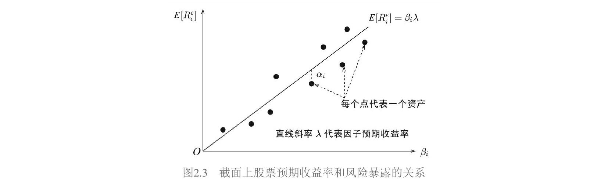

### 1.3 检验的三个部分

拿到一个多因子模型后，如何定量评估它的好坏？检验包含三个部分：

| 任务 | 说明 |
|---|---|
| 估计值 | $\hat{\alpha}_i,\ \hat{\boldsymbol{\beta}}_i,\ \hat{\boldsymbol{\lambda}}$ |
| 标准误 | $\sigma(\hat{\alpha}_i),\ \sigma(\hat{\boldsymbol{\beta}}_i),\ \sigma(\hat{\boldsymbol{\lambda}})$ |
| 检验 | 联合检验所有 $N$ 个资产的定价误差；检验每个因子的预期收益率 |

最核心的问题是：所有 $\alpha_i$ 联合起来是否在统计上足够接近零。如果是，模型就能很好地解释资产预期收益率的截面差异。

无论选择哪些因子，也无论采用哪种回归方法，检验最终都归结为三步：
1. 计算每个资产在所有因子上的暴露 $\boldsymbol{\beta}_i$
2. 通过回归分析对模型进行估计
3. 联合检验 $\alpha_i$ 以及每个因子的预期收益率 $\lambda_k$

在深入各种回归方法之前，先来准备必要的计量经济学工具。

---

## 2. 计量工具箱

本节介绍后续所有检验方法都会用到的计量经济学基础。这些工具在因子和异象的检验中无处不在。

### 2.1 广义线性回归模型

考虑总体的广义线性回归模型：

$$\boldsymbol{y} = \boldsymbol{X}\boldsymbol{b} + \boldsymbol{\varepsilon}$$

$$E[\boldsymbol{\varepsilon}|\boldsymbol{X}] = \boldsymbol{0}, \quad E[\boldsymbol{\varepsilon}\boldsymbol{\varepsilon}'|\boldsymbol{X}] = \sigma^2\boldsymbol{\Upsilon} = \boldsymbol{\Sigma} \tag{2.52}$$

其中 $\boldsymbol{y}$ 是 $T$ 维向量，$\boldsymbol{X}$ 是 $T \times (K+1)$ 解释变量矩阵（$K$ 个解释变量加一个截距项），$\boldsymbol{b}$ 是 $(K+1)$ 维回归系数向量，$\boldsymbol{\varepsilon}$ 是 $T$ 维随机扰动向量。

经典线性回归假设 $\boldsymbol{\Upsilon} = \boldsymbol{I}$（扰动独立且同方差）。广义模型通过引入正定矩阵 $\boldsymbol{\Upsilon}$ 允许打破这两个假设。

### 2.2 异方差与自相关

**异方差**（heteroscedasticity）：不同时刻的扰动方差不同，但时刻之间无关联。此时 $\sigma^2\boldsymbol{\Upsilon}$ 是对角阵：

$$\sigma^2\boldsymbol{\Upsilon} = \text{diag}(\sigma_1^2, \sigma_2^2, \cdots, \sigma_T^2) \tag{2.53}$$

**自相关**（autocorrelation）：不同时刻的扰动存在关联。此时 $\sigma^2\boldsymbol{\Upsilon}$ 有非零的非对角元素：

$$\sigma^2\boldsymbol{\Upsilon} = \sigma^2\begin{bmatrix} 1 & \rho_1 & \cdots & \rho_{T-1} \\ \rho_1 & 1 & \cdots & \rho_{T-2} \\ \vdots & \vdots & \ddots & \vdots \\ \rho_{T-1} & \rho_{T-2} & \cdots & 1 \end{bmatrix} \tag{2.54}$$

一般情况下二者同时存在。

### 2.3 OLS 估计与协方差矩阵

对模型（2.52）使用 OLS（Ordinary Least Squares，简单最小二乘）得到 $\boldsymbol{b}$ 的估计：

$$\hat{\boldsymbol{b}} = (\boldsymbol{X}'\boldsymbol{X})^{-1}\boldsymbol{X}'\boldsymbol{y} = \boldsymbol{b} + (\boldsymbol{X}'\boldsymbol{X})^{-1}\boldsymbol{X}'\boldsymbol{\varepsilon} \tag{2.55}$$

由 $E[\boldsymbol{\varepsilon}|\boldsymbol{X}] = \boldsymbol{0}$ 可知 $E[\hat{\boldsymbol{b}}] = \boldsymbol{b}$，即 OLS 估计量仍然是**无偏的**。但其协方差矩阵为：

$$\boldsymbol{V}_{\text{OLS}} = \frac{1}{T}\left(\frac{1}{T}\boldsymbol{X}'\boldsymbol{X}\right)^{-1}\underbrace{\left(\frac{1}{T}\boldsymbol{X}'[\sigma^2\boldsymbol{\Upsilon}]\boldsymbol{X}\right)}_{\boldsymbol{Q}}\left(\frac{1}{T}\boldsymbol{X}'\boldsymbol{X}\right)^{-1} \tag{2.56}$$

这是一个"三明治"结构：两片面包 $(\boldsymbol{X}'\boldsymbol{X})^{-1}$ 夹着中间矩阵 $\boldsymbol{Q}$。当 $\boldsymbol{\Upsilon} = \boldsymbol{I}$ 时，退化为经典公式 $\boldsymbol{V}_{\text{OLS}} = \sigma^2(\boldsymbol{X}'\boldsymbol{X})^{-1}$。但一旦存在异方差或自相关，用经典公式算出的标准误就是**错误的**。

修正自相关和异方差的核心就是正确估计中间矩阵：

$$\boldsymbol{Q} \equiv \frac{1}{T}\boldsymbol{X}'[\sigma^2\boldsymbol{\Upsilon}]\boldsymbol{X} = \frac{1}{T}\sum_{i=1}^{T}\sum_{j=1}^{T}\sigma_{ij}\boldsymbol{x}_i\boldsymbol{x}_j' \tag{2.58}$$

其中 $\boldsymbol{x}_i$ 是 $\boldsymbol{X}$ 第 $i$ 行的转置。

### 2.4 White 估计量（修正异方差）

当仅有异方差、无自相关时，$\boldsymbol{Q}$ 只涉及对角线元素：

$$\boldsymbol{Q} = \frac{1}{T}\sum_{i=1}^{T}\sigma_i^2\boldsymbol{x}_i\boldsymbol{x}_i' \tag{2.59}$$

White（1980）指出，用 OLS 残差 $\hat{\varepsilon}_i$ 代替未知的 $\sigma_i$ 即可得到 $\boldsymbol{Q}$ 的渐进估计 $\boldsymbol{S}_0$：

$$\boldsymbol{S}_0 = \frac{1}{T}\sum_{i=1}^{T}\hat{\varepsilon}_i^2\boldsymbol{x}_i\boldsymbol{x}_i' \tag{2.60}$$

代入三明治结构：

$$\hat{\boldsymbol{V}}_{\text{OLS}} = T(\boldsymbol{X}'\boldsymbol{X})^{-1}\boldsymbol{S}_0(\boldsymbol{X}'\boldsymbol{X})^{-1} \tag{2.61}$$

这被称为 **White 异方差相合估计量**（heteroscedasticity-consistent estimator）。其优势在于无需知道异方差的具体形式。

### 2.5 Newey–West 估计量（同时修正异方差和自相关）

一个朴素的想法是将 $\boldsymbol{S}$ 扩展到全部 $T^2$ 个元素：

$$\boldsymbol{S} = \frac{1}{T}\sum_{i=1}^{T}\sum_{j=1}^{T}\hat{\varepsilon}_i\hat{\varepsilon}_j\boldsymbol{x}_i\boldsymbol{x}_j' \tag{2.62}$$

但这不可行：$T^2$ 项求和只除以 $T$，$\boldsymbol{S}$ 可能不收敛；即便收敛也可能不正定。

Newey and West（1987）给出了正确的估计量：

$$\boldsymbol{S} = \frac{1}{T}\sum_{t=1}^{T}\hat{\varepsilon}_t^2\boldsymbol{x}_t\boldsymbol{x}_t' + \frac{1}{T}\sum_{j=1}^{J}\sum_{t=j+1}^{T}w_j\hat{\varepsilon}_t\hat{\varepsilon}_{t-j}(\boldsymbol{x}_t\boldsymbol{x}_{t-j}' + \boldsymbol{x}_{t-j}\boldsymbol{x}_t') \tag{2.63}$$

$$w_j = 1 - \frac{j}{1+J}$$

第一项就是 White 的异方差部分，第二项是自相关修正。权重 $w_j$ 随滞后阶数 $j$ 递减——离得越远，相关性影响越小。$J$ 是最大滞后阶数，Newey and West（1994）给出自适应公式：

$$J = \left\lfloor 4 \times \left(\frac{T}{100}\right)^{2/9}\right\rfloor \tag{2.65}$$

最终协方差矩阵的 **Newey–West 异方差自相关相合估计量**（HAC estimator）：

$$\hat{\boldsymbol{V}}_{\text{OLS}} = T(\boldsymbol{X}'\boldsymbol{X})^{-1}\boldsymbol{S}(\boldsymbol{X}'\boldsymbol{X})^{-1} \tag{2.64}$$

对角线元素开方就是回归系数的标准误。在实证资产定价文献中，"经 Newey–West 调整后的 $t$-值"无处不在，指的就是使用式（2.64）计算标准误后算出的 $t$-值。

### 2.6 对单一收益率序列的 Newey–West 调整

检验一个收益率序列 $\{\hat{\lambda}_t\}$（可以是因子收益率或异象收益率）的均值是否显著时，可以将 $\hat{\lambda}_t$ 作为被解释变量，$X_t = 1$ 作为解释变量跑 OLS。回归系数就是时序均值 $\hat{\lambda}$，残差为 $\hat{\varepsilon}_t = \hat{\lambda}_t - \hat{\lambda}$。代入式（2.63），由 $\boldsymbol{x}_t = 1$，中间矩阵退化为标量：

$$S = \frac{1}{T}\left\{\sum_{t=1}^{T}\hat{\varepsilon}_t^2 + 2\sum_{j=1}^{J}\sum_{t=j+1}^{T}w_j\hat{\varepsilon}_t\hat{\varepsilon}_{t-j}\right\} \tag{2.66}$$

由 $\boldsymbol{X}'\boldsymbol{X} = T$ 代入式（2.64）得：

$$\hat{\sigma}_{\hat{\lambda}}^2 = S / T \tag{2.67}$$

开方得到 $\text{s.e.}(\hat{\lambda}) = \sqrt{S/T}$，用它算 $t$-值即可。本书第3章检验因子、第5章检验异象都会用到这个公式。

### 2.7 Shanken 修正

在截面回归中，因子暴露 $\hat{\boldsymbol{\beta}}_i$ 是从第一步时序回归估计得到的，而非真值。将估计值当作解释变量（称为**生成的回归变量**，generated regressors），会导致标准误被低估。Shanken（1992）给出了修正方法，核心是在协方差矩阵中添加修正系数 $(1 + \boldsymbol{\lambda}'\boldsymbol{\Sigma}_f^{-1}\boldsymbol{\lambda})$：

$$\text{cov}(\hat{\boldsymbol{\lambda}}) = \frac{1}{T}\left[(\hat{\boldsymbol{\beta}}'\hat{\boldsymbol{\beta}})^{-1}\hat{\boldsymbol{\beta}}'\boldsymbol{\Sigma}\hat{\boldsymbol{\beta}}(\hat{\boldsymbol{\beta}}'\hat{\boldsymbol{\beta}})^{-1}(1 + \boldsymbol{\lambda}'\boldsymbol{\Sigma}_f^{-1}\boldsymbol{\lambda}) + \boldsymbol{\Sigma}_f\right] \tag{2.24}$$

$$\text{cov}(\hat{\boldsymbol{\alpha}}) = \frac{1}{T}\left[\boldsymbol{I} - \hat{\boldsymbol{\beta}}(\hat{\boldsymbol{\beta}}'\hat{\boldsymbol{\beta}})^{-1}\hat{\boldsymbol{\beta}}'\right]\boldsymbol{\Sigma}\left[\boldsymbol{I} - \hat{\boldsymbol{\beta}}(\hat{\boldsymbol{\beta}}'\hat{\boldsymbol{\beta}})^{-1}\hat{\boldsymbol{\beta}}'\right]'(1 + \boldsymbol{\lambda}'\boldsymbol{\Sigma}_f^{-1}\boldsymbol{\lambda}) \tag{2.25}$$

实际应用中，用样本估计量 $\hat{\boldsymbol{\lambda}}$、$\hat{\boldsymbol{\Sigma}}_f$ 代替真值。

---

## 3. 构建因子——从抽象到具体

### 3.1 因子模拟投资组合

因子是抽象的——"驱动资产收益率共同变化的某种力量"。要研究因子，必须把它变成一个可以计算收益率的投资组合，这就是**因子模拟投资组合**（factor mimicking portfolio）。它需要同时满足两个条件：

- **条件一（纯净性）：** 该投资组合仅在目标因子上有大于零的暴露，在其他因子上的暴露为零。
- **条件二（最小特质风险）：** 在所有满足条件一的投资组合中，该投资组合的**特质性风险**（idiosyncratic risk，即个股收益率中随机扰动 $\varepsilon_t$ 带来的风险）最小。

条件一保证组合收益仅由目标因子驱动；条件二保证特质性风险不会压过因子信号、引入过大误差。

用一个假想例子说明。四支股票在因子A、B上的暴露和特质性风险如下：

| 股票 | 因子A暴露 | 因子B暴露 | 特质性风险 |
|---|---|---|---|
| 股票一 | 0.8 | 0.4 | 1% |
| 股票二 | 1.3 | 0.6 | 2% |
| 股票三 | 0.6 | −0.4 | 5% |
| 股票四 | 1.2 | −0.4 | 1% |

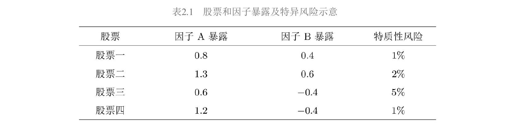

构建因子A的模拟组合：

- 等权配置股票一和股票二？**不行**——它们在因子B上暴露都很高，组合收益受A和B共同影响，违反条件一。
- 等权配置股票一和股票三？因子B暴露 $0.4 + (-0.4) = 0$，满足条件一。
- 等权配置股票一和股票四？因子B暴露同样为零，也满足条件一。

两个都满足条件一，用条件二取舍：后者特质风险更低（1%+1% vs 1%+5%），所以选股票一和股票四。

有了因子模拟投资组合，其收益率就是因子收益率。

### 3.2 排序法——绕过"先有鸡还是先有蛋"

构建因子模拟组合需要知道因子暴露 $\beta_i$。但 $\beta_i$ 的计算需要因子收益率（通过回归得到），而因子收益率又来自因子模拟组合。这个循环可以通过**投资组合排序法**（portfolio sort）打破。

排序法的核心思想：用**排序变量**（sort variable）的取值高低来**代替**因子暴露。它不假设变量取值等于暴露，也不假设二者之间满足某种特定数学关系，仅假设二者**正相关**。以账面市值比（book-to-market ratio, BM，即市净率的倒数）为例，排序法认为高 BM 的股票在围绕 BM 构建的价值因子上暴露更高，低 BM 的股票暴露更低，仅此而已。

排序法仅适用于围绕财务信息或量价数据构建的**风格因子**（style factor），如市值、估值、盈利、低波动等。对于 GDP 这类**宏观经济因子**，由于难以从个股数据出发找到与因子暴露相关的变量，无法使用排序法。

排序法包含三步：

**第一步：排序。** 确定股票池，将全部股票在截面上按排序变量（如 BM）的取值高低排序。

**第二步：分组并构建价差组合。** 按排名高低将全部股票分为 $L$ 组（通常 $L = 10$，按十分位数划分）。做多排名最高的第一组，做空排名最低的最后一组，构成**价差组合**（spread portfolio）。价差组合就是因子模拟投资组合，其收益率就是因子收益率。构建时要求多空两头金额相同（**资金中性**），组内个股加权方式通常为**市值加权**或**等权重**。

**第三步：定期再平衡。** 个股在变量上的取值随时间变化，需要定期（每月或每年）重复上述两步，更新因子模拟投资组合。这个更新过程称为**再平衡**（rebalance）。在每期构建新组合后，计算该组合在当前时刻和下一个再平衡时刻之间的收益率，在时序上往复，就得到因子收益率的时间序列 $\{\lambda_t\}$。

### 3.3 排序法的检验

通过排序法得到因子收益率时间序列和 $L$ 个投资组合的收益率后，需要进行**投资组合排序检验**（portfolio sort test），包含两个内容。

**检验一：因子预期收益率是否显著大于零。**

令 $\{\lambda_t\}$（$t = 1, 2, \cdots, T$）为因子收益率时间序列，则因子预期收益率的估计及标准误为：

$$\hat{\lambda} = \frac{1}{T}\sum_{t=1}^{T}\lambda_t \tag{2.1}$$

$$\text{s.e.}(\hat{\lambda}) = \frac{\text{std}(\lambda_t)}{\sqrt{T}} \tag{2.2}$$

原假设为因子预期收益为零（$\lambda = 0$），计算 $t$-值：

$$t\text{-值} = \frac{\hat{\lambda}}{\text{s.e.}(\hat{\lambda})} \tag{2.3}$$

满足自由度 $T-1$ 的 $t$ 分布。学术界通常使用 0.05 和 0.01 的显著性水平，大样本下对应 $t$-值阈值约为 2.0 和 2.6。

以 BM 为例，在 A 股市场将股票按 BM 高低分为 $L = 10$ 组（Low, 2, …, 9, High），每组内按总市值加权，每月再平衡。做多 High 组、做空 Low 组构建价值因子。检验结果如下：

| | Low | 1 | 2 | 3 | 4 | 5 | 6 | 7 | 8 | High | High−Low |
|---|---|---|---|---|---|---|---|---|---|---|---|
| 均值(%) | 0.57 | 0.53 | 0.57 | 0.72 | 0.94 | 0.90 | 1.08 | 1.32 | 1.21 | 1.44 | 0.88 |
| 标准误(%) | 0.57 | 0.56 | 0.55 | 0.58 | 0.56 | 0.53 | 0.57 | 0.58 | 0.56 | 0.58 | 0.47 |
| $t$-值 | 1.00 | 0.95 | 1.03 | 1.24 | 1.69 | 1.69 | 1.90 | 2.27 | 2.15 | 2.48 | 1.85 |
| $p$-值 | 0.32 | 0.35 | 0.30 | 0.22 | 0.09 | 0.09 | 0.06 | 0.02 | 0.03 | 0.01 | 0.07 |

因子月均收益率 0.88%，$t$-值 1.85，$p$-值 0.07，在 0.1 显著性水平下可拒绝原假设。（注：检验标准误时也可以使用 2.6 节介绍的 Newey–West 调整。）

**检验二：$L$ 个投资组合收益率的单调性。**

一个好的因子应能解释个股超额收益的截面差异，因此 $L$ 个投资组合的收益率应随排序变量单调变化。用 **Spearman 秩相关系数**（以 Charles Spearman 命名）衡量：

$$\rho_s = \frac{\text{cov}(X_r, X_g)}{\sigma_{X_r}\sigma_{X_g}} \tag{2.4}$$

其中 $X_r$ 是收益率排位，$X_g$ 是变量分组排位。$\rho_s = 1$ 表示完美单调递增，$\rho_s = -1$ 表示完美单调递减。

上述 BM 排序的实证结果（图2.1）显示 10 个组合的月均收益率基本随 BM 增加而变大，秩相关系数 $\rho_s = 0.94$（$p$-值 $5.48 \times 10^{-5}$），单调性显著。

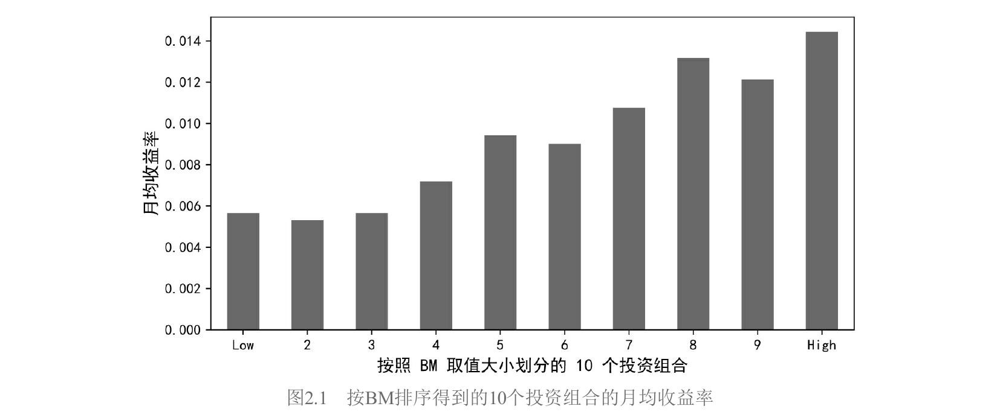

### 3.4 多重排序法

单变量排序（univariate sorting）的缺点是难以控制其他因子的影响。例如，如果高 BM 的股票恰好全是大市值股票，那价差组合的收益就混杂了 BM 和市值两个因子的效应。多重排序法通过使用多个变量排序来缓解这个问题。

#### 独立双重排序

所谓**独立双重排序**（independent / unconditional double sorting），即按两个变量 $X_1$ 和 $X_2$ 分别**独立地**将股票排序分组，然后取交集。假设各分 5 组（$L_1 = L_2 = 5$），两两交集得到 25 个投资组合（图2.2中的 $P_{11}$ 到 $P_{55}$）。

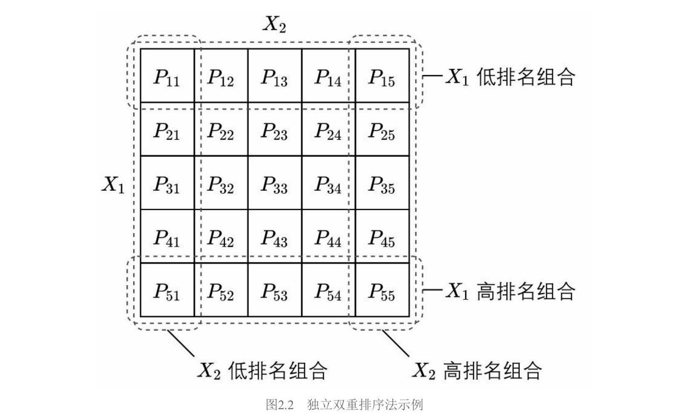

图中行对应 $X_1$ 的5档（从第1行 $X_1$ 最低到第5行 $X_1$ 最高），列对应 $X_2$ 的5档。围绕 $X_1$ 构建因子：做多第5行的5个组合，做空第1行的5个组合：

$$\lambda_{X_1 t} = \frac{1}{L_2}\sum_{i=1}^{L_2}R_{L_1 i,t} - \frac{1}{L_2}\sum_{i=1}^{L_2}R_{1i,t} \tag{2.5}$$

类似地，围绕 $X_2$ 构建因子（做多第5列，做空第1列）：

$$\lambda_{X_2 t} = \frac{1}{L_1}\sum_{i=1}^{L_1}R_{iL_2,t} - \frac{1}{L_1}\sum_{i=1}^{L_1}R_{i1,t} \tag{2.6}$$

两个变量的地位**完全对称**。

将式（2.5）和（2.6）中的投资组合收益率重新排列，可得等价形式——"先做差、再平均"：

$$\lambda_{X_1 t} = \frac{1}{L_2}\sum_{i=1}^{L_2}(R_{L_1 i,t} - R_{1i,t}) \tag{2.7}$$

$$\lambda_{X_2 t} = \frac{1}{L_1}\sum_{i=1}^{L_1}(R_{iL_2,t} - R_{i1,t}) \tag{2.8}$$

式（2.7）（2.8）在**异象研究**中更常用。以 $X_1$（异象变量）和 $X_2$（已有因子变量）做双重排序检验异象时，研究者不仅关心总的异象收益率，还关心在 $X_2$ 的每个分组内 $X_1$ 能否区分收益率截面差异——也就是每个 $R_{L_1 i,t} - R_{1i,t}$ 是否显著。

独立双重排序的缺点：当 $X_1$ 和 $X_2$ 截面相关性很高时，某些交叉组合内的股票数目可能过少（特别是高 $X_1$、低 $X_2$ 以及低 $X_1$、高 $X_2$ 的组），导致因子收益率不稳定。

#### 条件双重排序

**条件双重排序**（dependent / conditional double sorting）按给定顺序先后使用两个变量排序。假设先用 $X_1$ 将全部股票分成 $L_1$ 组，然后在每组内再用 $X_2$ 分成 $L_2$ 组。这意味着条件排序考察的是控制了 $X_1$ 之后，$X_2$ 对收益率的影响。

两个变量地位**不对称**：$X_1$ 只是控制变量，只需围绕 $X_2$ 构建因子。

条件排序中围绕 $X_2$ 计算因子收益率有两种方法。

**方法一：** 与独立双重排序相同，使用式（2.6）或式（2.8）。

**方法二（取并集法）：** 将全部 $L_1$ 个 $X_2$ 排名最高的组取并集，全部 $L_1$ 个 $X_2$ 排名最低的组取并集：

$$P_{L_2}^{\text{top}} = P_{1L_2} \cup P_{2L_2} \cup \cdots \cup P_{L_1 L_2} \tag{2.9}$$

$$P_{L_2}^{\text{bottom}} = P_{11} \cup P_{21} \cup \cdots \cup P_{L_1 1} \tag{2.10}$$

将多头和空头中的全部股票各自按市值加权（或等权）配置，因子收益率为：

$$\lambda_{X_2 t} = R_{L_2}^{\text{top}} - R_{L_2}^{\text{bottom}} \tag{2.11}$$

两种方法的区别：等权配置时式（2.6）和式（2.11）完全等价；只有在市值加权时才有差异——式（2.6）先在子组合内市值加权再等权平均，式（2.11）先汇总所有多头（空头）股票再统一市值加权。两种方法在文献中均有使用（Bali et al. 2014 用式（2.6），Liu et al. 2019 用式（2.11））。

条件排序保证了每组内都有足够多的股票。

#### 两点补充说明

**关于选择：** 条件排序在控制第一个变量方面比独立排序更好，但学术界研究因子时更习惯使用独立排序，可能与 Fama and French（1993）的传统有关。研究异象时，为排除小市值影响，使用市值和异象变量进行条件双重排序也很常见。

**关于分组数：** 研究异象时，股票池大时 $5 \times 5$ 或 $10 \times 10$ 都常见。研究因子时，Fama and French（1993）的 $2 \times 3$ 划分（市值分2组 × 另一变量分3组）是经典做法，影响深远。

#### 三重排序

Hou et al.（2015）的四因子模型使用规模、投资和盈利三个维度进行三重排序（triple sorting），原因是盈利和投资效应在小盘股中更强，需要同时控制市值。

### 3.5 因子命名约定

同一个因子至少有三种叫法。以 BM 因子为例：

| 命名方式 | 名称 | 出发点 | 代表 |
|---|---|---|---|
| 按构建方式 | HML（High Minus Low） | 多空两头 | Fama and French (1993) |
| 按排序变量 | BM因子 | 变量本身 | — |
| 按代表风格 | 价值因子 | 变量代表的股票风格 | 本书采用 |

本书选择以**风格**命名，理由：（1）风格因子在股票市场中占主导地位，"风格"比变量更能传达因子的经济含义；（2）业界常用多个指标（如 BM 和 EP）构建同一风格的因子，用单一指标命名以偏概全。Fama and French 的命名方式在因子越来越多时会造成不便（盈利因子叫 RMW = Robust Minus Weak，投资因子叫 CMA = Conservative Minus Aggressive……）。

---

## 4. 检验多因子模型——三种回归方法

### 4.1 时间序列回归

**时间序列回归**（time-series regression）是最简单直接的方法。Black et al.（1972）最早用它来检验 CAPM。

**前提：** 因子收益率时序 $\{\boldsymbol{\lambda}_t\}$ 已知（通过排序法算出）。因此此方法更适合分析由风格因子构成的多因子模型。

**做法：** 以因子收益率作为解释变量，资产超额收益率作为被解释变量，对每个资产 $i$ 独立进行时序 OLS 回归：

$$R_{it}^e = \alpha_i + \boldsymbol{\beta}_i'\boldsymbol{\lambda}_t + \varepsilon_{it}, \quad t = 1, 2, \cdots, T \tag{2.13}$$

对 $N$ 个资产分别跑 $N$ 次回归，得到每个资产的截距 $\hat{\alpha}_i$（定价误差的估计）、因子暴露 $\hat{\boldsymbol{\beta}}_i$，以及残差 $\hat{\varepsilon}_{it}$。

将式（2.13）在时序上取均值：

$$E_T[R_i^e] = \hat{\alpha}_i + \hat{\boldsymbol{\beta}}_i'\hat{\boldsymbol{\lambda}}, \quad i = 1, 2, \cdots, N \tag{2.14}$$

其中因子预期收益率的估计就是因子收益率的时序均值：

$$\hat{\lambda}_k = E_T[\lambda_{kt}], \quad k = 1, 2, \cdots, K \tag{2.15}$$

**几何理解（图2.4）：** 以单因子为例，时序回归得到的直线 $E[R_i^e] = \beta_i\lambda$ 必然经过两个点：原点 $(0, 0)$（$\beta_i = 0$ 时 $E[R_i^e] = 0$）和因子投资组合 $(1, \lambda)$（因子组合在自身上的暴露为1）。所有资产到这条直线的距离就是 $\hat{\alpha}_i$。

关键特征：这条直线**不是**通过最小化所有 $\hat{\alpha}_i$ 的平方和得到的（每个资产是独立回归的），这是时序回归与截面回归最大的区别。

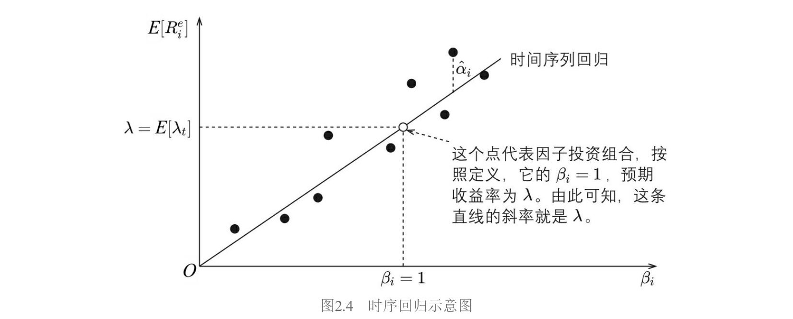

**GRS 检验：** 假设 $\varepsilon_{it}$ 满足 IID（独立同分布）正态分布，Gibbons, Ross, Shanken（1989）给出了联合检验所有 $\alpha_i = 0$ 的 $F$ 统计量（称为 GRS 统计量）：

$$\frac{T-N-K}{N}\left(1 + E[\boldsymbol{\lambda}_t]'\hat{\boldsymbol{\Sigma}}_\lambda^{-1}E[\boldsymbol{\lambda}_t]\right)^{-1}\hat{\boldsymbol{\alpha}}'\hat{\boldsymbol{\Sigma}}^{-1}\hat{\boldsymbol{\alpha}} \sim F_{N,\,T-N-K} \tag{2.16}$$

其中 $\hat{\boldsymbol{\alpha}} = [\hat{\alpha}_1, \cdots, \hat{\alpha}_N]'$，$\hat{\boldsymbol{\Sigma}}_\lambda = \frac{1}{T}\sum_{t=1}^T[\boldsymbol{\lambda}_t - E[\boldsymbol{\lambda}_t]][\boldsymbol{\lambda}_t - E[\boldsymbol{\lambda}_t]]'$ 是因子收益率的样本协方差矩阵，$\hat{\boldsymbol{\Sigma}} = \frac{1}{T}\sum_{t=1}^T\hat{\boldsymbol{\varepsilon}}_t\hat{\boldsymbol{\varepsilon}}_t'$ 是残差的样本协方差矩阵。

GRS 检验是有限样本下的精确统计量，但高度依赖正态分布假设，且要求 $T > N$。当 $\varepsilon_{it}$ 存在相关性或异方差时，可采用 GMM（第9节）进行检验。

**时序回归小结：**
1. 因子收益率时序需已知，适合风格因子。
2. 截距 $\hat{\alpha}_i$ 直接就是定价误差。
3. 因子预期收益率 = 因子收益率时序均值，对每个因子用 $t$-检验分析。
4. 联合检验 $\alpha_i$ 使用 GRS 的 $F$ 统计量。

### 4.2 截面回归

**截面回归**（cross-sectional regression）不要求因子收益率时序已知，因此应用更广泛，能处理 GDP、CPI、利率等宏观经济因子。

**第一步：时序回归得因子暴露。** 假设 $t$ 期一组因子的取值为 $\boldsymbol{f}_t$（不一定是因子收益率），通过时序回归确定因子暴露：

$$R_{it}^e = a_i + \boldsymbol{\beta}_i'\boldsymbol{f}_t + \varepsilon_{it}, \quad t = 1, 2, \cdots, T \tag{2.17}$$

截距用 $a_i$ 而非 $\alpha_i$，因为如果 $\boldsymbol{f}_t$ 不是因子收益率，截距就不是定价误差。

**第二步：截面回归。** 用 $\hat{\boldsymbol{\beta}}_i$ 作为解释变量，$E_T[R_i^e]$（全部 $T$ 期的时序平均）作为被解释变量，在截面上做回归。这种方法又被称为**两步回归估计**（two-pass regression estimate）。

不含截距项的模型：

$$E_T[R_i^e] = \hat{\boldsymbol{\beta}}_i'\boldsymbol{\lambda} + \alpha_i, \quad i = 1, 2, \cdots, N \tag{2.18}$$

含截距项 $\gamma$ 的模型：

$$E_T[R_i^e] = \gamma + \hat{\boldsymbol{\beta}}_i'\boldsymbol{\lambda} + \alpha_i, \quad i = 1, 2, \cdots, N \tag{2.19}$$

定义 $N \times K$ 因子暴露矩阵 $\hat{\boldsymbol{\beta}} = [\hat{\boldsymbol{\beta}}_1, \cdots, \hat{\boldsymbol{\beta}}_N]'$，$N$ 维向量 $\hat{\boldsymbol{\alpha}} = [\hat{\alpha}_1, \cdots, \hat{\alpha}_N]'$，$N$ 维向量 $E_T[\boldsymbol{R}^e] = [E_T[R_1^e], \cdots, E_T[R_N^e]]'$。OLS 估计量：

$$\hat{\boldsymbol{\lambda}} = (\hat{\boldsymbol{\beta}}'\hat{\boldsymbol{\beta}})^{-1}\hat{\boldsymbol{\beta}}'E_T[\boldsymbol{R}^e] \tag{2.20}$$

$$\hat{\boldsymbol{\alpha}} = E_T[\boldsymbol{R}^e] - \hat{\boldsymbol{\beta}}\hat{\boldsymbol{\lambda}} \tag{2.21}$$

**几何理解（图2.5）：** OLS 截面回归通过原点（不含截距项时），以最小化所有 $\hat{\alpha}_i$ 的平方和为目标确定直线斜率。

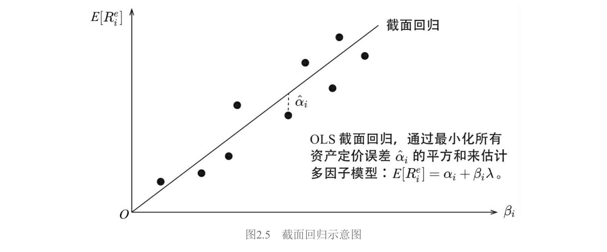

**标准误：** 定义 $\boldsymbol{\Sigma}_f = \text{cov}(\boldsymbol{f}_t)$，$\boldsymbol{\Sigma} = \text{cov}(\boldsymbol{\varepsilon}_t)$（假设 $\boldsymbol{f}_t$ 和 $\boldsymbol{\varepsilon}_t$ 独立、各自 IID）。不考虑 Shanken 修正时：

$$\text{cov}(\hat{\boldsymbol{\lambda}}) = \frac{1}{T}\left[(\hat{\boldsymbol{\beta}}'\hat{\boldsymbol{\beta}})^{-1}\hat{\boldsymbol{\beta}}'\boldsymbol{\Sigma}\hat{\boldsymbol{\beta}}(\hat{\boldsymbol{\beta}}'\hat{\boldsymbol{\beta}})^{-1} + \boldsymbol{\Sigma}_f\right] \tag{2.22}$$

$$\text{cov}(\hat{\boldsymbol{\alpha}}) = \frac{1}{T}\left[\boldsymbol{I} - \hat{\boldsymbol{\beta}}(\hat{\boldsymbol{\beta}}'\hat{\boldsymbol{\beta}})^{-1}\hat{\boldsymbol{\beta}}'\right]\boldsymbol{\Sigma}\left[\boldsymbol{I} - \hat{\boldsymbol{\beta}}(\hat{\boldsymbol{\beta}}'\hat{\boldsymbol{\beta}})^{-1}\hat{\boldsymbol{\beta}}'\right]' \tag{2.23}$$

考虑 Shanken 修正后，添加系数 $(1 + \boldsymbol{\lambda}'\boldsymbol{\Sigma}_f^{-1}\boldsymbol{\lambda})$（见第2节式（2.24）（2.25））。

截面上 $\alpha_i$ 之间存在相关性，OLS 会低估标准误。可用 **GLS**（Generalized Least Squares，广义最小二乘）代替 OLS：

$$\hat{\boldsymbol{\lambda}}_{\text{GLS}} = (\hat{\boldsymbol{\beta}}'\boldsymbol{\Sigma}^{-1}\hat{\boldsymbol{\beta}})^{-1}\hat{\boldsymbol{\beta}}'\boldsymbol{\Sigma}^{-1}E_T[\boldsymbol{R}^e] \tag{2.26}$$

$$\hat{\boldsymbol{\alpha}}_{\text{GLS}} = E_T[\boldsymbol{R}^e] - \hat{\boldsymbol{\beta}}\hat{\boldsymbol{\lambda}}_{\text{GLS}} \tag{2.27}$$

GLS 并考虑 Shanken 修正后的协方差矩阵：

$$\text{cov}(\hat{\boldsymbol{\lambda}}_{\text{GLS}}) = \frac{1}{T}\left[(\hat{\boldsymbol{\beta}}'\boldsymbol{\Sigma}^{-1}\hat{\boldsymbol{\beta}})^{-1}(1 + \hat{\boldsymbol{\lambda}}_{\text{GLS}}'\boldsymbol{\Sigma}_f^{-1}\hat{\boldsymbol{\lambda}}_{\text{GLS}}) + \boldsymbol{\Sigma}_f\right] \tag{2.28}$$

$$\text{cov}(\hat{\boldsymbol{\alpha}}_{\text{GLS}}) = \frac{1}{T}\left(\boldsymbol{\Sigma} - \hat{\boldsymbol{\beta}}(\hat{\boldsymbol{\beta}}'\boldsymbol{\Sigma}^{-1}\hat{\boldsymbol{\beta}})^{-1}\hat{\boldsymbol{\beta}}'\right)(1 + \hat{\boldsymbol{\lambda}}_{\text{GLS}}'\boldsymbol{\Sigma}_f^{-1}\hat{\boldsymbol{\lambda}}_{\text{GLS}}) \tag{2.29}$$

**检验统计量（$\chi^2$ 检验）：**

$$\text{OLS}: \hat{\boldsymbol{\alpha}}'\text{cov}(\hat{\boldsymbol{\alpha}})^{-1}\hat{\boldsymbol{\alpha}} \sim \chi^2_{N-K} \tag{2.30}$$

$$\text{GLS}: \hat{\boldsymbol{\alpha}}_{\text{GLS}}'\text{cov}(\hat{\boldsymbol{\alpha}}_{\text{GLS}})^{-1}\hat{\boldsymbol{\alpha}}_{\text{GLS}} \sim \chi^2_{N-K} \tag{2.31}$$

### 4.3 时序回归 vs 截面回归

图2.6以单因子为例直观比较了两者。

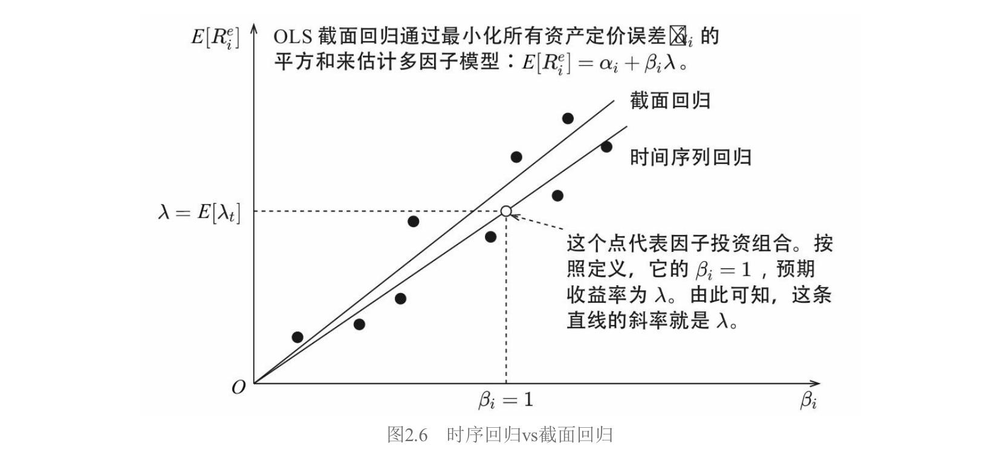

- **时序回归的直线**必然经过原点 $(0,0)$ 和因子组合 $(1, \lambda)$，斜率是因子收益率时序均值，是"给定的"。
- **截面回归的直线**以最小化所有 $\hat{\alpha}_i$ 的平方和为目标，斜率是"算出来的"。

**截面回归隐含了纯因子组合。** 这是一个非常优美的结论。将式（2.20）中的 $(\hat{\boldsymbol{\beta}}'\hat{\boldsymbol{\beta}})^{-1}\hat{\boldsymbol{\beta}}'$ 记为 $\boldsymbol{\Omega}$（$K \times N$ 矩阵），它的每一行就是一个因子的投资组合权重：

$$\hat{\boldsymbol{\lambda}} = (\hat{\boldsymbol{\beta}}'\hat{\boldsymbol{\beta}})^{-1}\hat{\boldsymbol{\beta}}'E_T[\boldsymbol{R}^e] = \boldsymbol{\Omega}\,E_T[\boldsymbol{R}^e] \tag{2.32}$$

验证 $\boldsymbol{\Omega}$ 的性质：

$$\boldsymbol{\Omega}\hat{\boldsymbol{\beta}} = (\hat{\boldsymbol{\beta}}'\hat{\boldsymbol{\beta}})^{-1}\hat{\boldsymbol{\beta}}'\hat{\boldsymbol{\beta}} = \boldsymbol{I} \tag{2.33}$$

展开来看，令 $\omega_{ki}$ 为 $\boldsymbol{\Omega}$ 第 $k$ 行第 $i$ 列的元素（因子 $k$ 的组合中资产 $i$ 的权重），$\hat{\beta}_{ij}$ 为 $\hat{\boldsymbol{\beta}}$ 第 $i$ 行第 $j$ 列的元素（资产 $i$ 在因子 $j$ 上的暴露）：

$$\sum_{i=1}^{N}\omega_{ki}\hat{\beta}_{ij} = 0 \quad (j \neq k) \tag{2.34}$$

$$\sum_{i=1}^{N}\omega_{ki}\hat{\beta}_{ik} = 1 \tag{2.35}$$

式（2.34）说明因子 $k$ 的投资组合对任何其他因子 $j \neq k$ 的暴露均为零；式（2.35）说明对自身暴露为1。这完美满足因子模拟组合条件一的要求。因此截面回归得到的因子收益率通常被认为比排序法更客观——它控制了其他因子的暴露。

**同时使用两种方法的警示意义（图2.7）：** 如果时序回归的因子收益率（斜率为正）和截面回归的因子收益率（斜率为负）方向相反，说明选择的因子可能有问题。

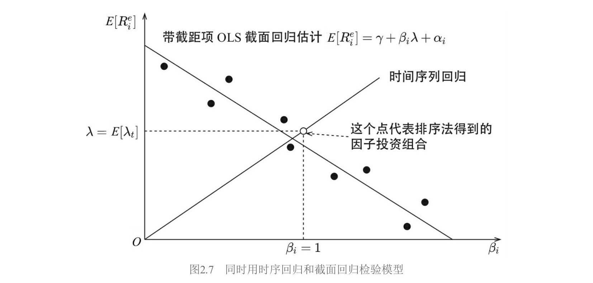

### 4.4 Fama–MacBeth 回归

1973年，Eugene Fama 和 James MacBeth 在 Fama and MacBeth（1973）中提出了 **Fama–MacBeth 回归**。该方法巧妙地排除了随机扰动在截面上的相关性对标准误的影响，是计量经济学领域被引用最频繁的文章之一。

**第一步：** 与截面回归相同——$N$ 个时序回归得到因子暴露 $\hat{\boldsymbol{\beta}}_i$。

**第二步（关键区别）：** 截面回归对 $E_T[R_i^e]$（时序均值）做**一次**截面回归。Fama–MacBeth 在**每个时刻 $t$**，以当期收益率 $R_{it}^e$ 为因变量、$\hat{\boldsymbol{\beta}}_i$ 为自变量做一次截面回归，一共做 $T$ 次：

$$R_{it}^e = \hat{\boldsymbol{\beta}}_i'\boldsymbol{\lambda}_t + \alpha_{it}, \quad i = 1, 2, \cdots, N \tag{2.36}$$

或带截距项：

$$R_{it}^e = \gamma_t + \hat{\boldsymbol{\beta}}_i'\boldsymbol{\lambda}_t + \alpha_{it}, \quad i = 1, 2, \cdots, N \tag{2.37}$$

然后将 $T$ 次回归结果取平均：

$$\hat{\lambda} = \frac{1}{T}\sum_{t=1}^{T}\hat{\lambda}_t \tag{2.38}$$

$$\hat{\alpha}_i = \frac{1}{T}\sum_{t=1}^{T}\hat{\alpha}_{it} \tag{2.39}$$

一句话概括：Fama–MacBeth 是**"先估计、再均值"**，传统截面回归是**"先均值、再估计"**。

**核心优势：** 标准误直接从 $T$ 个估计的时序变异性中算出：

$$\sigma(\hat{\lambda}_k) = \left[\frac{1}{T^2}\sum_{t=1}^{T}\left(\hat{\lambda}_{kt} - \hat{\lambda}_k\right)^2\right]^{1/2} \tag{2.40}$$

$$\sigma(\hat{\alpha}_i) = \left[\frac{1}{T^2}\sum_{t=1}^{T}(\hat{\alpha}_{it} - \hat{\alpha}_i)^2\right]^{1/2} \tag{2.41}$$

将 $N$ 个资产的 $\hat{\alpha}_{it}$ 写成向量 $\hat{\boldsymbol{\alpha}}_t = [\hat{\alpha}_{1t}, \cdots, \hat{\alpha}_{Nt}]'$，其协方差矩阵：

$$\hat{\boldsymbol{\alpha}} = \frac{1}{T}\sum_{t=1}^{T}\hat{\boldsymbol{\alpha}}_t \tag{2.42}$$

$$\text{cov}(\hat{\boldsymbol{\alpha}}) = \frac{1}{T^2}\sum_{t=1}^{T}(\hat{\boldsymbol{\alpha}}_t - \hat{\boldsymbol{\alpha}})(\hat{\boldsymbol{\alpha}}_t - \hat{\boldsymbol{\alpha}})' \tag{2.43}$$

**检验统计量：**

$$\hat{\boldsymbol{\alpha}}'\text{cov}(\hat{\boldsymbol{\alpha}})^{-1}\hat{\boldsymbol{\alpha}} \sim \chi^2_{N-K} \tag{2.44}$$

这个做法天然排除了 $\alpha_{it}$ **截面相关性**对标准误的影响——因为每期截面回归是独立的，截面相关性被"吸收"在每期的估计结果中。

**时变因子暴露：** Fama–MacBeth 方法的灵活性在于不必要求 $\hat{\boldsymbol{\beta}}_i$ 在全部 $T$ 期不变。实际中常用**滚动窗口**估计时变因子暴露 $\hat{\boldsymbol{\beta}}_{it-1}$（使用截至 $t-1$ 期的历史数据），作为 $t$ 期截面回归的解释变量：

$$R_{it}^e = \hat{\boldsymbol{\beta}}_{it-1}'\boldsymbol{\lambda}_t + \alpha_{it} \tag{2.45}$$

$$R_{it}^e = \gamma_t + \hat{\boldsymbol{\beta}}_{it-1}'\boldsymbol{\lambda}_t + \alpha_{it} \tag{2.46}$$

这种时变暴露的做法在实际研究和投资实践中应用更为广泛。

**不足：** 对 $\alpha_{it}$ 在**时序上**的相关性无能为力（一般认为股票收益率的时序相关性很微弱，所以这通常不是大问题）。由于 $\hat{\boldsymbol{\beta}}_i$ 是估计值，仍需 Shanken 修正。

### 4.5 不同回归方法比较

| 方法 | 是否需要因子收益率时序 | 截面关系如何确定 | 因子收益率 | 定价误差 | 检验统计量 |
|---|---|---|---|---|---|
| 时序回归 | 需要 | 时序取均值（隐含） | 时序均值 | 截距 $\hat{\alpha}_i$ | GRS ($F$分布) |
| 截面回归 | 不需要 | OLS/GLS 最小化 $\sum\hat{\alpha}_i^2$ | 回归斜率 | 回归残差 | $\chi^2$ |
| Fama–MacBeth | 不需要 | 每期OLS，再取均值 | $T$次回归均值 | $T$次残差均值 | $\chi^2$ |

两点体会：

**所有模型都是"不完美"的。** 当把足够多的资产放在回归左侧时，任何多因子模型都会被拒绝。实证中通常不用个股而是投资组合作为测试资产。重点不应追求统计上的"完美"，而应关注因子背后的逻辑。

**不同方法"殊途同归"。** 当 $\hat{\boldsymbol{\beta}}_i$ 在时序上不变时，传统截面回归和 Fama–MacBeth 的结果一致。通过比较不同方法的结果来加深对多因子模型的认知，才是学习方法的最大价值。

---

## 5. 因子暴露的截面相关性与正交化

### 5.1 为什么要正交化

**经济学动机：** "正交"意味着两个因子代表资产收益的不同驱动力。用市盈率和市净率分别构造两个价值因子，由于二者高度相关，虽名义上是两个因子，实际只解释了收益率中"价值驱动"的那部分。正交化的目的是降低因子暴露在截面上的相关性。

**数学影响：** 当使用 Fama–MacBeth 截面回归求解因子收益率时，因子暴露在截面上的高相关会增大因子收益率的标准误。以下用回归的几何意义来解释。

### 5.2 一元回归与多元回归的几何意义

考虑一元回归 $\boldsymbol{y} = b\boldsymbol{x} + \boldsymbol{\varepsilon}$，OLS 估计：

$$\hat{b} = \frac{\langle \boldsymbol{x}, \boldsymbol{y}\rangle}{\langle \boldsymbol{x}, \boldsymbol{x}\rangle} \tag{2.85}$$

其中 $\langle \boldsymbol{x}, \boldsymbol{y}\rangle = \sum_{i=1}^N x_i y_i$ 是内积。

**关键结论：** 如果多元回归中所有解释变量两两正交（$\langle \boldsymbol{x}_i, \boldsymbol{x}_j\rangle = 0, i \neq j$），则每个变量的多元回归系数等于各自一元回归的结果：

$$\hat{b}_i = \frac{\langle \boldsymbol{x}_i, \boldsymbol{y}\rangle}{\langle \boldsymbol{x}_i, \boldsymbol{x}_i\rangle} \tag{2.86}$$

这意味着正交时不同因子暴露对彼此的因子收益率没有影响。

**几何理解：**

- **一元回归（图2.13）：** 将 $\boldsymbol{y}$ 垂直投影到 $\boldsymbol{x}$ 上，残差 $\hat{\boldsymbol{\varepsilon}}$ 与 $\boldsymbol{x}$ 正交。

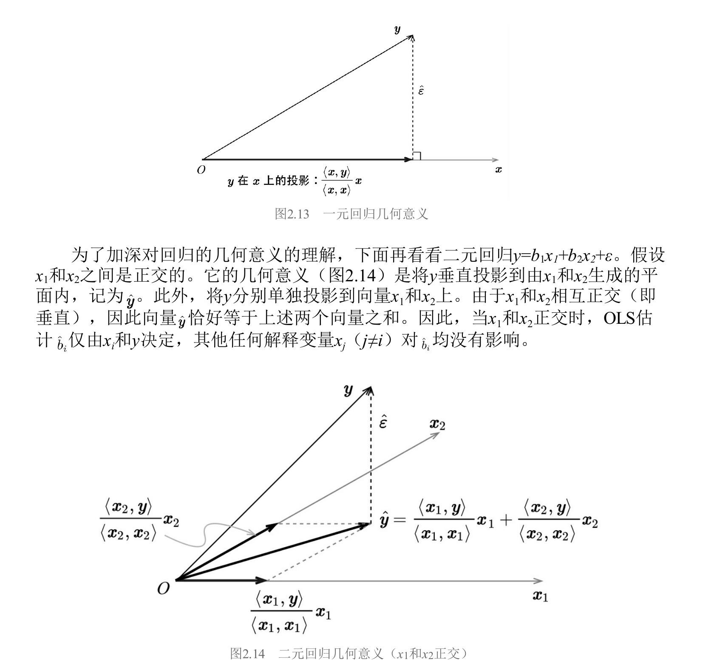

- **二元回归，$\boldsymbol{x}_1 \perp \boldsymbol{x}_2$（图2.14）：** $\hat{\boldsymbol{y}}$ 等于 $\boldsymbol{y}$ 分别在 $\boldsymbol{x}_1$ 和 $\boldsymbol{x}_2$ 上投影的向量之和。每个 $\hat{b}_i$ 仅由 $\boldsymbol{x}_i$ 和 $\boldsymbol{y}$ 决定。
- **二元回归，$\boldsymbol{x}_1$ 和 $\boldsymbol{x}_2$ 非正交（图2.15）：** $\hat{\boldsymbol{y}}$ 不再等于两个投影之和，解释变量之间相互影响各自的回归系数。

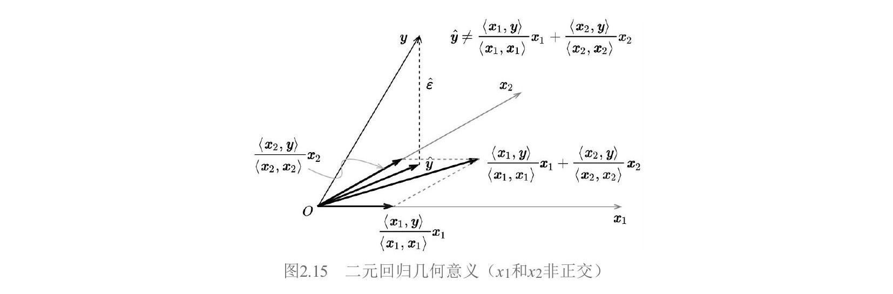

### 5.3 Gram–Schmidt 正交化与多元回归

可以通过 Gram–Schmidt 正交化过程求解多元回归。将非正交的 $\boldsymbol{x}_0, \boldsymbol{x}_1, \cdots, \boldsymbol{x}_K$ 按某个顺序正交化得到 $\boldsymbol{z}_0, \boldsymbol{z}_1, \cdots, \boldsymbol{z}_K$：

$$\boldsymbol{z}_k = \boldsymbol{x}_k - \sum_{j=0}^{k-1}\frac{\langle \boldsymbol{z}_j, \boldsymbol{x}_k\rangle}{\langle \boldsymbol{z}_j, \boldsymbol{z}_j\rangle}\boldsymbol{z}_j \tag{2.92}$$

**核心结论：** 最后一个被正交化的变量 $\boldsymbol{x}_K$ 的多元回归系数满足：

$$\hat{b}_K = \frac{\langle \boldsymbol{z}_K, \boldsymbol{y}\rangle}{\langle \boldsymbol{z}_K, \boldsymbol{z}_K\rangle} \tag{2.93}$$

此结论仅对最后一个变量成立（因为顺序 Gram–Schmidt 中 $\boldsymbol{z}_k$ 只对前面的变量正交化，不是对所有其他变量），但正交化顺序任意，可选任何变量放在最后。

本质含义：多元回归中 $\boldsymbol{x}_K$ 的回归系数等于 $\boldsymbol{x}_K$ 被其他所有解释变量正交化后仍能对 $\boldsymbol{y}$ 产生的**增量贡献**。

### 5.4 标准误膨胀——核心公式

由式（2.93），当 $y_i$ 满足独立同分布时：

$$\text{var}(\hat{b}_K) = \frac{\text{var}(y_i)}{\langle \boldsymbol{z}_K, \boldsymbol{z}_K\rangle} = \frac{\text{var}(y_i)}{\|\boldsymbol{z}_K\|^2} \tag{2.94}$$

如果 $\boldsymbol{x}_K$ 和其他解释变量高度相关，正交化后的残差 $\boldsymbol{z}_K$ 很小，$\|\boldsymbol{z}_K\|^2$ 很小，$\text{var}(\hat{b}_K)$ 就很大——**标准误膨胀**，估计不稳定。

回到因子投资：$\hat{b}_K$ 就是因子 $K$ 的收益率。不同因子暴露在截面上高度相关时，因子收益率标准误膨胀，检验失去效力。例如 Barra 中国市场模型对非线性市值因子和市值因子进行了正交化处理。

### 5.5 一次正交化求所有回归系数

按固定顺序做一次 Gram–Schmidt 得到 $\boldsymbol{z}_0, \cdots, \boldsymbol{z}_K$ 后，从后往前回代：

$$\hat{b}_K = \frac{\langle \boldsymbol{z}_K, \boldsymbol{y}\rangle}{\langle \boldsymbol{z}_K, \boldsymbol{z}_K\rangle} \tag{2.96}$$

$$\hat{b}_j = \frac{\langle \boldsymbol{z}_j,\, \boldsymbol{y} - \sum_{i=j+1}^{K}\hat{b}_i\boldsymbol{x}_i\rangle}{\langle \boldsymbol{z}_j, \boldsymbol{z}_j\rangle}, \quad j = K-1, K-2, \cdots, 0 \tag{2.97}$$

原理：算出 $\hat{b}_K$ 后从 $\boldsymbol{y}$ 中剔除 $\hat{b}_K\boldsymbol{x}_K$ 的贡献，$\boldsymbol{x}_{K-1}$ 就成了"最后一个"，原来的 $\boldsymbol{z}_{K-1}$ 仍然适用。以此类推。

---

## 6. 检验异象

### 6.1 异象投资组合的构造

如果某个资产能获得多因子模型**无法解释**的显著超额收益（$\alpha \neq 0$），就称该资产为一个**异象**（anomaly）。构造步骤：

1. 选择一个潜在的财务指标或量价指标，称为**异象变量**（anomaly variable）。
2. 根据异象变量取值高低，使用排序法构建异象投资组合，获得异象收益率时间序列。
3. 检验该异象收益率能否被多因子模型解释。

近年来的主流趋势是使用**复合变量**构造异象（如 Asness et al. 2019 的质量异象、Piotroski and So 2012 的预期差异象），这些异象往往有更强的金融学含义，但也更容易过拟合。

### 6.2 时序回归检验异象

令 $R_t^e$ 为异象收益率，$\boldsymbol{\lambda}_t$ 为 $K$ 个因子收益率向量，用 $\boldsymbol{\lambda}_t$ 作为解释变量、$R_t^e$ 作为被解释变量进行时序 OLS 估计：

$$R_t^e = \hat{\alpha} + \hat{\boldsymbol{\beta}}_a'\boldsymbol{\lambda}_t + \hat{\varepsilon}_t, \quad t = 1, 2, \cdots, T \tag{2.50}$$

$\hat{\alpha}$ 是异象收益率中无法被多因子模型解释的部分，$\hat{\boldsymbol{\beta}}_a$ 告诉我们哪些因子对解释异象收益率起了作用。

原假设 $\alpha = 0$，计算 $t$-值：

$$t\text{-值} = \frac{\hat{\alpha}}{\text{s.e.}(\hat{\alpha})} \tag{2.51}$$

满足自由度 $T - K - 1$ 的 $t$ 分布。拒绝原假设则认为发现异象。

标准误应使用第2节介绍的 Newey–West 调整。完整步骤：
1. 跑 OLS 得残差 $\hat{\boldsymbol{\varepsilon}}$
2. 用式（2.63）（2.64）计算 Newey–West 调整后的协方差矩阵，滞后阶数用式（2.65）
3. 取截距项标准误，算 $t$-值检验

### 6.3 Fama–MacBeth 截面回归检验异象

异象能获得超额收益意味着异象变量能预测资产未来收益率。Fama–MacBeth 回归可以在控制其他因子的同时检验这种预测性。

做法：将异象变量和多因子模型中构造因子的变量**同时**作为解释变量，个股超额收益作为被解释变量，每个时刻 $t$ 进行截面回归，得到异象变量 $t$ 期的超额收益 $\hat{\lambda}_t^\alpha$。

利用异象收益率序列 $\{\hat{\lambda}_t^\alpha\}$，计算均值 $\hat{\lambda}^\alpha$ 和标准误 $\text{s.e.}(\hat{\lambda}^\alpha)$，进行 $t$-检验。如果控制了因子变量后 $\hat{\lambda}^\alpha$ 仍然显著，就确认了异象。

标准误可使用第2节式（2.66）（2.67）的 Newey–West 调整。

---

## 7. 比较多因子模型

### 7.1 总体框架

比较多因子模型可沿"两个目标、两个切入点、多种方法"展开。

**两个目标：** （1）不同模型对同一组**测试资产**（test assets，通常是已发表的异象构成的投资组合）的解释程度；（2）不同模型的因子**相互检验**——你的因子能否被我的模型解释。

**两个切入点：** （1）**联合检验**所有 $\alpha_i$ → GRS 检验、均值—方差张成检验；（2）**独立检验**每个 $|\hat{\alpha}_i|$ → $\alpha$ 检验。

### 7.2 GRS 检验

GRS 检验（Gibbons, Ross, Shanken 1989）已在第4节出现，这里补充它在模型比较中的直观理解。GRS 统计量有一个基于夏普比率的等价形式：

$$\frac{T-N-K}{N}\left(\left[\frac{\sqrt{1+\hat{\theta}_{N+K}^2}}{\sqrt{1+\hat{\theta}_K^2}}\right]^2 - 1\right) \sim F_{N,\,T-N-K} \tag{2.68}$$

其中 $\hat{\theta}_{N+K}$ 是用全部 $N+K$ 个资产构成的事后最大**夏普比率**（Sharpe ratio）组合的夏普比率，$\hat{\theta}_K$ 是仅用 $K$ 个因子构成的最大夏普比率。

**直观含义：** 在 $K$ 个因子之外加入 $N$ 个测试资产后，最大夏普比率是否显著提升？如果显著提升，说明因子模型不能解释这 $N$ 个资产。

**几何解释（图2.11）：** 纵轴用相对 $R_f$ 的超额收益。在 $\hat{\sigma} = 1$ 处做竖直线，与两条切线分别相交于 $A$、$B$ 两点。$OA = \sqrt{1+\hat{\theta}_K^2}$，$OB = \sqrt{1+\hat{\theta}_{N+K}^2}$。GRS 检验就是看 $OB$ 是否显著长于 $OA$。

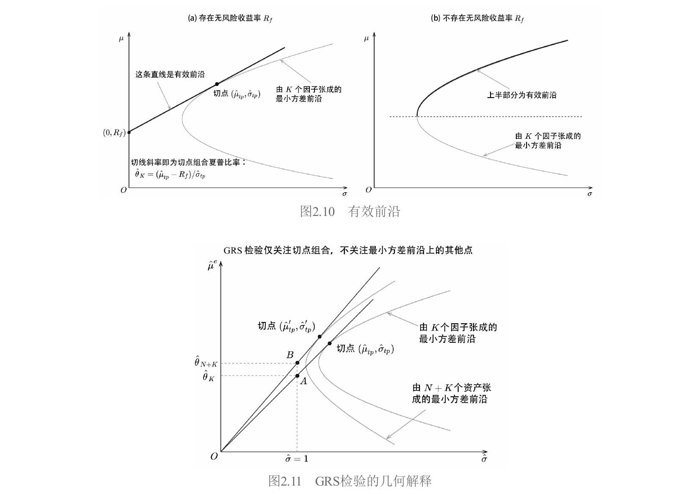

**优点：** 有限样本精确 $F$ 统计量，检验效力高。**缺点：** 依赖正态分布假设；要求 $T > N$；联合检验无法定位具体哪个资产出了问题。

**应用实例：** Liu et al.（2019）用 GRS 检验比较中国版三因子模型和 Fama and French（1993）三因子模型，将因子互为解释和被解释变量。结果中国版能解释 FF93 的因子，反过来不行。

### 7.3 均值—方差张成检验

Huberman and Kandel（1987）提出的**均值—方差张成**（mean–variance spanning）检验是另一种联合检验手段，不假设无风险收益率 $R_f$ 的存在，因此适用更广。

**核心思想：** 给定 $K$ 个因子，对每个预期收益率 $\hat{\mu}$，都能找到方差最低的配置，画出**最小方差前沿**（minimum–variance frontier，图2.8中的抛物线）。加入 $N$ 个新资产后，新前沿能否显著"优于"仅由 $K$ 个因子张成的前沿？

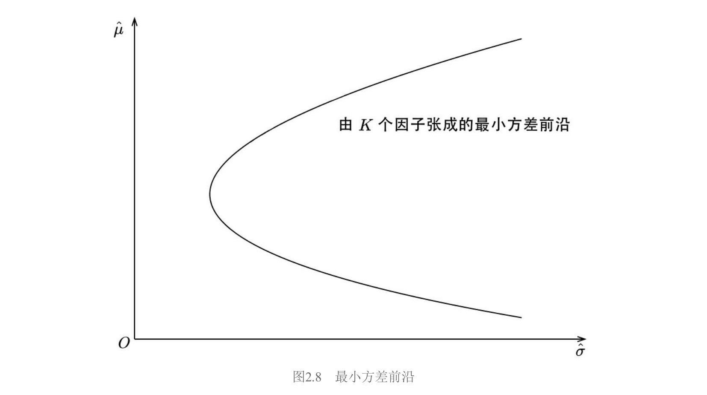

**原假设：** 令 $R_{2t} = \boldsymbol{\alpha} + \boldsymbol{\beta}R_{1t} + \boldsymbol{\varepsilon}_t$（$R_1$ 是 $K$ 个因子，$R_2$ 是 $N$ 个测试资产），定义 $\boldsymbol{\delta} = \mathbf{1}_N - \boldsymbol{\beta}\mathbf{1}_K$。原假设的充要条件：

$$H_0: \boldsymbol{\alpha} = \mathbf{0}_N, \quad \boldsymbol{\delta} = \mathbf{0}_N \tag{2.71}$$

**经济学含义（Kan and Zhou 2012）：** 最小方差前沿上有两个特殊组合——全局最小方差组合和切点组合。$\boldsymbol{\delta} = \mathbf{0}_N$ 意味着全局最小方差组合中 $N$ 个资产权重为零；$\boldsymbol{\alpha} = \mathbf{0}_N$ 意味着切点组合中 $N$ 个资产权重为零。由**两基金分离定理**（前沿上任意两个组合可线性组合出整条前沿），这两个组合都不包含 $N$ 个资产 $\Rightarrow$ 整条前沿上所有组合都不包含。

**检验统计量：** 定义 $\hat{\theta}_K(r)$ 为从纵轴上 $(0, r)$ 点向 $K$ 个因子的最小方差前沿做切线的斜率（图2.9），类似定义 $\hat{\theta}_{N+K}(r)$。

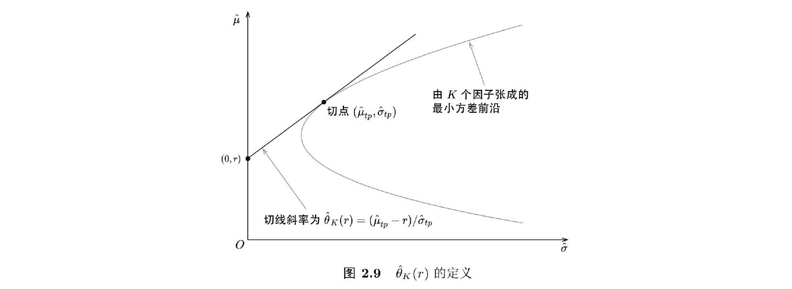

$$s_1 = \max_r \frac{1+\hat{\theta}_{N+K}^2(r)}{1+\hat{\theta}_K^2(r)} - 1 \tag{2.73}$$

$$s_2 = \min_r \frac{1+\hat{\theta}_{N+K}^2(r)}{1+\hat{\theta}_K^2(r)} - 1 \tag{2.74}$$

三种检验统计量以不同方式组合 $s_1, s_2$，大样本下渐进满足 $\chi^2_{2N}$：

$$LR = T(\ln(1+s_1) + \ln(1+s_2)) \tag{2.75}$$

$$W = T(s_1 + s_2) \tag{2.76}$$

$$LM = T\left(\frac{s_1}{1+s_1} + \frac{s_2}{1+s_2}\right) \tag{2.77}$$

**应用实例：** Han et al.（2016）使用新的趋势因子作为测试资产，传统动量和反转因子作为解释变量进行均值—方差张成检验，发现传统因子无法解释新趋势因子。

### 7.4 GRS 与均值—方差张成的几何比较

**GRS 假设 $R_f$ 存在**，有效前沿是直线（图2.10(a)），只关注切点组合的夏普比率。**均值—方差张成不假设 $R_f$**，有效前沿是抛物线上半部分（图2.10(b)），需要从两条前沿上找特殊点比较。

图2.12展示了均值—方差张成检验的几何解释。$g_K$ 和 $g_{N+K}$ 分别为两条前沿的全局最小方差组合（标准差为 $OD$ 和 $OC$）。从 $A$、$B$ 两点出发向两条前沿做切线和渐进线，与 $\hat{\sigma}=1$ 相交得 $G, H, E, F$ 四点。

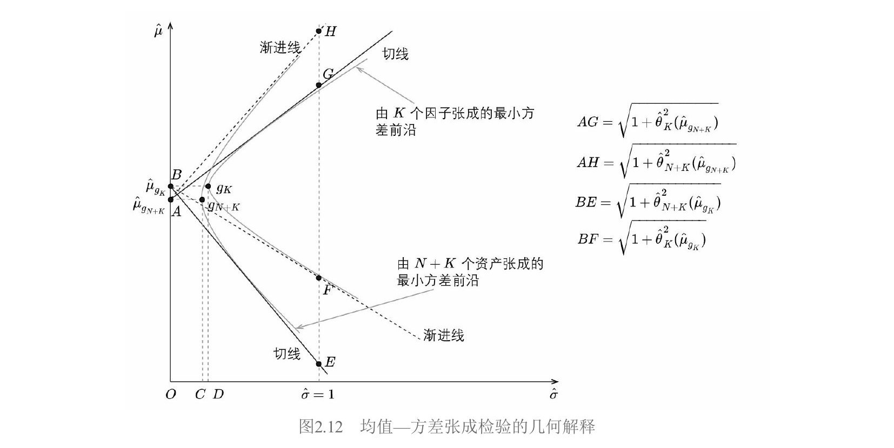

**似然比检验（有限样本 $F_{2N, 2(T-K-N)}$ 分布）：**

$$LR = \left(\frac{T-K-N}{N}\right)\left[\frac{OD}{OC} \cdot \frac{AH}{BF} - 1\right] \tag{2.78}$$

**Wald 和 LM 检验的"完美对称"：**

$$W: s_1 + s_2 = \left(\frac{OD}{OC}\right)^2 - 1 + \left(\frac{BE}{BF}\right)^2 - 1 \tag{2.79}$$

$$LM: \frac{s_1}{1+s_1} + \frac{s_2}{1+s_2} = 1 - \left(\frac{OC}{OD}\right)^2 + 1 - \left(\frac{AG}{AH}\right)^2 \tag{2.80}$$

$W$ 中 $(OD/OC)^2 - 1$ 对应 $LM$ 中 $1 - (OC/OD)^2$（分子分母互换）；$W$ 中 $(BE/BF)^2 - 1$ 衡量加入资产导致切线斜率提升，$LM$ 中 $1 - (AG/AH)^2$ 衡量去除资产导致的降低。

### 7.5 α 检验

与联合检验不同，$\alpha$ 检验把每个 $\alpha_i$ **独立**看待。对每个测试资产做时序回归得到 $\hat{\alpha}_i$ 和经 Newey–West 调整的 $t$-值，然后取平均：

- 指标一：$|\hat{\alpha}_i|$ 的均值
- 指标二：$|t\text{-值}|$ 的均值

取绝对值因为只关心偏离零的程度。指标越低模型越好。简单直观，可以定位具体哪些资产被解释得好或不好。$\alpha$ 检验经常和 GRS 检验**同时使用**。

### 7.6 贝叶斯方法

Barillas and Shanken（2018）通过计算不同模型的**边际似然度**（marginal likelihood）比较模型：

$$\text{prob}(D|\mathcal{M}_i) = \iint f(D|\mathcal{M}_i, \boldsymbol{\alpha}, \boldsymbol{\beta}, \boldsymbol{\Sigma})f(\boldsymbol{\alpha}|\boldsymbol{\beta}, \boldsymbol{\Sigma})f(\boldsymbol{\beta}, \boldsymbol{\Sigma})d\boldsymbol{\alpha}d\boldsymbol{\beta}d\boldsymbol{\Sigma} \tag{2.81}$$

两个模型的后验概率之比：

$$\frac{\text{prob}(\mathcal{M}_i|D)}{\text{prob}(\mathcal{M}_j|D)} = \frac{\text{prob}(\mathcal{M}_i)}{\text{prob}(\mathcal{M}_j)} \cdot \underbrace{\frac{\text{prob}(D|\mathcal{M}_i)}{\text{prob}(D|\mathcal{M}_j)}}_{\text{贝叶斯因子}} \tag{2.82}$$

假设先验概率相等，边际似然度高的模型胜出。但 Chib et al.（2020）对此提出挑战，指出 Barillas and Shanken（2018）的先验设定不满足使用边际似然度比较模型的三个必要条件（不同模型参数先验分布相同、常数相同、参数空间相同），方法尚存争议。

---

## 8. 因子暴露与因子收益率——新前沿

本节讨论一个近年来的前沿问题：到底用什么作为因子暴露、怎么算因子收益率更好？

### 8.1 变量误差问题

回顾 Fama–MacBeth 回归：第一步时序回归得 $\hat{\boldsymbol{\beta}}_i$，第二步用 $\hat{\boldsymbol{\beta}}_i$ 做截面回归。但 $\hat{\boldsymbol{\beta}}_i$ 是估计值而非真值。将估计值当解释变量引入了**变量误差**（errors-in-variables, EIV）问题——$\hat{\boldsymbol{\beta}}_i$ 中的测量误差 $\boldsymbol{\eta}_i$ 与新误差项相关，导致 OLS 有偏。

Fama and MacBeth（1973）的解决办法：用投资组合代替个股（个股 $\beta_i$ 的误差会在组合内相互抵消）。但 Jegadeesh et al.（2019）指出投资组合是降维处理，会丢掉个股截面特征，如果因子恰好和组合正交就发现不了风险溢价。

### 8.2 引入工具变量

Jegadeesh et al.（2019）主张仍用个股，通过**工具变量**（instrumental variables, IV）应对 EIV。

截面回归模型（带截距项）：

$$R_{it}^e = \gamma_t + \hat{\boldsymbol{\beta}}_i'\boldsymbol{\lambda}_t + \alpha_{it} \tag{2.47}$$

矩阵形式（定义 $\hat{\boldsymbol{B}}_E = [\mathbf{1}_N, \hat{\boldsymbol{\beta}}_E]$，$\boldsymbol{\zeta}_t = [\gamma_t, \lambda_{1t}, \cdots, \lambda_{kt}]'$）：

$$\boldsymbol{R}_t^e = \hat{\boldsymbol{B}}_E\boldsymbol{\zeta}_t + \boldsymbol{\alpha}_t \tag{2.48}$$

IV 估计量（$\hat{\boldsymbol{B}}_I = [\mathbf{1}_N, \hat{\boldsymbol{\beta}}_I]$ 为工具变量）：

$$\hat{\boldsymbol{\zeta}}_{\text{IV},t} = (\hat{\boldsymbol{B}}_I'\hat{\boldsymbol{B}}_E)^{-1}(\hat{\boldsymbol{B}}_I'\boldsymbol{R}_t^e) \tag{2.49}$$

关键操作：用**互不重叠**的历史数据分别估计 $\hat{\boldsymbol{\beta}}_E$ 和 $\hat{\boldsymbol{\beta}}_I$（偶数月 vs 奇数月），使测量误差不相关，从而 IV 估计量无偏。

### 8.3 使用公司特征

更"颠覆"的做法：**直接用公司特征**（firm characteristic）的取值（经标准化后）作为因子暴露，跳过第一步时序回归。例如用 BM 的取值代替时序回归得到的价值因子暴露。

Jegadeesh et al.（2019）的关键实验（以规模和价值因子为例）：

| 实验 | 解释变量 | $\hat{\beta}_{i,\text{SMB}}$ 月均收益(%) | $\hat{\beta}_{i,\text{HML}}$ 月均收益(%) | ln(市值) 月均收益(%) | BM 月均收益(%) |
|---|---|---|---|---|---|
| (1) 仅时序 $\hat{\beta}$（IV） | $\hat{\beta}_{i,\text{SMB}},\ \hat{\beta}_{i,\text{HML}}$ | 0.30 (2.20) | 0.34 (2.55) | — | — |
| (2) 仅公司特征（IV） | ln(市值), BM | — | — | −0.12 (−3.49) | 0.20 (4.40) |
| (3) 两者同时（IV） | 全部四个 | −0.04 (−0.42) | 0.24 (1.88) | −0.12 (−3.93) | 0.18 (4.40) |
| (4) 仅时序 $\hat{\beta}$（OLS） | $\hat{\beta}_{i,\text{SMB}},\ \hat{\beta}_{i,\text{HML}}$ | 0.21 (2.16) | 0.23 (2.79) | — | — |
| (5) 仅公司特征（OLS） | ln(市值), BM | — | — | −0.14 (−3.84) | 0.19 (4.25) |
| (6) 两者同时（OLS） | 全部四个 | −0.07 (−1.01) | 0.14 (1.73) | −0.16 (−4.93) | 0.14 (3.60) |

*括号内为 $t$-值*

关键发现：当时序 $\hat{\beta}$ 和公司特征同时作为解释变量时（实验3和6），**只有公司特征对应的因子被定价**（$t$-值显著），时序 $\hat{\beta}$ 对应的因子收益率不再显著。

### 8.4 两类模型

上述实证引出两类多因子模型：

| | 时序多因子模型（传统） | 截面多因子模型（新范式） |
|---|---|---|
| 因子收益率 | 排序法 | Fama–MacBeth 截面回归 |
| 因子暴露 | 时序回归 $\hat{\beta}$ | 公司特征（时变） |
| 代表 | Fama and French (1993) | Barra 模型 |

公司特征优于时序 $\hat{\beta}$ 的两个解释：（1）日频收益率噪声大，时序回归 $\hat{\beta}$ 在时序上不稳定，表现得像随机因子；（2）公司特征可能是未知因子暴露更好的代理变量。

**Fama and French（2020）的核心结论：**

- 截面模型（公司特征 + 截面回归因子收益率）**最优**，定价误差最小。
- 因子暴露应使用**时变的**公司特征（而非时序均值）。
- 另一种"混搭"模型（截面回归因子收益率 + 时序回归 $\hat{\beta}$）效果不如截面模型。

截面模型的优势来自两点，**缺一不可**：（1）截面回归的因子收益率优于排序法；（2）时变公司特征优于时序回归 $\hat{\beta}$。

本书后续安排体现了这种对比：第3章用排序法（传统），第4章用公司特征 + Fama–MacBeth（前沿）。

---

## 9. 广义矩估计——统一框架

**广义矩估计**（Generalized Method of Moments, GMM）由 Hansen（1982）提出，最初用于检验基于消费的资产定价模型（CCAPM），如今广泛应用于经济学和金融学。它是一个非常强大的计量经济学框架，OLS、GLS、Fama–MacBeth、GRS 检验都可视为其特例。

GMM 的核心最终归结为一件事：**计算样本均值的方差。**

### 9.1 样本均值的方差

随机变量 $u_t$ 的样本均值 $\bar{u} = \frac{1}{T}\sum_{t=1}^T u_t$ 本身也是随机变量（不同样本给出不同值，见下表）。

| | 样本一 | 样本二 | 样本三 | 样本四 |
|---|---|---|---|---|
| $u_t$ | 0 | −2 | 0 | 3 |
| | −1 | 2 | 5 | −2 |
| | 3 | 2 | −1 | 1 |
| | 3 | −3 | 1 | 2 |
| | −3 | −3 | −2 | 4 |
| $E_T[u_t]$ | 0.4 | −0.8 | 0.6 | 1.6 |

**IID 情况：**

$$\text{var}(\bar{u}) = \frac{\sigma^2(u_t)}{T} \tag{2.101}$$

$$\text{s.e.}(\bar{u}) = \frac{\sigma(u_t)}{\sqrt{T}} \tag{2.102}$$

**存在自相关时：**

$$\text{var}(\bar{u}) = \frac{1}{T}\left[\text{var}(u_t) + \sum_{j=1}^{T}\frac{T-j}{T}(\text{cov}(u_t, u_{t-j}) + \text{cov}(u_t, u_{t+j}))\right] \tag{2.103}$$

当 $T \to \infty$，渐进形式为：

$$\text{var}(\bar{u}) \to \frac{1}{T}\sum_{j=-\infty}^{\infty}\text{cov}(u_t, u_{t-j}) \tag{2.104}$$

假设 $E[u_t] = 0$，利用 $\text{cov}(X,Y) = E[XY]$（因为均值为零），定义**谱密度矩阵** $S$：

$$\text{var}(\bar{u}) \to \frac{1}{T}\sum_{j=-\infty}^{\infty}E[u_t u_{t-j}] \equiv \frac{1}{T}S \tag{2.105}$$

**$\text{var}(\bar{u}) \to S/T$ 是整个 GMM 的数学基石。**

### 9.2 GMM 的三部分

**第一部分：提出模型（总体矩条件）。** 将问题描述为一组关于数据 $\boldsymbol{x}_t$ 和参数 $\boldsymbol{b}$ 的函数 $\boldsymbol{f}(\boldsymbol{x}_t, \boldsymbol{b})$，当 $\boldsymbol{b} = \boldsymbol{b}_0$ 时：

$$E[\boldsymbol{f}(\boldsymbol{x}_t, \boldsymbol{b}_0)] = \boldsymbol{0} \tag{2.106}$$

资产定价例子：基本定价公式 $p_t = E[m_{t+1}x_{t+1}]$[^1]（$m$ 是随机折现因子）。对无风险资产和零成本组合分别代入：

$$\begin{bmatrix} E[m(\boldsymbol{b}_0)R_f^g - 1] \\ E[m(\boldsymbol{b}_0)R^e] \end{bmatrix} = \begin{bmatrix} 0 \\ 0 \end{bmatrix} \tag{2.110}$$

**第二部分：样本矩代替总体矩。**

$$\boldsymbol{g}_T(\boldsymbol{b}_0) \equiv \frac{1}{T}\sum_{t=1}^{T}\boldsymbol{f}(\boldsymbol{x}_t, \boldsymbol{b}_0) = E_T[\boldsymbol{f}(\boldsymbol{x}_t, \boldsymbol{b}_0)] \tag{2.111}$$

$\boldsymbol{g}_T$ 就是 $\boldsymbol{f}$ 的**样本均值**。GMM 估计量找 $\hat{\boldsymbol{b}}_0$ 使样本矩的 $p$ 个线性组合等于零（$n$ 个矩，$p$ 个参数，$n > p$ 为**过度识别**）：

$$\hat{\boldsymbol{b}}_0: \quad \boldsymbol{a}\boldsymbol{g}_T(\hat{\boldsymbol{b}}_0) = \boldsymbol{0} \tag{2.113}$$

[^2]$\boldsymbol{a}$ 是 $p \times n$ 矩阵。

**第三部分：计算标准误，检验模型。** Hansen（1982）给出渐进分布：

$$\sqrt{T}(\hat{\boldsymbol{b}}_0 - \boldsymbol{b}_0) \xrightarrow{d} \mathcal{N}(\boldsymbol{0},\ (\boldsymbol{a}\boldsymbol{d})^{-1}\boldsymbol{a}S\boldsymbol{a}'(\boldsymbol{a}\boldsymbol{d})^{-1\prime}) \tag{2.115}$$

$$\sqrt{T}\boldsymbol{g}_T(\hat{\boldsymbol{b}}_0) \xrightarrow{d} \mathcal{N}(\boldsymbol{0},\ [\boldsymbol{I} - \boldsymbol{d}(\boldsymbol{a}\boldsymbol{d})^{-1}\boldsymbol{a}]S[\boldsymbol{I} - \boldsymbol{d}(\boldsymbol{a}\boldsymbol{d})^{-1}\boldsymbol{a}]') \tag{2.116}$$

### 9.3 数学基础——一切来自 S/T

**$S$ 的来源：** $\boldsymbol{g}_T$ 是样本均值，$\text{var}(\boldsymbol{g}_T(\boldsymbol{b}_0))$ 就是样本均值的方差，直接套用式（2.105）的向量版：

$$\text{var}(\boldsymbol{g}_T(\boldsymbol{b}_0)) \to \frac{1}{T}\sum_{j=-\infty}^{\infty}E[\boldsymbol{f}(\boldsymbol{x}_t, \boldsymbol{b}_0)\boldsymbol{f}(\boldsymbol{x}_{t-j}, \boldsymbol{b}_0)'] \equiv \frac{1}{T}S \tag{2.117, 2.118}$$

**$\boldsymbol{d}$ 的定义：** 样本矩对参数的一阶偏导（$n \times p$ 矩阵，分子布局）：

$$\boldsymbol{d} \equiv E\left[\frac{\partial \boldsymbol{f}(\boldsymbol{x}_t, \boldsymbol{b}_0)}{\partial \boldsymbol{b}'}\right] = \frac{\partial \boldsymbol{g}_T(\hat{\boldsymbol{b}}_0)}{\partial \boldsymbol{b}'} \tag{2.120}$$

**推导 $\text{var}(\hat{\boldsymbol{b}}_0)$：** 对 $\boldsymbol{a}\boldsymbol{g}_T(\hat{\boldsymbol{b}}_0) = \boldsymbol{0}$ 在 $\boldsymbol{b}_0$ 处泰勒展开[^3]：

$$\hat{\boldsymbol{b}}_0 - \boldsymbol{b}_0 = -(\boldsymbol{a}\boldsymbol{d})^{-1}\boldsymbol{a}\boldsymbol{g}_T(\boldsymbol{b}_0) \tag{2.121}$$

$$\text{var}(\hat{\boldsymbol{b}}_0) = \frac{1}{T}(\boldsymbol{a}\boldsymbol{d})^{-1}\boldsymbol{a}S\boldsymbol{a}'(\boldsymbol{a}\boldsymbol{d})^{-1\prime} \tag{2.122}$$

**推导 $\text{var}(\boldsymbol{g}_T(\hat{\boldsymbol{b}}_0))$：**

$$\boldsymbol{g}_T(\hat{\boldsymbol{b}}_0) = [\boldsymbol{I} - \boldsymbol{d}(\boldsymbol{a}\boldsymbol{d})^{-1}\boldsymbol{a}]\boldsymbol{g}_T(\boldsymbol{b}_0) \tag{2.124}$$

$$\text{var}(\boldsymbol{g}_T(\hat{\boldsymbol{b}}_0)) = \frac{1}{T}[\boldsymbol{I} - \boldsymbol{d}(\boldsymbol{a}\boldsymbol{d})^{-1}\boldsymbol{a}]\ S\ [\boldsymbol{I} - \boldsymbol{d}(\boldsymbol{a}\boldsymbol{d})^{-1}\boldsymbol{a}]' \tag{2.125}$$

$\boldsymbol{g}_T$ 在 $\hat{\boldsymbol{b}}_0$ 处的方差比在 $\boldsymbol{b}_0$ 处更小——GMM 估计过程中 $\boldsymbol{a}\boldsymbol{g}_T = \boldsymbol{0}$ 的约束"消耗"了一些变异。

**检验统计量：**

$$\boldsymbol{g}_T(\hat{\boldsymbol{b}}_0)'\text{var}(\boldsymbol{g}_T(\hat{\boldsymbol{b}}_0))^{-1}\boldsymbol{g}_T(\hat{\boldsymbol{b}}_0) \sim \chi^2_{n-p} \tag{2.126, 2.127}$$

**全部推导只用了两件东西：$S/T$（样本均值的方差）和 delta 方法（一阶泰勒展开）。**

### 9.4 有效性

GMM 允许任意选择 $\boldsymbol{a}$。Hansen（1982）给出使 $\text{var}(\hat{\boldsymbol{b}}_0)$ 最小的**有效估计量**对应的 $\boldsymbol{a}$：

$$\boldsymbol{a} = \boldsymbol{d}'S^{-1} \tag{2.128}$$

等价地[^4]，GMM 估计量可写成最小化加权矩的形式：

$$\hat{\boldsymbol{b}}_0 = \arg\min_{\boldsymbol{b}}\ \boldsymbol{g}_T(\boldsymbol{b})'\boldsymbol{W}\boldsymbol{g}_T(\boldsymbol{b}) \tag{2.129}$$

最优权重矩阵 $\boldsymbol{W} = S^{-1}$[^5]，直觉：给方差大（不靠谱）的矩低权重，给方差小（靠谱）的矩高权重。

取 $\boldsymbol{W} = S^{-1}$ 后统计量简化：

$$\text{var}(\hat{\boldsymbol{b}}_0) = \frac{1}{T}(\boldsymbol{d}'S^{-1}\boldsymbol{d})^{-1} \tag{2.136}$$

$$\text{var}(\boldsymbol{g}_T(\hat{\boldsymbol{b}}_0)) = \frac{1}{T}(S - \boldsymbol{d}(\boldsymbol{d}'S^{-1}\boldsymbol{d})^{-1}\boldsymbol{d}') \tag{2.137}$$

$$T\boldsymbol{g}_T(\hat{\boldsymbol{b}}_0)'S^{-1}\boldsymbol{g}_T(\hat{\boldsymbol{b}}_0) \sim \chi^2_{n-p} \tag{2.138}$$

**两阶段法：** 第一阶段取 $\boldsymbol{W} = \boldsymbol{I}$ 估出 $\hat{\boldsymbol{b}}_0$；第二阶段用它估计 $S$，令 $\boldsymbol{W} = S^{-1}$ 重新估计。可迭代多次。

### 9.5 不应成为黑箱

GMM 的强大不在于它是检验工具，而在于**灵活性**——可以从经济学原理出发选择 $\boldsymbol{a}$（或 $\boldsymbol{W}$），而非无脑用 $\boldsymbol{W} = S^{-1}$。

例子：检验 CCAPM（2个参数，4个矩：市场、无风险、HML、SMB），从金融学原理出发选择：

$$\begin{bmatrix} 1 & 0 & 0 & 0 \\ 0 & 1 & 1 & 1 \end{bmatrix}\begin{bmatrix} E_T[m(\hat{b}_1, \hat{b}_2)R_m^e] \\ E_T[m(\hat{b}_1, \hat{b}_2)R_f^g - 1] \\ E_T[m(\hat{b}_1, \hat{b}_2)R_{\text{HML}}^e] \\ E_T[m(\hat{b}_1, \hat{b}_2)R_{\text{SMB}}^e] \end{bmatrix} = \begin{bmatrix} 0 \\ 0 \end{bmatrix} \tag{2.139}$$

让市场超额收益和无风险资产来估计参数，然后用 HML 和 SMB 检验 CCAPM（$\chi^2$ 自由度为 $4-2=2$）。这比盲目用 $\boldsymbol{W} = S^{-1}$ 更有经济学意义。

---

## 10. 研究方法建议

### 研究异象

| 步骤 | 方法 | 目的 |
|---|---|---|
| 1 | 排序法（单变量；双重排序控制市值） | 检验异象**绝对收益** |
| 2 | 时序回归（因子收益率为解释变量，异象收益率为被解释变量） | 检验异象**超额收益**（$\hat{\alpha}$ 是否显著） |
| 3 | Fama–MacBeth 回归（异象变量 + 因子变量为解释变量） | 控制其他变量后，检验异象的**预测性** |

### 研究因子和多因子模型

**因子选择：** 成为定价因子需要有明确的金融学依据（风险补偿或错误定价），且因子自身被定价（预期收益率显著）。

**模型检验与比较：**

| 目标 | 方法 |
|---|---|
| 模型能否解释测试资产 | GRS 检验 + $\alpha$ 检验 |
| 不同模型因子互为测试资产 | GRS 检验 + 均值—方差张成检验 |
| 因子预期收益率是否显著 | 排序法 $t$-检验 或 Fama–MacBeth 回归 |

### 本书后续章节

| 章节 | 内容 | 方法 |
|---|---|---|
| 第3章 | 主流因子实证 | 排序法 + Newey–West 调整 |
| 第4章 | 七个多因子模型 | 公司特征 + Fama–MacBeth + GRS + $\alpha$ 检验 |
| 第5章 | A股异象实证 | 排序法 + 时序回归 + Fama–MacBeth + Newey–West |

[^1]: 是从一个非常基础的经济学假设推导出来的结论，不是凭空设定的。
	
	**假设只有一条：投资者追求效用最大化。**
	
	一个投资者今天有财富，要决定消费多少、投资多少。他的目标是让当前消费和未来消费带来的总效用最大。写成数学：
	
	$$\max \quad U(c_t) + \delta, E_t[U(c_{t+1})]$$
	
	$c_t$ 是今天的消费，$c_{t+1}$ 是明天的消费，$U(\cdot)$ 是效用函数（凹函数，多消费更开心但边际递减），$\delta$ 是时间偏好（对未来的耐心程度）。
	
	**推导过程。**
	
	投资者可以用今天的钱买一单位某个资产，价格 $p_t$，明天得到回报 $x_{t+1}$（包括分红和资本利得）。买还是不买？最优条件是"今天少消费 $p_t$ 带来的效用损失 = 明天多得到 $x_{t+1}$ 带来的效用增加的期望"：
	
	$$U'(c_t) \cdot p_t = \delta, E_t[U'(c_{t+1}) \cdot x_{t+1}]$$
	
	左边是今天少花 $p_t$ 的代价（边际效用乘以价格），右边是明天多得 $x_{t+1}$ 的好处的期望。两边除以 $U'(c_t)$：
	
	$$p_t = E_t!\left[\delta\frac{U'(c_{t+1})}{U'(c_t)} \cdot x_{t+1}\right]$$
	
	定义括号里那个东西为**随机折现因子**：
	
	$$m_{t+1} \equiv \delta\frac{U'(c_{t+1})}{U'(c_t)}$$
	
	就得到了基本定价公式：
	
	$$p_t = E_t[m_{t+1}, x_{t+1}]$$
	
	**这个公式说了什么？**
	
	资产今天的价格 = 未来回报用 $m$ 折现后的期望。$m$ 不是一个固定的折现率，而是随机的，取决于投资者未来的消费状况。明天消费好（$c_{t+1}$ 大），$U'(c_{t+1})$ 小（边际效用递减），$m$ 就小，未来的回报就不那么值钱；明天消费差，$m$ 就大，同样的回报更值钱。
	
	**和因子投资的关系。**
	
	不同的资产定价模型（CAPM、Fama-French、CCAPM等）本质上都是在给 $m$ 指定不同的具体形式。CAPM 说 $m$ 只和市场收益率有关，Fama-French 说 $m$ 和市值、价值等因子有关，CCAPM 说 $m$ 直接和消费增长有关。GMM 检验这些模型时，就是在检验你选的 $m$ 的具体形式是否让 $p_t = E[m_{t+1}x_{t+1}]$ 在数据中成立。
	
	所以基本定价公式不是假设，是"投资者追求效用最大化"这一条假设的直接推论。它的地位相当于牛顿第二定律之于力学——所有具体模型都是它的特殊情况。
	

[^2]: 这个式子说的是：GMM估计量 $\hat{\boldsymbol{b}}_0$ 的定义就是让样本矩的 $p$ 个线性组合等于零的那个参数值。
	
	**为什么不直接令 $\boldsymbol{g}_T(\hat{\boldsymbol{b}}_0) = \boldsymbol{0}$？**
	
	因为矩的个数 $n$ 通常多于参数的个数 $p$（过度识别）。$n$ 个方程、$p$ 个未知数、$n > p$，一般无解。没办法让所有 $n$ 个样本矩同时等于零。
	
	**那怎么办？**
	
	退而求其次：从 $n$ 个矩里挑出 $p$ 个线性组合，让这 $p$ 个组合等于零。矩阵 $\boldsymbol{a}$ 是 $p \times n$ 的，每一行定义了一个线性组合。$\boldsymbol{a}\boldsymbol{g}_T$ 把 $n$ 维向量压成 $p$ 维向量，$p$ 个方程 $p$ 个未知数，刚好能解出 $\hat{\boldsymbol{b}}_0$。
	
	**举个具体例子。**
	
	假设有 $n=4$ 个矩、$p=2$ 个参数。$\boldsymbol{g}_T$ 是4维的，不可能找到一个 $\hat{\boldsymbol{b}}_0$ 让4个分量同时为零。选一个 $2\times4$ 的矩阵 $\boldsymbol{a}$，比如：
	
	$$\boldsymbol{a} = \begin{bmatrix} 1 & 0 & 0 & 0 \\ 0 & 1 & 1 & 1 \end{bmatrix}$$
	
	则 $\boldsymbol{a}\boldsymbol{g}_T = \boldsymbol{0}$ 意味着：
	
	- 第一个矩精确等于零
	- 第二、三、四个矩的和等于零
	
	2个方程2个未知数，解出 $\hat{\boldsymbol{b}}_0$。
	
	**恰好识别的特殊情况。**
	
	如果 $n = p$，$\boldsymbol{a}$ 是方阵，可以取 $\boldsymbol{a} = \boldsymbol{I}$，此时 $\boldsymbol{a}\boldsymbol{g}_T = \boldsymbol{g}_T = \boldsymbol{0}$，所有矩都精确为零。OLS就属于这种情况。
	
	**和另一种写法的关系。**
	
	在笔记中也看到了另一种等价写法（式（2.129））：
	
	$$\hat{\boldsymbol{b}}_0 = \arg\min_{\boldsymbol{b}}\ \boldsymbol{g}_T(\boldsymbol{b})'\boldsymbol{W}\boldsymbol{g}_T(\boldsymbol{b})$$
	
	这是说：既然没法让所有矩都等于零，那就最小化它们的加权平方和。对这个最小化问题求一阶条件，得到的恰好就是 $\boldsymbol{a}\boldsymbol{g}_T(\hat{\boldsymbol{b}}_0) = \boldsymbol{0}$，其中 $\boldsymbol{a} = \boldsymbol{d}'\boldsymbol{W}$。两种写法是同一件事的两面。

[^3]: **起点：** 我们知道 $\boldsymbol{a}\boldsymbol{g}_T(\hat{\boldsymbol{b}}_0) = \boldsymbol{0}$，想把 $\hat{\boldsymbol{b}}_0 - \boldsymbol{b}_0$ 表达成 $\boldsymbol{g}_T(\boldsymbol{b}_0)$ 的函数。
	
	**第一步：对 $\boldsymbol{g}_T$ 在 $\boldsymbol{b}_0$ 处做一阶泰勒展开。**
	
	$\boldsymbol{g}_T(\hat{\boldsymbol{b}}_0)$ 是关于参数 $\boldsymbol{b}$ 的函数，在 $\boldsymbol{b} = \boldsymbol{b}_0$（真值）处展开：
	
	$$\boldsymbol{g}_T(\hat{\boldsymbol{b}}_0) \approx \boldsymbol{g}_T(\boldsymbol{b}_0) + \frac{\partial \boldsymbol{g}_T(\boldsymbol{b}_0)}{\partial \boldsymbol{b}'}(\hat{\boldsymbol{b}}_0 - \boldsymbol{b}_0)$$
	
	这就是多元函数的一阶泰勒展开，和标量情况 $f(x) \approx f(x_0) + f'(x_0)(x - x_0)$ 完全类比。其中 $\frac{\partial \boldsymbol{g}_T(\boldsymbol{b}_0)}{\partial \boldsymbol{b}'}$ 是 $n \times p$ 的雅可比矩阵，就是 $\boldsymbol{d}$。所以：
	
	$$\boldsymbol{g}_T(\hat{\boldsymbol{b}}_0) \approx \boldsymbol{g}_T(\boldsymbol{b}_0) + \boldsymbol{d}(\hat{\boldsymbol{b}}_0 - \boldsymbol{b}_0)$$
	
	**第二步：左乘 $\boldsymbol{a}$。**
	
	两边同时左乘 $\boldsymbol{a}$（$p \times n$ 矩阵）：
	
	$$\boldsymbol{a}\boldsymbol{g}_T(\hat{\boldsymbol{b}}_0) \approx \boldsymbol{a}\boldsymbol{g}_T(\boldsymbol{b}_0) + \boldsymbol{a}\boldsymbol{d}(\hat{\boldsymbol{b}}_0 - \boldsymbol{b}_0)$$
	
	**第三步：利用 $\boldsymbol{a}\boldsymbol{g}_T(\hat{\boldsymbol{b}}_0) = \boldsymbol{0}$。**
	
	左边等于零（这是 $\hat{\boldsymbol{b}}_0$ 的定义），所以：
	
	$$\boldsymbol{0} = \boldsymbol{a}\boldsymbol{g}_T(\boldsymbol{b}_0) + \boldsymbol{a}\boldsymbol{d}(\hat{\boldsymbol{b}}_0 - \boldsymbol{b}_0)$$
	
	**第四步：解出 $\hat{\boldsymbol{b}}_0 - \boldsymbol{b}_0$。**
	
	移项：
	
	$$\boldsymbol{a}\boldsymbol{d}(\hat{\boldsymbol{b}}_0 - \boldsymbol{b}_0) = -\boldsymbol{a}\boldsymbol{g}_T(\boldsymbol{b}_0)$$
	
	$\boldsymbol{a}\boldsymbol{d}$ 是 $p \times p$ 方阵，两边左乘 $(\boldsymbol{a}\boldsymbol{d})^{-1}$：
	
	$$\hat{\boldsymbol{b}}_0 - \boldsymbol{b}_0 = -(\boldsymbol{a}\boldsymbol{d})^{-1}\boldsymbol{a}\boldsymbol{g}_T(\boldsymbol{b}_0)$$
	
	这就是式（2.121）。
	
	**第五步：求方差。**
	
	$(\boldsymbol{a}\boldsymbol{d})^{-1}\boldsymbol{a}$ 是常数矩阵（记为 $\boldsymbol{C}$），所以：
	
	$$\hat{\boldsymbol{b}}_0 - \boldsymbol{b}_0 = -\boldsymbol{C},\boldsymbol{g}_T(\boldsymbol{b}_0)$$
	
	用公式 $\text{var}(\boldsymbol{C}\boldsymbol{x}) = \boldsymbol{C},\text{var}(\boldsymbol{x}),\boldsymbol{C}'$：
	
	$$\text{var}(\hat{\boldsymbol{b}}_0) = \boldsymbol{C},\text{var}(\boldsymbol{g}_T(\boldsymbol{b}_0)),\boldsymbol{C}'$$
	
	前面已知 $\text{var}(\boldsymbol{g}_T(\boldsymbol{b}_0)) = S/T$，代入并把 $\boldsymbol{C}$ 还原：
	
	$$\text{var}(\hat{\boldsymbol{b}}_0) = (\boldsymbol{a}\boldsymbol{d})^{-1}\boldsymbol{a},\frac{S}{T},\boldsymbol{a}'(\boldsymbol{a}\boldsymbol{d})^{-1\prime} = \frac{1}{T}(\boldsymbol{a}\boldsymbol{d})^{-1}\boldsymbol{a}S\boldsymbol{a}'(\boldsymbol{a}\boldsymbol{d})^{-1\prime}$$
	
	这就是式（2.122）。整个推导只用了泰勒展开和 $\text{var}(\boldsymbol{C}\boldsymbol{x}) = \boldsymbol{C},\text{var}(\boldsymbol{x}),\boldsymbol{C}'$ 两个工具。

[^4]: 要证明的是：对（2.129）求一阶条件，得到的恰好是 $\boldsymbol{a}\boldsymbol{g}_T(\hat{\boldsymbol{b}}_0) = \boldsymbol{0}$，其中 $\boldsymbol{a} = \boldsymbol{d}'\boldsymbol{W}$。
	
	**起点：** 最小化目标函数
	
	$$Q(\boldsymbol{b}) = \boldsymbol{g}_T(\boldsymbol{b})'\boldsymbol{W}\boldsymbol{g}_T(\boldsymbol{b})$$
	
	**第一步：对 $\boldsymbol{b}$ 求导。**
	
	这是一个标量对向量求导。用链式法则，$Q$ 是 $\boldsymbol{g}_T$ 的二次型，$\boldsymbol{g}_T$ 又是 $\boldsymbol{b}$ 的函数：
	
	$$\frac{\partial Q}{\partial \boldsymbol{b}} = 2,\frac{\partial \boldsymbol{g}_T'}{\partial \boldsymbol{b}},\boldsymbol{W},\boldsymbol{g}_T$$
	
	其中 $\frac{\partial \boldsymbol{g}_T'}{\partial \boldsymbol{b}}$ 是 $\boldsymbol{g}_T$ 对 $\boldsymbol{b}$ 的雅可比矩阵的转置，也就是 $\boldsymbol{d}'$（$p \times n$ 矩阵）。
	
	**第二步：令导数等于零。**
	
	$$\boldsymbol{d}'\boldsymbol{W},\boldsymbol{g}_T(\hat{\boldsymbol{b}}_0) = \boldsymbol{0}$$
	
	**第三步：对比。**
	
	令 $\boldsymbol{a} = \boldsymbol{d}'\boldsymbol{W}$，上式就是：
	
	$$\boldsymbol{a},\boldsymbol{g}_T(\hat{\boldsymbol{b}}_0) = \boldsymbol{0}$$
	
	和式（2.113）完全一样。所以两种写法——"选 $\boldsymbol{a}$ 让线性组合为零"和"选 $\boldsymbol{W}$ 最小化加权平方和"——给出同一个 $\hat{\boldsymbol{b}}_0$，且 $\boldsymbol{a}$ 和 $\boldsymbol{W}$ 之间的关系就是 $\boldsymbol{a} = \boldsymbol{d}'\boldsymbol{W}$。
	
	特别地，有效GMM取 $\boldsymbol{W} = S^{-1}$，对应 $\boldsymbol{a} = \boldsymbol{d}'S^{-1}$，就是式（2.128）。

[^5]: $\boldsymbol{W}$ 是人为选择的，不是推导出来的。
	
	**问题的本质：** 过度识别时（$n > p$），$n$ 个样本矩不可能同时为零。必须定义一个标准来衡量"这 $n$ 个矩离零有多近"，然后找使它最近的 $\hat{\boldsymbol{b}}_0$。
	
	**最自然的想法：** 把 $n$ 个矩的平方加起来，最小化总偏离：
	
	$$\min_{\boldsymbol{b}} \sum_{i=1}^n [g_{T,i}(\boldsymbol{b})]^2 = \min_{\boldsymbol{b}}\ \boldsymbol{g}_T(\boldsymbol{b})'\boldsymbol{g}_T(\boldsymbol{b})$$
	
	这就是 $\boldsymbol{W} = \boldsymbol{I}$（单位阵）的情况。能用，但不是最好的选择——因为不同的矩量纲不同、精度不同，等权对待不合理。
	
	**改进的想法：** 加权平方和。给每个矩一个权重：
	
	$$\min_{\boldsymbol{b}}\ \boldsymbol{g}_T(\boldsymbol{b})'\boldsymbol{W}\boldsymbol{g}_T(\boldsymbol{b})$$
	
	$\boldsymbol{W}$ 就是这个权重矩阵。它是半正定的（保证目标函数有最小值），但除此之外你想怎么选都行。不同的 $\boldsymbol{W}$ 给出不同的 $\hat{\boldsymbol{b}}_0$，都是合法的GMM估计量。
	
	**最优的选择：** Hansen（1982）证明，在所有合法的 $\boldsymbol{W}$ 中，$\boldsymbol{W} = S^{-1}$ 让 $\text{var}(\hat{\boldsymbol{b}}_0)$ 最小。直觉是：$S/T$ 是 $\boldsymbol{g}_T(\boldsymbol{b}_0)$ 的方差，$S$ 大的矩方差大、不靠谱，$S^{-1}$ 自动给它低权重；$S$ 小的矩方差小、靠谱，$S^{-1}$ 给它高权重。这和WLS（加权最小二乘）里用误差方差的倒数做权重是同一个道理。
	
	**总结：** $\boldsymbol{W}$ 的来源是"过度识别时需要定义'离零多近'"这个需求。它是自由选择的，$S^{-1}$ 是统计上最优的那个选择。
