# 第3章 主流因子解读

## 全章概览

本章覆盖两大块内容：**数据与流程的方法论基础**（3.1节），以及**七个主流因子在A股2000–2019年的深度实证**（3.2–3.8节）。每个因子都按"起源→成因→A股实证"的三段式展开。

七个因子分别是：市场因子、规模因子、价值因子、动量因子、盈利因子、投资因子和换手率因子。除换手率因子外，其余因子均被海外学术界最重要的多因子模型所包含。换手率因子虽未被纳入海外模型，但在A股市场的显著性和认可度极高，因此也加入讨论。

---

## 3.1 数据和流程

这是全章的地基。后面所有因子实证都建立在这套数据处理规范之上。

### 3.1.1 数据来源

量价数据和基本信息来自**Wind**（万得信息，中国大陆领先的金融数据提供商），财务数据来自**Tushare**（一个免费、开源的Python财经数据接口包）。

### 3.1.2 量价数据处理

量价数据是与行情相关的数据，包括开盘价、最高价、最低价、收盘价、成交量、换手率、交易状态和涨跌停状态等。本书全部实证研究均属于日线级别，不涉及高频数据。有四个关键问题需要处理。

#### 1. 前复权和后复权

股票会因为配股、分拆、合并和发放股息等事件导致股价出现较大的缺口。如果直接用不复权的价格算收益率，结果会出错。因此需要通过复权对价格序列进行调整。

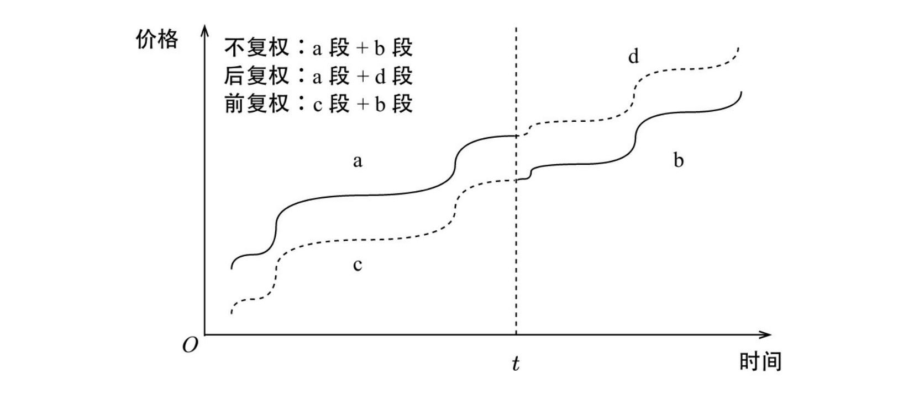

图3.1中，股价在 $t$ 时刻发生跳变，实线a和b两段是变化前后的实际价格：

- **不复权**：a段+b段，直接使用实际价格，存在不连续的缺口。
- **前复权**（c段+b段）：保持当前价格不变，将历史价格向下调整，使股价连续。前复权用来看盘方便，能一眼看出历史走势，是行情软件的默认方式。但有两个缺陷：每次除权除息都要重新调整历史价格（历史价格是时变的），且对持续分红公司可能出现负值。
- **后复权**（a段+d段）：保持历史价格不变，在每次权益事件后调整当前价格。后复权价格和真实股价可能差别较大，不适合看盘，但可以被看作投资者的长期财富增长曲线，反映真实收益率。

**本书统一使用后复权价格**，无论是计算收益率还是回溯历史表现。

#### 2. 长期停牌股复牌

部分停牌股复牌后没有涨跌停限制，导致当日收益率异常极端。例如★ST超日（002506.SZ），停牌超过一年后于2015年8月12日复牌，当日涨幅高达593.72%。

| 交易日 | 收益率（%） |
|---|---|
| 2015/08/10 | 停牌 |
| 2015/08/11 | 停牌 |
| 2015/08/12 | 593.72 |
| 2015/08/13 | 10.04 |
| 2015/08/14 | 10.01 |

> **表3.1 复牌首日大涨示例**

处理方法：针对1996年12月16日涨跌停制度实施后的数据，将日收益率**压缩到 $[-10\%, +10\%]$ 区间**——大于10%的用10%代替，小于-10%的用-10%代替。

#### 3. 填充值

A股存在停牌制度，停牌日没有交易数据。是用上一个非停牌日数据填充，还是直接设为缺失值？需要按场景判断：

- **可以填充**的场景：计算动量（当前价格相对于 $T$ 个交易日前的涨跌幅）。基期如果停牌，用上一个非停牌日价格代替，逻辑上说得通。
- **不能填充、应设为缺失值**的场景：计算波动率或 $\beta$。填充法会把停牌日收益率设为零，而"收益率为零"不等于"没有波动"，它只是"没有交易"。用它算波动率会导致低估。计算 $\beta$ 时，市场超额收益率每天都有，但个股停牌日如果用0代替，会导致 $\beta$ 估计出现较大偏差。

**核心原则：填充法引入的0收益率如果会扭曲统计量的经济含义，就不能填充。**

#### 4. 最少交易日

有些公司滥用停牌制度，导致股票交易断断续续。如果某支股票在一个月的绝大多数交易日均停牌，只有少数样本用来计算波动率等指标，会造成较大的小样本偏差。

**规则：有效样本数必须超过时间窗口的 $\frac{2}{3}$。** 一个月通常包含21个交易日，因此样本数 $\geq 14$ 时才计算波动率，否则设为缺失值。

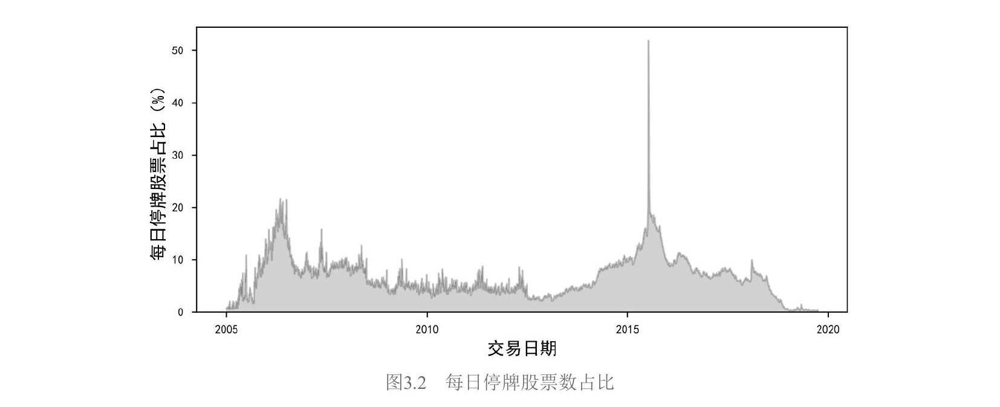

图3.2展示了2005–2019年每日停牌股票占比。2015年前后停牌现象非常严重（占比一度接近50%），2018年底上交所和深交所发布停复牌指引后大幅改善。

---

### 3.1.3 财务数据处理

财务数据是与公司财务有关的数据，反映企业一定期间的经营成果和财务状况变动。财务数据比量价数据复杂得多，坑也多得多。

#### 1. 报告期

A股《会计法》规定会计年度从1月1日开始，12月31日结束。上市企业一年定期披露四次财报：

| 报告期 | 起始点 | 结束点 | 常用标签 | 最晚披露日 |
|---|---|---|---|---|
| 一季报 | 1月1日 | 3月31日 | XXXX0331 | 同年4月30日 |
| 半年报 | 1月1日 | 6月30日 | XXXX0630 | 同年8月31日 |
| 三季报 | 1月1日 | 9月30日 | XXXX0930 | 同年10月31日 |
| 年报 | 1月1日 | 12月31日 | XXXX1231 | 次年4月30日 |

> **表3.2 财务报告期**

注意两点：每个报告期的起始点都是1月1日（半年报是1–6月累计数据，不是只有4–6月）；披露日期只有截止日要求，具体哪天披露由公司决定。

#### 2. 财务报表

财务报告主要由"四表一附注"构成：

| 表名 | 含义 | 特点 |
|---|---|---|
| 资产负债表 | 反映企业在一定日期的资产、负债和所有者权益情况 | **时点数据** |
| 利润表 | 反映企业在一定时期经营成果（盈利或亏损）和利润分配情况 | **区间数据** |
| 现金流量表 | 反映企业各项目对现金流的影响，分为经营、投资和融资三个类别 | **区间数据** |
| 所有者权益变动表 | 反映企业期初到期末所有者权益的增减情况 | 区间数据 |
| 附注 | 对财务报表的说明和解释 | — |

> **表3.3 四表一附注**

**时点数据vs区间数据的区分非常重要**，直接影响后面单季度数据和TTM数据的计算方式。

#### 3. 基准报告期

公司在披露最新报告期的报表时，会同时披露一个历史基准报表作为对比。关键是：**不同报表对应的基准报表不同。**

| 最新报告期 | 资产负债表基准 | 利润表基准 | 现金流量表基准 |
|---|---|---|---|
| 一季报 | 上年年报 | 上年一季报 | 上年一季报 |
| 半年报 | 上年年报 | 上年半年报 | 上年半年报 |
| 三季报 | 上年年报 | 上年三季报 | 上年三季报 |
| 年报 | 上年年报 | 上年年报 | 上年年报 |

> **表3.4 基准报告期**

资产负债表是时点数据，基准永远是上年年报（拿期末和年初比）；利润表和现金流量表是累计数据，基准是上年同期（同比才有可比性）。

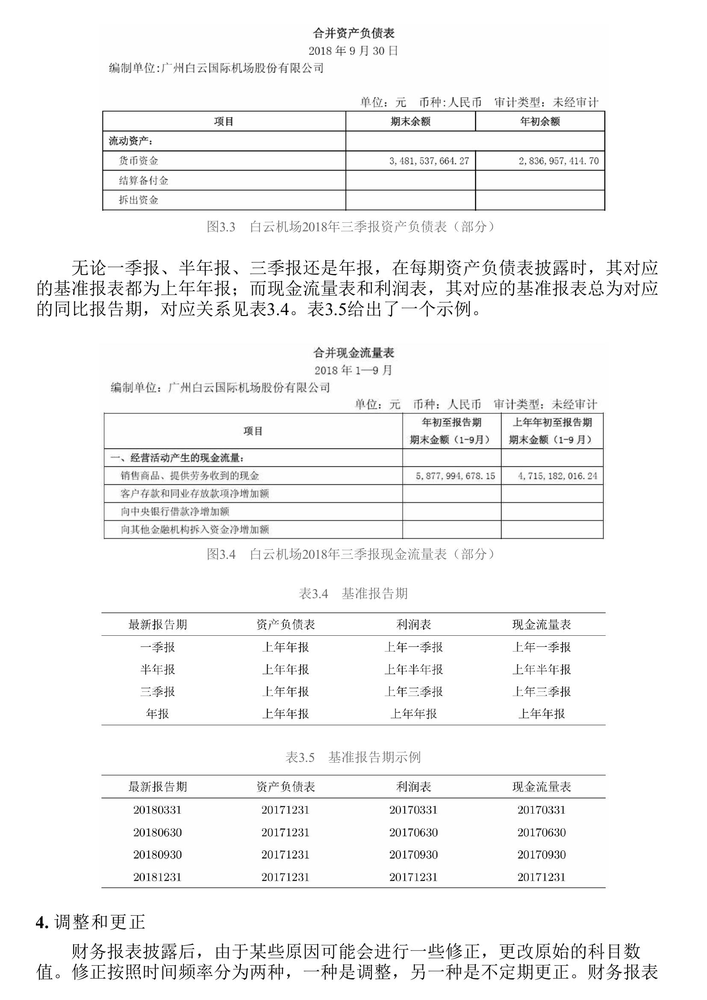

#### 4. 调整和更正

财务报表披露后，可能因为两种原因被修改：

- **调整**：在披露新报告期的基准报表时，如果基准报表和原始报表科目数值不同，就发生了调整。这是**定期**发生的。
- **更正**：因为会计政策变更或统计差错，对之前某期报告发布更正公告。这是**不定期**的。

中铁工业的例子（图3.5和图3.6）：2017年3月31日首次披露2016年年报（原始报表），2018年3月28日披露2017年年报时同时披露了2016年年报（基准报表）。比较两者发现货币资金、应收票据等科目数值不同——这就是调整。

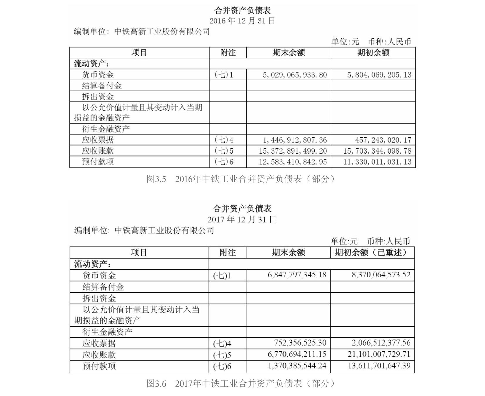

柳工的例子（表3.6）：2018年8月30日披露半年报，2018年9月29日对半年报进行了更正，修改了营业总成本、投资收益等科目。

| 会计科目 | 更正前 | 更正后 |
|---|---|---|
| 营业总成本 | 9,062,061,659.26 | 9,065,019,260.18 |
| 投资收益 | 53,176,657.27 | 54,502,547.68 |
| 营业利润 | 766,448,249.39 | 774,665,801.19 |
| 净利润 | 627,967,425.36 | 636,184,977.16 |
| 基本每股收益 | 0.5207 | 0.5295 |

> **表3.6 柳工2018年半年报利润表更正（元）**

#### 5. 基本原则

面对调整和更正，有两种偷懒的处理方式，**都不推荐**：

- 方式一：只用第一次披露的原始值。简单，不引入未来数据，但信息利用不充分。
- 方式二：始终用最新调整/更正后的值。也简单，但在历史回溯时会利用未来数据，结果偏差大。

**正确做法是Point-in-Time原则：在当前时点利用可得的最新信息。** 既能保证充分利用最新数据（考虑调整和更正），也可以避免使用未来数据。

#### 6. 数据存储

同一个报告期在底层数据库中最多有四条记录：

| 类型 | 简称 | 说明 |
|---|---|---|
| 类型1 | 初始报表（最新值） | 首次披露的财务报表，如有更正则为更正后值 |
| 类型2 | 基准报表（最新值） | 最新报告期披露时的基准报告期报表，如有更正则为更正后值 |
| 类型3 | 初始报表（原始值） | 如有更正公告，修改前的初始报表记录 |
| 类型4 | 基准报表（原始值） | 如有更正公告，修改前的基准报表记录 |

> **表3.8 合并报表在底层表中的四种记录类型**

如果没有调整也没有更正，只有类型1一条记录。有调整无更正，有类型1和2。有更正时，类型3和/或4才会出现。

#### 7. 如何使用（最关键的部分）

图3.7用四种情况说明了在不同时点该提取哪条记录，**核心逻辑始终是：在每个时点，提取当时能看到的最新版本的数据。**

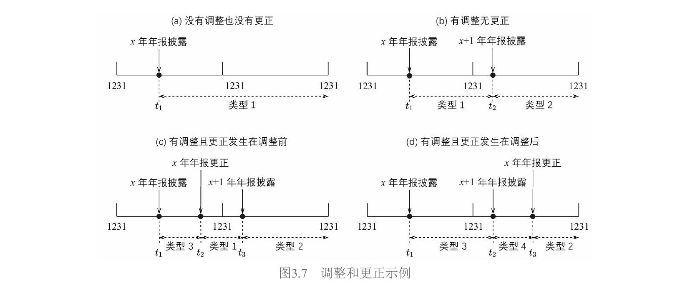

**情况(a)：没有调整也没有更正。** $x$ 年年报在 $t_1$ 日披露，之后只有类型1。$t_1$ 日后取类型1。

**情况(b)：有调整，无更正。** $t_1$ 日首次披露（类型1），$t_2$ 日披露基准报表（类型2）。$t_1$ 到 $t_2$ 取类型1，$t_2$ 之后取类型2。

**情况(c)：有调整，更正在调整之前。** $t_1$ 日披露（类型1），$t_2$ 日更正（更正后→类型1，更正前→类型3），$t_3$ 日披露基准（类型2）。$t_1$–$t_2$ 取类型3，$t_2$–$t_3$ 取类型1，$t_3$ 之后取类型2。

**情况(d)：有调整，更正在调整之后。** $t_1$ 日披露（类型1），$t_2$ 日披露基准（类型2），$t_3$ 日更正（原类型1→类型3，原类型2→类型4，更新后分别覆盖类型1和2）。$t_1$–$t_2$ 取类型3，$t_2$–$t_3$ 取类型4，$t_3$ 之后取类型2。

#### 8. 单季度数据

利润表和现金流量表是从年初累计的，如果想单独看某一个季度的数据，需要做差：

| 季度 | 资产负债表 | 利润表 | 现金流量表 |
|---|---|---|---|
| 一季度 | 一季报 | 一季报 | 一季报 |
| 二季度 | 半年报 | 半年报 $-$ 一季报 | 半年报 $-$ 一季报 |
| 三季度 | 三季报 | 三季报 $-$ 半年报 | 三季报 $-$ 半年报 |
| 四季度 | 年报 | 年报 $-$ 三季报 | 年报 $-$ 三季报 |

> **表3.9 单季度数据计算**

资产负债表是时点数据，单季度直接等于当期报告期数据；利润表和现金流量表需要做差（一季度除外，因为起点就是1月1日）。如果环比报告期缺失，则无法计算，单季度数据为空。

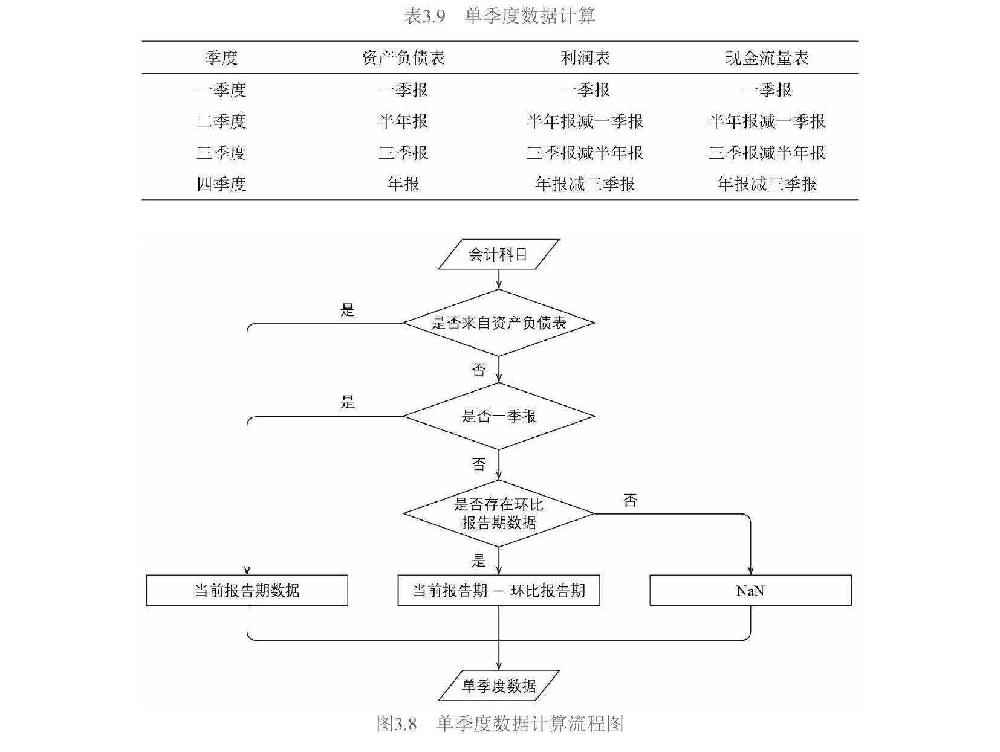

#### 9. TTM数据

TTM（Trailing Twelve Months）是滚动12个月数据，目的是消除季节性差异使得横向可比。

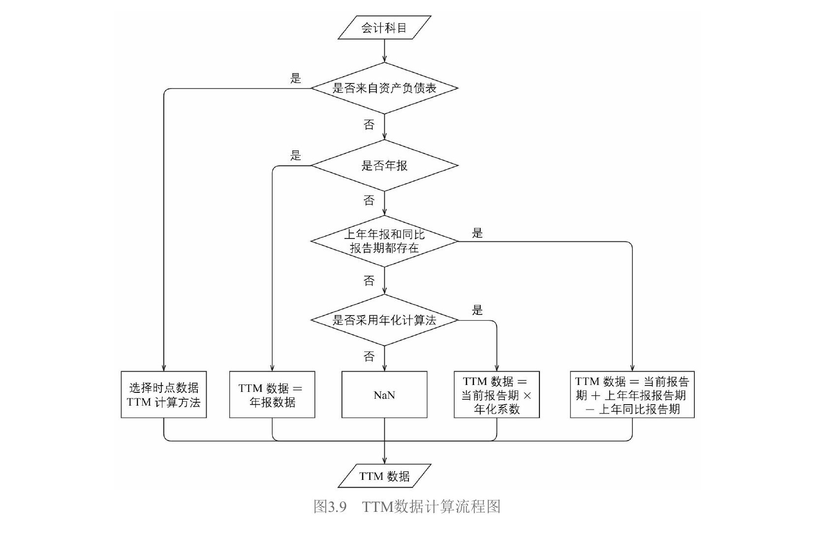

对于**利润表和现金流量表**：
- 最新报告期为年报：TTM = 年报数据。
- 最新报告期为其他：$\text{TTM} = \text{当前报告期} + \text{上年年报} - \text{上年同期}$。例如当前是2018年三季报（1–9月），$\text{TTM} = \text{2018Q3} + \text{2017年报} - \text{2017Q3}$，相当于2017年10月到2018年9月。
- 上年年报或同期缺失时，可用年化算法：当前报告期 $\times$ 年化系数（一季报 $\times 4$、半年报 $\times 2$、三季报 $\times \frac{4}{3}$）。

对于**资产负债表**（时点数据），TTM没有天然定义，有三种做法：直接用最新值、最近四期均值、当期和同比期均值。

---

### 3.1.4 因子构造流程

有了干净的数据，接下来解决因子构造的五个实操问题。

#### 1. 是否剔除金融股

学术惯例是剔除金融行业（银行、证券、保险），因为经营模式和会计科目差异大。但本书选择**不剔除**，理由三个：大部分因子具有普适性；金融行业有优质公司；Fama and French (1993, 2015) 也没刻意剔除。

#### 2. 剔除"黑名单"

以下四类股票从股票池中过滤：

- **风险警示股（ST）**：连续两年净利润为负，或每股净资产低于面值。面临暂停上市、退市风险，涨跌停限制缩窄到 $\pm 5\%$。
- **待退市股**：恢复交易后往往一连串跌停。
- **净资产为负股**：最近报告期净资产为负。
- **次新股**：上市不足一年的股票，高弹性、高波动、风险高。

#### 3. 异常值

由于数据质量和计算方式等问题，可能出现极端异常值。例如2019年5月28日A股ROE(TTM)最小值为 $-1227.85\%$，来自株治集团（亏损过大且净资产太小）。

| 股票数（支） | 均值 | 标准差 | 最小值 | 25%分位数 | 中位数 | 75%分位数 | 最大值 |
|---|---|---|---|---|---|---|---|
| 3365 | 4.16% | 34.53% | −1227.85% | 2.87% | 7.03% | 11.69% | 78.51% |

> **表3.10 2019年5月28日ROE（TTM）分布**

本书采用**缩尾法（winsorization）**：左右各 $1\%$，把小于第1百分位数和大于第99百分位数的样本点替换为对应分位数的值（替换而非删除，保留样本量）。

#### 4. 排序和分组

同时使用两种排序方法：

- **单变量排序**：按目标变量从小到大分10组，考察收益率是否单调，以及多空组合收益率是否显著。
- **独立双重排序**：用市值和目标变量分别独立地各分5组，交叉得到 $5 \times 5 = 25$ 个投资组合。目的是**控制市值的影响**。双重排序中市值是默认的第二个排序变量，因此对规模因子本身不适用。

每个组合内按**等权重**或**总市值加权**计算收益率。两种都汇报，因为差异本身包含信息。

#### 5. 调仓频率和交易限制

- **调仓频率**：统一为**每月末**。
- **不可交易股**：调仓日剔除停牌股、一字涨停股和一字跌停股。
- **交易成本**：设为0（关注因子收益率的统计显著性，不是策略的实际盈利能力）。

### 3.1.5 实证设定

表3.11将全部约定汇总，是全书实证分析的"宪法"：

| 项目 | 设定 |
|---|---|
| 数据来源 | Wind和Tushare |
| 收益计算 | 后复权收盘价 |
| 长期停牌股复牌首日收益率 | 压缩到 $\pm 10\%$ |
| 缺失值处理 | 向前填充或者不填充（视场景） |
| 最少交易日 | 不少于计算窗口 $\frac{2}{3}$ 的数据 |
| 财务数据处理 | 遵循point-in-time原则 |
| 股票范围 | 全部A股，不剔除金融股 |
| 时间区间 | 2000年1月1日至2019年12月31日 |
| 黑名单 | 待退市股、净资产为负股、次新股和风险警示股 |
| 不可交易股 | 停牌股、一字涨停股、一字跌停股 |
| 异常值处理 | 缩尾法（左右各1%） |
| 单变量排序 | 按变量取值从小到大将股票分成10组 |
| 双重排序 | 独立双重排序，两个变量各自分5组，交叉得到25个投资组合 |
| 投资组合内股票权重 | 等权重或按总市值加权 |
| 调仓频率 | 每月末 |
| 交易成本 | 设为0 |

> **表3.11 本书在进行实证分析时采用的设定**

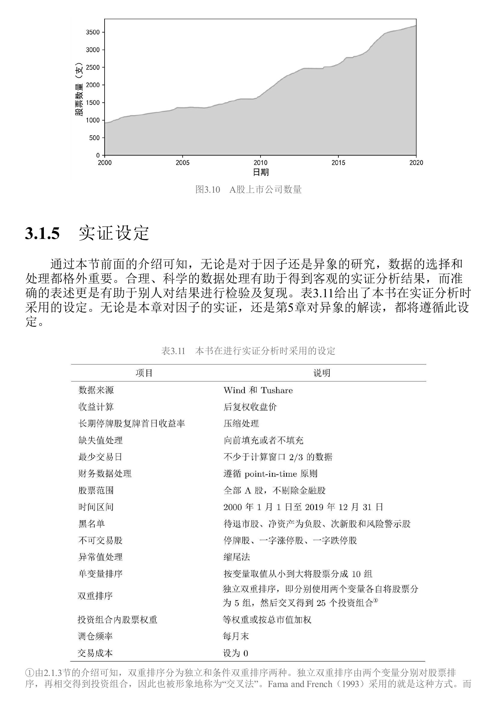

图3.10展示了研究区间内A股上市公司数量的增长：2000年初925支，2019年底3692支。选择从2000年开始的原因：会计规则1999年才开始标准化，且2000年后样本量才足够。

---

## 3.2 市场因子

市场因子是所有因子的起点。在多因子模型出现之前，CAPM（Capital Asset Pricing Model，资本资产定价模型）是计算资产预期收益率的唯一范式。

### 3.2.1 市场因子起源

CAPM模型的数学表达式为：

$$E[R_i] - R_f = \beta_i (E[R_M] - R_f) \tag{3.1}$$

其中 $E[R_i]$ 是资产 $i$ 的预期收益率，$R_f$ 是无风险利率，$R_M$ 是市场组合收益率，$\beta_i$ 是资产 $i$ 的系统性风险系数。

含义很直接：资产的预期超额收益等于其 $\beta_i$ 乘以市场组合的预期超额收益。$\beta_i$ 越大，承担的系统性风险越高，预期收益也越高——"高风险，高收益"。

CAPM在1960年代由Treynor、Sharpe、Lintner和Mossin分别独立提出，其中Sharpe和Lintner的版本最知名，称为**Sharpe–Lintner CAPM**。

推导逻辑：假设投资者用均值和方差衡量回报与风险（沿袭Markowitz的均值–方差优化框架）。将给定预期收益下风险最小的组合连接起来，构成**最小方差前沿**。假设投资者可以按无风险利率自由借贷，从无风险资产向前沿做切线得到**切点组合**（tangency portfolio），即夏普比率最高的组合。由于所有理性投资者都投资该组合，它在均衡时就是**市场组合**。

### 3.2.2 对CAPM的质疑

"可以按无风险利率自由借贷"的假设太强。Black (1972) 放松这一限制，推导出**Black CAPM**：

$$E[R_i] = \beta_i E[R_M] + (1 - \beta_i) E[R_z] \tag{3.2}$$

其中 $R_z$ 是零 $\beta$ 因子，满足 $\text{cov}(R_z, R_M) = 0$。这是一个**两因子模型**。

关键区别：Sharpe–Lintner CAPM下，$E[R_i]$ 和 $\beta_i$ 关系的斜率等于 $E[R_M] - R_f$；而Black CAPM中，$(1 - \beta_i)E[R_z]$ 这一项使得资产预期收益 $E[R_i]$ 和 $\beta_i$ 之间的关系**更加平坦**，高 $\beta$ 资产的预期收益被压低、低 $\beta$ 资产的预期收益被抬高。实证数据更支持这种平坦的关系。

学者们将CAPM的检验提炼为三个假说：(1) 仅凭 $\beta$ 便可解释预期收益的截面差异，且关系线性；(2) 市场组合超额收益显著为正；(3) $\beta = 0$ 的资产预期收益率等于无风险利率。实证大都不支持传统CAPM，主要发现：高低 $\beta$ 组合的收益差异远小于CAPM预测；市值、BM、EP等变量也有解释力。正因CAPM被拒绝，才有了多因子模型的兴起。

### 3.2.3 市场因子实证

市场因子不是多空对冲因子，它就是**全部股票按总市值加权的投资组合**。实证关注两个问题。

**问题一：市场因子解释个股收益时序波动的能力**

对每只个股的超额收益率对市场组合超额收益率做时序回归，求可决系数 $R^2$。

| 均值 | 标准差 | 最小值 | 25%分位数 | 中位数 | 75%分位数 | 最大值 |
|---|---|---|---|---|---|---|
| 29.09% | 13.85% | 0.00% | 19.83% | 30.52% | 38.58% | 85.25% |

> **表3.12 $R^2$的描述性统计**

$R^2$ 均值约29%，说明市场因子能解释个股收益率时序波动的约三成，还有七成需要其他因子来解释。

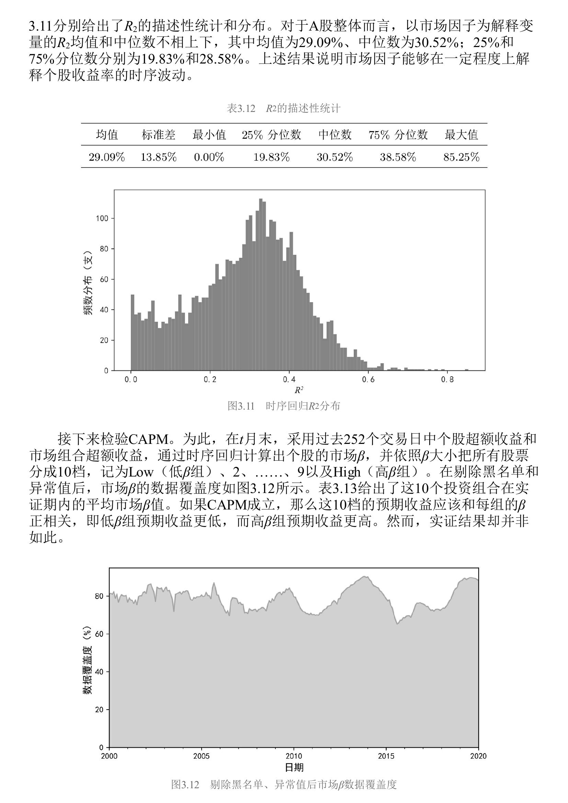

**问题二：CAPM是否成立**

在 $t$ 月末，用过去252个交易日数据估计每只股票的市场 $\beta$，按 $\beta$ 从小到大分10组。

| Low | 2 | 3 | 4 | 5 | 6 | 7 | 8 | 9 | High |
|---|---|---|---|---|---|---|---|---|---|
| 0.73 | 0.92 | 1.01 | 1.07 | 1.13 | 1.18 | 1.23 | 1.29 | 1.36 | 1.48 |

> **表3.13 10个投资组合的市场 $\beta$（实证期内时间平均）**

如果CAPM成立，高 $\beta$ 组应有更高的预期收益。但实证结果否定了这一点（图3.13）：

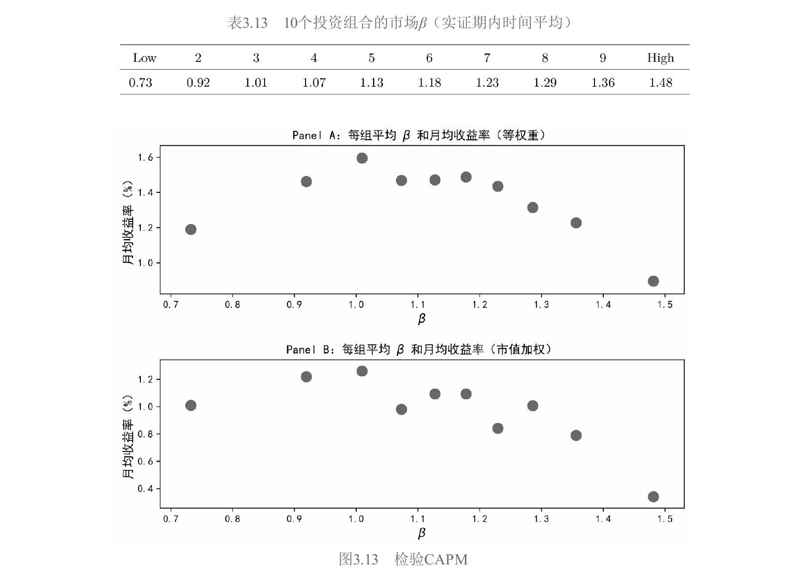

- **等权重**（Panel A）：10组收益率和 $\beta$ 的秩相关系数 $= -0.394$（$p$ 值0.26），无显著单调性。
- **市值加权**（Panel B）：秩相关系数 $= -0.745$（$p$ 值0.013），收益率和 $\beta$ **显著负相关**——低 $\beta$ 的股票反而收益更高。

CAPM被A股数据拒绝，引申出两个思考：第一，需要加入其他风格因子构建多因子模型；第二，低 $\beta$ 带来高收益，表明A股可能存在著名的**低 $\beta$ 异象**（Betting Against Beta）。

---

## 3.3 规模因子

规模因子的含义最为直观：**小市值股票长期跑赢大市值股票**。

### 3.3.1 规模因子起源

Banz (1981) 基于纽约证券交易所40年数据发现，市值最小的一组股票月均收益率比其他股票高 $0.4\%$，且这种效应对市值最小的企业最为显著。

背后的直觉是：投资者普遍不愿意持有小市值股票（信息获取难、流动性差、分析师覆盖少），这些股票因此被"冷落"，价格偏低，预期收益偏高。

**Fama and French (1993)** 让规模因子"封神"——指出规模因子溢价平均 $0.63\%$/月，并在三因子模型中以SMB（Small-Minus-Big）因子的形式正式确立。

A股方面，Liu et al. (2019) 发现2000–2016年间规模效应非常显著，但指出A股特殊的IPO制度导致微型股**壳价值**长期畸高，扭曲了规模溢价。不过2017–2018年大市值白马股远优于小盘股，规模效应被大幅稀释——因子有周期性。

### 3.3.2 规模因子成因

- **财务困境风险说**：小市值公司多是"坠落的天使"（fallen angels），财务困境风险更高，需要更高预期收益补偿（Chan and Chen 1991; Fama and French 1995, 1996）。
- **非流动性说**：小盘股流动性差，非流动性溢价表现为规模效应。但解释力有限。
- **投资者行为说**：机构偏好大市值，小盘股缺乏投资者基础，必须提供更高预期收益吸引投资者。
- **遗漏变量说**：Berk (1995) 指出如果定价模型有设定偏误，规模总会和未被解释的收益部分负相关。

### 3.3.3 规模因子实证

以**总市值**（收盘价 $\times$ 总股本）为排序变量。图3.14展示了数据覆盖度。

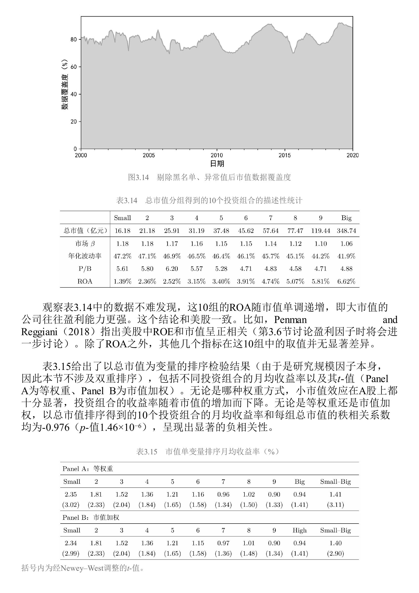

**描述性统计（表3.14）**

| | Small | 2 | 3 | 4 | 5 | 6 | 7 | 8 | 9 | Big |
|---|---|---|---|---|---|---|---|---|---|---|
| 总市值（亿元） | 16.18 | 21.18 | 25.91 | 31.19 | 37.48 | 45.62 | 57.64 | 77.47 | 119.44 | 348.74 |
| 市场 $\beta$ | 1.18 | 1.18 | 1.17 | 1.16 | 1.15 | 1.15 | 1.14 | 1.12 | 1.10 | 1.06 |
| 年化波动率 | 47.2% | 47.1% | 46.9% | 46.5% | 46.4% | 46.1% | 45.7% | 45.1% | 44.2% | 41.9% |
| P/B | 5.61 | 5.80 | 6.20 | 5.57 | 5.28 | 4.71 | 4.83 | 4.58 | 4.71 | 4.88 |
| ROA | 1.39% | 2.36% | 2.52% | 3.15% | 3.40% | 3.91% | 4.74% | 5.07% | 5.81% | 6.62% |

> **表3.14 总市值分组得到的10个投资组合的描述性统计**

关键发现：**ROA随市值单调递增**——大市值公司盈利能力更强，小市值公司盈利差。这个正相关性为后面理解盈利因子和规模因子的交互关系埋下伏笔。

**单变量排序（表3.15）**

| | Small | 2 | 3 | 4 | 5 | 6 | 7 | 8 | 9 | Big | Small–Big |
|---|---|---|---|---|---|---|---|---|---|---|---|
| 等权重 | 2.35 | 1.81 | 1.52 | 1.36 | 1.21 | 1.16 | 0.96 | 1.02 | 0.90 | 0.94 | **1.41** |
| $t$值 | (3.02) | (2.33) | (2.04) | (1.84) | (1.65) | (1.58) | (1.34) | (1.50) | (1.33) | (1.41) | **(3.11)** |
| 市值加权 | 2.34 | 1.81 | 1.52 | 1.36 | 1.21 | 1.15 | 0.97 | 1.01 | 0.90 | 0.94 | **1.40** |
| $t$值 | (2.99) | (2.33) | (2.04) | (1.84) | (1.65) | (1.58) | (1.36) | (1.48) | (1.34) | (1.41) | **(2.90)** |

> **表3.15 市值单变量排序月均收益率（%），括号内为经Newey–West调整的 $t$ 值**

收益率随市值增加而下降，秩相关系数 $= -0.976$（$p$ 值 $1.46 \times 10^{-6}$）。Small–Big因子月均 $1.41\%$（$t = 3.11$），非常显著。等权重和市值加权结果差异很小，说明规模效应的显著性不依赖加权方式。

**累计收益率曲线（图3.15和图3.16）**

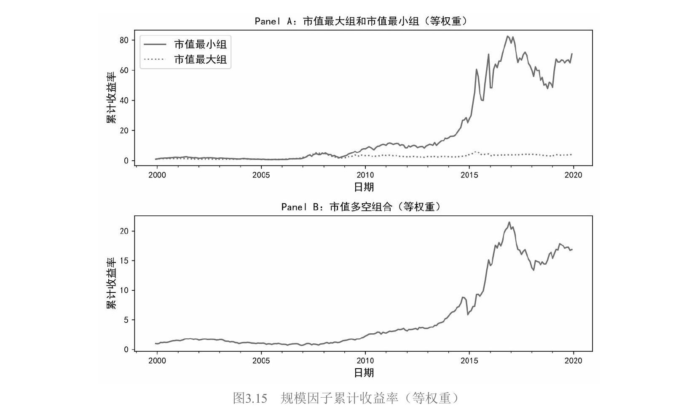

Panel A：小市值组累计收益远高于大市值组。Panel B：规模因子2000–2016年持续走高，**但2017年开始大幅回撤**——大市值蓝筹股走强，小市值效应被逆转。高收益伴随高波动：多头年化波动率37.3%，空头29.1%。

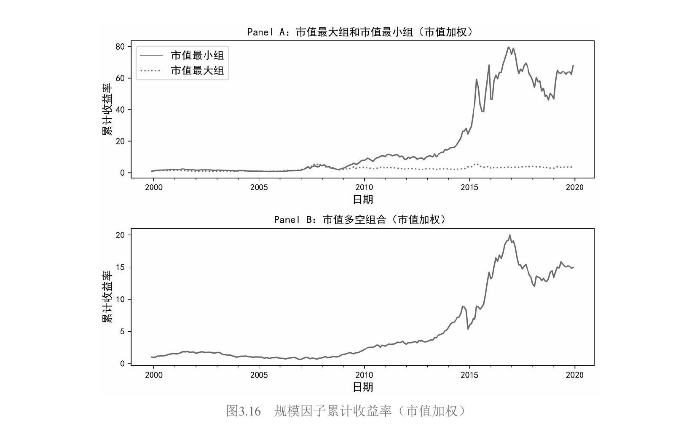

---

## 3.4 价值因子

价值因子的含义：**估值低的股票比估值高的股票有更高的预期收益**。

### 3.4.1 价值因子起源

Stattman (1980) 最早发现**BM（Book-to-Market ratio，账面市值比）** 较高的公司预期收益更高。BM = 账面净资产 / 市值。BM高说明市场给这家公司的估值低于账面价值——市场不看好它，所以便宜。

Fama and French (1992) 比较了BM、EP（Earnings-to-Price ratio，盈利市值比）等变量后，指出同时控制时EP不再显著，BM胜出成为构造价值因子的首选变量。Fama and French (1993) 在三因子模型中以HML（High-Minus-Low）因子正式确立了BM构建的价值因子。

国际市场上，价值效应在北美、欧洲、亚太等区域普遍存在（Fama and French 2012, 2017），且在日本之外的区域随市值增大而变弱。Asness et al. (2013) 更在不同国家、不同资产类别中发现了广泛持久的价值效应。

### 3.4.2 价值因子成因

**风险补偿类**：

- **财务困境风险假说**：高BM往往反映更高的财务困境风险（Griffin and Lemmon 2002）。
- **在位资产风险**：Zhang (2005) 认为企业不景气时难以削减在位资产，在位资产风险大于增长期权，高BM企业需要更高回报。
- **商业周期风险**：Hahn and Lee (2006) 认为高BM企业对期限利差暴露更大。
- **经营杠杆**：Obreja (2013) 将价值溢价归因于经营杠杆。

**行为偏差类**：

- **过度外推**：Lakonishok et al. (1994) 认为投资者把过去表现简单外推，对过去盈利不佳的企业过度悲观，导致价值效应。
- **套利限制**：Ali et al. (2003) 发现BM在套利限制更大的股票中表现更显著。
- **无形信息**：Daniel and Titman (2006) 发现投资者对有形信息关注不足，BM能预测无形收益的均值回复。

**近期挑战**：Fama and French (2015) 承认盈利和投资因子加入后BM变得冗余；2008年后价值因子表现持续低迷。

### 3.4.3 价值因子实证

以BM为排序变量（分子：归属股东权益合计（不含少数股东权益），分母：总市值）。

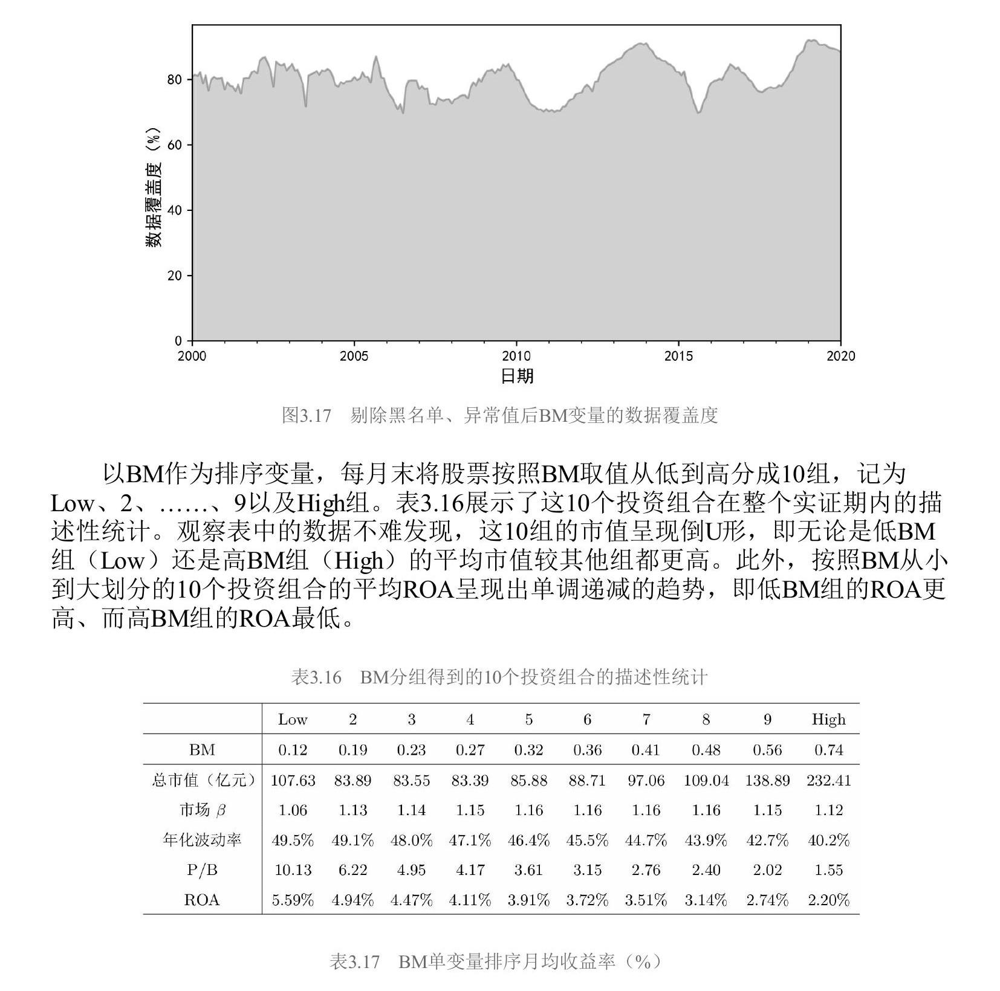

**描述性统计（表3.16）**

| | Low | 2 | 3 | 4 | 5 | 6 | 7 | 8 | 9 | High |
|---|---|---|---|---|---|---|---|---|---|---|
| BM | 0.12 | 0.19 | 0.23 | 0.27 | 0.32 | 0.36 | 0.41 | 0.48 | 0.56 | 0.74 |
| 总市值（亿元） | 107.63 | 83.89 | 83.55 | 83.39 | 85.88 | 88.71 | 97.06 | 109.04 | 138.89 | 232.41 |
| ROA | 5.59% | 4.94% | 4.47% | 4.11% | 3.91% | 3.72% | 3.51% | 3.14% | 2.74% | 2.20% |

> **表3.16 BM分组得到的10个投资组合的描述性统计（部分）**

两个关键发现：市值呈**倒U形**（低BM和高BM的平均市值都偏大），ROA**单调递减**（低BM公司盈利好、高BM公司盈利差）。

**单变量排序（表3.17）**

| | Low | 2 | 3 | 4 | 5 | 6 | 7 | 8 | 9 | High | High–Low |
|---|---|---|---|---|---|---|---|---|---|---|---|
| 等权重 | 0.70 | 1.04 | 1.07 | 1.30 | 1.36 | 1.50 | 1.58 | 1.63 | 1.59 | 1.68 | **0.99** |
| $t$值 | (1.02) | (1.49) | (1.54) | (1.82) | (1.89) | (2.09) | (2.14) | (2.21) | (2.13) | (2.26) | **(3.08)** |
| 市值加权 | 0.57 | 0.53 | 0.57 | 0.72 | 0.94 | 0.90 | 1.08 | 1.32 | 1.21 | 1.44 | **0.88** |
| $t$值 | (0.87) | (0.79) | (0.89) | (1.08) | (1.38) | (1.51) | (1.61) | (1.89) | (1.70) | (2.05) | **(2.09)** |

> **表3.17 BM单变量排序月均收益率（%）**

等权重High–Low月均 $0.99\%$（$t = 3.08$），显著。市值加权 $0.88\%$（$t = 2.09$），显著性下降但仍在0.05水平显著。

**双重排序（表3.18）——关键结果**

用BM和市值独立双重排序（等权重），High–Low的表现：

| 市值档 | High–Low月均收益率 | $t$值 |
|---|---|---|
| Small | 0.93% | **4.76** |
| 2 | 0.82% | 3.38 |
| 3 | 0.56% | 2.12 |
| 4 | 0.68% | 2.07 |
| Large | 0.45% | 1.22 |
| **五组平均** | **0.69%** | **2.89** |

规律清晰：**BM在小市值中最强（$t = 4.76$），随市值增大效果递减，在大市值中失效（$t = 1.22$）。**

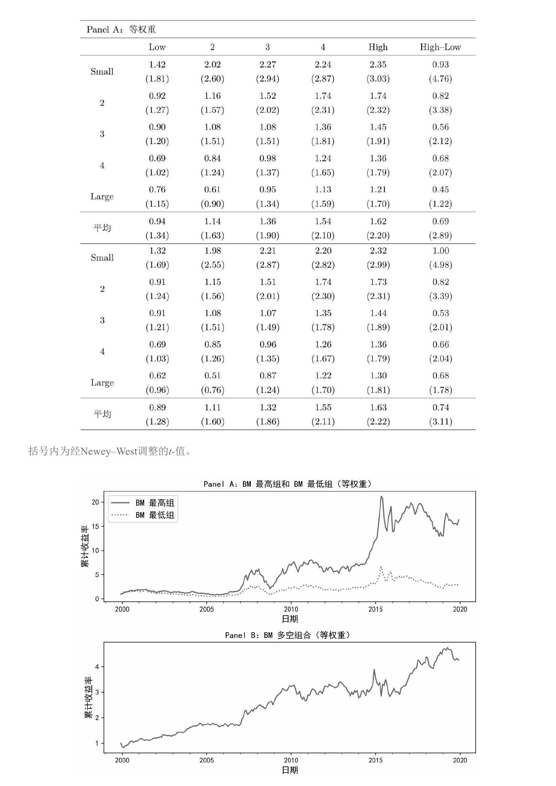

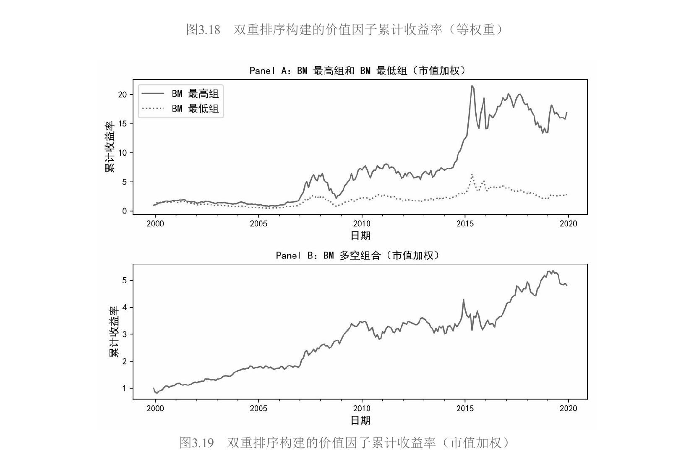

**EP vs BM争议**

Liu et al. (2019) 提出的A股多因子模型剔除了市值最低30%的股票，用EP替代BM构建价值因子。书中分析指出，由会计学恒等式 $EP = BM \times ROE$，剔除最小30%市值的股票同时做了两件事：**削弱BM的效果**（BM在小市值中最强），**提升ROE的效果**（ROE在小市值中最弱，见3.6节）。因此EP"优于"BM只是数据处理方式的副产品，而非金融学原理决定的。

---

## 3.5 动量因子

动量因子是七个因子中最有争议的——在美股和欧洲市场表现优异，但在A股和日本市场几乎完全失效。

### 3.5.1 动量因子起源

**截面动量效应**反映的是股票间的相对强弱趋势会延续，"强者恒强，弱者恒弱"。构造方式：做多过去一段时间表现最好的股票（赢家组合），做空表现最差的股票（输家组合）。

Jegadeesh and Titman (1993) 首先提出：每月末按过去 $X$ 个月总收益排序分10组，等权做多最高组、做空最低组，持有 $Y$ 个月。实证显示无论多空组合还是纯多头，都能获得显著稳健的超额收益。

国际市场上动量效应广泛存在（Rouwenhorst 1998, 1999; Asness et al. 2013），**但日本和中国A股是两个重要的例外**。

### 3.5.2 动量因子成因

**风险补偿阵营**：动态风险敞口假说认为赢家和输家组合有时变的系统性风险暴露。Daniel and Moskowitz (2016) 提出**"动量崩溃"（momentum crashes）**——市场状态切换时动量组合大幅损失，这种尾部风险是动量溢价的来源。Novy-Marx (2015b) 则认为价格动量完全由**盈余动量**驱动。

**行为偏差阵营**（更多学者支持）：过度自信和自我归因（Daniel et al. 1998）、处置效应（Grinblatt and Han 2005）、推定预期偏差（Choi and Mertens 2019）、知情交易（Chen and Zhao 2012）、市场情绪（Stambaugh et al. 2012）。

**改进方法**：**残差动量（residual momentum）** 由Blitz et al. (2011) 提出，用个股收益中无法被多因子模型解释的残差部分计算动量，剥离了系统性风险敞口，不再有动量崩溃问题，甚至在日本市场也有效。

### 3.5.3 动量因子实证

排序变量：$t{-}12$ 到 $t{-}1$ 之间11个月的总收益（**跳过 $t$ 月本身**以排除短期反转干扰）。

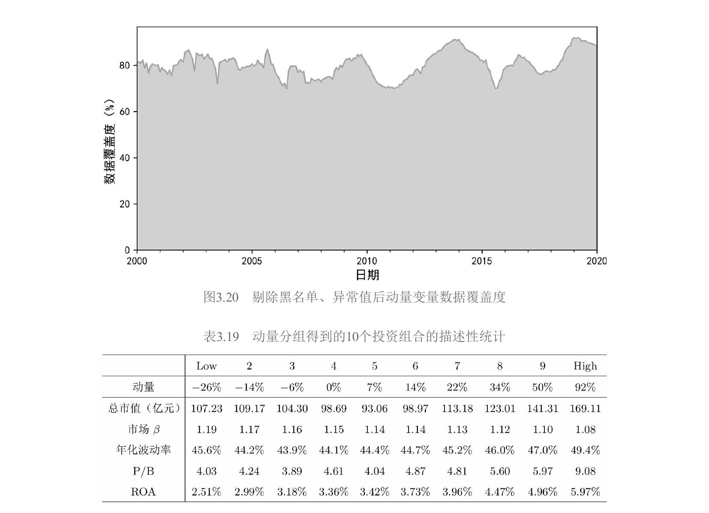

**描述性统计（表3.19）**

| | Low | 2 | 3 | 4 | 5 | 6 | 7 | 8 | 9 | High |
|---|---|---|---|---|---|---|---|---|---|---|
| 动量 | −26% | −14% | −6% | 0% | 7% | 14% | 22% | 34% | 50% | 92% |
| 总市值（亿元） | 107.23 | 109.17 | 104.30 | 98.69 | 93.06 | 98.97 | 113.18 | 123.01 | 141.31 | 169.11 |
| ROA | 2.51% | 2.99% | 3.18% | 3.36% | 3.42% | 3.73% | 3.96% | 4.47% | 4.96% | 5.97% |

> **表3.19 动量分组得到的10个投资组合的描述性统计**

两个发现：高动量组（第9组和High组）市值显著跳升，大市值暴露会削弱其表现；ROA单调递增，涨得多的股票盈利也好。

**单变量排序（表3.20）**

| | Low | 2 | 3 | 4 | 5 | 6 | 7 | 8 | 9 | High | High–Low |
|---|---|---|---|---|---|---|---|---|---|---|---|
| 等权重 | 1.19 | 1.32 | 1.47 | 1.50 | 1.55 | 1.42 | 1.36 | 1.25 | 1.24 | 1.14 | **−0.04** |
| $t$值 | (1.60) | (1.78) | (1.97) | (2.00) | (2.16) | (2.00) | (1.92) | (1.79) | (1.79) | (1.73) | **(−0.14)** |
| 市值加权 | 0.87 | 0.82 | 0.88 | 0.61 | 1.02 | 0.91 | 0.78 | 0.91 | 0.71 | 0.95 | **0.08** |
| $t$值 | (1.21) | (1.13) | (1.26) | (0.90) | (1.53) | (1.32) | (1.31) | (1.53) | (1.20) | (1.49) | **(0.20)** |

> **表3.20 动量变量单变量排序月均收益率（%）**

等权重下收益率呈**倒U形**，完全无单调性。High–Low月均 $-0.04\%$（$t = -0.14$），**赢家组合跑输了输家组合**。市值加权同样不显著。

**双重排序（表3.21）——等权重**

| 市值档 | High–Low月均 | $t$值 |
|---|---|---|
| Small | −0.23% | −0.91 |
| 2 | −0.09% | −0.39 |
| 3 | −0.01% | −0.03 |
| 4 | +0.23% | 0.89 |
| Large | +0.34% | 0.96 |
| **五组平均** | **0.05%** | **0.22** |

规律：**小市值中表现为反转（赢家跑输输家），大市值中微弱存在动量但不显著。** 五组平均完全不显著。

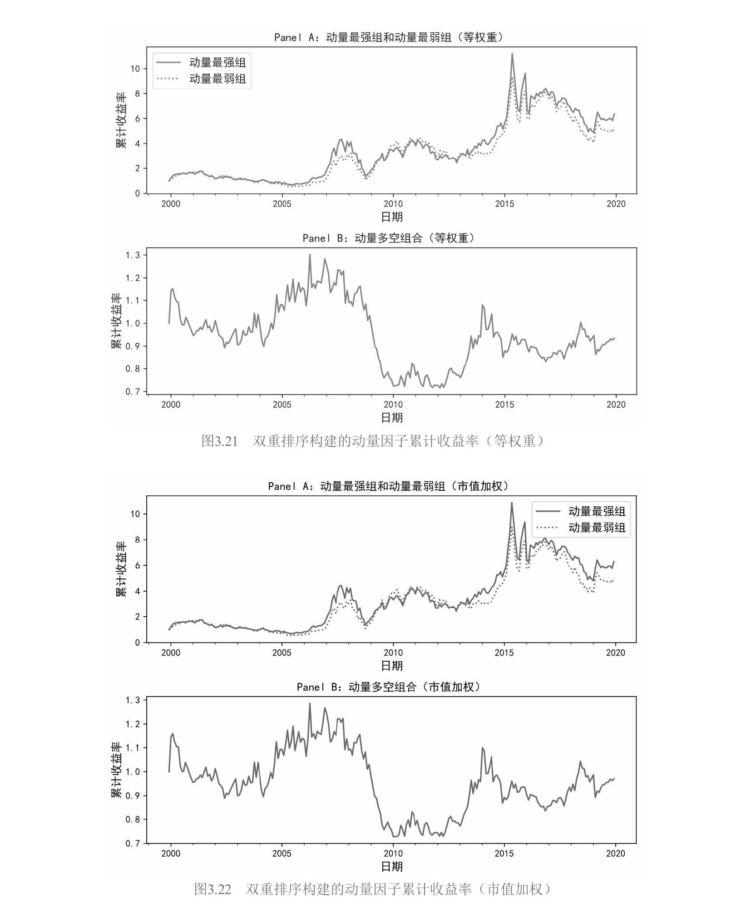

等权重Panel A：高动量组和低动量组的累计收益率曲线几乎完全重叠。Panel B：动量因子累计收益甚至小于零（原因：算术平均接近零时，波动使几何平均变为负数）。

**结论：以学术界标准方法构建的动量效应在A股完全不显著，和日本市场类似，和美股、欧洲市场形成鲜明对比。**

---

## 3.6 盈利因子

盈利因子是近年来被广泛认可的因子，被Fama and French (2015) 五因子模型和Hou et al. (2015) 四因子模型同时纳入。

### 3.6.1 盈利因子起源

盈利能力是股票估值的核心。经典估值模型（DDM、RIM）本质都是把未来各期盈利按折现率贴现到现在。

构建盈利因子的变量有很多选择：

- **ROE（Return On Equity，净资产收益率）**：归属股东利润 / 净资产。最常用。
- **ROA（Return On Assets，总资产收益率）**：归属股东和债权人的利润 / 总资产。Novy-Marx (2013) 主张用毛利润作分子。
- **ROTC（Return On Tangible Capitals，有形资本收益率）**：息税前利润 / 有形资本。Joel Greenblatt"神奇公式"中的盈利指标。
- **ROIC（Return On Invested Capital，投入资本回报率）**：息前税后利润 / 投入资本。
- **RNOA（Return On Net Operating Asset，净经营资产收益率）**：经营利润 / 净经营资产。剔除了杠杆和非经营活动干扰。

### 3.6.2 盈利因子成因

盈利因子的**理论基础比其他因子更扎实**。Fama and French (2006, 2015) 从DDM推导出预期盈利和预期收益正相关；Hou et al. (2015) 从 $q$-理论得到类似结论。

除盈利水平外，学术界还探索了三个重要维度：

- **盈利质量**：Sloan (1996) 将盈利分解为现金流和应计利润，发现高应计项目的公司未来收益显著更低——**应计异象（accruals anomaly）**。
- **盈利波动**：盈利波动越大，盈利持续性和可预测性越差（Dichev and Tang 2009）。
- **盈利增长**：盈利趋势与股票收益正相关（Akbas et al. 2017）；盈利加速度与收益正相关（He and Narayanamoorthy 2020）。

盈利因子还和**质量因子**密切相关。Asness et al. (2019) 定义的质量因子包含盈利、成长和安全性三个维度。Frazzini et al. (2018) 发现质量因子有助于解释巴菲特的长期优异表现。

### 3.6.3 盈利因子实证

变量：**ROE(TTM)**。分子为最近12个月营业利润，分母为股东权益（不含少数股东权益）最近四个报告期均值。

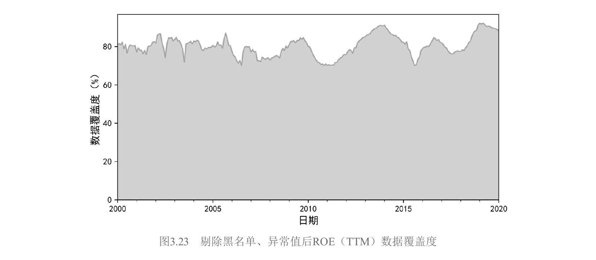

**描述性统计（表3.22）**

| | Low | 2 | 3 | 4 | 5 | 6 | 7 | 8 | 9 | High |
|---|---|---|---|---|---|---|---|---|---|---|
| ROE(TTM) | −11.6% | 0.4% | 3.3% | 5.5% | 7.5% | 9.6% | 11.9% | 14.9% | 19.3% | 30.0% |
| 总市值（亿元） | 48.45 | 53.97 | 52.94 | 60.27 | 63.38 | 77.96 | 100.03 | 164.87 | 236.50 | 300.31 |
| ROA | −3.53% | 0.75% | 2.09% | 2.79% | 3.69% | 4.51% | 5.30% | 6.24% | 7.56% | 9.69% |

> **表3.22 ROE（TTM）分组得到的10个投资组合的描述性统计（部分）**

**关键发现：市值单调递增。** Low组平均48亿，High组300亿。**盈利差的公司往往是小市值，盈利好的公司往往是大市值。** 这直接影响后面的实证结果。

**单变量排序（表3.23）——等权重vs市值加权的巨大差异**

| | Low | 2 | 3 | 4 | 5 | 6 | 7 | 8 | 9 | High | High–Low |
|---|---|---|---|---|---|---|---|---|---|---|---|
| 等权重 | 1.22 | 1.29 | 1.33 | 1.34 | 1.33 | 1.36 | 1.43 | 1.35 | 1.40 | 1.38 | **0.16** |
| $t$值 | (1.59) | (1.68) | (1.75) | (1.81) | (1.84) | (1.89) | (2.10) | (2.01) | (2.10) | (2.05) | **(0.52)** |
| 市值加权 | 0.58 | 0.78 | 0.96 | 0.85 | 0.82 | 0.77 | 1.05 | 0.76 | 1.00 | 1.26 | **0.68** |
| $t$值 | (0.80) | (1.05) | (1.35) | (1.23) | (1.18) | (1.14) | (1.68) | (1.27) | (1.63) | (1.94) | **(1.72)** |

> **表3.23 ROE（TTM）单变量排序月均收益率（%）**

等权重下High–Low仅 $0.16\%$（$t = 0.52$），完全不显著；市值加权下 $0.68\%$（$t = 1.72$），显著性上升。原因是：等权配置放大了小市值的影响，Low组（低盈利）通过小市值效应获得额外收益加成，缩小了High和Low的差距。

**双重排序（表3.24）——控制市值后焕然一新**

| 市值档 | High–Low月均（等权重） | $t$值 | High–Low月均（市值加权） | $t$值 |
|---|---|---|---|---|
| Small | 0.22% | 1.03 | 0.22% | 1.01 |
| 2 | 0.52% | 2.36 | 0.52% | 2.37 |
| 3 | 0.58% | 2.73 | 0.62% | 2.84 |
| 4 | 0.90% | **4.14** | 0.89% | **4.05** |
| Large | 0.70% | 2.28 | 0.61% | 1.84 |
| **五组平均** | **0.58%** | **3.27** | **0.57%** | **3.23** |

**盈利因子在中间市值档位最强，小市值中最弱，大市值中也不错但略回落**，呈"两边低、中间高"形态。五组平均月均 $0.58\%$（$t = 3.27$），非常显著。

**和价值因子的镜像对称：BM在小市值中强、大市值中弱；ROE在小市值中弱、大市值中强。这是 $EP = BM \times ROE$ 这个恒等式在A股的具体映射。**

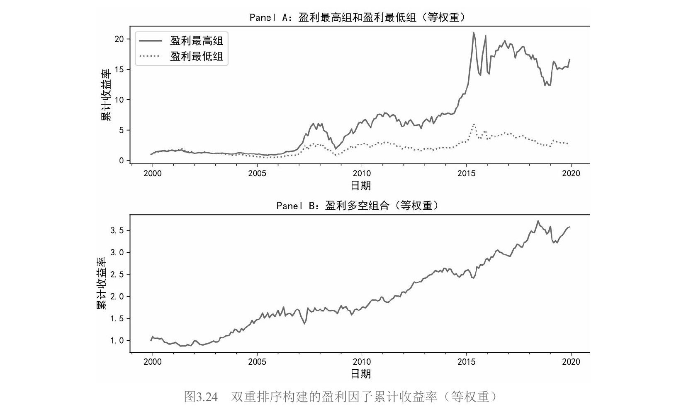

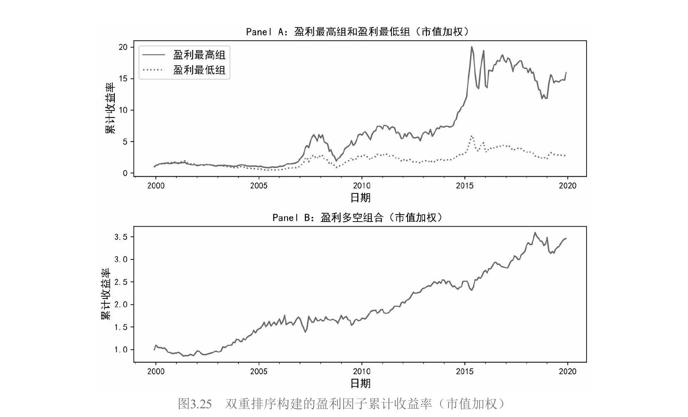

---

## 3.7 投资因子

投资因子是七个因子中最"水土不服"的——理论上应该显著，在A股却完全不显著，甚至一度出现和理论相反的结果。弄清原因比因子结论本身更有价值。

### 3.7.1 投资因子起源

**投资效应**：当期投资多的公司，未来预期收益更低。投资和预期收益负相关。

理论根基来自**$q$-理论**。公司最优投资行为要求投资的预期盈利现值等于投资的边际成本。均衡时：股票预期收益率 $= \frac{\text{盈利率}}{\text{投资的边际成本}}$。盈利率给定时，投资越高→分母越大→预期收益率越低。投资和盈利是 $q$-理论硬币的两面。

Fama and French (2015) 从DDM推导出类似结论，Hou et al. (2015) 从 $q$-理论出发。两个模型都将投资因子纳入。大部分研究采用**总资产增长率**作为投资的代理变量。

**A股方面，已有研究大多认为不存在显著的投资效应**（Guo et al. 2017; Qiao 2019; Liu et al. 2019）。

### 3.7.2 投资因子成因

- **$q$-理论和实物期权**：更多投资意味着用低风险资产替代实物期权，降低公司风险和预期收益。
- **规模报酬递减**：投资增加→资本边际产出下降→预期收益降低（Lyandres et al. 2008）。
- **经理人择时**：经理人在股票被高估时发行股票扩大投资，投资者未察觉，导致投资和未来收益负相关（Baker and Wurgler 2002）。
- **过度投资**：高投资公司投资净现值为负的项目，投资者反应不足，价值最终回归。

### 3.7.3 投资因子实证

变量：**总资产同比增长率**（基于年报数据）。

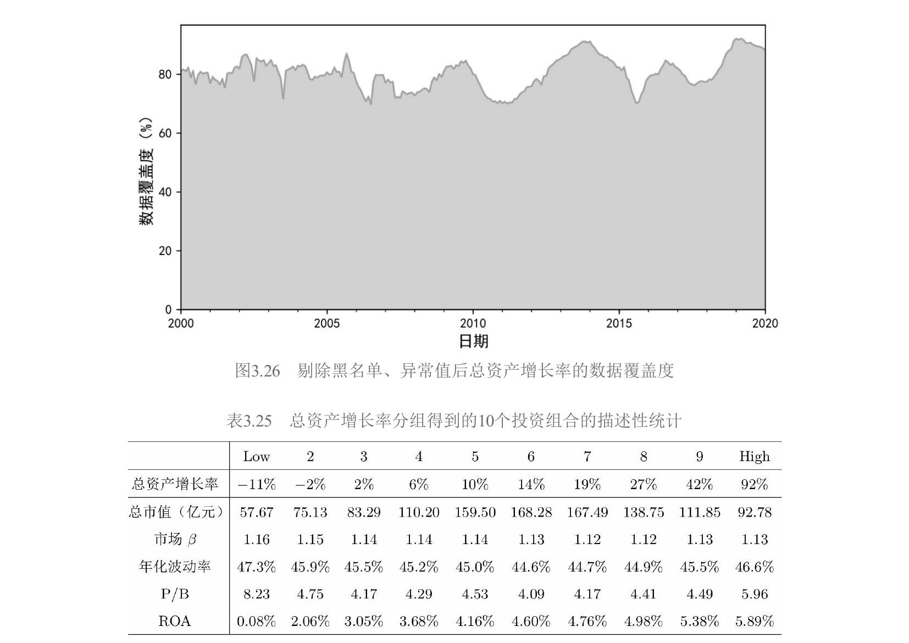

**描述性统计（表3.25）——发现盈利污染的线索**

| | Low | 2 | 3 | 4 | 5 | 6 | 7 | 8 | 9 | High |
|---|---|---|---|---|---|---|---|---|---|---|
| 总资产增长率 | −11% | −2% | 2% | 6% | 10% | 14% | 19% | 27% | 42% | 92% |
| 总市值（亿元） | 57.67 | 75.13 | 83.29 | 110.20 | 159.50 | 168.28 | 167.49 | 138.75 | 111.85 | 92.78 |
| ROA | 0.08% | 2.06% | 3.05% | 3.68% | 4.16% | 4.60% | 4.76% | 4.98% | 5.38% | 5.89% |

> **表3.25 总资产增长率分组得到的10个投资组合的描述性统计**

**ROA和总资产增长率强正相关**：低投资公司盈利差（ROA $0.08\%$），高投资公司盈利好（ROA $5.89\%$）。

会计学解释：总资产 $=$ 股东权益 $+$ 负债。不分红时，A股上市公司平均负债率稳定（约85%），总资产变化主要由利润决定。所以总资产增长率低→利润低→ROA低。

**这意味着低投资组在盈利因子上有负暴露，高投资组有正暴露。盈利因子的影响会"污染"投资因子。**

**单变量排序（表3.26）**

等权重Low–High月均 $-0.02\%$（$t = -0.11$），不显著且**符号为负**（低投资组收益低于高投资组，和理论方向相反）。市值加权同样不显著。

**和市值双重排序（表3.27）——结果更令人意外**

等权重下，**每个市值档内Low–High都是负的**。五组平均 $-0.22\%$（$t = -1.63$），方向持续为负。

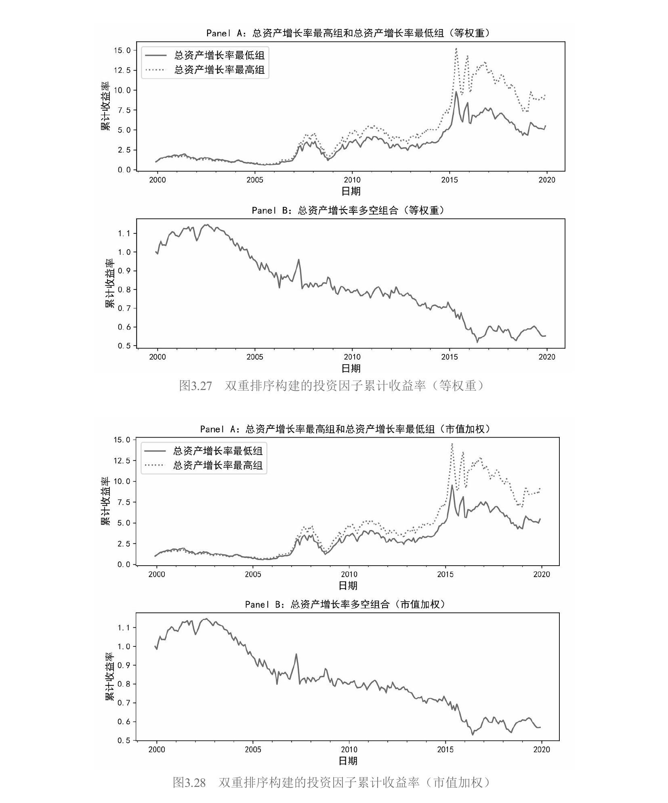

累计收益曲线几乎单边下行——投资因子的多空组合持续亏损。

**诊断与修正：用ROA条件双重排序剥离盈利污染**

先按ROA分5组（控制盈利水平），再在每组内按总资产增长率分5组。

**ROA和总资产增长率条件双重排序（表3.28）——等权重**

| ROA档 | Low–High月均 | $t$值 |
|---|---|---|
| ROA Low | 0.01% | 0.07 |
| 2 | 0.24% | 1.15 |
| 3 | 0.04% | 0.20 |
| 4 | −0.21% | −1.24 |
| ROA High | 0.06% | 0.29 |
| **五组平均** | **0.03%** | **0.19** |

**控制ROA后，投资因子收益率从之前的显著为负变成接近零。** Low–High不再系统性为负，有正有负围绕零波动。

**结论：投资因子在A股不显著，但不和理论矛盾。** 之前的负收益来自盈利因子的污染；控制盈利后回到零——不显著但方向不再为反。A股市场中总资产增长往往来自兼并收购（伴随股价上涨），可能也造成投资和收益正相关，抵消了理论预测的负相关。

**这一节最大的教训：因子之间不是独立的，实证中必须考虑因子间的交互作用。**

---

## 3.8 换手率因子

换手率因子是全章最亮眼的因子——$t$ 值超过6，显著性远超所有其他因子。它是A股的"特色因子"，尚未被纳入海外主流多因子模型。

### 3.8.1 换手率因子起源

**换手率**（成交量 / 流通股本）是标准化的成交量指标。学术界和业界的共识是：**换手率和预期收益负相关**——低换手率的股票未来收益更高，高换手率的反之。

Datar et al. (1998) 发现换手率有助于解释股票收益。Liu et al. (2019) 指出换手率对A股未来收益有显著负面影响，据此构建了**PMO因子（Pessimistic-Minus-Optimistic）**，纳入其A股四因子模型。

### 3.8.2 换手率因子成因

**换手率 $\neq$ 流动性**。Amihud (2002) 重新定义非流动性后，换手率不再适合作流动性代理变量。Subrahmanyam (2005) 认为换手率是**趋势能否延续的表征**。

**行为金融学解释**（最主要方向）：
- **过度自信和盲目乐观**：Odean (1998)、Statman et al. (2006) 指出换手率反映投资者非理性情绪。过度自信的投资者交易频繁，推高换手率，股票被高估，未来收益下降。
- **意见分歧**：Hong and Stein (2007) 认为高换手率意味着更大的意见分歧。在做空限制下，乐观者主导定价，股价被推高，未来收益降低。
- **套利限制**：Chou et al. (2013) 发现换手率异象和行为偏差、套利限制相关，且**高度持续**——组合形成后长达五年都能获得显著超额收益。

### 3.8.3 换手率因子实证

变量：**异常换手率** $=$ 过去21个交易日平均换手率 $/$ 过去252个交易日平均换手率（基于自由流通股本）。大于1说明近期比平时活跃，小于1说明近期比平时冷清。

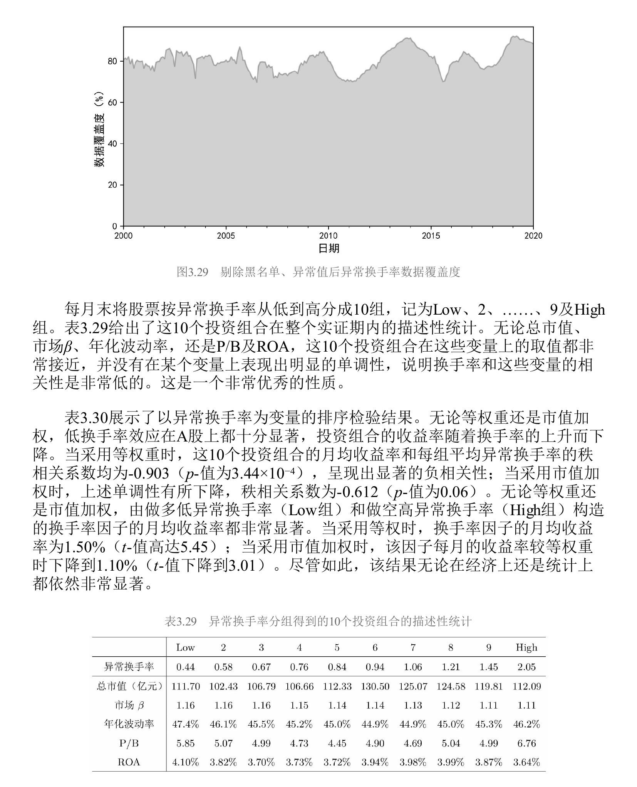

**描述性统计（表3.29）——一个非常优秀的性质**

| | Low | 2 | 3 | 4 | 5 | 6 | 7 | 8 | 9 | High |
|---|---|---|---|---|---|---|---|---|---|---|
| 异常换手率 | 0.44 | 0.58 | 0.67 | 0.76 | 0.84 | 0.94 | 1.06 | 1.21 | 1.45 | 2.05 |
| 总市值（亿元） | 111.70 | 102.43 | 106.79 | 106.66 | 112.33 | 130.50 | 125.07 | 124.58 | 119.81 | 112.09 |
| 市场 $\beta$ | 1.16 | 1.16 | 1.16 | 1.15 | 1.14 | 1.14 | 1.13 | 1.12 | 1.11 | 1.11 |
| 年化波动率 | 47.4% | 46.1% | 45.5% | 45.2% | 45.0% | 44.9% | 44.9% | 45.0% | 45.3% | 46.2% |
| P/B | 5.85 | 5.07 | 4.99 | 4.73 | 4.45 | 4.69 | 4.90 | 5.04 | 4.99 | 6.76 |
| ROA | 4.10% | 3.82% | 3.70% | 3.73% | 3.72% | 3.94% | 3.98% | 3.99% | 3.87% | 3.64% |

> **表3.29 异常换手率分组得到的10个投资组合的描述性统计**

**换手率和市值、$\beta$、波动率、P/B、ROA的相关性都非常低。** 分组后各维度无系统性差异。对比前面的因子（规模和盈利纠缠、投资受盈利污染），换手率几乎和所有常见变量正交——这是一个非常干净的因子。

**单变量排序（表3.30）**

| | Low | 2 | 3 | 4 | 5 | 6 | 7 | 8 | 9 | High | Low–High |
|---|---|---|---|---|---|---|---|---|---|---|---|
| 等权重 | 1.67 | 1.82 | 1.74 | 1.65 | 1.68 | 1.45 | 1.36 | 1.20 | 0.93 | 0.17 | **1.50** |
| $t$值 | (2.40) | (2.57) | (2.43) | (2.30) | (2.33) | (2.04) | (1.88) | (1.66) | (1.28) | (0.23) | **(5.45)** |
| 市值加权 | 1.09 | 1.34 | 1.33 | 1.15 | 1.04 | 1.39 | 1.18 | 0.83 | 0.80 | −0.01 | **1.10** |
| $t$值 | (1.83) | (2.06) | (2.07) | (1.69) | (1.64) | (2.18) | (1.78) | (1.17) | (1.17) | (−0.01) | **(3.01)** |

> **表3.30 异常换手率单变量排序月均收益率（%）**

等权重Low–High月均 $1.50\%$（$t = 5.45$），**全章最高的 $t$ 值**。市值加权 $1.10\%$（$t = 3.01$），同样非常显著。

**双重排序（表3.31）**

| 市值档 | Low–High月均（等权重） | $t$值 | Low–High月均（市值加权） | $t$值 |
|---|---|---|---|---|
| Small | 1.70% | **8.08** | 1.74% | **8.42** |
| 2 | 1.50% | 6.68 | 1.49% | 6.73 |
| 3 | 1.32% | 5.97 | 1.28% | 5.76 |
| 4 | 1.04% | 5.04 | 1.03% | 5.07 |
| Large | 0.62% | 2.23 | 0.45% | 1.50 |
| **五组平均** | **1.24%** | **6.67** | **1.20%** | **6.51** |

**低换手率效应在小市值中最强，随市值增大递减，但除大市值加权外所有档位都显著。** $t$ 值超过6，全章所有因子中最显著。

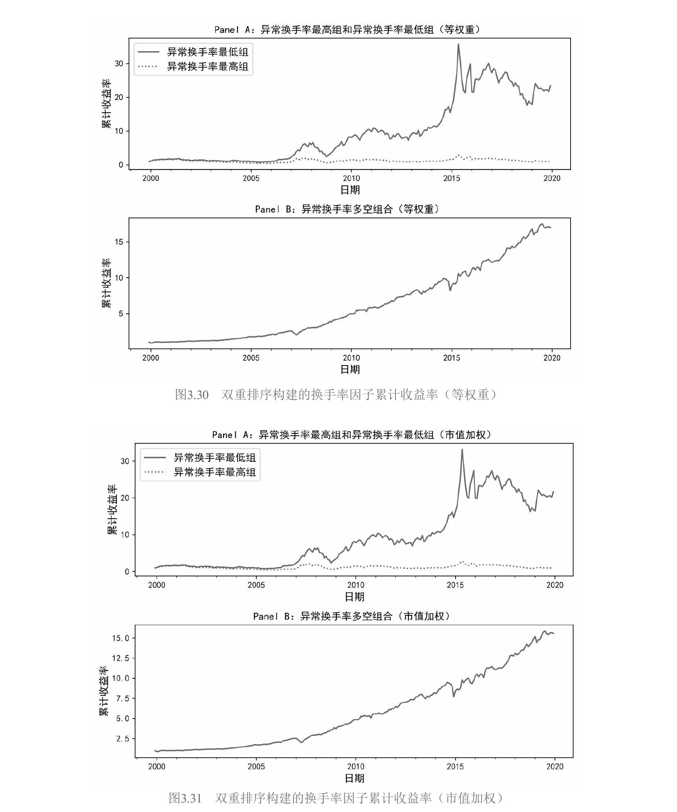

Panel B的累计收益率曲线**非常平顺**，几乎稳定上行无大幅回撤——极高的 $t$ 值意味着收益不仅高而且稳定。

**"泼一盆冷水"**

书中负责任地提醒三点：

1. 这仍是**纸面收益率**，未考虑交易费用。月度调仓意味着频繁换股。
2. **空头端贡献更大**——高换手率组收益极低甚至为负，空头"拉低"基准线放大了多空差。但实际中做空限制会使空头贡献大打折扣。
3. **多头端仍有实用价值**：低异常换手率组合年化夏普比率约0.65，市场组合仅0.40。虽然完美多空对冲难以实现，但可以**将投资组合有计划地暴露于低异常换手率因子上**，利用多头端跑赢市场。

---

## 全章总结

### A股2000–2019年七个因子实证结果一览

| 因子 | 排序变量 | 因子方向 | 双重排序 $t$ 值（等权重） | A股是否显著 |
|---|---|---|---|---|
| 市场 | 总市值加权组合 | — | — | 时序有解释力，CAPM被拒绝 |
| 规模 | 总市值 | Small–Big | 3.11（单变量） | 非常显著 |
| 价值 | BM | High–Low | 2.89 | 显著，小市值中最强 |
| 动量 | 过去11个月收益 | High–Low | 0.22 | **不显著** |
| 盈利 | ROE(TTM) | High–Low | 3.27 | 显著，需控制市值 |
| 投资 | 总资产增长率 | Low–High | 0.19 | **不显著** |
| 换手率 | 异常换手率 | Low–High | **6.67** | **极其显著** |

### 跨因子核心洞察

1. **规模和盈利的纠缠**：大市值公司盈利好，小市值公司盈利差。等权重时盈利因子被小市值效应掩盖，必须控制市值才能看到真实效果。

2. **BM和ROE的镜像对称**：BM在小市值中强、大市值中弱；ROE在小市值中弱、大市值中强。$EP = BM \times ROE$ 使得剔除小市值时EP看起来优于BM，但这只是数据处理的副产品。

3. **投资因子受盈利因子污染**：总资产增长率和ROA正相关，不控制盈利时投资因子出现反向结果，控制后回归零——不显著但不矛盾。

4. **换手率的独立性**：几乎和所有其他变量正交，是A股最干净、最显著的因子。

这些结论为第4章构建适合A股的多因子模型提供了完整的实证基础。
