# 第4章 多因子模型

## 引言

在CAPM（资本资产定价模型，Capital Asset Pricing Model）统治资产定价领域数十年后，学者们逐渐发现它无法解释市场中的很多现象。20世纪70年代起，Basu（1977）发现的盈利市值比（EP）效应、Banz（1981）发现的小市值效应等"异象"（anomaly）不断涌现。这些发现最终催生了多因子模型——认为股票的预期收益率不仅取决于对市场的暴露，还取决于对其他系统性风险因子的暴露。

本章分四个部分展开：首先综述七个学术界主流的多因子模型（4.1节），然后用Fama-MacBeth回归检验A股中哪些因子被定价（4.2节），接着通过一个A股实例演示如何比较多因子模型（4.3节），最后讨论模型的简约性原则（4.4节）。

---

## 4.1 主流多因子模型综述

自Fama and French（1993）提出第一个多因子模型以来，学术界对多因子模型的研究已近30年。表4.1（见下图）总结了当下主流的七个模型。

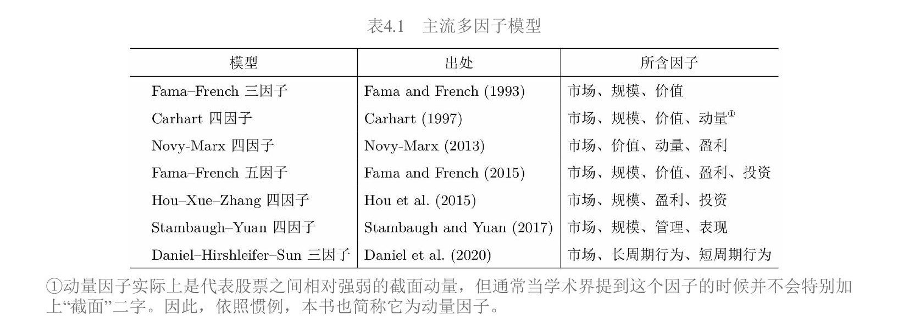

这七个模型可以按研究视角分为三类：

- **实证驱动型**：FF3、Carhart、Novy-Marx——先在数据中发现异象，再构建因子
- **理论推导型**：FF5（从DDM推导）、HXZ（从q-理论推导）——先有理论，再构建因子
- **行为金融型**：Stambaugh-Yuan、Daniel-Hirshleifer-Sun——从投资者的认知偏差和错误定价出发

下面逐一介绍。

---

### 4.1.1 Fama-French 三因子模型

#### 为什么需要多因子模型

在多因子模型出现之前，CAPM是资产定价的唯一范式。CAPM认为股票的预期收益率只取决于它对市场组合的暴露（即 $\beta$）。但从20世纪70年代起，学者陆续发现一些"异象"：按某种风格打包的股票组合能持续战胜市场。最重要的两个发现是Basu（1977）的盈利市值比（EP，Earnings-to-Price ratio，即每股盈利与每股价格之比）效应和Banz（1981）的小市值效应。

这些异象单独出现时还没有动摇CAPM。直到Fama and French（1992）整合了之前的多种异象，才彻底改变了人们的看法——人们再也无法忽视CAPM解释不了的其他系统性风险因子。

#### 三因子模型的表达式

Fama and French（1993）在CAPM的市场因子基础上，加入了价值因子HML（High-Minus-Low）和规模因子SMB（Small-Minus-Big），提出了三因子模型：

$$E[R_i] - R_f = \beta_{i,\text{MKT}}(E[R_M] - R_f) + \beta_{i,\text{SMB}}E[R_{\text{SMB}}] + \beta_{i,\text{HML}}E[R_{\text{HML}}]$$

其中：

- $E[R_i] - R_f$：股票 $i$ 的预期超额收益率
- $R_f$：无风险收益率
- $E[R_M] - R_f$：市场组合的预期超额收益率（市场因子）
- $E[R_{\text{SMB}}]$、$E[R_{\text{HML}}]$：规模因子和价值因子的预期收益率
- $\beta_{i,\text{MKT}}$、$\beta_{i,\text{SMB}}$、$\beta_{i,\text{HML}}$：股票 $i$ 在三个因子上的暴露（即敏感度、回归系数）

#### 因子的构建方法：$2\times3$ 双重排序

构建因子是理解多因子模型的关键。Fama and French使用BM（Book-to-Market ratio，账面市值比，即公司账面价值与市值之比）和市值两个公司指标，进行了 $2\times3$ 独立双重排序（图4.1）：

**第一步**，按市值分两组：以NYSE（纽约证券交易所）上市公司市值的中位数为界，将NYSE、NASDAQ（纳斯达克）及AMEX（美国证券交易所）的全部上市公司分成小市值组（Small, S）和大市值组（Big, B）。

**第二步**，按BM分三组：以NYSE上市公司BM的30%和70%分位数为界，将全部上市公司分成三组——High组（BM高于70%分位数）、Middle组（BM介于30%和70%之间）、Low组（BM低于30%分位数）。

两个维度交叉，得到 $2\times3=6$ 个投资组合：S/H、S/M、S/L、B/H、B/M、B/L。每个组合内部的股票按市值加权计算收益率。

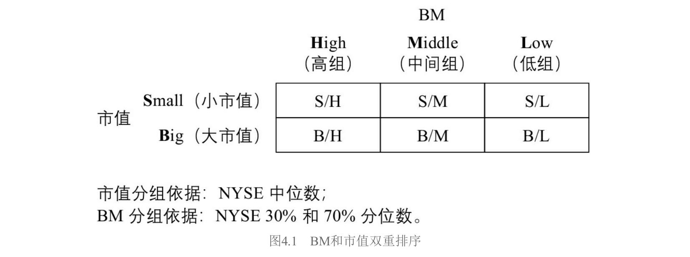

用这六个组合构建因子：

$$\text{SMB} = \frac{1}{3}(\text{S/H} + \text{S/M} + \text{S/L}) - \frac{1}{3}(\text{B/H} + \text{B/M} + \text{B/L})$$

$$\text{HML} = \frac{1}{2}(\text{S/H} + \text{B/H}) - \frac{1}{2}(\text{S/L} + \text{B/L})$$

SMB是三个小市值组合的等权平均减去三个大市值组合的等权平均：如果小公司比大公司收益高，SMB就是正的。HML是两个高BM组合的等权平均减去两个低BM组合的等权平均：如果"便宜"（高BM）公司比"贵"（低BM）公司收益高，HML就是正的。

**为什么要用双重排序？** 因为直接按单变量排序会导致因子之间"串味"。比如直接按BM排序，高BM组可能全是小公司，低BM组可能全是大公司，这样你就分不清收益差异到底来自价值还是规模。双重排序的妙处在于：构建HML时，多头和空头都同时包含大小市值的股票，从而在价值因子中"中性化"了规模的影响，反之亦然。

每年六月末，使用上一财年最新的财务数据对股票重新排序并再平衡。Fama-French三因子模型被提出后逐步取代CAPM成为资产定价的第一范式，而上述双重排序方法也成为后续模型竞相模仿的标准范式。

---

### 4.1.2 Carhart 四因子模型

#### 动机：三因子模型解释不了动量

Fama-French三因子模型虽然有足够的开创性，但有一个非常显著的异象它无法解释：截面动量异象（cross-sectional momentum）。

该异象由Jegadeesh and Titman（1993）发现。他们的做法是：在当前时点 $t$ 月，用 $t-12$ 到 $t-1$ 这11个月的总收益率对所有股票排序，买入过去涨得多的股票（赢家组合Winner），卖出过去跌得多的股票（输家组合Loser），发现这个多空组合能获得显著的超额收益。

为什么用11个月而不是12个月？因为市场在最近一个月存在短期反转现象（Jegadeesh 1990），为了不让短期反转干扰中期动量信号，特意跳过了最近一个月。

#### 模型表达式与因子构建

受此启发，Carhart（1997）在三因子模型上加入了截面动量因子MOM（Momentum），提出了Carhart四因子模型：

$$E[R_i] - R_f = \beta_{i,\text{MKT}}(E[R_M] - R_f) + \beta_{i,\text{SMB}}E[R_{\text{SMB}}] + \beta_{i,\text{HML}}E[R_{\text{HML}}] + \beta_{i,\text{MOM}}E[R_{\text{MOM}}]$$

动量因子的构建采用**单变量排序**：每月末按 $t-12$ 到 $t-1$ 这11个月的总收益率排序，做多排名前30%的赢家、做空排名后30%的输家。多空两头内的股票均采用**等权重**配置。

这是本章所有模型中唯一一个用单变量排序且等权重构造的因子，其他模型的风格因子几乎都采用双重排序加市值加权。动量因子需要每月再平衡（因为动量信号变化快），而三因子模型中的SMB和HML每年六月末再平衡一次。

---

### 4.1.3 Novy-Marx 四因子模型

#### 动机：盈利能力预测未来收益

Novy-Marx（2013）提出了一个关键发现：企业的盈利能力和未来预期收益密切相关。这催生了另一个四因子模型，包含市场、价值、动量和盈利四个因子：

$$E[R_i] - R_f = \beta_{i,\text{MKT}}(E[R_M] - R_f) + \beta_{i,\text{HML}}E[R_{\text{HML}}] + \beta_{i,\text{UMD}}E[R_{\text{UMD}}] + \beta_{i,\text{PMU}}E[R_{\text{PMU}}]$$

其中UMD（Up-Minus-Down）就是动量因子（和Carhart的MOM同义，命名不同），PMU（Profitable-Minus-Unprofitable）是盈利因子。

#### 为什么用毛利润衡量盈利能力

Novy-Marx认为应该用毛利润（Gross Profitability, GP）而非净利润来衡量盈利能力，理由有三：

1. 毛利润代表最真实的经济生产能力，是所有投入者（债权人和股东）共同努力的结果
2. 毛利润包含了研发和广告投入等费用，这些费用实际上有利于企业未来盈利，不应被减掉
3. 利润表越往下，受人为操纵的科目越多，数据越不可靠；毛利润相对干净

实证中，无论用排序法还是Fama-MacBeth回归，GP都表现出和BM同样强的预测能力，且优于净利润率和自由现金流率。

#### 盈利因子PMU的构建

构建方式追随Fama and French（1993），使用GP和市值进行 $2\times3$ 双重排序（图4.2）：以NYSE中上市公司GP的30%和70%分位数为界，将全部上市公司分为盈利（Profitable, P）、中性（Neutral, N）和不盈利（Unprofitable, U）三组，和市值高低交叉得到6个组合。

盈利因子为：

$$\text{PMU} = \frac{1}{2}(\text{S/P} + \text{B/P}) - \frac{1}{2}(\text{S/U} + \text{B/U})$$

Novy-Marx模型有两个独特之处。第一，在构建因子时进行了**行业中性处理**——做多一只股票的同时按同等权重做空该股票所属的行业指数，消除行业效应的干扰。第二，该模型中的动量因子也是通过 $2\times3$ 双重排序构建的（动量变量与市值交叉），和Carhart的单变量排序不同。

动量因子每月再平衡，价值和盈利因子每年六月末再平衡。

---

### 4.1.4 Fama-French 五因子模型

#### 动机：从理论推导因子

前面三个模型的因子选择多少带有"实证驱动"的色彩——先发现异象，再构建因子。Fama and French（2015）则试图从公司估值理论出发，推导出哪些因子应该存在。这是一个重要的范式转变。

#### 理论推导：从DDM出发

出发点是股利贴现模型（DDM, Dividend Discount Model）。利用Miller and Modigliani（1961）的结果，$t$ 时刻公司市值 $M_t$ 满足：

$$M_t = \sum_{\tau=1}^{\infty} E[Y_{t+\tau} - dB_{t+\tau}]/(1+r)^{\tau}$$

其中 $Y_{t+\tau}$ 是 $t+\tau$ 期的净利润，$dB_{t+\tau}$ 是账面价值的变化（代表投资），$r$ 是股票长期预期收益率。

两边除以账面价值 $B_t$：

$$\frac{M_t}{B_t} = \frac{\sum_{\tau=1}^{\infty} E[Y_{t+\tau} - dB_{t+\tau}]/(1+r)^{\tau}}{B_t}$$

从这个式子可以推出三个关系（每次固定其他变量不变，只看目标变量和 $r$ 的关系）：

1. **更高的 $B_t/M_t$（即更高的BM）对应更高的 $r$**。BM高意味着市场给公司的估值低，低估值对应高预期收益率。
2. **更高的 $Y_{t+\tau}$（预期盈利）对应更高的 $r$**。同等估值下，盈利能力越强的公司，预期收益率越高。
3. **更高的 $dB_{t+\tau}$（预期投资）对应更低的 $r$**。同等条件下，投资越多（扩张越激进）的公司，预期收益率越低。

后两点就是加入盈利因子和投资因子的理论基础。实证中用历史ROE（Return on Equity，净资产收益率）代替预期盈利，用过去一年总资产变化率代替预期投资，采用朴素估计（naïve estimate）。

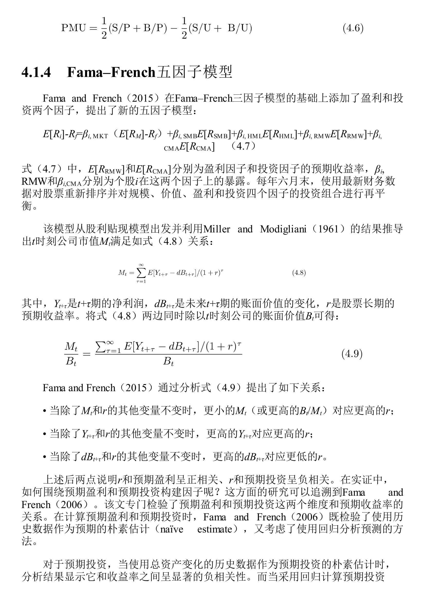

#### 模型表达式

$$E[R_i] - R_f = \beta_{i,\text{MKT}}(E[R_M] - R_f) + \beta_{i,\text{SMB}}E[R_{\text{SMB}}] + \beta_{i,\text{HML}}E[R_{\text{HML}}] + \beta_{i,\text{RMW}}E[R_{\text{RMW}}] + \beta_{i,\text{CMA}}E[R_{\text{CMA}}]$$

五个因子：市场、规模（SMB）、价值（HML）、盈利（RMW, Robust-Minus-Weak）、投资（CMA, Conservative-Minus-Aggressive）。

#### 盈利因子RMW和投资因子CMA的构建

分别使用ROE和总资产变化率与市值进行 $2\times3$ 双重排序（图4.3）。

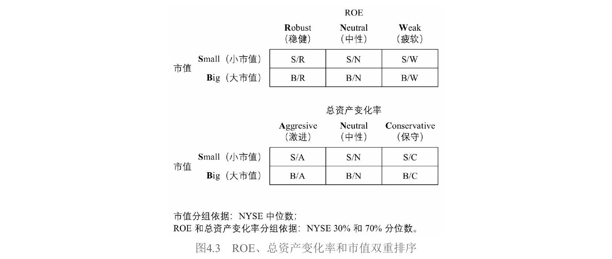

**盈利因子RMW**：以NYSE上市公司ROE的30%和70%分位数为界，分为稳健（Robust, R）、中性（Neutral, N）、疲软（Weak, W）三组。由于预期盈利和预期收益率**正相关**，做多高盈利、做空低盈利：

$$\text{RMW} = \frac{1}{2}(\text{S/R} + \text{B/R}) - \frac{1}{2}(\text{S/W} + \text{B/W})$$

**投资因子CMA**：以总资产变化率的30%和70%分位数为界，分为激进（Aggressive, A）、中性（Neutral, N）、保守（Conservative, C）三组。由于预期投资和预期收益率**负相关**，做多保守（投资少）、做空激进（投资多）：

$$\text{CMA} = \frac{1}{2}(\text{S/C} + \text{B/C}) - \frac{1}{2}(\text{S/A} + \text{B/A})$$

注意方向：CMA是Conservative Minus Aggressive。投资维度上"好"意味着保守而非激进。

#### 规模因子的新构建方式

在五因子模型中，BM、ROE、总资产变化率分别与市值做了三组双重排序，共得到18个组合。如果还只用BM那一组来构建SMB就不合理了。因此Fama and French（2015）综合三组：

$$\text{SMB} = \frac{1}{3}(\text{SMB}_{\text{BM}} + \text{SMB}_{\text{ROE}} + \text{SMB}_{\text{INV}})$$

其中每个子SMB的计算方式都和三因子模型中一样，只是来自不同的双重排序。

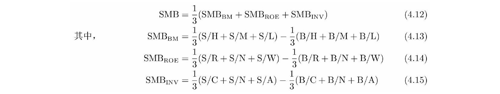

值得注意的是，按DDM推导，代表投资的变量应该是账面价值的变化 $dB_{t+\tau}$，而非总资产变化。Fama and French（2015）坦言他们比较了两种方法，发现用总资产变化率排序时截面收益差异更大，所以选了总资产。这是一个"理论说一套、实证做一套"的地方，后来被Hou et al.（2019b）批评过。

---

### 4.1.5 Hou-Xue-Zhang 四因子模型（q-因子模型）

#### 动机：从公司投资角度理解资产定价

传统资产定价理论从投资者最优证券组合角度出发，和公司变量没有直接关系。Hou et al.（2015）则开辟了一条全新路径：从**公司投资决策**的角度推导资产定价关系。因为实体投资经济学理论又称q-理论（q-theory），所以这个模型也叫q-因子模型。

#### 核心经济学原理：净现值原则

NPV原则（Net Present Value Rule）是公司金融学的基本原则：如果项目现值大于投资成本，就应该投资；否则不投资。

公司面临很多项目时，应优先投资折现率低、盈利率高（即现值最高）的项目。随着投资项目越来越多，投资成本慢慢增加，盈利率越来越低。最后一个被投资的项目应该是净现值恰好为零的：

$$\text{投资成本} = \text{项目现值} = \frac{\text{盈利率}}{\text{折现率}}$$

变形得到：$\text{折现率} = \text{盈利率} / \text{投资成本}$。由此得到两个条件预期结论：盈利率给定时，投资越多折现率越低，预期收益率越低；投资给定时，盈利率越高折现率越高，预期收益率越高。

#### 数学模型：两期公司投资决策

q-因子模型构建了一个两期模型（时刻0和1）。设公司 $i$ 在时刻0的资产为 $A_{i0}$，利润率为 $\Pi_{i0}$（已知）；时刻1的利润率 $\Pi_{i1}$ 是随机变量。决策变量是时刻0的投资额 $I_{i0}$。模型假设时刻0的资产在 $t=1$ 时全部折旧，因此 $A_{i1} = I_{i0}$。投资伴随一个调整费用 $\frac{a}{2}\left(\frac{I_{i0}}{A_{i0}}\right)^2 A_{i0}$。

公司最大化两期回报之和：

$$\max_{I_{i0}} \quad \Pi_{i0}A_{i0} - I_{i0} - \frac{a}{2}\left(\frac{I_{i0}}{A_{i0}}\right)^2 A_{i0} + E_0[M_1 \Pi_{i1} A_{i1}]$$

其中 $M_1$ 是随机折现因子（Stochastic Discount Factor, SDF）。对 $I_{i0}$ 求一阶条件：

$$1 + a\frac{I_{i0}}{A_{i0}} = E_0[M_1 \Pi_{i1}]$$

左边是投资的边际成本（1是直接成本，$a\frac{I_{i0}}{A_{i0}}$ 是边际调整费用），右边是边际效益的折现值。这正是NPV原则的数学表达。

由投资第一性原理（the first principle of investment），投资收益率 $r^I$ 满足 $E_0[M_1 r_{i1}^I] = 1$。比较两个式子并利用Cochrane（1991）和Liu et al.（2009）的结果（投资收益率等于股票收益率 $r^S$），最终得到：

$$E_0[r_{i1}^S] = \frac{E_0[\Pi_{i1}]}{1 + a(I_{i0}/A_{i0})}$$

这个公式非常漂亮。分子是预期盈利，分母中包含投资。预期盈利给定时，投资越大，收益率越低；投资给定时，盈利越高，收益率越高。

#### 与FF5的关键区别

虽然两个模型都包含投资因子，但理论基础不同。q-因子模型从实体投资理论推出收益率和**历史投资**（$I_{i0}/A_{i0}$ 是时刻0的，已经发生了）的关系，而FF5从DDM推出收益率和**预期投资**（$dB_{t+\tau}$ 是未来的）的关系。

#### 模型表达式与因子构建

$$E[R_i] - R_f = \beta_{i,\text{MKT}}(E[R_M] - R_f) + \beta_{i,\text{ME}}E[R_{\text{ME}}] + \beta_{i,\text{I/A}}E[R_{\text{I/A}}] + \beta_{i,\text{ROE}}E[R_{\text{ROE}}]$$

四个因子：市场、规模（ME）、投资（I/A）、盈利（ROE）。

该模型使用 $2\times3\times3$ **三重排序**——市值（NYSE中位数分S/B）、单季度ROE（NYSE 30%/70%分位数分H/M/L）、总资产变化率（NYSE 30%/70%分位数分H/M/L）——交叉得到 $2\times3\times3=18$ 个投资组合。用符号 $c_1/c_2/c_3$ 表示三个变量的分组交集，例如S/H/H表示小市值、高ROE、高总资产变化率。

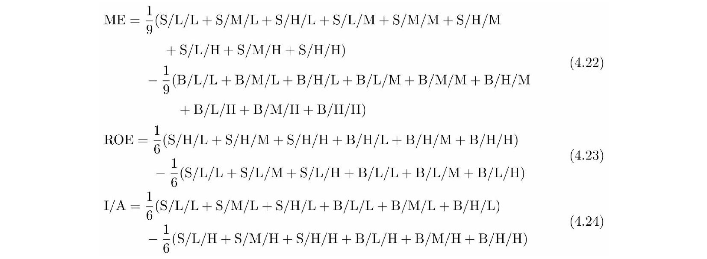

三个因子定义如下：

- **规模因子（ME）**：等权做多9个小市值组合 $\text{S}/c_2/c_3$，做空9个大市值组合 $\text{B}/c_2/c_3$
- **盈利因子（ROE）**：等权做多6个高ROE组合 $c_1/\text{H}/c_3$，做空6个低ROE组合 $c_1/\text{L}/c_3$
- **投资因子（I/A）**：等权做多6个低总资产变化率组合 $c_1/c_2/\text{L}$，做空6个高总资产变化率组合 $c_1/c_2/\text{H}$

注意投资因子的方向：做多低投资（L），做空高投资（H），因为低投资对应高收益率。

再平衡频率方面，规模和投资因子的排序变量每年六月末更新，而盈利因子（单季度ROE）**每月末更新**，但所有因子的投资组合均是月度再平衡。

---

### 4.1.6 Stambaugh-Yuan 四因子模型

#### 动机：从错误定价中寻找因子

前面的模型本质上都在讲"风险"——承担了某种系统性风险，所以获得风险溢价。Stambaugh and Yuan（2017）则从行为金融学出发，认为大量异象和因子的本质是**错误定价**（mispricing）：投资者的有限理性和认知偏差导致股票价格偏离内在价值。被高估的资产未来收益低，被低估的资产未来收益高。

#### 模型表达式

$$E[R_i] - R_f = \beta_{i,\text{MKT}}(E[R_M] - R_f) + \beta_{i,\text{SMB}}E[R_{\text{SMB}}] + \beta_{i,\text{MGMT}}E[R_{\text{MGMT}}] + \beta_{i,\text{PERF}}E[R_{\text{PERF}}]$$

四个因子：市场、规模、管理因子（MGMT）、表现因子（PERF）。

#### 构建错误定价指标：11个异象

构建管理和表现因子的第一步，是找到衡量股票是否被高估或低估的指标。Stambaugh and Yuan选择了11个Fama-French三因子模型无法解释的异象（表4.2），背后逻辑是：异象的超额收益反映了个股中三因子模型无法解释的部分，也就是错误定价。

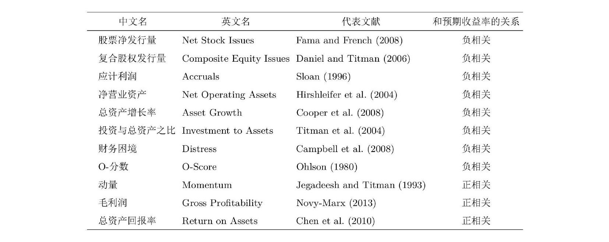

这11个异象根据相关性被分成两组：

- **管理组（6个）**：股票净发行量、复合股权发行量、应计利润、净营业资产、总资产增长率、投资与总资产之比——均与上市公司的管理决策相关
- **表现组（5个）**：财务困境、O-分数、动量、毛利率、总资产回报率——均与上市公司的经营表现相关

#### 排序逻辑：从异象到综合排名

每月末，对每个异象变量在截面上给股票排序。排序方向的关键是让被高估的股票排在前面：如果异象变量和收益率负相关（如应计利润），则按变量从高到低排序；如果正相关（如动量），则从低到高排序。

每只股票在11个异象上各有一个排名。分别在管理组内取6个排名的平均、在表现组内取5个排名的平均，得到综合排名。综合排名越高越可能被高估（未来收益低），越低越可能被低估（未来收益高）。取多个排名的平均是为了消除单一异象变量的噪声。

#### 因子构建与传统做法的差异

有了综合排名后，分别用管理变量和表现变量与市值进行 $2\times3$ 双重排序（图4.4）。

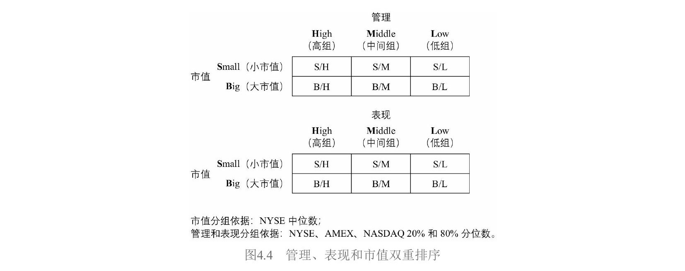

Stambaugh and Yuan（2017）的做法和学术界惯例有两点不同：（1）管理和表现变量的划分用全部股票的分位数而非仅NYSE的分位数；（2）阈值用20%/80%分位数而非传统的30%/70%。这两个非标准选择后来被Hou et al.（2019b）质疑，复现发现因子对构造方式十分敏感。

以管理因子为例，低组代表被低估、高组代表被高估，因此做多低组、做空高组：

$$\text{MGMT} = \frac{1}{2}(\text{S/L} + \text{B/L}) - \frac{1}{2}(\text{S/H} + \text{B/H})$$

表现因子同理：

$$\text{PERF} = \frac{1}{2}(\text{S/L} + \text{B/L}) - \frac{1}{2}(\text{S/H} + \text{B/H})$$

#### 规模因子的特殊构建

Stambaugh-Yuan模型的规模因子与其他模型差异最大。分别用管理和表现两个变量与市值双重排序共得到12个组合，但构建规模因子时**丢掉了高组和低组共8个组合**，只保留4个中间组：

$$\text{SMB} = \frac{1}{2}(\text{S/M}_{\text{MGMT}} + \text{S/M}_{\text{PERF}}) - \frac{1}{2}(\text{B/M}_{\text{MGMT}} + \text{B/M}_{\text{PERF}})$$

理由是：由于套利不对称性（做空困难），被高估股票的错误定价难以消除，且错误定价在小市值股票中更突出。传统方法无法在规模因子的多空两头对称地消除错误定价的影响，造成规模因子有被高估的偏差。实证表明这种新方法构建的规模因子有更高的风险溢价。

---

### 4.1.7 Daniel-Hirshleifer-Sun 三因子模型

#### 动机：区分长短时间尺度的错误定价

Daniel et al.（2020）的核心观察是：市场上的异象可按时间尺度分成两大类。**长时间尺度的异象**（大于1年，通常3到5年）主要来自投资者的**过度自信**（overconfidence）；**短时间尺度的异象**（小于1年）主要来自投资者的**有限注意力**（limited attention）。因此他们提出两个行为因子分别捕捉这两类错误定价。

#### 模型表达式

$$E[R_i] - R_f = \beta_{i,\text{MKT}}(E[R_M] - R_f) + \beta_{i,\text{FIN}}E[R_{\text{FIN}}] + \beta_{i,\text{PEAD}}E[R_{\text{PEAD}}]$$

三个因子：市场、FIN（长周期行为因子）、PEAD（短周期行为因子）。

#### FIN因子：捕捉过度自信

FIN因子利用上市公司的增发和回购行为来构建。逻辑链条是：（1）管理层具备信息优势，股价被高估时倾向增发、被低估时倾向回购；（2）普通投资者过度自信，对增发/回购行为反应不足，股价短期不会修正；（3）因此增发和未来收益率负相关，回购和未来收益率正相关。

FIN因子使用两个指标：过去五年的复合股权发行量（CSI, Composite Share Issuance）和过去一年的股票净发行量（NSI, Net Share Issuance）。

CSI的处理较简单，以NYSE上市公司CSI的20%和80%分位数分为低/中/高三档。NSI的处理则非常复杂（图4.5）：由于年与年之间增发和回购公司数量不平衡，作者先将股票分为净回购和净发行两大类，分别在各自内部排序，然后将净回购中的高组作为NSI的低组（回购多=被低估），将净发行中的高组作为NSI的高组。

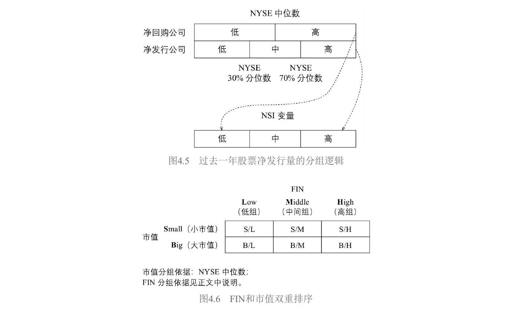

最终，在CSI和NSI上都属于高组的股票归入FIN的高组（被高估），都属于低组的归入FIN的低组（被低估），其余归入中间组。用FIN和市值进行 $2\times3$ 双重排序（图4.6）：

$$\text{FIN} = \frac{1}{2}(\text{S/L} + \text{B/L}) - \frac{1}{2}(\text{S/H} + \text{B/H})$$

FIN因子变化缓慢（增发和回购有合规要求，不可能频繁进行），每年六月更新，只能解释长时间尺度（3到5年）的异象。

#### PEAD因子：捕捉有限注意力

PEAD（Post-Earnings-Announcement-Drift）即盈余惯性。大量实证显示，业绩超预期公司的股票在未来6到9个月内能获得更高收益，因为投资者的有限注意力导致对最新业绩数据反应不足。

Daniel et al.（2020）以上市公司最近一个财报的披露日期为时间零点，计算 $[-2, 1]$ 窗口内（即披露前两个交易日到披露后一个交易日）的累计超额收益率（CAR, Cumulative Abnormal Return）：

$$\text{CAR}_i = \sum_{d=-2}^{1}(R_{id} - R_{Md})$$

其中 $R_{id}$ 是公司 $i$ 在第 $d$ 日的收益率，$R_{Md}$ 是同期市场收益率。CAR越大说明业绩超预期越多。由于投资者反应不足，CAR和未来收益率正相关。

用CAR和市值进行 $2\times3$ 双重排序（图4.7），CAR用NYSE的20%/80%分位数：

$$\text{PEAD} = \frac{1}{2}(\text{S/H} + \text{B/H}) - \frac{1}{2}(\text{S/L} + \text{B/L})$$

做多高CAR（业绩超预期），做空低CAR。PEAD因子每月更新。

#### 因子构建的共同惯例

书中在此特别强调了一个贯穿所有模型的惯例：每个投资组合**内部**的股票按**市值加权**；因子的多头和空头由多个投资组合构成时，不同投资组合**之间**是**等权重**。唯一的例外是Carhart四因子模型的动量因子（单变量排序，多空两头均等权重）。

#### 4.1节小结

| 模型 | 视角 | 因子数 | 核心新增因子 |
|---|---|---|---|
| FF3（1993） | 实证 | 3 | 规模 + 价值 |
| Carhart（1997） | 实证 | 4 | + 动量 |
| Novy-Marx（2013） | 实证 | 4 | + 盈利（毛利润） |
| FF5（2015） | DDM理论 | 5 | + 盈利（ROE）+ 投资 |
| HXZ q-因子（2015） | 投资q-理论 | 4 | 投资 + 盈利（理论推导） |
| Stambaugh-Yuan（2017） | 行为金融（错误定价） | 4 | 管理 + 表现 |
| DHS（2020） | 行为金融（认知偏差） | 3 | FIN + PEAD |

---

## 4.2 A股中被定价的因子

第3章用排序法检验了各因子在A股的表现，发现规模、价值等因子都是显著的。但排序法有一个固有缺陷：无法完全剔除因子之间的相互影响。比如按BM排序构建价值因子，高BM组可能同时偏向小市值、低换手率，这些"串味"会污染结果。

Fama-MacBeth回归能规避这个问题。回归可以同时放入多个解释变量，每个变量的系数反映的是**控制了其他变量之后**该因子的边际贡献。

### 4.2.1 实证设定

几个关键设定：

**因子暴露的选择**：除市场因子外，直接用公司特征的实际取值作为因子暴露。对市值取对数（log市值）来削弱右偏分布的影响。市场因子用滚动252个交易日窗口的时序回归计算个股 $\beta$。

**回归流程**：每个月 $t$，用当期公司特征作为解释变量（$x$），用个股 $t+1$ 月的收益率作为被解释变量（$y$），做一次截面回归。每个月得到一组因子收益率（即回归系数），最后对所有月份的系数取平均，用Newey-West调整后的 $t$ 值检验显著性。

**额外设定**：（1）回归中加入截距项，控制模型设定偏误；（2）因子暴露只做了剔除异常值处理，没有标准化——这意味着不同因子的收益率绝对值不直接可比，后面用"影响系数"解决。

### 4.2.2 回归结果

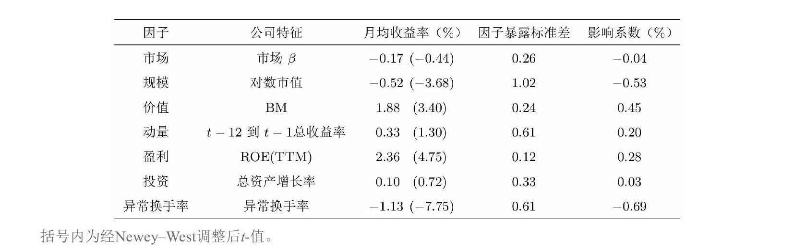

#### 显著被定价的因子（4个）

**规模因子**：月均收益率 $-0.52\%$，$t$ 值 $-3.68$。负号意味着市值越大收益率越低，即小市值效应。

**价值因子**：月均收益率 $1.88\%$，$t$ 值 $3.40$。BM越高的公司收益率越高，价值效应显著。

**盈利因子**：月均收益率 $2.36\%$，$t$ 值 $4.75$。ROE(TTM)越高收益率越高。收益率看着很高，但ROE截面标准差很小（0.12），用影响系数校正后就合理了。

**换手率因子**：月均收益率 $-1.13\%$，$t$ 值 $-7.75$。换手率越高收益率越低，即低换手率效应。$t$ 值绝对值在所有因子中最高。

#### 不显著的因子（3个）

**市场因子**：月均收益率 $-0.17\%$，$t$ 值 $-0.44$，不显著。与Black CAPM模型一致。

**动量因子**：月均收益率 $0.33\%$，$t$ 值 $1.30$，不显著。动量在A股不如美股有效。

**投资因子**：月均收益率 $0.10\%$，$t$ 值 $0.72$，非常不显著。且收益率为正（总资产增长率高的公司收益率反而更高），和理论预测的负相关方向相反。

#### 影响系数：不同因子的可比性

由于没有标准化，收益率的绝对大小受因子暴露标准差的影响。Bali et al.（2016）提出的**影响系数**（impact coefficient）解决了这个问题：

$$\text{影响系数} = \text{因子月均收益率} \times \text{因子暴露标准差}$$

含义：当其他条件不变，资产在该因子上的暴露增加一个标准差时，预期收益率的变化。

| 因子 | 月均收益率 | 暴露标准差 | 影响系数 |
|---|---|---|---|
| 换手率 | $-1.13\%$ | 0.61 | $-0.69\%$ |
| 规模 | $-0.52\%$ | 1.02 | $-0.53\%$ |
| 价值 | $1.88\%$ | 0.24 | $0.45\%$ |
| 盈利 | $2.36\%$ | 0.12 | $0.28\%$ |

换手率和规模的影响系数最大，价值紧随其后。盈利因子影响系数虽然最小，但标准误极低，$t$ 值反而最高（4.75），说明它"影响力"不大但极其稳定。

**结论**：A股市场中真正被定价的因子是**规模、价值、盈利和换手率**。在实际因子投资中，可以从这四个维度构建因子。

---

## 4.3 多因子模型比较：来自A股的例子

本节通过一个A股实例，演示如何用 $\alpha$ 检验和GRS检验（Gibbons-Ross-Shanken检验）比较两个多因子模型。重点在方法论的应用，而非在两个模型中判出绝对高低。

### 4.3.1 两个模型

#### 第一个模型：Liu et al.（2019）三因子模型

这是专门针对A股市场提出的模型，发表在Journal of Financial Economics上，包含市场、规模和价值三个因子，做了两个针对A股的特殊处理：

**处理一：剔除壳价值污染。** 由于A股IPO发审制度不健全，优秀企业上市成本高、时间长，一些企业选择通过收购市值极低的上市公司来借壳上市。A股中市值最小的一批股票具有很高的"壳价值"，收益率由壳价值驱动而非基本面。Liu et al.（2019）直接**剔除市值最低的30%的股票**。

**处理二：用EP替代BM构建价值因子。** 在他们的实证中，EP比BM更能解释A股收益率的截面差异。

对于第二个处理，书中提出了质疑。关键在于恒等关系 $\text{EP} = \text{BM} \times \text{ROE}$。回顾第3章：BM在小市值中作用强、在大市值中弱；ROE在大市值中显著、在小市值中不显著。当剔除了市值最低的30%后，剩下的偏大市值股票使BM效果变差、ROE和EP效果变好。EP胜出可能只是剔除小市值股票的副产品。

其他学者的研究也佐证了这一点。Cakici et al.（2017）和Hsu et al.（2018）在不同区间发现BM优于EP；Qiao（2019）发现EP只有在剔除小市值后才显著；MSCI的报告（Rao and Gupta 2019）显示前十年BM胜出、后十年EP胜出。可见两者各有千秋。

#### 第二个模型：Liu et al.（2019）四因子模型

Liu et al.（2019）自己也认识到单用EP替代BM在理论上不够合理。他们从DDM出发分析，认为BM和ROE对收益率的作用不应该被单一的EP合并替代。因此主张仍然使用BM构建价值因子，额外加入ROE构建盈利因子，得到包含市场、规模、价值（BM）、盈利（ROE）的四因子模型。

### 4.3.2 BM、ROE与预期收益：理论基础

从单期预期收益率的定义出发：

$$M_t = \frac{E_t[D_{t+1}] + E_t[M_{t+1}]}{1 + E_t[r_{t+1}]}$$

由净盈余关系（clean surplus relation），分红等于利润减去账面价值变动：$D_{t+1} = Y_{t+1} - dB_{t+1}$。代入并两边除以 $B_t$：

$$\frac{M_t}{B_t} = \frac{E_t\left[\frac{Y_{t+1}}{B_t}\right] - E_t\left[\frac{dB_{t+1}}{B_t}\right] + E_t\left[\frac{M_{t+1}}{B_t}\right]}{1 + E_t[r_{t+1}]}$$

由此推出：

1. **BM与预期收益率正相关**：固定其他变量，更高的 $B_t/M_t$ 对应更高的 $E_t[r_{t+1}]$
2. **ROE与预期收益率正相关**：固定其他变量，更高的 $E_t[Y_{t+1}/B_t]$（预期ROE）对应更高的 $E_t[r_{t+1}]$

既然BM和ROE都独立地和预期收益率正相关，那仅用 $\text{EP} = \text{BM} \times \text{ROE}$ 来替代两者就存在两个问题：（1）Penman and Reggiani（2018）表明应同时考虑BM、EP、ROE中的至少两个，只用一个会丢失信息；（2）EP和ROE正相关，用EP构造的价值因子在盈利维度上有不可避免的暴露，不够纯粹。

### 4.3.3 模型比较的实证结果

#### 因子构建

三因子模型用市值和EP进行 $2\times3$ 双重排序：

$$\text{CHN-SMB} = \frac{1}{3}(\text{S/V} + \text{S/M} + \text{S/G}) - \frac{1}{3}(\text{B/V} + \text{B/M} + \text{B/G})$$

$$\text{CHN-VMG} = \frac{1}{2}(\text{S/V} + \text{B/V}) - \frac{1}{2}(\text{S/G} + \text{B/G})$$

其中V代表Value（高EP），G代表Growth（低EP），前缀CHN来自原文标题"Size and value in China"。

四因子模型分别用BM和ROE(TTM)与市值进行 $2\times3$ 双重排序：

$$\text{LSL-HML} = \frac{1}{2}(\text{S/H} + \text{B/H}) - \frac{1}{2}(\text{S/L} + \text{B/L})$$

$$\text{LSL-RMW} = \frac{1}{2}(\text{S/R} + \text{B/R}) - \frac{1}{2}(\text{S/W} + \text{B/W})$$

$$\text{LSL-SMB} = \frac{1}{2}(\text{SMB}_{\text{BM}} + \text{SMB}_{\text{ROE}})$$

前缀LSL是三位作者姓氏首字母。

#### 因子收益率和相关性分析

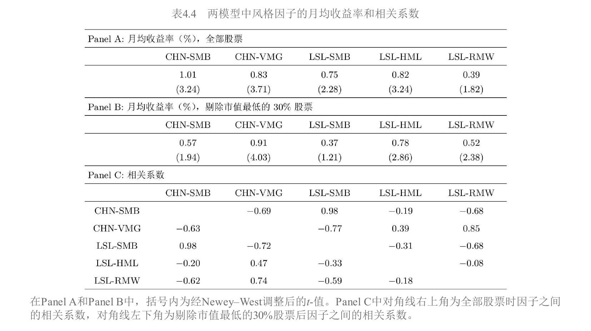

表4.4揭示了三个重要发现：

**发现一**：两个规模因子高度相关（相关系数0.98），但LSL-SMB的月均收益率低于CHN-SMB。剔除市值最低的30%后，两个规模因子都不再显著。

**发现二**：**CHN-VMG（EP构建的价值因子）和LSL-RMW（ROE构建的盈利因子）高度相关**，相关系数高达0.85（全部股票），剔除小市值后仍有0.74。这完美印证了 $\text{EP} = \text{BM} \times \text{ROE}$，说明EP构建的价值因子在盈利维度上有很高的暴露，不够纯粹。相比之下，BM构建的LSL-HML和盈利因子的相关系数只有 $-0.08$。

**发现三**：盈利因子LSL-RMW在全部股票中不显著（$t$ 值1.82），剔除小市值后变显著（$t$ 值2.38），和3.6节的结论一致。

#### $\alpha$ 检验

选择10个异象作为测试资产（表4.5），用每个异象构建多空组合，看这个组合的收益率能否被给定的多因子模型完全解释。如果时序回归的截距 $\alpha$ 显著不为零，说明该异象有模型无法解释的超额收益。

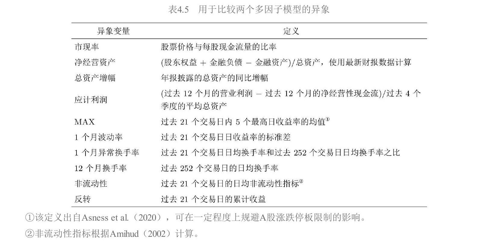

**整个实证期一次回归的结果**（表4.6）：

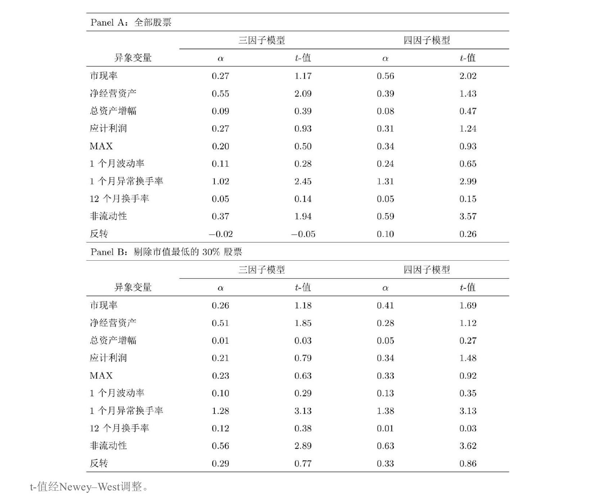

以 $|t|<2.0$ 为标准：三因子模型无法解释2个异象（净经营资产、1个月异常换手率），四因子模型无法解释3个异象（市现率、1个月异常换手率、非流动性）。以 $|t|<3.0$ 为标准：三因子模型能解释全部异象，四因子模型无法解释1个（非流动性）。

**汇总指标**（表4.7）：使用四个评价指标——平均 $|\alpha|$、平均 $|t|$、$|t|\geq2$ 的异象个数、$|t|\geq3$ 的异象个数——无论哪个指标，三因子模型都不差于四因子模型。

**滚动60月窗口的稳健性检验**（表4.8、表4.9）：

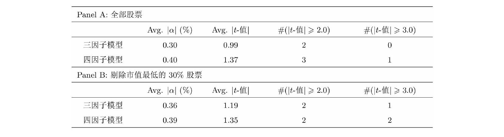

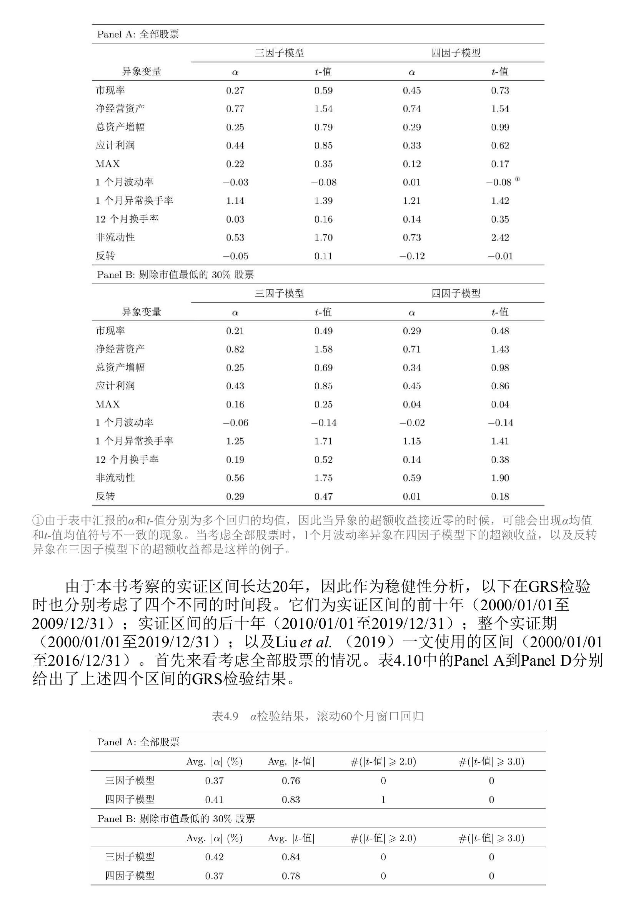

三因子模型能解释全部异象。但有意思的是，剔除小市值后四因子模型反而表现更好——结论对方法选择敏感。

#### GRS检验

GRS检验的思路不同于 $\alpha$ 检验：让两个模型的风格因子互为模型和测试资产，看一个模型的因子能否被另一个模型的因子完全解释。

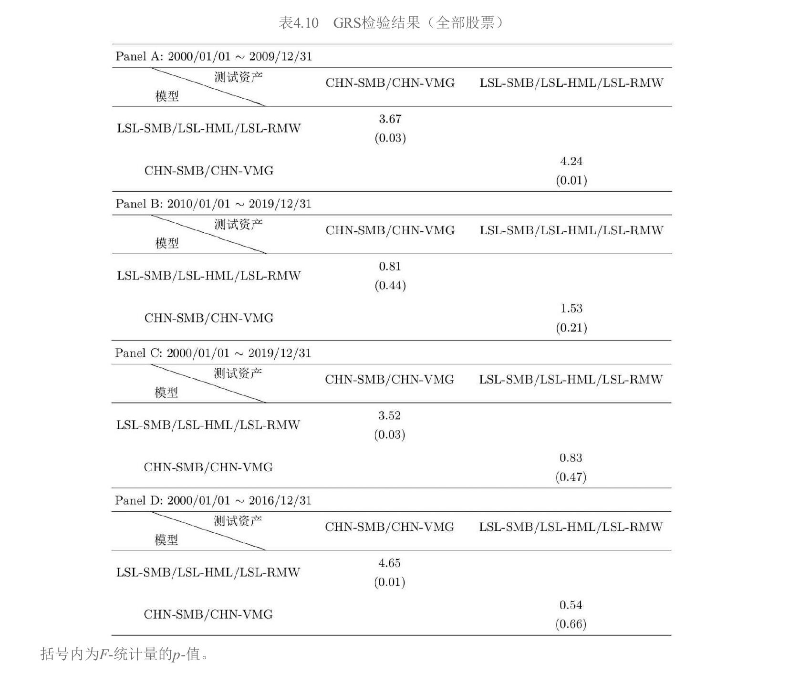

关键结果：

| 区间 | LSL因子解释CHN因子 | CHN因子解释LSL因子 |
|---|---|---|
| 前十年（2000-2009） | $F=3.67, p=0.03$，不能 | $F=4.24, p=0.01$，不能 |
| 后十年（2010-2019） | $F=0.81, p=0.44$，能 | $F=1.53, p=0.21$，能 |
| 整个区间（2000-2019） | $F=3.52, p=0.03$，不能 | $F=0.83, p=0.47$，能 |

前十年两个模型互相无法解释。后十年可以互相解释。整个区间来看，CHN的因子能解释LSL的因子，但反过来不行。

#### 为什么CHN-VMG（EP构建的价值因子）能一直显著？

这是本节最精彩的分析。表4.11展示了前后十年各因子的表现：

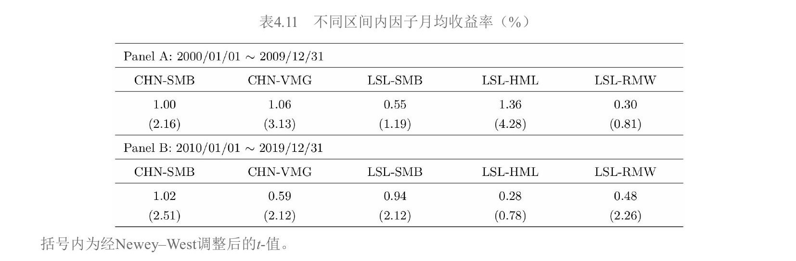

关键观察：

- 前十年，BM构建的价值因子LSL-HML非常显著（$t=4.28$），但盈利因子LSL-RMW不显著（$t=0.81$）
- 后十年完全反转：LSL-HML不再显著（$t=0.78$），LSL-RMW变显著（$t=2.26$）
- 四因子模型的三个风格因子在前后十年里总是"断了至少一条腿"

反观CHN-VMG在前后十年都显著。答案在图4.8中：

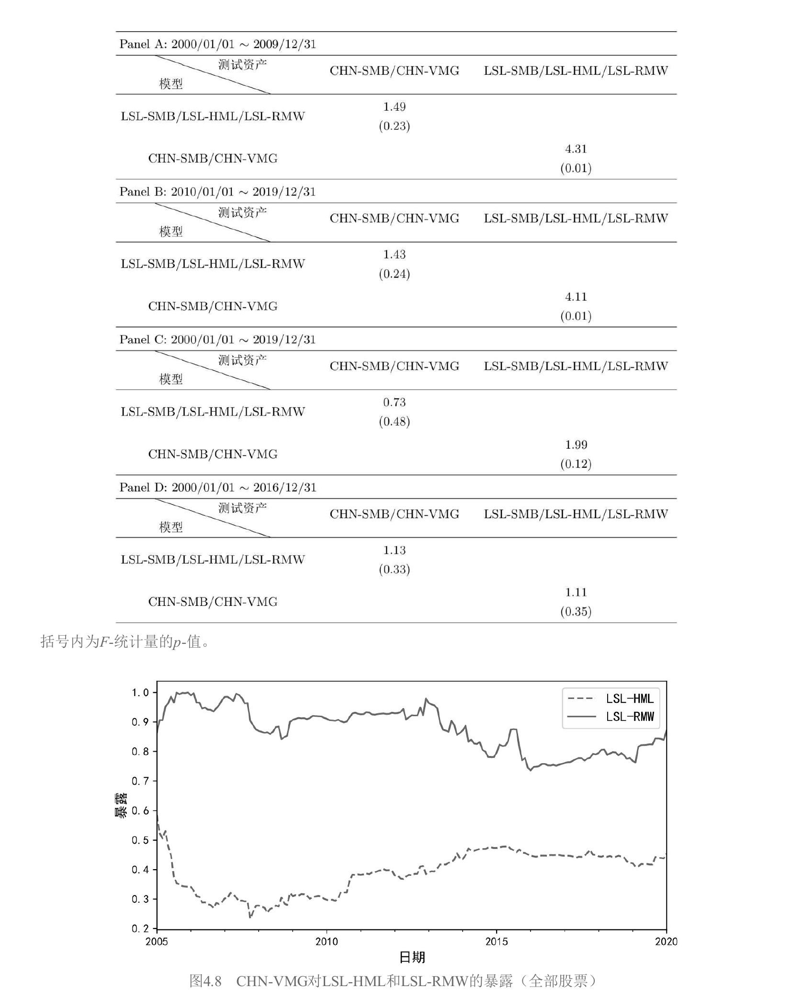

通过滚动60月回归估计CHN-VMG在LSL-HML和LSL-RMW上的暴露，可以看到CHN-VMG在这两个因子上都有**非常稳定且较大的暴露**。前十年LSL-HML表现好，CHN-VMG通过对价值的暴露受益；后十年LSL-RMW变显著，CHN-VMG通过对盈利的暴露受益。得益于 $\text{EP} = \text{BM} \times \text{ROE}$，CHN-VMG始终同时反映价值和盈利两方面的风险溢价。

#### 本节的两个核心启示

1. **数据窥探风险**：不同的实证窗口会出现不同的结果，人们会有意或无意地选择有利于自己结论的区间。前后十年结论的反转就是最好的例子。
2. **理论比实证更重要**：与在数据中比较谁更能解释谁相比，每个因子背后的经济学/金融学含义是否清晰合理重要得多。这也是Fama and French（2018）反复强调的观点。

---

## 4.4 多因子模型的简约性

#### 核心问题：模型越复杂越好吗？

从数学上来说，如果仅以"能否解释异象"来评判多因子模型，那么随着加入越来越多的因子，模型一定能在样本内解释越来越多的异象。但本章介绍的七个模型的因子个数均在3到5个之间，非常克制。这背后遵循的就是**简约性原则**（The Law of Parsimony）。

虽然因子个数差异不大，但构建因子所用到的变量个数差异很大。更多的变量意味着更高的复杂度，也可能意味着更大的过拟合风险。

#### 两个简约指数

Daniel et al.（2020）的作者之一Lin Sun提出了两个指数来量化模型复杂度。

**简约指数I**——惩罚变量的重复使用：

$$\text{简约指数I} = 0 - \text{模型中所有因子用到的全部变量之和}$$

取值为负，越接近零越简单。如果一个变量被用于多个因子，每次都计算。以FF3为例：市场因子不需变量（0），规模和价值因子各用了市值和BM（各2个），但市值和BM同时用于两个因子所以各计两次，简约指数I $= 0-0-2-2 = -4$。Stambaugh-Yuan四因子模型的简约指数I为 $0-0-12-7-6 = -25$。

**简约指数II**——变量只计一次：

$$\text{简约指数II} = 0 - \text{因子个数} - \text{不同变量个数}$$

FF3：3个因子 + 2个变量 = $-5$。Stambaugh-Yuan：4个因子 + 12个变量 = $-16$。

#### 复杂度与解释力的关系

Lin Sun用CAPM和七个模型检验了34个异象。图4.9绘制了简约指数和0.05显著性水平下异象个数的关系：

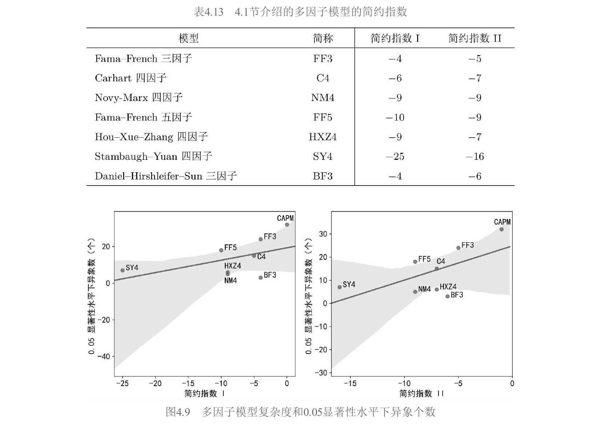

结论非常清晰：随着模型复杂度提升（简约指数更小），能解释的异象越多（显著异象个数越少）。CAPM最简单但解释力最差，SY4最复杂但解释力最强。

#### 启示

1. 不同因子模型之间的解释力差异并无定论——总能通过增加复杂度来提升样本内的解释效果
2. 需要在模型复杂度和解释力之间做取舍，类似机器学习中的bias-variance tradeoff
3. 在简约法则的指导下，优秀的多因子模型应满足三个条件：因子个数较少、构建因子所需变量不多、每个因子背后都有清晰的经济学或金融学含义

---

## 全章总结

**4.1节**梳理了七个主流多因子模型的演进，从实证驱动（FF3→Carhart→Novy-Marx）到理论推导（FF5从DDM、HXZ从q-理论）再到行为金融（SY4从错误定价、BF3从认知偏差），展示了学术界理解资产定价的多条路径。

**4.2节**用Fama-MacBeth回归确认了A股中真正被定价的因子是规模、价值、盈利和换手率，动量和投资在A股不显著。

**4.3节**通过一个A股实例演示了 $\alpha$ 检验和GRS检验的应用，核心发现是 $\text{EP} = \text{BM} \times \text{ROE}$ 导致EP构建的价值因子同时捕捉价值和盈利两方面的溢价。更重要的启示是实证窗口敏感性和理论基础的重要性。

**4.4节**用简约指数量化了模型复杂度与解释力的正相关关系，强调了简约性原则——优秀的多因子模型应通过少量有明确经济含义的因子来解释资产收益率，而非一味追求解释力。
