# 第5章 异象研究

> 来源：《因子投资方法与实践》第192-223页
> 本文档整理了书中的全部内容，并融入了逐步讲解中的分析与思考

---

## 开篇：什么是异象，为什么要研究它

在前面的章节里，我们讨论过因子和多因子模型。那些模型的核心假设是，它们已经捕捉了股票预期收益率在横截面上的主要差异。但现实中总有一些资产的收益表现，是这些模型解释不了的。如果一个资产能够获得定价模型无法解释的超额收益，它就可以被称为一个**异象（anomaly）**。

不过这里有一个陷阱。金融市场上可以挖掘的指标成千上万，从公司财务信息到量价数据，总能找到一些指标，按照它们构建的投资组合在样本内看起来很美好。但很多时候这些只不过是**过拟合**的产物——在历史数据上碰巧好看，拿到样本外就原形毕露。所以，一个真正值得研究的异象，背后必须有扎实的金融学依据，而不只是统计上的巧合。

从方法论上说，异象的超额收益等于它的预期收益和定价模型所解释的预期收益之间的偏离。换句话说，异象的产生和投资者对资产的**错误定价**有关。越来越多能在样本外持续有效的异象，都可以从错误定价的角度获得解释。另一方面，早期研究往往用单一变量构建异象，而越来越多的新近研究转向多变量、多维度，构建更综合的异象变量，从而捕捉更稳定的超额收益。

本章将详细解析三个经典的异象：

- 由预期差造成的估值高低异象（5.1节）
- 基本面锚定反转异象（5.2节）
- 特质性波动率之谜（5.3节）

在检验这些异象时，本章选取了三个定价模型：

- **CAPM**（资本资产定价模型）：最基础的模型，只包含市场风险因子。
- **Fama-French三因子模型**：在市场因子的基础上加入了规模因子（SMB）和价值因子（HML）。
- **Liu-Shi-Lian四因子模型**：在Fama-French三因子的基础上加入了盈利因子，是专为A股市场设计的增强版模型。

实证中同时采用了**等权重**和**市值加权**两种方式构建投资组合。等权重让每只被选中的股票对组合的贡献相同，往往在小市值股票上有更多暴露；市值加权则让大市值公司主导组合，更接近实际投资中可能遇到的情况。两种权重的对比，是理解异象在不同市值规模上表现差异的关键。

---

## 5.1 估值高低中的异象

打开任何一款股票软件，你都能看到市盈率（PE）、市净率（PB）、市销率（PS）和市现率（PCF）这些指标。它们本质上都是**价格乘数（price multiples）**——价格和某个基本面指标的比值，用来衡量价格偏离基本面的程度。乘数越大，估值越高；乘数越小，估值越低。

知道这些指标的含义非常容易，但在实际应用时却寸步难行。PE已经很高了，追不追？PE已经很低了，能不能买入？前者怕买贵当了接盘侠，又怕错过大牛股；后者担心入场太早，或者买到烂公司的股票，万劫不复。

### 一个让人困惑的例子

为了更形象地说明这个问题，书里举了一个非常经典的例子——Amazon和IBM的对比（图5.1）。

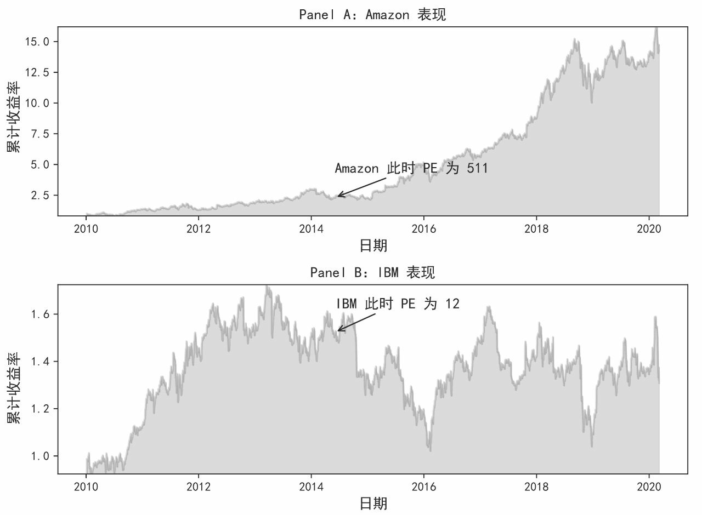

2014年6月，Amazon的PE高达511，而IBM的PE只有12。用PE来衡量价格是否合理的话，Amazon已经贵得离谱，存在回调的可能；IBM则是大甩卖的便宜货，谁见了都动心。站在当时来看，这样的分析完全没错。然而回头看，如果你当时卖掉Amazon去抄底IBM，一定会追悔莫及。Amazon的股价此后一路高歌，IBM却长期低迷。

金融教科书告诉你估值水平很重要，但这个例子又狠狠地打了你一耳光。问题出在哪？出在估值不能孤立地看，必须结合基本面来看。这就是5.1节要讨论的核心问题。

---

### 5.1.1 价值因子与价值投资

在因子投资领域，价值因子历史悠久、表现优异。Asness et al.（2013）在美国、英国、日本和欧洲等成熟市场，以及股票指数、债券、商品期货和外汇中都发现价值因子能获得正的超额收益。价值因子通常按照估值指标的高低选股——选择看起来便宜的股票，避开昂贵的股票。便宜的股票长期来看确实有更高的预期收益，但这是事实，却不是全部真相。

一个股票估值之所以便宜，可能是因为价格真的偏离了内在价值，也可能是因为它本来就不值钱。前者是真正的价值股，后者则是**估值陷阱**。Piotroski（2000）做过统计，虽然低估值组合整体表现不错，但只有不到44%的股票能在未来两年获得正的超额收益——也就是说，超过一半的低估值股票是在拖后腿。

这凸显了**价值因子投资**和**价值投资**之间的区别：

- **价值因子投资**（公式化价值投资）：单纯按估值指标选股，好处是简单纯粹，但容易选到较多伪价值股。
- **价值投资**：在估值基础上把基本面考虑进来，真正关注公司未来的盈利能力和成长能力，试图找到那些优质且便宜的股票。

巴菲特在1989年致股东信中说了一句广为流传的话：以合理的价钱买入优质的公司，远胜于以便宜的价钱买入一般的公司。

正是基于这种认识，学术界开始越来越注重将基本面因素纳入研究。其中最有代表性的两个工具就是Piotroski（2000）提出的**F-Score**，以及Mohanram（2005）设计的**G-Score**。前者用来衡量公司基本面的好坏，后者用来衡量企业的成长潜力。

---

### 5.1.2 F-Score：基本面好坏的度量

Piotroski（2000）用了三大类共9个指标来度量一家公司的好坏，包括盈利能力、财务情况和经营效率。具体指标见表5.1。

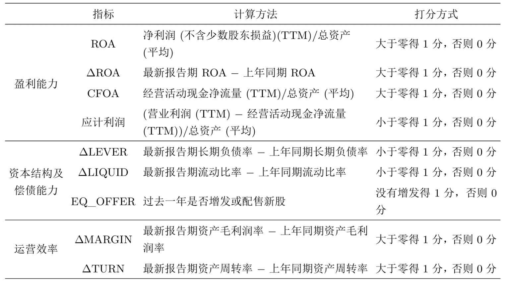

这些指标的设计有一个共同特点：它们都是公司自己跟自己比——跟去年比有没有变好。ROA（资产收益率）大于零得1分，否则0分。Delta-ROA（ROA的变化）大于零得1分。CFOA（经营现金流/总资产）大于零得1分。应计利润小于零得1分，这个指标的逻辑是经营现金流大于营业利润的公司更靠谱。Delta-LEVER（长期负债率的变化）小于零得1分，负债下降是好事。Delta-LIQUID（流动比率的变化）大于零得1分。EQ_OFFER过去一年没有增发得1分——不圈钱的公司让人放心。Delta-MARGIN（毛利率的变化）和Delta-TURN（资产周转率的变化）大于零各得1分。

这种纵向对比的好处是不太受行业差异的影响，一家钢铁厂和一家软件公司可以用同一套尺子衡量。

F-Score的取值范围是0到9，分值越高说明公司基本面越强。直觉上，无论是0分还是9分的公司都非常极端，大部分公司的总分应该在4分或5分左右。图5.2给出了实证期内不同F-Score的平均股票数量，确认了这种分布不均匀的特征。

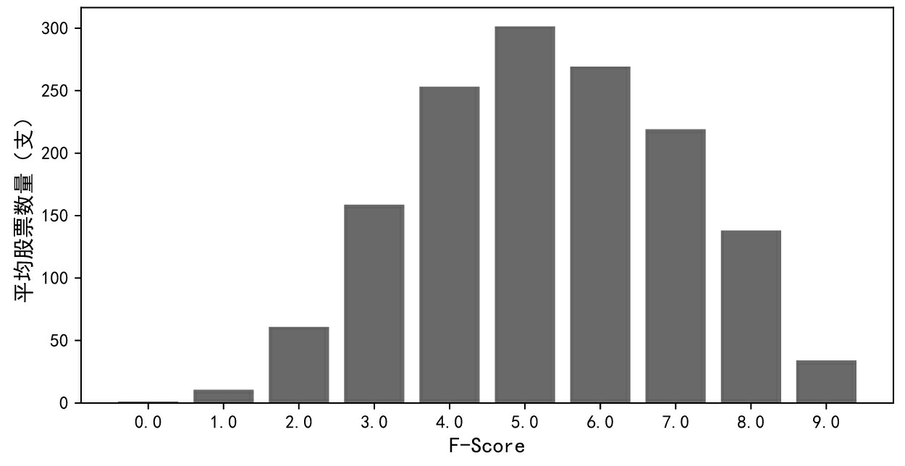

为了解决这个问题，Piotroski把公司分成三组：0到3分为最低组、4到6分为中间组、7到9分为最高组。图5.3展示了这三组投资组合在A股实证期内的累计收益走势。

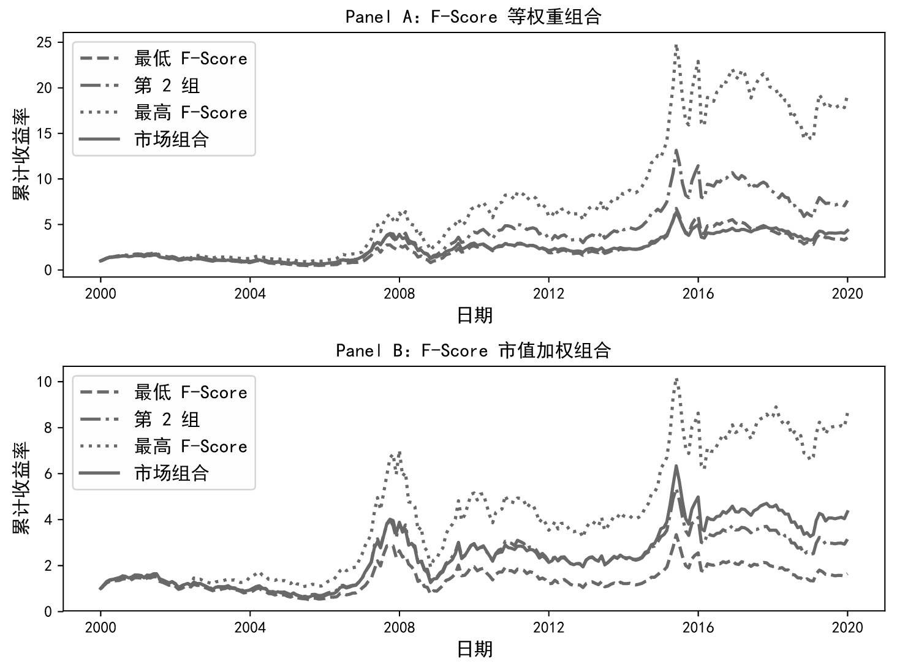

无论是等权重（Panel A）还是市值加权（Panel B），最高F-Score组的收益率都显著高于最低F-Score组。这说明用F-Score来评价公司基本面的强弱，在A股上是有效的。基本面好的公司，长期来看确实能给投资者带来更高的回报。

---

### 5.1.3 G-Score：在高估值里淘金

与Piotroski不同，Mohanram（2005）设计G-Score的目的是从成长股中区分出基本面好的赢家和基本面差的输家，解决投资者面对高估值时该不该追的困境。G-Score从三个维度衡量公司基本面：盈利能力、保守会计准则和盈利可持续性。具体指标见表5.2。

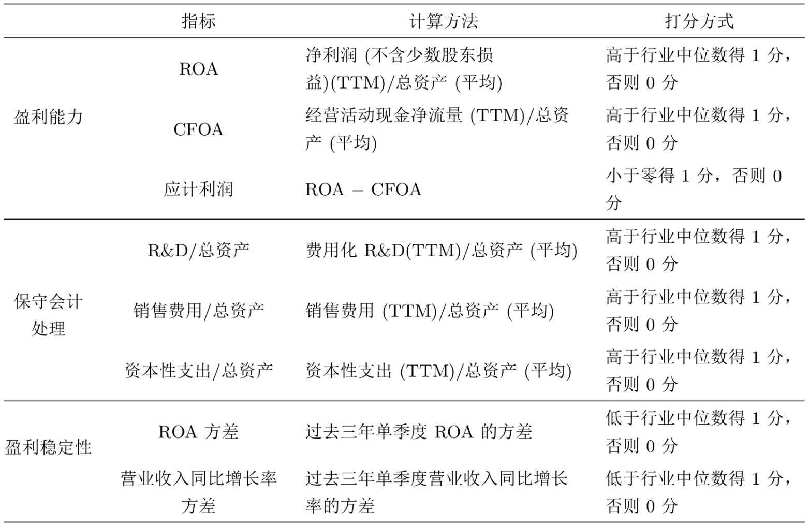

其中最有意思的是保守会计准则这个维度。公司在广告和研发上的投入往往被费用化，直接拉低当期利润和现金流，但这些投入恰恰与未来盈利直接挂钩。G-Score把R&D/总资产、销售费用/总资产、资本性支出/总资产这些支出作为加分项，这是一个非常反直觉但深思熟虑的设计——投入越大未来潜力越大。盈利稳定性则通过ROA方差和营业收入同比增长率方差来衡量，避免选到业绩坐过山车的公司。每个指标得分是同行业内比较得出的（应计利润除外），这一点与F-Score不同。

G-Score的分布同样不均匀（图5.4），Mohanram把0到1分为低G-Score组，2到5分为中组，6到8分为高组。由于A股数据可得性问题，2005年以前的分组标准做了适当调整。

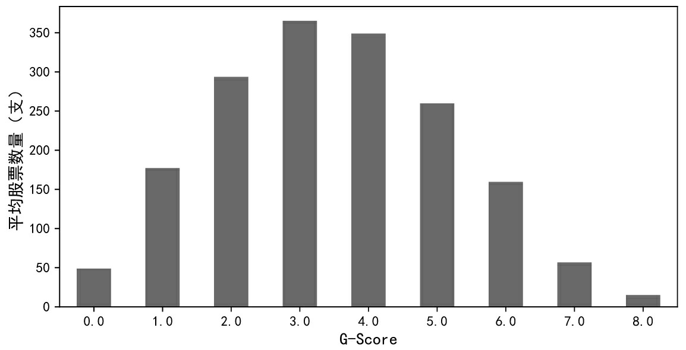

由于G-Score的初心是在高估值股票中找基本面优秀的标的，实证采用了G-Score和BM（账面市值比，book-to-market ratio）结合的方式，做了3乘3独立双重排序。图5.5展示了9个组合的夏普比率。

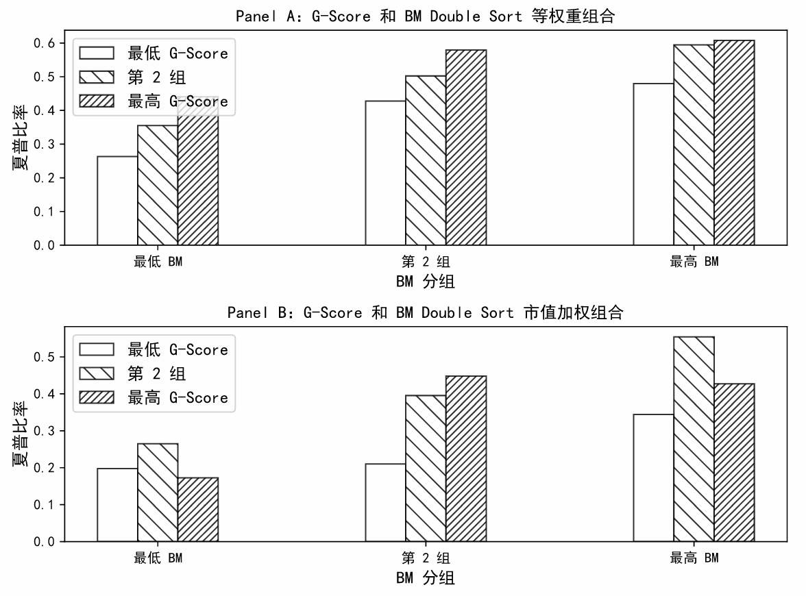

在等权重下，低BM组中G-Score确实呈现单调上升——G-Score越高，夏普比率越高，说明它能从成长股中区分出好公司和坏公司。然而在市值加权下，高G-Score组的夏普比率反而是三组中最低的，这与Mohanram的初衷相背离，说明等权重的结果受到了小市值的影响。F-Score和G-Score的实证告诉我们两件事：第一，基本面确实能在A股上区分股票的预期收益；第二，不同指标的效果会因权重配置方式而异，小市值的影响不可忽视。

---

### 5.1.4 通过预期差获取超额收益

F-Score和G-Score在A股都表现出一定的有效性，但前者的普适性更强。本节把F-Score所代表的基本面强弱和BM代表的估值高低结合起来，从一个更根本的出发点入手——估值和基本面的匹配程度。

Piotroski and So（2012）对这个问题进行了充分的研究，提出了**预期差（expectation errors）**的概念。他们认为，价值股战胜成长股背后的原因是错误定价，即市场参与者低估了价值股、高估了成长股。价格反映了投资者对股票的市场预期，而内在价值反映了股票本身的基本面预期。高估、低估说明这两个预期之间存在差异，Piotroski and So把这个差异定义为**预期差**，价值股跑赢成长股的内在逻辑是预期差的修正。

为了定量描述这个错位，他们用F-Score来衡量基本面预期，用BM代表市场预期。按照基本面预期和市场预期分别分成高、中、低三档，便构成了图5.6所示的九宫格。

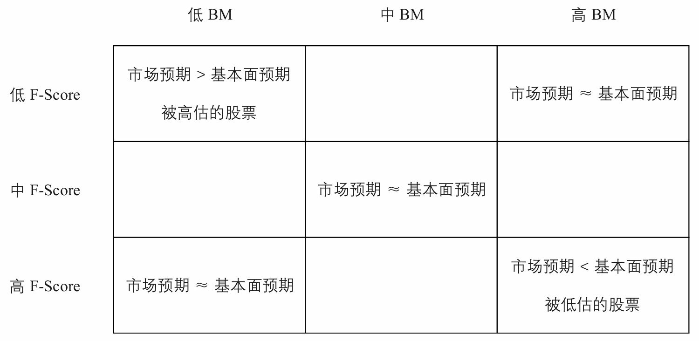

这个九宫格的直觉非常清晰。对于基本面优秀的股票，市场给它们高估值是合理的，不存在预期差；对于基本面很差的股票，市场给它们低预期也非常合理，同样不存在预期差。这两类股票的价格已经较好地反映了内在价值，未来不会带来超额收益。

真正的机会出现在错位的时候。想象一下：一只股票基本面其实很好（F-Score高），但市场因为它的行业冷门、名字不起眼、或者过去一段时间表现不佳，给了它一个很低的估值（BM高）。这时候市场预期远低于基本面预期，股票被低估了。一旦预期差在未来某个时刻修正，价格向价值回归，持有这只股票就能获得正的超额收益。反过来，一只股票基本面很差（F-Score低），但市场因为它蹭上了某个热点、短期业绩爆发、或者被游资追捧，给了它极高的估值（BM低）。这时候市场预期远高于基本面预期，股票被高估了。一旦预期差修正，价格跌落，这只股票就会带来负的超额收益。

所以价值因子的收益实际上是由存在预期差的价值股和成长股贡献的，而不存在预期差的股票在这个组合中则属于打酱油的。如果这个分析正确，那么仅仅针对存在预期差的股票构建对冲组合，就应该比仅以BM构造的价值因子获得更显著的超额收益。

Piotroski and So（2012）在美股上证实了这一点。他们构建了三个对冲组合：（1）仅通过BM大小构建的V/G组合；（2）使用不存在预期差的价值和成长股构建的非预期差组合；（3）使用存在预期差的价值和成长股构建的预期差组合。实证结果表明，预期差组合的收益率高于V/G组合，非预期差组合的收益率近似为零。

**A股实证完美复现了美股的结果。** 按照BM和F-Score进行3乘3双重排序，得到9个投资组合。表5.3给出了双重排序的月均收益率检验结果。

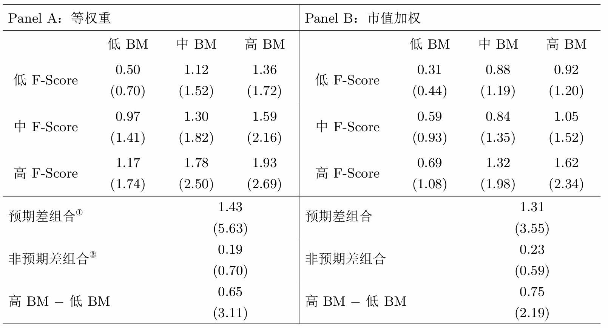

三个对冲组合的定义如下：

- **预期差组合**：做多高BM且高F-Score的股票，做空低BM且低F-Score的股票（高BM&高F-Score - 低BM&低F-Score）
- **非预期差组合**：做多高BM但低F-Score的股票，做空低BM但高F-Score的股票（高BM&低F-Score - 低BM&高F-Score）
- **高BM减低BM**：仅通过BM高低构建的传统价值因子组合

以等权重为例，预期差组合的月均收益为1.43%（t值高达5.63），这一结果远超仅通过BM高低构造的投资组合（月均收益率0.65%，t值3.11）。而非预期差组合的月均收益仅为0.19%（t值0.70），在统计上不显著，几乎为零。这和美股上的结论几乎一模一样。

当采用市值加权时，定性的特点依然保持不变。预期差组合月均收益率1.31%（t值3.55），非预期差组合月均收益率0.23%（t值0.59）。

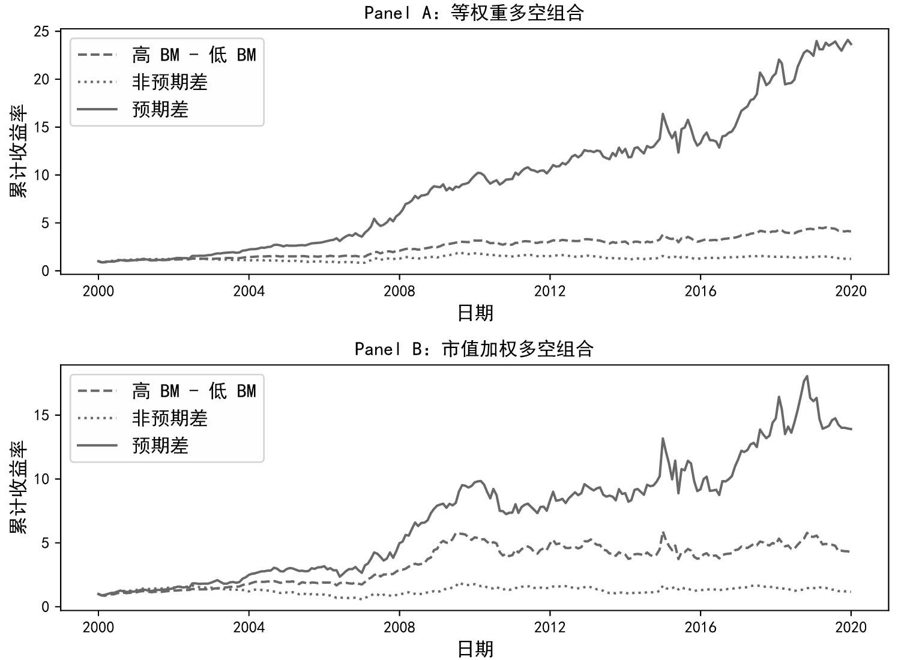

图5.7更直观地展示了这三条累计收益曲线的走势。预期差组合稳稳走在最上方，传统BM排序组合居中，非预期差组合几乎贴着零轴徘徊。这些数字背后有一个很强的经济学含义：价值股战胜成长股，并不是因为所有低估值股票都更好，而是因为其中存在预期差的那一部分在贡献超额收益。把不存在预期差的股票剔除，不仅让收益更高，还让信号更纯粹。

---

### 定价模型检验：这是真正的alpha吗

月均收益高还不够严谨。需要回答一个更尖锐的问题：这些收益能不能被常见的定价模型解释？如果不能，那才是真正的异象，是模型无法捕捉的alpha。

表5.4给出了三个定价模型下的超额收益检验结果。

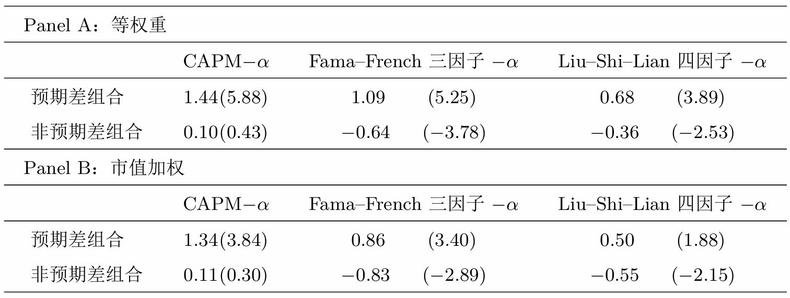

等权重时，无论CAPM、Fama-French三因子还是Liu-Shi-Lian四因子，预期差组合均能获得显著超额收益。CAPM-α为1.44%（t值5.88），FF三因子-α为1.09%（t值5.25），Liu-Shi-Lian四因子-α为0.68%（t值3.89）。随着定价模型中因子个数的增加，无法解释的超额收益在逐渐减小，但始终显著。这说明预期差组合确实有定价模型难以完全消化的部分。

市值加权时，预期差组合在CAPM和FF三因子下依然显著（CAPM-α 1.34%，t值3.84；FF三因子-α 0.86%，t值3.40），但Liu-Shi-Lian四因子-α不再显著（0.50%，t值1.88）。

非预期差组合则展现了完全不同的面貌：它的CAPM-α几乎为零且不显著（0.10%，t值0.43），但在FF三因子和Liu-Shi-Lian四因子下，超额收益反而显著为负（FF三因子-α -0.64%，t值-3.78；Liu-Shi-Lian四因子-α -0.36%，t值-2.53）。这进一步证实了非预期差组合中的股票定价相对合理，多空对冲互相抵消后没有剩余收益。

综合这些结果，可以得出一个相当坚实的结论：利用市场预期和基本面预期的错配所构造的预期差组合，确实能够在A股上获得显著且稳健的超额收益。

---

### 投资者过度悲观与过度乐观的实证证据

预期差根源于投资者的反应不到位。Piotroski and So（2012）的文章还从另一个角度提供了证据：存在预期差的股票在未来业绩公告期内的收益更显著（正或负），分析师在这些股票上的预测误差更大，对它们的预期修正也更大。

具体来说，对于高BM且高F-Score的价值股，分析师给出的盈利预测系统性地偏低——即便F-Score已经清晰表明公司质量不错，分析师仍然因为公司过去的低迷表现、行业的冷门标签、或者股价长期不涨的故事，给出了过于保守的预测。反过来，对于低BM且低F-Score的热门成长股，分析师的预测又系统性地偏高——这些公司可能蹭上了某个热点概念，短期股价表现亮眼，分析师便顺坡下驴，给出过于乐观的盈利预期，忽视了F-Score所揭示的基本面疲态。

当后续财报季实际业绩公布时，两个方向的预测误差都被暴露出来。价值股的实际盈利往往超出分析师的保守预期，成长股的实际盈利则frequently低于分析师的乐观预期。这种预测误差本身就是市场参与者认知偏差的量化痕迹。

存在预期差的股票在业绩公告窗口期内有显著更高的收益波动。如果一只股票的定价是准确的，当它发布财报时价格不应该有太大反应。但如果存在预期差，实际业绩和错误预期之间的落差会在公告日被集中释放，表现为显著的正向或负向超额收益。高BM且高F-Score的价值股在公告期内获得显著为正的超额收益，低BM且低F-Score的成长股则获得显著为负的超额收益。而非预期差组合中的股票在公告窗口期内没有显著的超额收益。

把这三个维度拼在一起，就形成了一幅完整的因果链条图：投资者反应不到位导致分析师预测出现系统性偏差，股票价格偏离内在价值，业绩公告暴露偏差，分析师被迫大幅修正预测，价格向价值回归。这个过程就是预期差从产生到修正的完整生命周期。

---

## 5.2 基本面锚定反转

### 5.2.1 金融学依据

短期反转异象（short-term reversal anomaly，STR）大概是A股中最显著的异象。它意味着前期大涨的股票在未来有更低的预期收益率，反之，前期大跌的股票在未来有更高的预期收益率。以过去一个月累计收益率为变量把股票分成五组，输家组（过去跌幅最大）到赢家组（过去涨幅最高），图5.8清晰地展示了A股市场的反转现象。

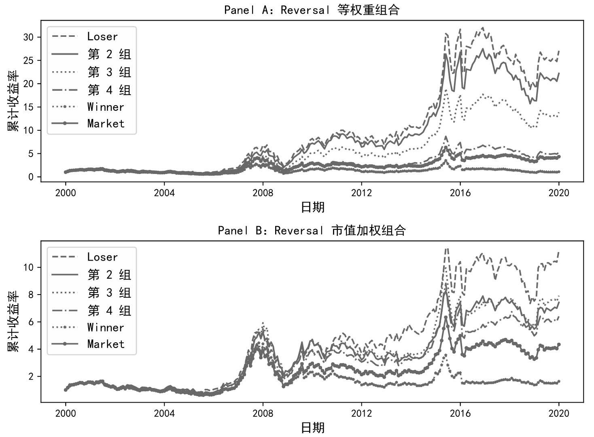

在实际投资中，由于做空受到很大限制，想利用反转异象只能从多头入手，即买入前期超跌的股票。通常来说，投资者需要克服极大的恐惧才能进行这种逆趋势而为的操作。

但股票超跌的原因有三种：（1）上市公司基本面恶化；（2）投资者对信息的过度反应（Lehmann 1990a）；（3）噪音交易者导致的瞬时流动性冲击（Grossman and Miller 1988，Jegadeesh and Titman 1995）。第一种造成的下跌往往难以反转，因为基本面恶化是不可逆的。后两种则是可以修复的——过度反应会逐渐平复，流动性冲击会消退。所以，要想通过逆势做多来利用反转异象，就必须把基本面恶化的公司规避掉。

这意味着投资者应试图把基本面变化造成的影响从收益率中剥离出去，而使用收益率中剩余的部分代表过度反应和流动性冲击的程度，并以此构建更合理的反转策略。Zhu et al.（2019）利用这个想法提出了**基本面锚定反转（fundamental-anchored reversal，FAR）**异象。

怎么把基本面的影响从收益率里剥离出来？Da et al.（2014）提出过一个很简洁的框架。一只股票的实际收益率，可以拆解成三部分：均衡状态下的预期收益、基本面现金流消息带来的收益变化，以及剩下的残差部分。最后这个残差，才是把基本面因素去掉之后，由过度反应或者流动性冲击驱动的部分。

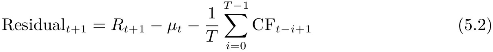

这个思路很清晰，但实际操作中有两个难题。第一，股票价格对基本面消息的吸收是缓慢的，不是一天两天就消化完的，只看最近一期的基本面变化不够（Hong et al. 2000，Choi and Sias 2012）。第二，分析师并不能覆盖全市场的股票，很多小票根本没有分析师跟踪。

Zhu et al.的改进很巧妙。既然现金流信息不好全面获取，那就找一个代理变量。他们发现Piotroski的F-Score正好可以担当这个角色。我们在5.1节已经看到，F-Score和股票未来收益率之间是正相关的——基本面强的公司未来确实表现更好。更重要的是，随着价格对基本面信息的逐步吸收，F-Score对未来收益的预测能力是不断提升的。这正好符合Da et al.模型里那个缓慢吸收的逻辑。

于是他们做了一个关键替换：用F-Score隐含的收益率来代替基本面消息驱动的收益部分。这样一来，用实际收益率减去F-Score隐含的基本面收益，得到的就是剥离基本面之后的残差收益率。这个残差才是真正值得关注的反转信号。

到这里，你可能已经感觉到一种熟悉的味道了。这和5.1节的预期差确实有异曲同工之妙。传统的短期反转异象说明短期历史收益率和未来预期收益率之间呈现负相关关系，而F-Score代表的基本面强则和未来预期收益率呈现正相关关系。综合以上两点，短期历史收益率和F-Score叠加后与预期收益率的关系如表5.5所示。

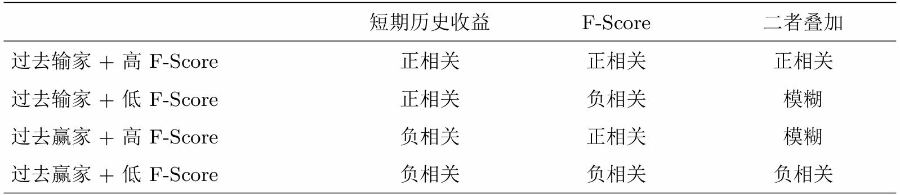

前期大跌的股票，如果基本面很强（高F-Score），那它的下跌很可能不是基本面驱动的，而是过度反应或流动性冲击造成的，这种超跌未来大概率会修复，所以预期收益率高。前期大跌但基本面很差（低F-Score）的股票，下跌可能是基本面恶化带来的，这种反转就不可信，预期收益率低。反过来，前期大涨的股票，如果基本面很差（低F-Score），那它的上涨可能是过度炒作了，未来有回调压力，预期收益率低。前期大涨且基本面好的股票，上涨有基本面支撑，是合理的。

所以最优的组合是什么？做多基本面强的前期输家，同时做空基本面差的前期赢家。做多这一端是在捡被错杀的好公司，做空那一端是在压被炒上天的烂公司。这和预期差的底层逻辑完全一致——还是在找市场预期和基本面现实之间的裂缝，只是这里的裂缝表现为短期价格走势和基本面强弱的背离。

---

### 5.2.2 A股市场中的基本面锚定反转

实证中使用过去一个月的累计收益率为反转变量，使用F-Score为基本面变量，进行独立双重排序。具体来说，使用反转变量将股票分成5组（Loser、P2、P3、P4、Winner），使用F-Score将股票分成3组（Low、Middle、High），这样一共得到15个投资组合，如图5.9所示。

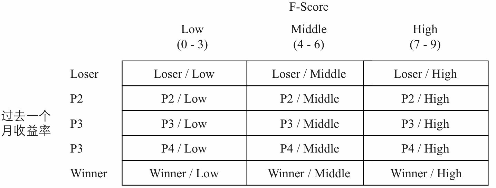

表5.6给出了以上15个组合在实证期内的月均收益率以及t值。

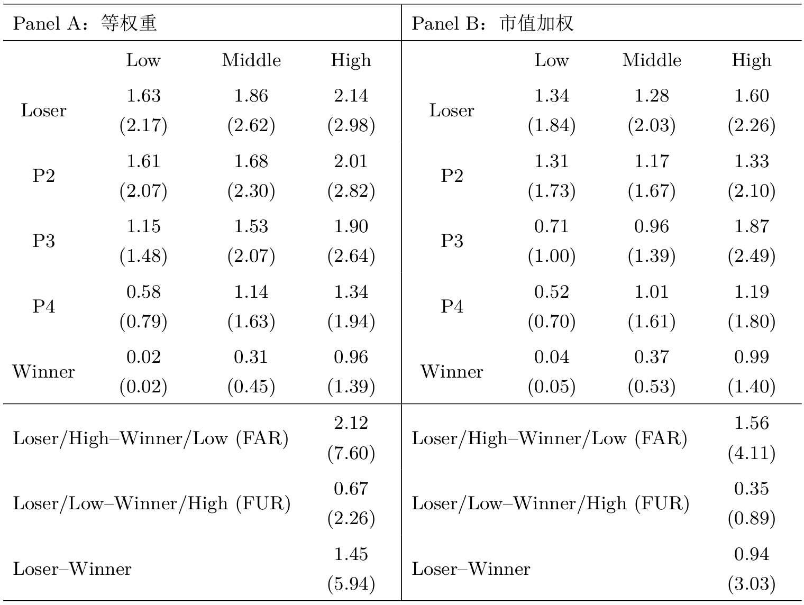

然后定义两个关键的对冲组合。第一个是**基本面锚定反转（FAR）**：做多Loser/High组合（基本面强的输家）同时做空Winner/Low组合（基本面差的赢家）。作为对比，通过做多Loser/Low组合（基本面差的输家）同时做空Winner/High组合（基本面强的赢家）得到**未经基本面锚定的反转（FUR）**。最后保留传统的Loser-Winner组合作为基准。

结果显示，当等权重配置时，在控制反转或F-Score因子后，另一个因子仍具有很好的单调性。更重要的是，**FAR的月均收益率达到了2.12%（t值高达7.60）**。这个数字是什么概念？它显著超过了传统反转组合的1.45%（t值5.94）。而FUR的月均收益率仅有0.67%（t值2.26），远低于FAR，说明基本面锚定确实起到了决定性的筛选作用。

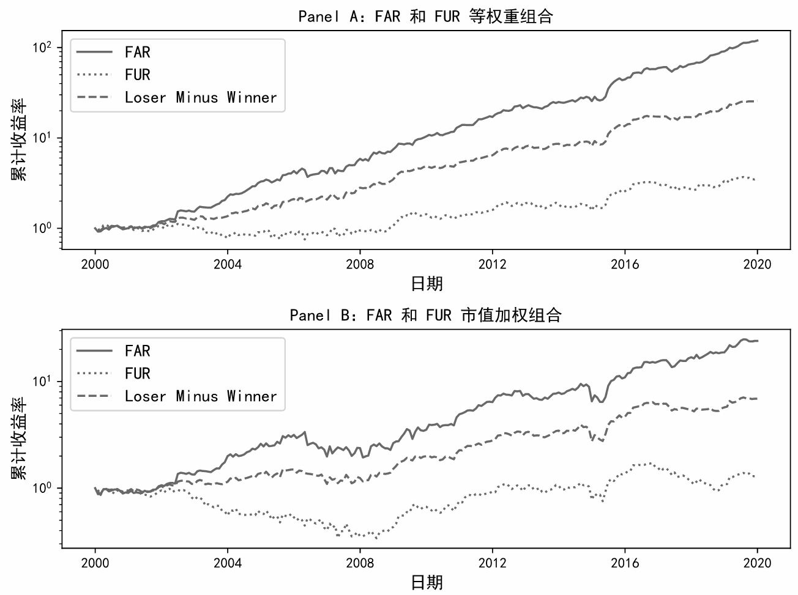

图5.10展示了这三条累计收益曲线的走势。纵坐标采用了以10为底的对数坐标，让长期的收益差距看起来更加直观。在等权重下，FAR组合的曲线几乎是笔直向上，和传统反转之间的差距越拉越大。FUR虽然也略有上行，但斜率明显平缓得多。

不过这里需要泼一盆冷水。作者特意提醒读者，这仅仅是纸面收益率，完全没有考虑交易成本。A股的交易费用、冲击成本、尤其是高频调仓带来的摩擦，在实际中会显著侵蚀这些名义收益。另外，空头方对平滑组合波动和推高整体收益的贡献非常高。但在A股的现实环境中，做空受到极大限制，融券标的有限、成本高昂，很多股票根本无法做空。这意味着实际能够捕捉到的收益，主要来自多头端。

这就引出了一个关键问题：多头本身的表现如何？

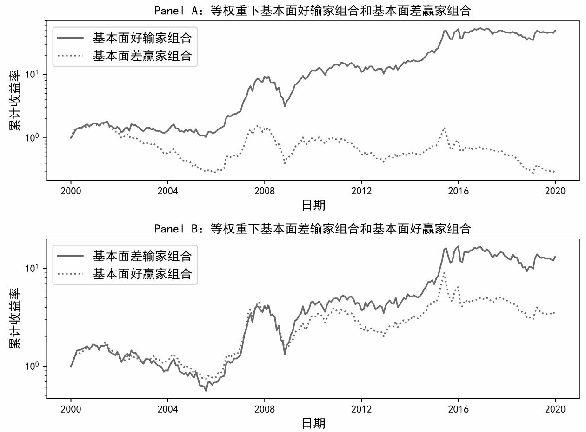

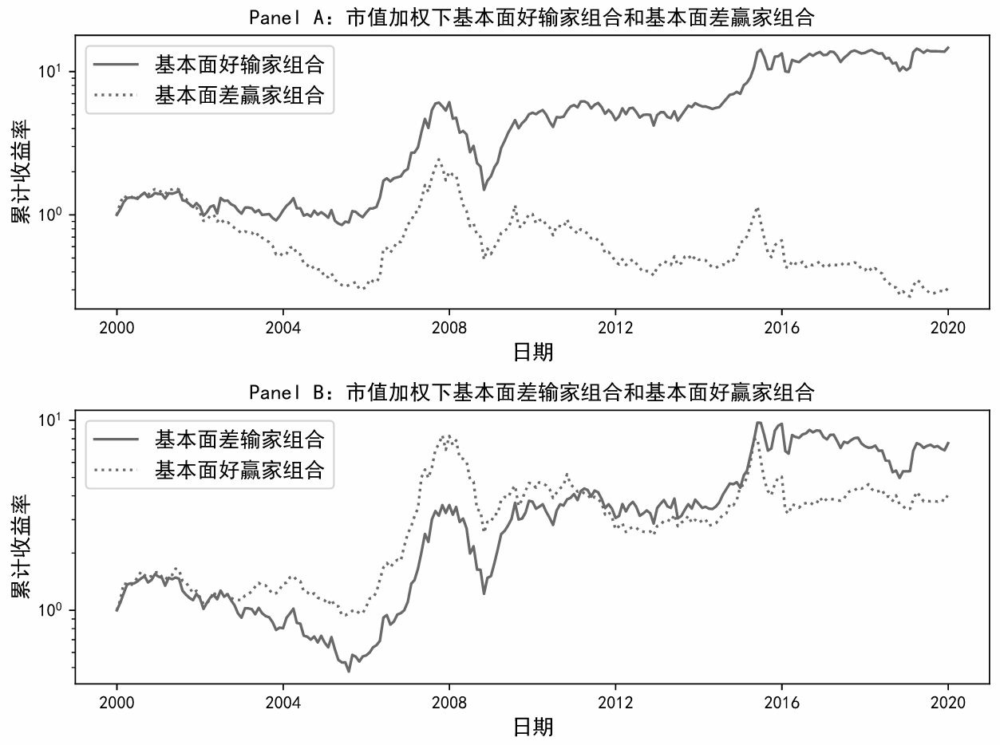

图5.11和图5.12分别给出了等权重和市值加权下，FAR和FUR多空两头的独立走势。无论哪种加权方式，FAR多头本身的波动都远高于组合整体，而收益率反而更低。也就是说，在实际投资中如果只能靠做多来利用这个异象，你面临的波动会非常大，收益却相对有限。这对风险管理提出了很高要求，不是简单买入持有就能实现的。

当切换到市值加权时，反转的整体效果打了不小的折扣。这一点很重要，因为它揭示了反转异象的一个结构性特征——它更多地出现在小市值股票中。等权重赋予每只股票相同的比重，小票的极端波动被充分暴露；市值加权则让大市值公司主导组合，而这些公司的短期反转效应本身就比较弱。即便如此，在市值加权下FAR依然优于传统反转，FUR依然明显落后。定性的规律是稳健的，只是幅度收窄了。

接下来检验定价模型无法解释的超额收益。

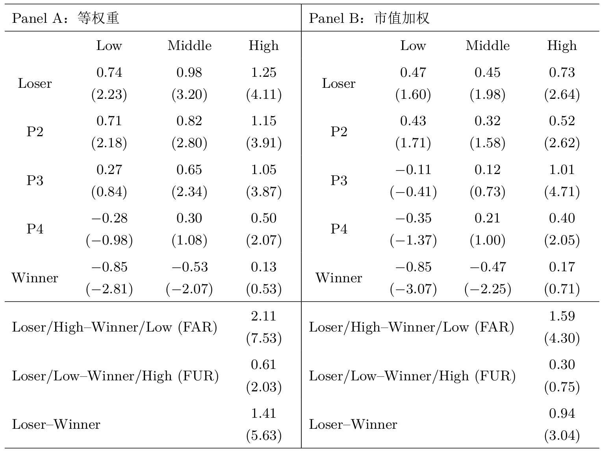

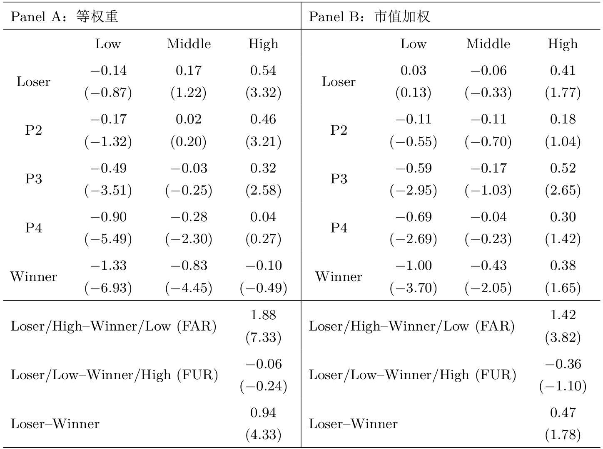

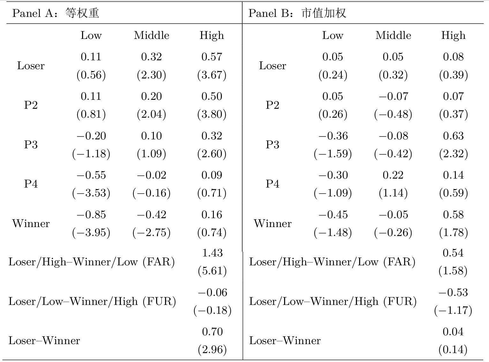

等权重时，15个组合从左下角（Winner/Low）到右上角（Loser/High）基本呈现从显著负收益到显著正收益的趋势。FAR组合的超额收益显著高于传统Loser-Winner组合，而FUR组合无法获得显著的超额收益。传统Loser-Winner组合在等权重下也能获得显著超额收益，证明了传统反转异象存在于A股市场。

市值加权时，定性结论依然成立，但有一个值得注意的细节：当Liu-Shi-Lian四因子模型作为定价模型时，FAR的超额收益不再显著（月均α为0.54%，t值仅1.58）。回顾5.1节的预期差组合，同样在市值加权下被这个四因子模型显著削弱。这个发现本身也是一个有价值的结论：如果你用Liu-Shi-Lian四因子来评估A股的策略收益，很多看似显著的异象会被吸收掉，剩余alpha的门槛更高。

在实际交易中，为了依靠FAR获得更高的超额收益，可考虑在满足换手率、流动性等必要约束的条件下，适当将反转组合向小市值倾斜。

---

## 5.3 特质性波动率之谜

由多因子定价模型可知，股票的风险可以分解为因子代表的系统性风险以及特质性风险两部分。后者通常通过**特质性波动率（idiosyncratic volatility，简称IVOL）**来度量。由于特质性波动率可以通过分散化投资而被抵消，金融理论暗示着投资者不应该因为承担了特异性风险而得到补偿。换句话说，股票的特质性波动率应无法预测股票的预期收益率。

然而2006年，Ang et al.在Journal of Finance上发表的一篇文章打破了这种观点。该文的题目是The Cross-Section of Volatility and Expected Returns，它指出特质性波动率高的股票在未来预期收益率更低，即二者之间存在负相关关系。三年后同一组作者又在Journal of Financial Economics上发文，通过来自美国和全球的更多实证结果说明特质性波动率和预期收益率之间的负相关性。Ang et al.（2006）一经发表便得到了学术界的高度关注，截至今日其谷歌学术引用量已超过3000次。

这篇文章的影响之所以这么大，是因为它直接挑战了分散化逻辑的核心。如果特质性风险真的可以通过分散化消除，那高特质性波动率的股票就不应该有低的预期收益。但数据摆在那里，理论和实证之间的矛盾，就构成了一个谜。

---

### 学术界的三种声音

当然，任何重磅发现都会引来挑战。关于特质性波动率和预期收益率的关系，学术界逐渐形成了三种立场：

- **负相关**：Ang et al.（2006，2009）、Jiang et al.（2009）、Guo and Savickas（2010）、Chen et al.（2012）。大多数实证结果支持这一方向。
- **正相关**：Fu（2009）为代表。他认为Ang et al.发现的负相关主要源于一小部分极高特质性波动率股票收益率的反转效应。
- **无显著关系**：Anderson et al.（2015）认为1987年10月是极端异常点，排除后负相关不再显著。Bali and Cakici（2008）等则认为关系不稳定。

从目前的学术主流来看，大多数实证结果还是支持负相关的。学术界把这种负相关关系称作**特质性波动率之谜（idiosyncratic volatility puzzle）**。

---

### 5.3.1 套利不对称性和特质性波动率

在众多试图解谜的研究中，Stambaugh et al.（2015）的工作尤其值得关注。他们没有从计量方法或数据来源的角度去质疑Ang et al.，而是提出了一个全新的理论视角——**套利不对称性（arbitrage asymmetry）**。

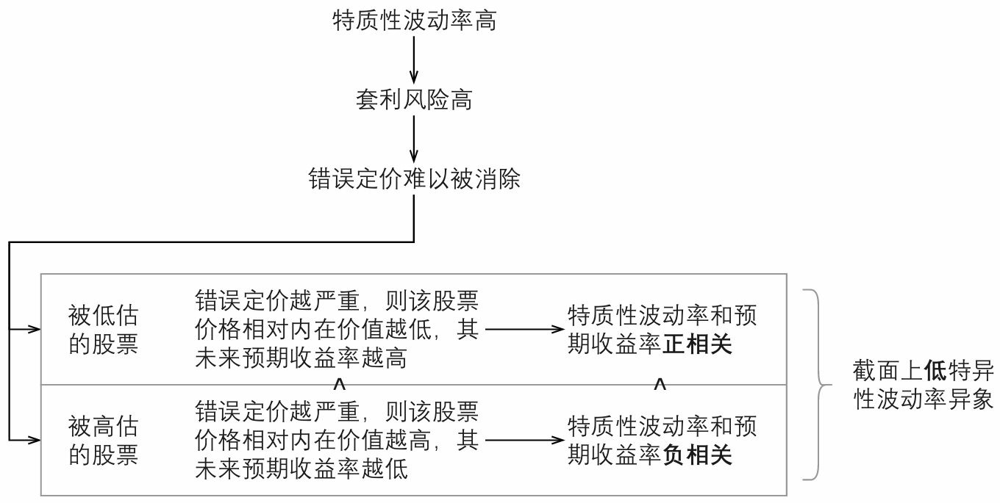

图5.13展示了这个猜想框架。这个想法的直觉是这样的：

市场之所以存在错误定价，是因为套利活动没能把它完全消除。但套利并不是对称的。当一只股票被低估的时候，投资者可以积极地买入，推动价格回升到合理水平。这个过程相对顺畅，因为做多没有什么制度障碍。但当一只股票被高估的时候，情况就不同了。做空受到很大限制，融券成本高、标的有限、还有可能面临逼空风险。很多投资者即使看到高估，也不愿意或者不能通过卖空来纠正价格。

这就造成了一个关键的不对称：被低估股票上的错误定价更容易被消除，被高估股票上的错误定价则持续存在。

特质性波动率在这里扮演了什么角色呢？它是阻止套利的一个因素。一只股票如果特质性波动率很高，它的价格走势就很颠簸，套利者在持有期间面临的短期亏损风险很大。这种波动加剧了套利风险，让纠正错误定价变得更加困难。

Stambaugh et al.把这两条线拧在一起：在被高估的股票中，套利不对称性和高特质性波动率叠加，导致错误定价持续存在，而且高IVOL股票的未来收益更低——因为它们被高估得更严重。在被低估的股票中，套利相对充分，错误定价被消除得更多，所以高IVOL和预期收益率之间的负相关较弱，甚至可能出现微弱的正相关。把被高估和被低估两组加总到整个横截面上，负相关压过了正相关，整体呈现出特质性波动率之谜。

为了验证这个猜想，Stambaugh et al.针对美股进行了详细的实证研究。为了确定被高估和被低估的股票，他们采用了11个异象变量构建综合错误定价指标。使用每个异象变量依次为股票排序，综合得分越高则该股票越被高估。然后用这个错误定价变量和特质性波动率做双重排序，美股数据支持了上述猜想的所有关键环节。

此外，Stambaugh et al.还以机构持股比例为代表，检验了套利限制程度对特质性波动率异象的影响。结果显示，在机构持股比例较低（套利限制较大）的股票中，特质性波动率异象更加显著。该文还通过Baker and Wurgler（2006）的投资者情绪指数研究了异象的时变特征——投资者情绪高涨时特质性波动率异象高度显著，情绪低迷时则不再显著。

---

### 5.3.2 A股市场中的特质性波动率异象

实证的起点是把理论概念变成可操作的指标。特质性波动率的计算方式很标准：以Fama-French三因子模型为基准，取过去21个交易日每只股票相对于三个因子的超额收益，做时序回归，得到残差收益率序列，再算这个序列的标准差。这个标准差就是个股的特质性波动率，记作IVOL。

直观地说，IVOL衡量的是一只股票的独有波动——和大盘无关、和行业无关、和价值属性无关，纯粹是它自己特有的价格颠簸程度。一只高IVOL的股票，走势上蹿下跳很剧烈，而且这种跳动的主要来源不是系统性风险事件，而是公司自身的特有消息、投资者情绪、流动性变化等。一只低IVOL的股票则走势相对平稳。

衡量错误定价程度时，Stambaugh et al.在美股上用了11个异象变量，但A股的数据可得性让其中3个难以复现——财务困境指标、股票净发行量和复合股权净发行量。最终采用了剩下的8个异象变量来构建综合错误定价得分。具体做法是，用每个异象变量依次为股票排序，根据该变量与预期收益率的已知关系方向赋予分数，然后把八个分数取平均。综合得分越高，股票越被高估，未来预期收益越低。

接下来的排序策略是**条件双重排序**。首先用错误定价变量把全部股票分成5组（从 most underpriced 到 most overpriced）。然后在每一组内部，再用IVOL把股票分成5组（从最低特质性波动率到最高）。五乘五，一共25个投资组合。

这个设计的目的很明确：如果Stambaugh et al.的猜想成立，那么IVOL和预期收益率的关系应该在不同错误定价方向上表现不同。在被高估的那一组里，高IVOL股票的预期收益应该特别低，负相关最强。在被低估的那一组里，负相关应该较弱，甚至可能出现正相关。

为了检验IVOL异象本身，在每个错误定价分组内，用最低IVOL组减去最高IVOL组构建一个对冲组合。另外，把五个错误定价组的IVOL组合结果取平均，也可以看在不区分错误定价方向时，单纯的低IVOL减高IVOL是否有效。

表5.10至表5.13分别展示了不同投资组合的绝对收益以及超额收益的检验结果。

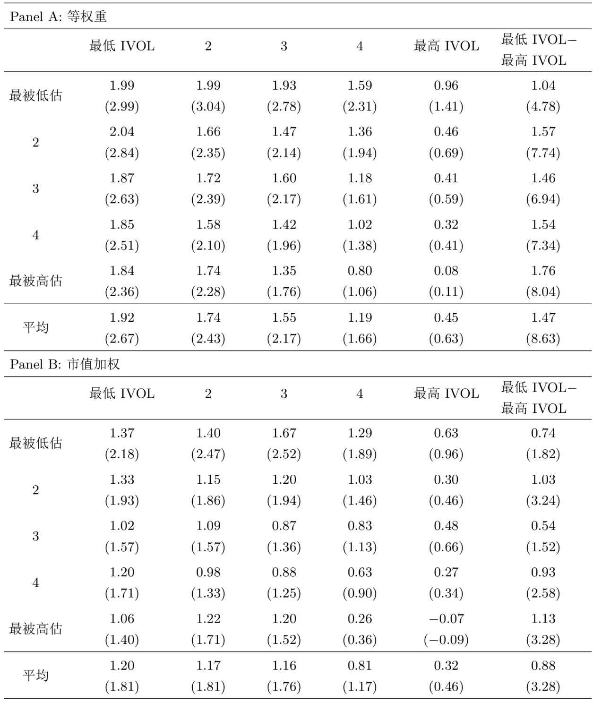

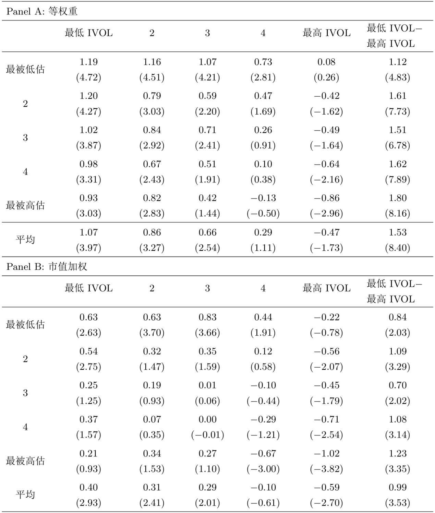

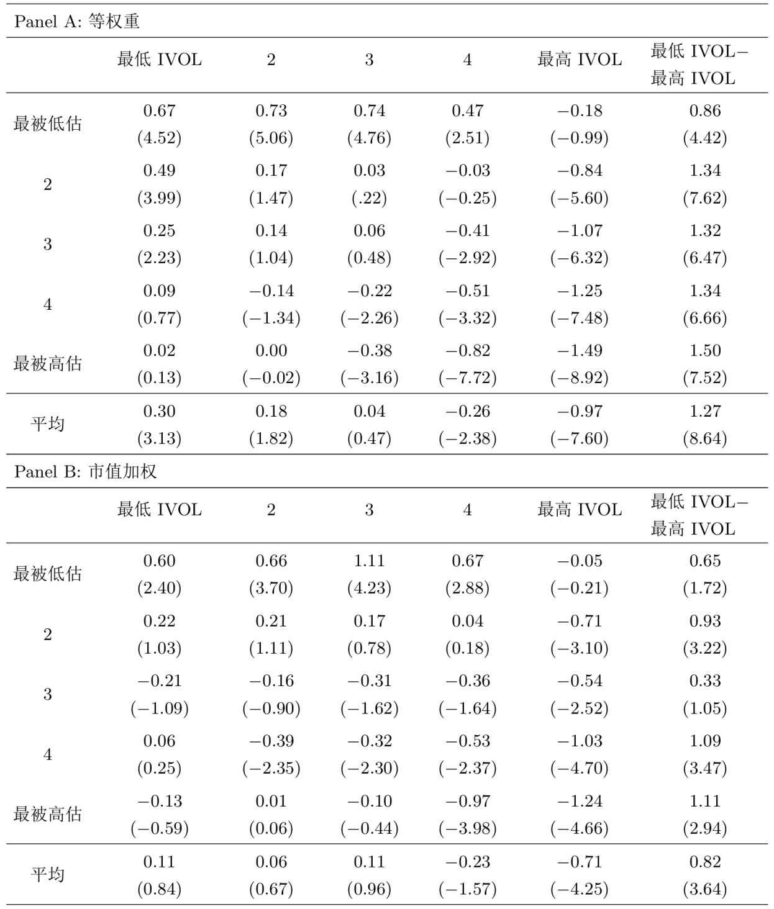

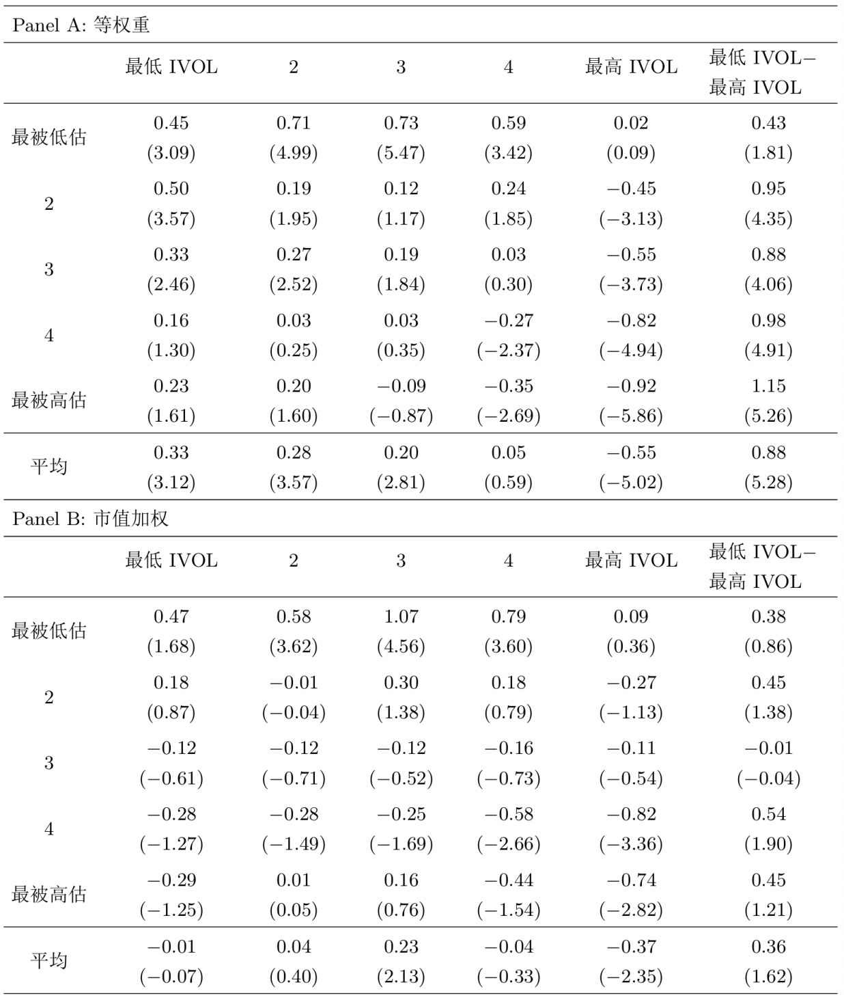

**先看平均五组错误定价的结果**，这是最不依赖于理论假设的整体描述。

无论是等权重还是市值加权，做多最低IVOL组、做空最高IVOL组所构建的特质性波动率异象组合，在绝大多数情况下都获得了非常显著的超额收益。以Fama-French三因子alpha为例，等权重时月均超额收益是1.27%，t值高达8.64。市值加权下，月均收益降到0.82%，但t值仍有3.64，统计上依然显著。这说明，即使不区分股票是被高估还是被低估，仅仅在A股市场上按照特质性波动率高低做对冲，就能稳定地获得定价模型无法解释的收益。

市值加权的显著性降低，这个模式我们在前面两个异象中已经见过多次。它反映了特质性波动率异象同样在小市值股票上更强，市值加权把大市值公司纳入后，信号被稀释了。

有一个和前面异象一致的规律值得再次强调：当使用Liu-Shi-Lian四因子模型作为定价模型时，市值加权下的特质性波动率异象组合alpha仅为0.36%，t值1.62，不再显著。回顾5.1节的预期差组合和5.2节的FAR组合，同样在市值加权下被这个四因子模型显著削弱。三章的结果汇聚在一起，形成了一个相当有力的判断——**Liu-Shi-Lian四因子模型对A股中由基本面和错误定价驱动的异象具有较强的解释力**，是本章三个异象的一个有效定价边界。

**接下来考察分组细节**：A股数据能不能复现Stambaugh et al.在美国看到的那个不对称模式？

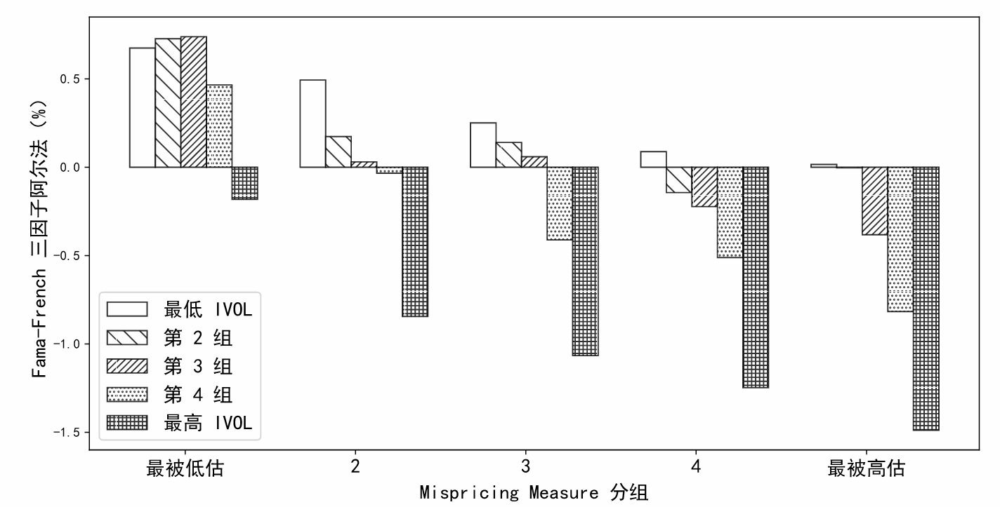

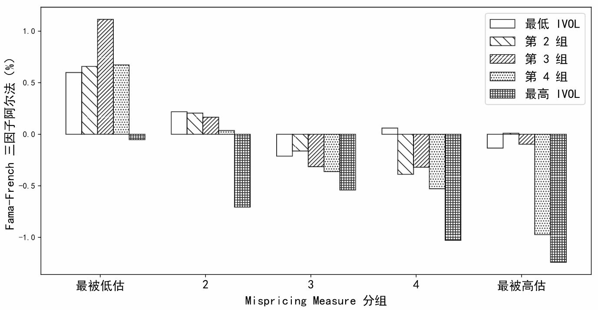

图5.14和图5.15以Fama-French三因子alpha为例，分别展示了等权重和市值加权下25个投资组合的超额收益热力图。

在最被高估的那一组里，五个IVOL分组确实呈现出了清晰的负相关。随着特质性波动率从低到高，组合的超额收益单调下降。这和理论猜想完全一致：被高估的股票上，高IVOL加剧了套利困难，错误定价持续存在，未来收益更低。

但在最被低估的那一组里，事情变得有些微妙。图5.14和图5.15显示，在最被低估的五个IVOL分组中，并没有出现美股上那种清晰的正相关。具体来看，IVOL最低的三组确实呈现出微弱的正相关——高IVOL对应稍高的平均收益率。但如果把范围扩大到前四组，秩相关系数在等权重下为负且不显著，在市值加权下为0.80，仍保有一定正相关性。真正打破模式的是最高IVOL那一组，它的收益率显著低于前四组，甚至低于某些中间分组。这个突然的下行导致在最被低估的股票中，做多低IVOL组做空高IVOL组仍然能获得显著为正的低特质性波动率异象收益。

这个结果和美股有差异。一个可能的解释是A股市场的高噪音和高换手率特征。在A股，即使是基本面不错、被低估的股票，如果特质性波动率极高，也可能因为噪音交易者的频繁进出、散户情绪的剧烈摆动而导致价格偏离。这种环境下，高IVOL在最被低估组中的负面效应可能比美股更强，从而压倒了理论上应有的正相关。

用CAPM或Liu-Shi-Lian四因子模型作为定价基准时，上述定性结论也依然成立。这说明不对称模式的存在与否具有一定的稳健性，只是A股的具体形态和美股不完全一致。

---

### 关于特质性波动率之谜的其他视角

特质性波动率代表着特质性风险，经典理论认为特质性波动率和预期收益率之间应该相互独立。然而大量实证分析表明二者之间表现出负相关性，这便形成了特质性波动率之谜。近年来，大量学者投身到解谜的行列中，除了Stambaugh et al.（2015）的套利不对称性框架外，还有几个值得关注的研究方向。

**Liang and Tang（2018）**将IVOL拆解成不确定性和残差波动率两部分，并指出IVOL和收益率的负相关主要源于不确定性部分，为理解IVOL之谜提供了新的视角。

**Herskovic et al.（2016）**则发现了一个更深层的现象：个股的特质性波动率之间也存在显著的共同运动，并提出了一种因子结构来解释特质性波动率。该文的发现对于实证资产定价有一定的启示，且他们的结果也表明了特质性波动率和预期收益率之间的负相关性。

**Schneider et al.（2020）**提出了剩余协偏度假说，认为用来检验低波动异象的定价模型遗漏了一个重要因子——剩余协偏度因子。Kraus and Litzenberger（1976）指出从投资者递减的绝对风险厌恶可以推出效用函数的三阶导大于0，隐含着投资者对正偏度的偏好。Harvey and Siddique（2000）进一步通过正式模型指出资产的CAPM超额收益与其剩余协偏度负相关。Schneider et al.针对美股使用股票期权数据计算出隐含偏度，以此作为未来剩余协偏度的代理变量，发现当该因子被加入定价模型后，常见的低波动异象（包括低特质性波动率异象）消失了。主成分分析进一步显示，隐含偏度因子几乎可以完全解释四个低波动异象的共同成分。这个发现虽然主要基于美股数据，但它为理解异象提供了一个全新的理论框架——也许特质性波动率之谜不是真正的定价失败，而是模型遗漏变量造成的假象。

---

## 尾声：三条线索汇成一根绳

如果把本章三节串起来看，会发现一条贯穿始终的线索。

5.1节的预期差，是静态地看估值和基本面的错配。市场预期和基本面预期不一致，错误定价产生，修正带来收益。

5.2节的基本面锚定反转，是动态地看价格短期冲击和基本面的关系。超跌的股票中，只有基本面未被破坏的那些才值得抄底，本质上还是在识别市场反应和基本面现实之间的裂缝。

5.3节的特质性波动率之谜，则是从套利机制的结构性不对称来理解异象。高特质性波动率放大了错误定价的持续性，而被高估的股票上这种效应尤其强烈。

三者都指向同一个核心：**A股市场上存在系统性的错误定价，而定量地衡量基本面、识别预期差、理解套利限制，是从这些错误定价中获取超额收益的关键路径。**

另外还有一个贯穿三节的实证发现值得铭记：当采用市值加权时，三个异象在Liu-Shi-Lian四因子模型下的超额收益均不显著。这说明该模型对A股有较强的适用性，是评估策略alpha时需要认真对待的一个定价基准。
