# 第7章 因子投资实践

> 本章导读：如果说前六章是在"研究室"里讨论因子是什么、为什么存在，第七章则是走到"交易室"里，看业界怎么把这套东西真正变成钱。阅读时请始终装着一条主线——**多因子模型在实践中服务于三个目的：预测收益、估计风险、事后归因**。

本章共八节。7.1节到7.3节分别从收益率模型、风险模型和投资组合优化三个角度，阐述主动管理如何利用多因子模型作为量化工具来获取超过基准的收益。7.4节介绍因子指数和Smart Beta投资——普通投资者分享因子盛宴的捷径。7.5节直面因子择时这一"烫手山芋"。7.6节和7.7节分别从风格分析和风险归因的角度，说明如何用多因子模型读懂投资结果。7.8节展望因子投资的未来：另类数据与大类资产配置。

---

## 7.1 收益率模型：获取"阿尔法"

### 7.1.1 基本术语

在进入方法论之前，必须先厘清一个术语问题。业界量化研究员嘴里常说的**"阿尔法因子"**，在本书基于式（1.3）的统一框架下其实不够准确。

**式（1.3）** 是本书的核心框架，它将股票的预期收益率分解为两部分：一部分由股票暴露在定价因子上的风险补偿驱动（$\beta'\lambda$），另一部分是无法被定价模型解释的异象收益（$\alpha$）。在这个框架里，"阿尔法"和"因子"各有严格的所指——阿尔法指的是异象收益，因子指的是定价因子这种投资组合。但业界口中的"阿尔法因子"指的既不是异象也不是组合，而是**变量**，是像**账面市值比（Book-to-Market Ratio，简称BM，即每股净资产与每股价格之比）** 或**特质性波动率（Idiosyncratic Volatility，简称IVOL，即个股收益率中无法被市场因子解释的部分的波动率）** 这样用来构建因子的原材料。

更微妙的是：BM这个变量对应的是价值因子，属于 $\beta'\lambda$ 部分；IVOL对应的是特质性波动率异象，属于 $\alpha$ 部分。业界把两类变量都笼统叫"阿尔法因子"，但"阿尔法"这个词本身就带着偏向 $\alpha$ 的色彩，无形中把BM这类对应定价因子的变量给矮化了。因此本章改用**"收益率预测变量"（return predictors）** 这个中性称呼。

### 7.1.2 寻找预测变量

寻找预测变量有三个方向。第一是从常见行情和财务数据中挖掘新异象，但这条路越来越难。第二是改造旧变量——比如经典BM有个时代性缺陷：新经济公司把大量投入砸在研发和广告上，这些投入明明在塑造未来盈利能力，会计上却不计入净资产。把研发和广告支出加回净资产重新算BM，改进后的变量超额收益明显更高（Liu et al. 2019）。这说明**好变量不是挖出来的化石，而是需要随经济结构演化的活物**。第三是利用另类数据，7.8.1节会专门讨论。

### 7.1.3 挑选预测变量

变量越来越多（有私募声称配了3000多个"阿尔法因子"），但变量绝非越多越好。一个变量从想法到应用，需要过六道关——**表7.1** 总结了这六大标准。

**表7.1 收益预测变量应满足的六个标准**

| 标准 | 含义 | 核心关切 |
|------|------|----------|
| 逻辑性（Intuitiveness） | 背后要有经济学解释 | 是风险补偿还是错误定价？如果两者都不是，可能是数据窥探 |
| 持续性（Persistence） | 实证数据支撑理论逻辑 | IC测试、投资组合排序法、发表前后检验 |
| 信息增量性（Information Increasement） | 相对已有变量是否提供新信息 | 变量相关性、条件排序、Fama-MacBeth回归 |
| 稳健性（Robustness） | 对构造方法和参数不敏感 | 参数敏感性、算法稳健性、样本外检验 |
| 可投资性（Investability） | 纸面收益能否转化为实盘收益 | 信息衰减、换手频率、交易成本、冲击成本 |
| 普适性（Pervasiveness） | 能否跨市场跨资产存活 | 价值和动量是标杆 |

#### 逻辑性与持续性：IC

逻辑性是六道关的守门人。没有底层逻辑，再漂亮的结果都没有灵魂。逻辑只有两个正当来源：**风险补偿**（承担了未知系统性风险，超额收益是对风险的报酬）或**错误定价**（行为偏差加套利限制造成的，且不会很快消失）。两个都解释不通？大概率是数据窥探的产物——你用历史数据反复试，总有些变量凭运气显得有效，但样本外立刻现原形。

持续性拿实证来检验。这里引出业界最宠爱的指标——**IC（Information Coefficient，信息系数）**。它的定义朴素得有点让人失望：

$$IC_t = corr(z_{it}, R_{it+1})$$

就是 $t$ 时刻股票 $i$ 的变量取值 $z_{it}$，和它下一期真实收益率 $R_{it+1}$ 在整个股票截面上算个相关系数。取值范围 -1 到 1，绝对值越大越好。它衡量的是"变量今天的取值里含有多少关于明天收益的信息"，是一个纯粹的**事前预测**视角。经验法则是：按日频算，IC 超过 2% 就算优秀变量——2% 听着小得可怜，但金融数据的信噪比就是这么残酷。

光看IC均值不够。**表7.2** 给了一整套围绕IC的衍生指标。

**表7.2 与IC相关的评价指标**

| 指标 | 符号 | 含义 |
|------|------|------|
| 信息系数 | IC | 变量取值与下期收益率的截面相关系数 |
| 信息率 | IR | IC的均值 / IC的标准差，衡量预测能力的稳定性 |
| IC > 2%的比例 | — | 有效期的覆盖率 |
| IC的t值 | — | 统计显著性 |

#### 信息增量性：正交化

信息增量性问的是：在已有变量的基础上，新变量是否带来新信息？如果它和已有变量相关性很高，那它只是个"影子"。

这里引出业界极其常用的操作——**正交化（中性化）**。假设变量A是优秀的预测变量，但它和一个无关变量B纠缠在一起，B会污染A的预测。怎么办？在截面上拿A对B回归，用**残差**代替A——残差天然和B正交，污染就被洗掉了。业界最常见的做法就是拿**行业哑变量**和**市值**当B，把原始变量洗成"行业市值中性"的版本。

#### 稳健性

稳健性从三个维度检验：**参数**（把动量的12个月回看期换成11或13个月，表现是否一致）、**算法**（把原始收益换成风险调整后收益再算动量，表现是否相似）、**样本**（按10年窗口或商业周期划分子区间，各区间是否都有不俗表现）。如果稍微动一下就面目全非，该怀疑的不是市场，而是自己过拟合了。

#### 可投资性：信息衰减

这是学界和业界之间最大的鸿沟。业界那句著名的嘲讽"阿尔法只存在于论文中"说的就是这关。核心概念是**信息衰减**：变量预测未来的能力像食物一样有保质期。**半衰期**定义为IC衰减到一半所需要的时间。高频量价变量保质期短，基本面变量保质期长。衰减快意味着你得高频调仓才能跟上，调仓意味着交易成本，而且这类策略容量还小。**纸面上再美的超额收益，扣完成本可能什么都不剩。**

#### 普适性

最高标准：跨市场、跨资产都能存活。模范生是**价值**和**动量**——Asness et al.（2013）在英美日欧的股票、债券、商品、外汇里都找到了它们。

### 7.1.4 收益率预测

变量在手，接下来走四步流程。

**第一步：确定投资范围。** 不是天然全市场——医药基金只能在医药行业选，中证500增强只能在500只成分股里选。定了池子还要建**黑名单**，踢掉三类股票：低流动性（冲击成本高）、高风险（ST/待退市/净资产为负/次新股）、长期大概率跑输的（高换手高波动的投机股、估值高盈利差的劣质股、有减持造假等负面事件的）。**表7.3** 和 **表7.4** 分别展示了原始股票池范围和中证指数的流动性剔除规则。

**表7.3 原始股票池范围**

| 产品类型 | 原始股票池 |
|----------|-----------|
| 全市场选股 | 全部A股 |
| 行业基金 | 特定行业内的股票 |
| 指数增强产品 | 基准指数的成分股（如中证500） |

**表7.4 中证指数编制方案中对流动性的规定**

| 规则要点 | 说明 |
|----------|------|
| 流动性筛选 | 剔除流动性过低的股票 |
| 具体阈值 | 参考过去一年的日均成交金额、换手率等指标 |

**第二步：剔除异常值。** 三种方法各有脾气。**缩尾法（Winsorization）** 按固定比例砍掉首尾——最简单但有三个毛病：对本来没异常值的指标会误伤、对异常值多的指标清不干净、对不对称分布左右各砍同样比例不合理。**三倍标准差法** 直观易懂，但致命伤是均值和标准差本身被异常值污染——异常值把 $\sigma$ 撑大，$\pm 3\sigma$ 的网就罩不住真凶了，"成也萧何，败也萧何"。**MAD法（Median Absolute Deviation，绝对中位差）** 用中位数替代均值、用绝对中位差替代标准差，天生不怕异常值污染，识别更准：

$$MAD_i = median(|X_i - X_m|)$$

其中 $X_m$ 是变量的中位数。实际判别时先乘修正系数 $MAD_e = 1.4826 \times MAD$（正态分布下1个标准差约等于1.4826倍MAD），偏离中位数超过 $3 \times MAD_e$ 的即为异常值。

**第三步与第四步：预测收益率**，分非参数和参数两条路线。

**非参数法** 不做分布假设，只利用单调相关性。

- **条件选股**：设阈值筛股票。比如"BM > 1/3 且 ROE(TTM) > 10%"，每月筛选。**图7.1** 展示了该策略的累计收益率。它的毛病是条件难把握（太多选不出、太少选太多）、持股数量时序上飘忽、阈值设多了容易过拟合，而且没法和投资组合优化对接。

- **排序打分法**：每个变量给股票排名，名次换分数，加总后选总分最高的N只。**图7.2** 展示了用同样两个变量、每月选总分最高的50只股票的结果。它解决了持股数量不稳和条件过多的问题，但隐含假设所有变量权重相等——"变量之间该配什么权重"推给了7.5节的因子择时。

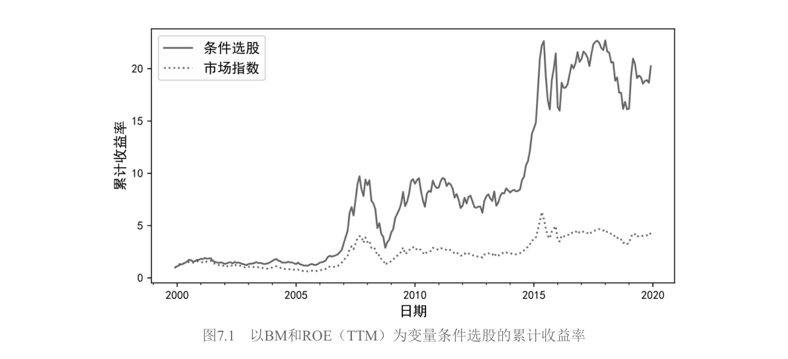

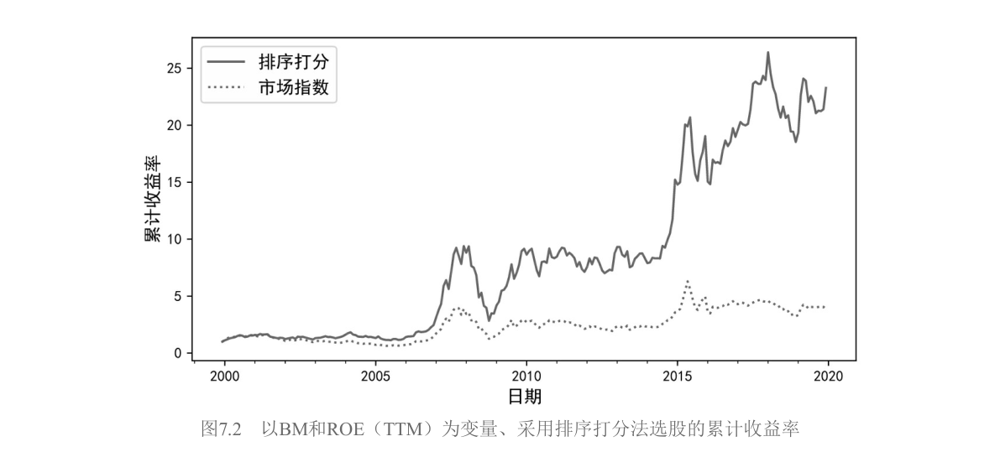

**参数化路线** 是先标准化再回归。因为变量量纲千差万别（BM和市值不是一个量级），先把每个变量转成截面上均值0、标准差1的 **Z-Score**：

$$z_{it} = \frac{x_{it} - \bar{x}_t}{\sigma(x_t)}$$

注意均值和标准差都是 $t$ 时刻整个股票池的**截面统计量**——标准化是在同一时刻的股票之间比高低，而不是和股票自己的历史比。Z-Score的含义是"这只股票此刻在同类中的相对位置"。

有了单变量得分，按权重加总成综合得分。这里有一个重要的工程经验——**分层汇总**：不要把十几个细分变量一股脑扔进一个公式，而是先在各维度内部合成（盈利、成长、安全各自一个得分），再把维度得分汇总。Asness et al.（2019）构建著名的**质量因子**时用的就是这种层级结构。加权求和后，综合得分的截面标准差通常不再是1而是小于1（变量间不完全相关，加总有分散化效应），所以要再做一次标准化。

接下来做**一元截面回归**：

$$R_{it} = c_t + b_t z_{it-1} + \varepsilon_{it}, \quad i = 1, \cdots, N$$

每期（比如每月）做一次。然后用最近 $T$ 期（月频通常取12、24或36个月）的回归系数取平均作为下一期系数的估计：

$$\hat{b}_{t+1} = \frac{1}{T}\sum_{\tau=t-T+1}^{t} b_\tau, \qquad \hat{c}_{t+1} = \frac{1}{T}\sum_{\tau=t-T+1}^{t} c_\tau$$

最后代入 $t$ 时刻最新的Z-Score，得到 $t+1$ 时刻的预测：

$$\hat{R}_{it+1} = \hat{c}_{t+1} + \hat{b}_{t+1} z_{it}$$

#### Grinold经验法则（α三要素）

从截面回归出发，两边减去基准收益率 $R_{Bt}$，定义超额收益 $\alpha_{it} \equiv R_{it} - R_{Bt}$。对回归式做OLS估计，由于Z-Score截面均值为0，回归截距等于超额收益的截面均值。预测超额收益为 $\hat{\alpha}_{it} = \bar{\alpha}_t + \hat{b}_t z_{it-1}$。

第一项 $\bar{\alpha}_t$ 对所有股票都一样（等权重基准下严格为零），所以**个股超额收益的预测完全由第二项决定**。对斜率 $\hat{b}_t$ 做代数拆解——OLS斜率等于协方差除以方差：

$$\hat{b}_t = \frac{cov(z_{it-1}, \alpha_{it})}{\sigma^2(z_{it-1})} = \rho(z_{it-1}, \alpha_{it}) \cdot \frac{\sigma(\alpha_{it})}{\sigma(z_{it-1})}$$

Z-Score标准差为1，分母消失；$\rho$ 就是IC的定义；$\sigma(\alpha_{it})$ 是超额收益的截面波动率。于是斜率变成两个量的乘积：$\hat{b}_t = IC_t \times \sigma(\alpha_t)$。代回预测式，得到 **Grinold（1994）超额收益经验法则**：

$$\boxed{\hat{\alpha}_{it} = IC_t \times \sigma(\alpha_t) \times z_{it-1}}$$

这个公式不是天外飞来的假设，它就是"标准化得分 + 截面回归"的另一副面孔。三要素各自的含义对应三条提升业绩的路径：**IC** 是你的预测能力（提升研究质量）；**$\sigma(\alpha_t)$** 是市场提供的机会集（股票之间收益分化越大，同样预测能力能兑现的收益越多，所以选股策略在分化剧烈的市场里如鱼得水）；**$z_{it-1}$** 是这只股票在你体系里的相对位置（决定你看好的股票押多重）。三者是乘法关系，任何一项为零，超额收益就归零。

---

## 7.2 风险模型：以Barra为例

### 为什么需要风险模型

收益率模型告诉你"哪只涨得多"，但股票收益是你"想"的事，风险是你"不想"但必须面对的事。你以为选出来的10只股票各有美好未来，但如果它们碰巧同属一个行业、暴露在同一宏观因子下，逆风时10只一起跌。

理论上你需要计算N只股票的协方差矩阵，里面有 $N(N-1)/2$ 个两两相关性。当N是几千时，这个数字大到天文级别，而且历史样本永远不够——这就是**维数灾难**。多因子模型的思路优雅极了：假设几千只股票都被少数几个共同因子驱动，一旦估计出因子间的协方差，再叠加个股自己的"噪音"，整个协方差矩阵就出来了：

$$\Sigma = \beta \Sigma_\lambda \beta' + \Sigma_\varepsilon$$

左边是N阶的协方差矩阵。右边第一项 **因子部分**：$\beta$ 是 $N \times K$ 的因子暴露矩阵，$\Sigma_\lambda$ 是K阶的因子协方差矩阵，通过降维把"股票对股票"的关系转化成"股票对因子 × 因子 × 因子对股票"的间接映射。第二项 **特质性部分** $ \Sigma_\varepsilon $ 代表单只股票的"个性"，假设这些个性之间互不相关，所以是对角阵。

### Barra CNE5的结构

**Barra** 是全球最著名的商业风险模型提供商（已被MSCI收购），CNE5是专门针对中国A股市场的多因子模型。其结构是 **1个国家因子 + P个行业因子 + Q个风格因子**，共 $K = 1 + P + Q$ 个因子。

国家因子对所有股票的暴露恒等于1——你没有选择，每只A股都是中国的股票。它在截面回归里实际上起到了**截距项**的作用。而且国家因子组合恰好约等于**市值加权的全市场组合**——"中国"本身作为一个因子，它的收益当然最接近于整个A股大盘的涨跌。

行业因子对应申万一级行业，暴露是0-1哑变量——一个股票要么属于这个行业，要么不属于。为了防止国家因子和行业因子"打架"（二者线性相关导致方程有无穷多解），Barra附加了一个约束：行业因子收益率的市值加权平均等于零。这实际上把行业因子收益率定义成了**相对于市值加权均值的偏离**。

风格因子（价值、成长、波动率等）的暴露直接使用公司的**基本面特征值**——比如用BM本身作为价值因子的暴露原始值，然后再标准化（去市值加权均值、除以截面标准差）。

### 模型求解与纯因子投资组合

模型每期做一次**加权最小二乘法（WLS）截面回归**，求解当期的因子收益率。回归权重和市值平方根成反比——小市值股票噪音更大，给它更小的权重。

求解过程同时给出了一个极为重要的副产品——**纯因子投资组合（Pure Factor Portfolio）**。对于因子k，它的纯因子组合满足一个近乎理想的性质：**只在该因子上有1个单位的暴露，在其他所有因子上暴露为零**。这个性质使得你可以把总收益干净地归因到不同因子上。

三类纯因子组合各有性格：

- **国家因子**：纯多头组合，近似全市场组合。在国家和行业上有正暴露，在风格上零暴露。
- **行业因子**：资金中性的多空对冲组合，本质是**100%做多该行业 + 100%做空市场组合**。代表"该行业相对大盘的超额收益"，在风格上零暴露。
- **风格因子**：资金中性的多空对冲组合。只在自己因子上暴露为1，其他因子全部零暴露。

### 协方差矩阵的求解与调整

用历史数据直接算出来的协方差矩阵并不准确。核心问题出在**特征因子组合**的层面上——对因子协方差矩阵做特征分解后，那些方差较小的特征因子组合，其事前风险预测系统性地偏低。

Barra祭出两大统计武器。第一，**特征因子调整法（Eigenfactor Adjustment）**：用自助法（Bootstrap）模拟出"样本协方差"和"真实协方差"之间的期望偏差，然后用这个偏差去修正对角阵。第二，**贝叶斯收缩（Bayesian Shrinkage）**：把个股特质性波动率按市值分档，以档内市值加权平均作为先验，然后把样本估计往先验上"拉"——偏离群体均值越大的股票，拉回收缩的力度越强。

两种调整的共同目标是让一个指标尽量接近1——**偏差统计量**（Bias Statistic），即事后实现的风险与事前预测的风险之比。如果它显著偏离1，说明风险模型在撒谎。

---

## 7.3 投资组合优化

### 7.3.1 错位的收益与风险模型

7.1造出了收益预测，7.2造出了风险估计，7.3本该是把两块砖砌成一座房子。但作者一上来就抛出一个让很多人措手不及的问题：**你的收益模型和买来的Barra风险模型，两套模型的因子对不上，怎么办？**

这个**错位（Misalignment）**问题在海外已讨论十几年，在国内几乎没人提。你的收益模型里有一组预测变量（暴露矩阵 $\beta_\alpha$），Barra里有另一套风险因子（暴露矩阵 $\beta_R$），二者天然不可能一一对应。比如你的收益模型里有个高频量价信号，Barra的风格因子里压根没有对应的东西。

把收益模型的预测超额收益 $R_\alpha$ 在Barra风险因子所张成的超平面上做正交分解：一部分是 $R_\alpha$ 在风险因子空间内的投影 $\tilde{R}_\alpha$（可以被Barra解释），另一部分是垂直于该超平面的残差 $\mu_\perp$（Barra完全解释不了）。

均值-方差优化的无约束最优解为：

$$\omega^* \propto \frac{1}{\sigma_s^2} \mu_\perp + \frac{1}{\sigma_s^2 + \sigma_{R\alpha}^2} \tilde{R}_\alpha$$

$\mu_\perp$ 的系数分母只有 $\sigma_s^2$（特质性风险），而 $\tilde{R}_\alpha$ 的系数分母是 $\sigma_s^2 + \sigma_{R\alpha}^2$（特质性风险 + 因子风险）。**优化器会给 $\mu_\perp$ 更大的权重，因为它看起来"没有风险"——但它只是恰好位于Barra看不到的方向上。** 盈亏同源，它绝非无风险。优化器误以为未被风险模型覆盖的收益是"免费的午餐"，于是过度配置——这就是错位导致的风险被系统性低估。

作者打了一个很直观的比喻：你和一个盲人合作寻宝。你能看到金银财宝的分布（收益模型），盲人能通过回声定位感知周围的地形（风险模型）。但有些地方你能看到闪光，盲人却感知不到任何障碍——你以为那里安全且富饶，于是大步走过去，实际上可能是悬崖。

解决思路有两条。**改造风险模型**从简单到复杂有三种做法：剔除相似因子、替换因子暴露、联合构建新风险模型——但商业模型是黑箱，改不了。**更务实的思路是改进优化过程**——直接在目标函数里给 $\mu_\perp$ 额外惩罚（Bender et al. 2009）。作者特别指出：国内券商金工报告普遍忽视错位问题，"使用某多因子模型选股 + Barra风控"的展示中几乎不做任何处理，这是一个值得持续关注的定量问题。

### 7.3.2 目标函数

假设错位已处理，来看优化器里该放什么目标函数。最著名的当然是Markowitz（1952）的**均值-方差优化**：

$$\max_\omega \left( \omega' \mu - \frac{\zeta}{2} \omega' \Sigma \omega \right)$$

$\zeta$ 是风险厌恶系数。无约束最优解 $\omega_{mvo} \propto \Sigma^{-1} \mu$。它的致命缺陷是**最优权重对输入参数极其敏感**，而偏偏预期收益率 $\mu$ 又是最难估计的。

为了规避对 $\mu$ 的依赖，人们发展出三种**仅以 $\Sigma$ 为输入**的目标函数：

- **最小方差**（式7.60）：$\min_\omega \omega' \Sigma \omega$，最优解 $\omega_{mv} \propto \Sigma^{-1} \mathbf{1}$。完全无视收益，只追求波动最小。它在实践中常常出人意料地好——因为最小化方差的过程天然倾向于低配高波动股票，而高波动股票往往被高估（低波动异象）。

- **最大多样化**（式7.62）：最大化 $\omega' \sigma / \sqrt{\omega' \Sigma \omega}$。衡量"加权平均波动率"与"组合实际波动率"的比值，比值越大说明分散化越充分。

- **风险平价**（式7.64-65）：让投资组合中每只股票对组合的风险贡献相等，也叫**等风险贡献（Equal Risk Contribution）** 组合。桥水基金的全天候策略让这个概念名声大噪。一般情况下没有解析解，需要数值求解。

### 7.3.3 不同目标函数的比较

在什么条件下，简配版退化为均值-方差？**表7.5** 做了汇总。

**表7.5 不同配置方法与均值-方差优化的等价条件**

| 配置方法 | 与均值-方差等价的条件 | 条件数量 |
|----------|---------------------|----------|
| 最小方差 | 所有资产预期收益率相等 | 1 |
| 最大多样化 | 所有资产收益-风险比相同（$\mu_i/\sigma_i$ 相等） | 2 |
| 风险平价 | 收益-风险比相同 + 两两相关系数相等 | 2 |
| 等权重 | 收益-风险比相同 + 相关系数相等 + 波动率相等 | 3 |

作者用三个假想资产做了一组实验。当所有条件满足时各方法与均值-方差给出的权重完全一致；但条件每被破坏一层，就有一种方法开始"掉队"——先是等权重，然后是风险平价，然后是最大多样化。**等权重最先掉队的原因很简单：它完全不使用任何关于 $\mu, \sigma, \rho$ 的信息。**

**表7.6** 和 **表7.7** 展示了实验结果。

**表7.6 等权重、风险平价、最大多样化、均值-方差优化权重的比较**

| 实验 | 满足条件 | 等权重 | 风险平价 | 最大多样化 | 均值-方差 |
|------|----------|--------|----------|------------|-----------|
| 实验一 | 全部三个条件 | 与MVO相同 | 与MVO相同 | 与MVO相同 | 基准 |
| 实验二 | 前两个条件 | 偏离 | 与MVO相同 | 与MVO相同 | 基准 |
| 实验三 | 仅第一个条件 | 偏离 | 偏离 | 与MVO相同 | 基准 |
| 实验四 | 均不满足 | 偏离最大 | 偏离 | 偏离 | 基准 |

**表7.7 最小方差与均值-方差优化权重的比较**

| 实验组 | 最小方差权重 | 均值-方差权重 | 说明 |
|--------|-------------|---------------|------|
| 第一组 | 相同 | 随$\mu$变化 | 最小方差不依赖$\mu$ |
| 第二组 | 相同（不变） | 大幅变化 | 仅当$\mu_i$全相等时才等价 |

实验传递的信息很重要：**没有免费的午餐，但也没有必要为复杂性本身付费**。等权重只有在"一无所知"时才是理性选择；一旦你对收益、波动或相关性有任何靠谱的信息，都应该把它用起来。

### 7.3.4 约束条件

真实交易中，没有约束的优化是灾难性的。常见的约束有七种，按逻辑分三组。

**资金与仓位层面**：卖空约束（$\omega \geq 0$）、杠杆约束（$\omega' \mathbf{1} = 1$）、上下限约束（$L \leq \omega \leq U$），还可以扩展到行业中性（$H\omega = h$，即组合的行业分布和基准完全一致）。

**交易层面**：换手率约束（$|\omega_i - \omega_i^0| \leq \phi_i$），这对大资金尤其重要——船大难掉头，高换手直接吃掉超额收益。持仓数量约束（$N_L \leq \sum \delta_i \leq N_U$），太少不够分散，太多因子暴露被稀释。

**风险层面**：因子暴露约束（限制组合在某因子上的暴露范围，若设成相对基准的主动暴露为零就是**风格中性组合**）。跟踪误差约束（$(\omega - \omega_B)' \Sigma (\omega - \omega_B)^{1/2} \leq \sigma_{TE}$），直接控制组合相对基准的主动风险波动率。

加了这些约束后，解析解通常不存在，需要数值方法求解。股票数量多时找到全局最优很难，约束参数设得不合理甚至会出现无解的情况——风控永远是妥协的艺术。

### 7.3.5 交易成本模型

理论和实盘之间最后一道鸿沟是交易成本，分为显性（手续费、买卖价差）和隐性（市场冲击成本）。

**线性成本函数**（式7.79）：$TC(\omega) = \sum c_i |\omega_i - \omega_i^0|$，与权重变化成正比。但它不考虑冲击成本——卖1%和卖10%对市场的冲击显然不是一个量级。**二次成本函数**（式7.80）在线性基础上加了二次项，捕捉"交易越多，单位冲击成本越高"的现实。把成本模型代入原始目标函数作为惩罚项（式7.81），优化器在做决策时会自动权衡：多调一点仓能带来多少额外收益，又要付出多少交易成本？当边际收益等于边际成本时，就找到了最优的再平衡点。

---

## 7.4 Smart Beta：因子投资的捷径

如果说7.1到7.3是专业机构的游戏，Smart Beta就是普通投资者也能参与的因子投资捷径。它的本质是把学术界花了几十年验证出来的、有显著溢价的因子，打包成规则透明、成本低廉、可以像买卖指数基金一样交易的产品。学术研究和普通投资者之间的鸿沟，由Smart Beta来填平。

### 7.4.1 因子指数和Smart Beta

**Smart Beta** 这个名字里，"Smart"表示挑选有风险溢价的因子，"Beta"表示通过暴露在这些因子上来获取超额收益。它介于被动投资和主动投资之间——像被动投资一样规则透明、成本低廉、易于复制；又像主动投资一样主动偏离市值加权，通过暴露在有溢价的因子上来争取更好表现。图7.3展示了这种三角关系。

**表7.8** 整理了各家知名机构对Smart Beta的定义，涵盖资管公司、指数编制商、数据公司和智能投顾。口径不一，但共性要素有四条：偏离传统市值加权、规则清晰透明可复制、主动在一个或多个因子上暴露、追求增强收益或降低风险。

**表7.8 各机构的Smart Beta定义**

| 机构类型 | 定义核心 |
|----------|----------|
| 资产管理公司 | 系统性偏离市值加权，追求风险调整后的超额收益 |
| 指数编制商 | 规则透明、基于因子的指数化投资策略 |
| 数据资讯公司 | 结合主动和被动优势的混合策略 |
| 智能投顾 | 低成本的因子暴露工具 |

**表7.9** 从多个维度把三者放在一起对比。

**表7.9 被动投资、主动投资和Smart Beta对比**

| 维度 | 被动投资 | Smart Beta | 主动投资 |
|------|----------|------------|----------|
| 核心信念 | 市场有效 | 因子有持续溢价 | 选股/择时可击败市场 |
| 透明度 | 高 | 高 | 低 |
| 费用 | 低 | 中低 | 高 |
| 换手率 | 低 | 中低 | 高 |
| 可复制性 | 高 | 高 | 低 |
| 收益来源 | 市场Beta | 因子溢价 | Alpha + 风格暴露 |
| 对因子的态度 | 无偏向 | 主动暴露 | 可能无意识地暴露 |

#### 选择因子

**表7.10** 和 **表7.11** 梳理了实践中最常用的大类因子和各家指数公司的选用情况。核心几类包括：

**表7.10 Smart Beta中常见的大类因子**

| 因子 | 英文 | 典型指标 | 逻辑 |
|------|------|----------|------|
| 价值 | Value | BM、PE、股息率 | 低估值股票长期跑赢高估值 |
| 质量 | Quality | ROE、低杠杆、盈利稳定 | 优质公司长期表现更好 |
| 低波动 | Low Volatility | 低Beta、低已实现波动 | 低风险股票反而收益不低 |
| 动量 | Momentum | 过去12月收益率（剔除最近1月） | 涨得好的继续涨 |
| 股利/红利 | Dividend | 股息率、分红稳定性 | 高分红公司往往基本面扎实 |
| 规模 | Size | 市值 | 小市值长期跑赢大市值 |

**表7.11 有代表性的指数公司所使用的大类因子**

| 指数公司 | 使用的因子 |
|----------|-----------|
| 明晟（MSCI） | 价值、质量、低波动、动量、规模、高股息 |
| 标普道琼斯 | 价值、动量、低波动、质量、规模、红利 |
| 富时罗素 | 质量、价值、低波动、规模、动量 |
| 中证指数 | 红利、质量、低波动、价值、规模、成长 |

选因子时，比历史业绩更重要的是搞懂背后的驱动力。作者举了价值因子的血泪案例——2017年四季度开始美股价值因子持续跑输标普500，量化巨头AQR深受其创，但AQR掌门人Cliff Asness写长文论证价值因子背后的逻辑并未改变。这揭示了一个重要事实：**因子表现是有周期的**。**表7.12** 展示了不同因子在不同市场环境下的表现差异。

**表7.12 因子表现与市场周期、商业周期以及投资者情绪**

| 市场状态 | 经济周期 | 情绪 | 表现较好的因子 |
|----------|----------|------|----------------|
| 上涨 | 扩张 | 乐观 | 质量、动量 |
| 下跌 | 收缩 | 悲观 | 质量、低波、股利 |

质量和动量在市场上涨、经济扩张、情绪乐观时表现好；低波、质量和股利在下跌市、收缩期、悲观情绪中更抗跌。不同因子之间相关性较低，"东方不亮西方亮"，这正是多因子配置的价值所在。

#### 指数编制

核心矛盾贯穿始终：**因子暴露和可投资性是天生敌人**。你想获得尽可能高的因子暴露，通常意味着选少数最符合因子特征的股票、甚至做空不符合的股票——这会带来流动性差、换手率高、容量小的问题。反过来，想让产品易于交易、成本低、容量大，就必须在因子暴露上妥协。

图7.4用一个金字塔描绘了五种因子指数化方法，从上到下因子暴露递减、可投资性递增。

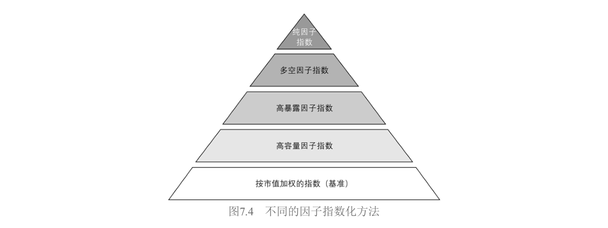

- **纯因子指数**：金字塔顶端，完全从数学角度构建，不考虑可投资性。如Barra模型里的纯因子组合——行业组合是做多行业加做空市场，风格组合只在自己因子上暴露为1。它满足"对目标因子1单位暴露、其他零暴露"的理想，但几乎不可交易。
- **多空因子指数**：通常资金中性，用排序法构建。如Fama-French三因子里的SMB和HML。对目标因子仍有很高暴露，但不可避免暴露在其他因子上。
- **高暴露因子指数**：开始真正平衡因子暴露和可投资性，同时考虑低换手率、高流动性、高容量等约束。构建方法包括筛选法（按因子高低排序取Top N）和优化法。
- **高容量因子指数**：在高暴露指数基础上进一步降低因子暴露换取更好可投资性。包含股票池里所有股票，但按因子暴露和市值综合决定权重。
- **市场指数（基准）**：金字塔底层，市值加权，最高可投资性，被认为对所有风格因子的暴露为零。

指数编制的具体实现分两种模式。**权重模式**放弃市值加权，用另类加权方式间接在因子上产生暴露（等权重偏向规模、最小方差偏向低波动、基本面加权偏向质量）。**排序模式**更直接，用一个或多个因子指标排序打分，选得分最高的N只股票。也可以两者结合——先用因子指标筛选，再用另类加权确定权重。

以**明晟质量指数**为例走一遍完整流程：第一步确定股票范围（NASDAQ、NYSE、AMEX三大交易所）。第二步计算因子得分，用三个基本面变量：ROE、权益负债率（D/E）和盈利增长稳定性。对每个变量先做缩尾处理去异常值，再标准化成Z-Score（盈利稳定性和D/E与未来收益负相关，得分乘以-1）。三个变量得分取平均得到综合质量得分。第三步把股票按质量得分降序排列，选排名靠前的N只。第四步确定权重，用**市值调整法**——权重正比于"市值 × 质量得分"的乘积，既保证因子暴露足够高，又保证容量足够大。

### 7.4.2 为什么要投资Smart Beta

作者给了四个理由，每个都配有实证。

**增加收益**。被动投资只赚市场Beta，主动投资难以区分能力和运气。Smart Beta规则透明，收益来源清晰。图7.5展示了一个例子：传统60/40股债组合，如果股票部分等权重配置给6个Smart Beta指数，年化收益率从6.68%提升到9.11%，夏普比率从0.48提升到0.60。这不是复杂的择时或选股，只是静态地暴露在一组有溢价的因子上。

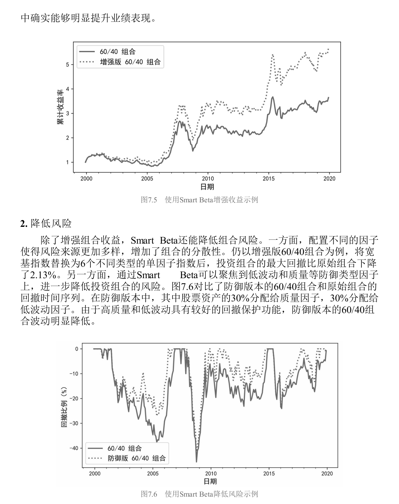

**降低风险**。图7.6对比了防御版60/40和原始组合——防御版把股票资产的30%配给质量、30%配给低波动，结果回撤明显降低。低波动和质量因子在下跌市中的"缓冲垫"效应被充分利用。

**节约费用**。图7.7展示了换手率和选股能力呈倒U形关系——换手率过高反而侵蚀收益。Smart Beta换手率远低于主动基金。图7.8对比了管理费率：Smart Beta的费率远低于主动管理基金。对长期投资者而言，省下的费用就是赚到的收益。

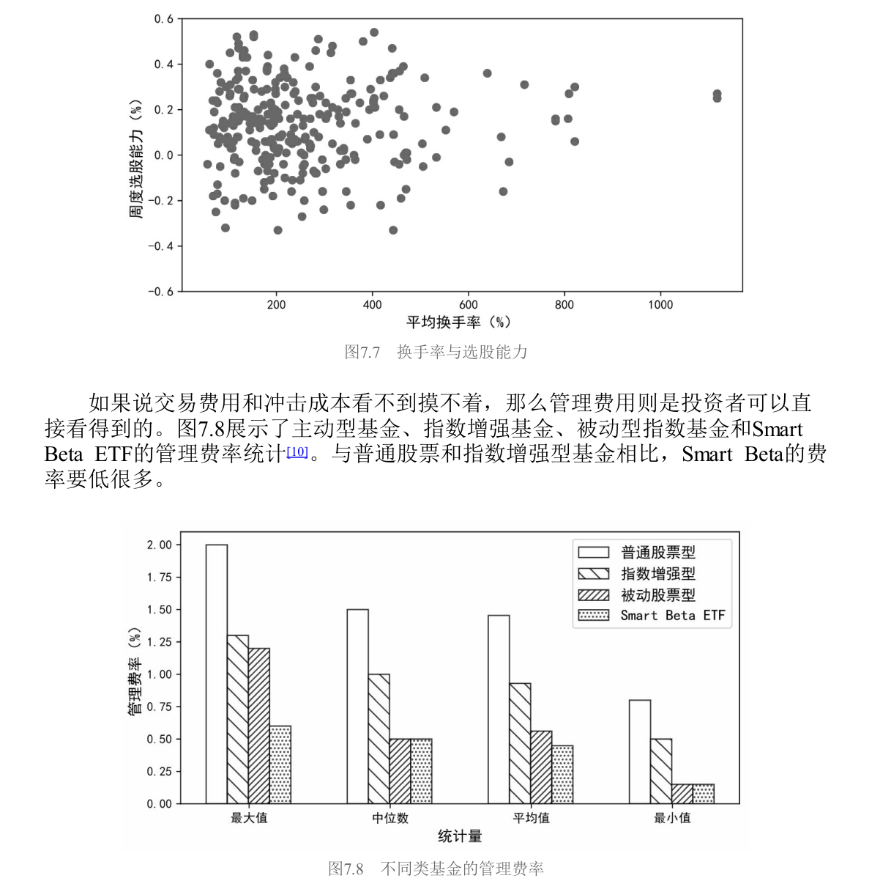

**增加透明度**。主动投资有三大隐患：委托代理问题（基金经理的目标未必是投资人利益最大化）、风格漂移（基金经理变更或投资框架不成熟导致风格反复横跳，国内基金经理人均任职仅1.72年）、人性弱点（过度自信、锚定效应、处置效应等认知偏差）。Smart Beta作为指数化投资，考核核心是跟踪误差而非排名，规则在设计之初就确定，不受情绪影响，也不因人员变动而漂移。

### 7.4.3 如何投资Smart Beta

#### Smart Beta市场一览

美国市场已相当成熟——截至2019年末，Smart Beta ETFs超过900支，合计管理规模9826.9亿美元。**表7.13** 列出了规模最大的10支，2019年平均管理规模370.9亿美元，涵盖价值、成长、股利和低波动。最早的在2000年就有了，运转超过20年。

**表7.13 美国市场中规模最大的10支Smart Beta ETFs**

| 排名 | ETF名称 | 管理规模（亿美元） | 因子类型 | 成立年份 |
|------|---------|-------------------|----------|----------|
| 1 | iShares Russell 1000 Value | 约600+ | 价值 | 2000 |
| 2 | iShares MSCI USA Quality Factor | 约400+ | 质量 | 2013 |
| 3 | Invesco S&P 500 Low Volatility | 约350+ | 低波动 | 2011 |
| 4 | Vanguard Value ETF | 约300+ | 价值 | 2004 |
| 5 | iShares MSCI USA Momentum Factor | 约250+ | 动量 | 2013 |
| 6 | SPDR S&P Dividend ETF | 约200+ | 股利 | 2005 |
| 7 | iShares Russell 1000 Growth | 约200+ | 成长 | 2000 |
| 8 | Vanguard Growth ETF | 约200+ | 成长 | 2004 |
| 9 | iShares Edge MSCI Min Vol USA | 约200+ | 最小方差 | 2011 |
| 10 | Invesco S&P 500 High Dividend Low Volatility | 约150+ | 高股息低波 | 2012 |

*注：规模为2019年末数据，表中数值为示意量级，精确值请参考原文表7.13*

但回到国内，情况完全不同。2006年华泰柏瑞发行了国内首支Smart Beta基金——上证红利ETF。图7.9展示了国内Smart Beta ETFs的发行数量和管理规模，2019年是个明显的拐点。**表7.14** 汇总了国内所有产品。

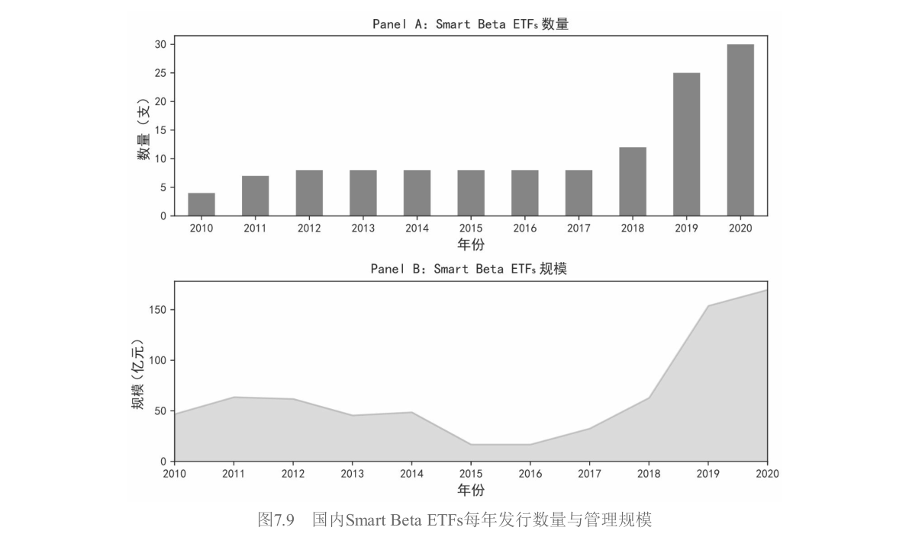

**表7.14 中国市场中的Smart Beta ETFs**

| 因子类型 | 产品数量 | 规模（亿元） | 占比 |
|----------|----------|-------------|------|
| 红利 | 较多 | 约60+ | ~35% |
| 质量 | 较多 | 约44+ | ~26% |
| 低波 | 中等 | 约30+ | ~18% |
| 多因子 | 较少 | 约16+ | ~9% |
| 价值 | 较少 | 约10+ | ~6% |
| 规模（小市值） | 较少 | 约5+ | ~3% |
| 成长 | 较少 | 约4+ | ~2% |
| **合计** | **30支** | **169.62** | **100%** |

*注：数据截至2020年一季度末*

国内无论是产品数量、总规模还是投资者认知，都还在非常早期的阶段。这意味着**对于国内投资者来说，Smart Beta的赛道不拥挤，但可选工具也有限**。

#### 筛选流程

面对形形色色的产品，三步走。第一步明确投资目标——长期增强收益还是短期降低波动？这决定了往进攻型因子（小市值、高成长）还是防御型因子（低波动、高质量）上靠。第二步确定因子暴露，找到跟目标匹配的因子类型。第三步，如果同一类因子有多个产品，从**因子暴露程度**和**管理费用**综合评估——暴露决定能拿到多少溢价，费用决定付出多少成本。

#### 基金评价

评价Smart Beta基金需要一套指标体系，分两条线：从**净值序列**入手和从**持仓明细**入手。图7.10汇总了完整的评价指标体系。

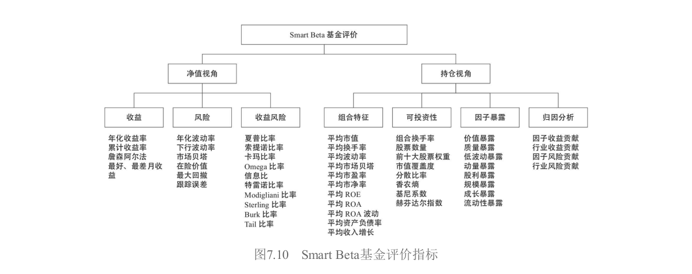

净值序列关注三类指标：收益类（年化收益率等，越高越好）、风险类（最大回撤等，越低越好）、风险调整后收益类（夏普比率等，越大越好）。持仓明细可以深入挖掘：组合特征（具体持有什么股票）、因子暴露程度（相对基准的暴露越高越好）、可投资性（换手率不能太高，否则费用损耗大且易踩踏；持仓不能太集中）、风格与风险归因（7.6和7.7节的内容）。

#### 拥挤度

图7.11展示了美股市场上因子拥挤度与未来风险的关系。无论看未来1个月、3个月、6个月还是12个月，**拥挤度越高，未来回撤和波动越大；拥挤度越低，未来越安稳**。从风险管理的角度，当一个因子处于拥挤状态时，需要格外谨慎。

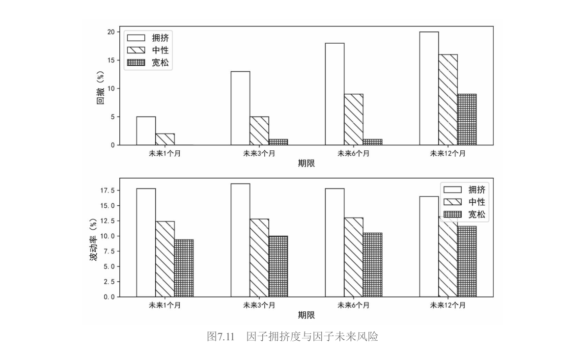

### 7.4.4 应用实践

这一节用作者自己维护的**BetaPlus 1000指数系列**做实证。BetaPlus 1000对标罗素1000，包含A股总市值最大的1000只股票（覆盖全市场约90%市值）作为基准。在此基础上构建了价值、质量、红利、动量、低波动和规模六大类因子指数。

**表7.15** 汇总了2000年1月到2019年12月这20年间各指数的表现。

**表7.15 BetaPlus指数风险收益特征**

| 指数 | 年化收益率(%) | 年化波动率(%) | 夏普比率 |
|------|--------------|--------------|----------|
| BetaPlus 1000（基准） | 7.24 | 27.63 | ~0.26 |
| 价值 | ~11+ | ~28 | ~0.39 |
| 质量 | ~12+ | ~27 | ~0.44 |
| 红利 | ~10+ | ~27 | ~0.37 |
| 低波动 | ~9+ | ~24 | ~0.38 |
| 动量 | ~8+ | ~28 | ~0.29 |
| 规模（小市值） | ~8+ | ~29 | ~0.28 |

六个因子指数的年化收益率和夏普比率**全部优于基准**。表现最好的是**质量和价值**，依赖基本面信息的价值投资在A股长期有效。规模（小市值）表现一般——BetaPlus 1000本身已是大市值股票池，在这个池子里再选小市值效果自然不如在全市场里做。**动量**是所有因子中表现最差的，仅微弱跑赢基准——这跟A股市场**反转效应太强**有直接关系。

**表7.16** 展示了不同因子指数相对基准的月频超额收益之间的相关系数。

**表7.16 BetaPlus因子指数超额收益相关系数**

| | 价值 | 质量 | 红利 | 低波动 | 动量 | 规模 |
|--|------|------|------|--------|------|------|
| 价值 | 1.00 | — | 高正相关 | 低相关 | **显著负相关** | 低相关 |
| 质量 | — | 1.00 | 低相关 | **负相关** | 低相关 | 低相关 |
| 红利 | — | — | 1.00 | 低相关 | 负相关 | **-0.51** |
| 低波动 | — | — | — | 1.00 | 低相关 | 低相关 |
| 动量 | — | — | — | — | 1.00 | 低相关 |
| 规模 | — | — | — | — | — | 1.00 |

价值和红利相关性较高（股息率本质是价值指标）。价值和动量显著负相关——涨得好的股票估值被推高，自然就偏成长而非价值。质量和低波动负相关，说明两个防御因子并非简单替代品。规模和红利-0.51的负相关，因为大公司倾向于高分红，小公司处于成长期、分红比例低。

图7.12展示了各指数的月度换手率。基准BetaPlus 1000月换手率最低（均值6.83%）。质量和红利换手率也低，因为财报数据披露频率低。**动量最高，达32.9%**——直接受行情变化驱动，市场一动就必须跟着动。高换手意味着高成本，这是动量在A股表现平庸的另一个原因。

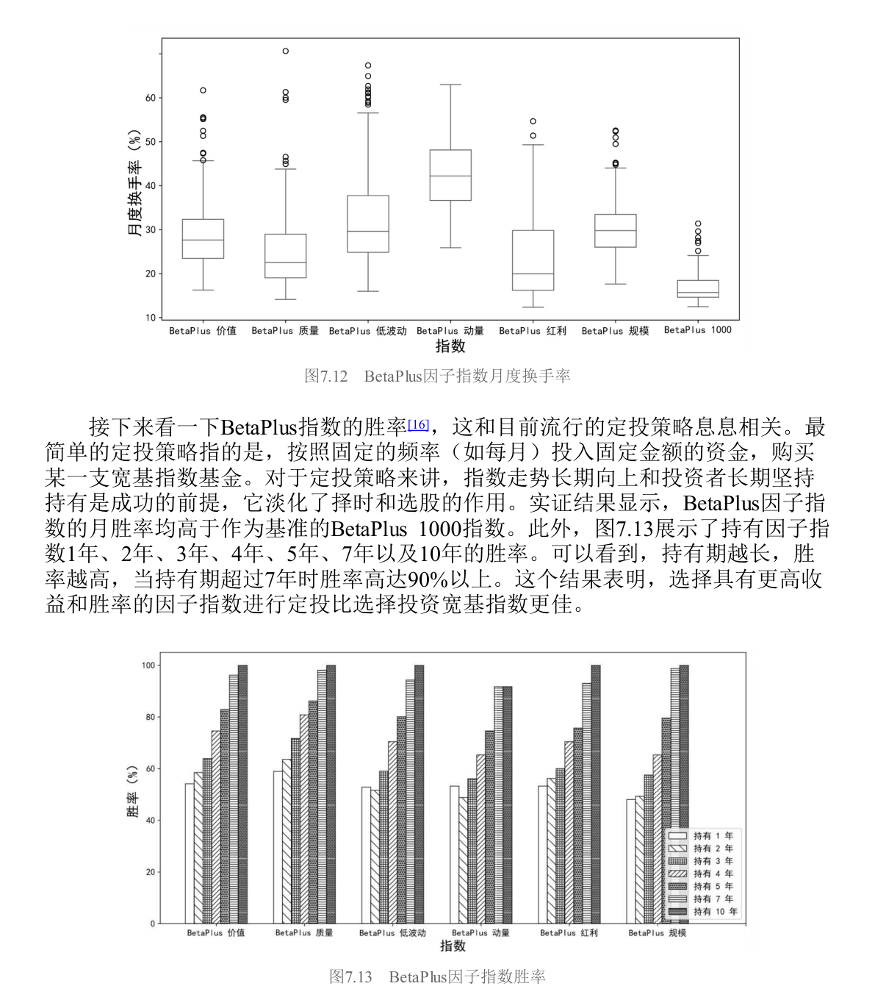

作者还测了**胜率**——持有因子指数1年、2年、3年...10年后累计收益大于0的概率。图7.13显示所有因子指数的月胜率都高于基准，而且**持有期越长胜率越高——持有超过7年时，胜率超过90%**。这意味着对于长期定投的投资者，选择因子指数比选择宽基指数更优。

#### 混合还是整合？

持有一篮子单因子指数，有两种组织方式。

**混合法（Mix）** 把每个因子当成独立的子基金，分别选股分别持仓，你在组合层面等权重持有。优点是单个组合能最大化暴露在目标因子上，简单直观；缺点是因子之间相关性低，持仓重合度低，总持仓数量可能过多，而且你需要决定每个子基金的权重。

**整合法（Integrate）** 在选股层面就综合考虑多因子——给每只股票打六个维度的分，加总后选综合得分最高的前200只，按流通市值加权。优点是一站式解决，资金门槛低；缺点是无法灵活地对单个因子做动态调整。

**表7.17** 和 **图7.14** 展示了两种方法的对比。

**表7.17 整合法和混合法的风险收益特征**

| 指标 | 混合法 | 整合法 | 基准（BetaPlus 1000） |
|------|--------|--------|----------------------|
| 年化收益率(%) | ~10+ | ~12+ | 7.24 |
| 夏普比率 | ~0.38 | ~0.44 | ~0.26 |
| 最大回撤(%) | ~45+ | ~48+ | ~65 |

两种方法都能稳定战胜基准，但**整合法表现更优**——年化收益率高约1.49%，夏普比率高0.06。不过整合法最大回撤也略大一些。海外研究没有定论：Bender and Wang（2016）发现整合法在收益、夏普和信息比率上都显著优于混合法；但Chow et al.（2018）指出整合法有更高的持股集中度和换手率，可投资性打折扣。Ghayur et al.（2018）认为取决于因子暴露水平——暴露低时混合法好，暴露高时整合法好。

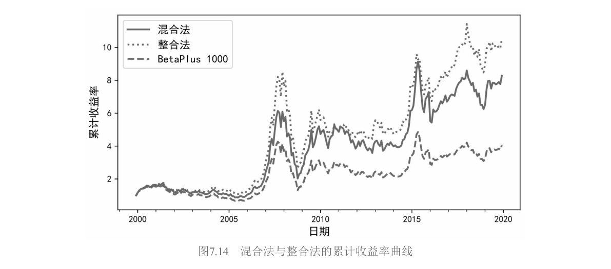

#### 因子配置权重

混合法里面对六个单因子组合，该给各自配多少权重？**表7.18** 汇总了五种常见方法。

**表7.18 因子配置方法**

| 配置方法 | 金融学假设 | 实现方式 |
|----------|------------|----------|
| 简单多样化（等权重） | 无 | 各因子权重相等 |
| 波动率倒数 | 低波动因子应配更高权重 | $w_k \propto 1/\sigma_k$ |
| 风险平价 | 各因子对组合风险贡献相等 | 需解优化问题 |
| 最大分散度 | 最大化组合分散化程度 | 类似最大多样化 |
| 因子动量加权 | 近期表现好的因子应配更高权重 | 按近期IC或收益率加权 |

**表7.19** 给出了实证结果。

**表7.19 不同因子配置方法的实证结果**

| 配置方法 | 年化收益率(%) | 夏普比率 | 说明 |
|----------|--------------|----------|------|
| 等权重 | ~10+ | ~0.38 | 已非常优秀 |
| 波动率倒数 | ~10+ | ~0.38 | 提升不明显 |
| 风险平价 | ~10+ | ~0.38 | 提升不明显 |
| 最大分散度 | ~10+ | ~0.38 | 提升不明显 |
| 因子动量加权 | ~10+ | ~0.38 | 提升不明显 |

**五种方法的差别不大。** 简单多样化已经非常优秀，更复杂的方法并没有带来明显提升。这不意外——被配置的六个因子指数本身风险收益差异不大，而且复杂方法需要估计更多参数，历史数据估计参数的误差很大。DeMiguel et al.（2009）针对美股资产配置也得出了类似结论。因子配置权重本质上属于因子择时，是否有效尚无明确答案。

#### 通过择时选择因子

既然不同因子在不同市场状态下表现不同（表7.12），能不能根据市场状态动态切换？图7.15用双均线系统（1个月均线 vs 6个月均线）划分市场状态。图7.16统计了质量和价值指数在两种状态下的表现差异——上涨市价值优于质量，下跌市质量远优于价值。

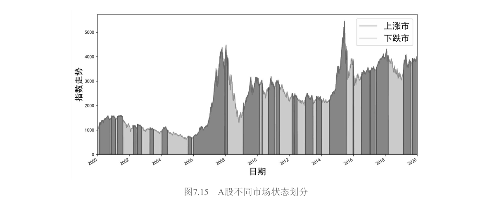

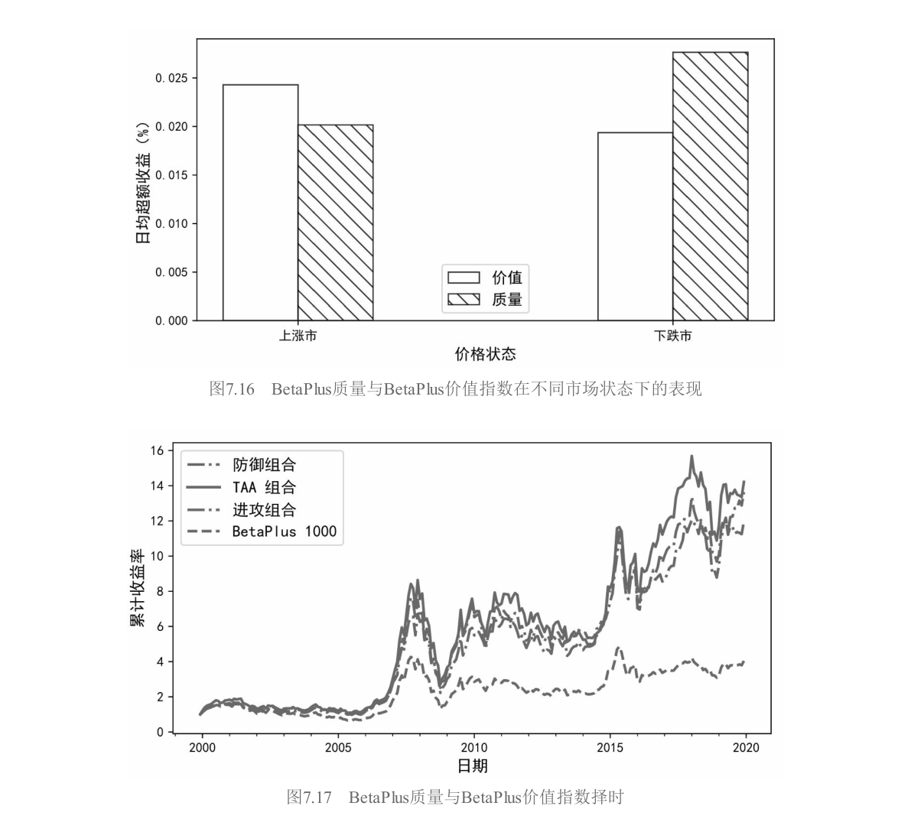

基于这个规律，设计了一个简单的战术配置（TAA）规则：上涨市持有价值指数，下跌市持有质量指数。图7.17和表7.20展示了结果。

**表7.20 BetaPlus质量与BetaPlus价值指数择时的风险收益特征**

| 指标 | TAA配置 | BetaPlus价值 | BetaPlus质量 | BetaPlus 1000基准 |
|------|---------|-------------|-------------|-------------------|
| 年化收益率(%) | **13.98** | ~11+ | ~12+ | 7.24 |
| 最大回撤(%) | **较低** | ~50+ | ~45+ | ~65 |

TAA配置实现了更高的收益，最大回撤还低于基准——"既要又要"的结果。但作者没有过度渲染：7.5节会告诉你**因子择时极难**，这个简单的双均线规则能否在未来持续奏效，大有问题。这里更多是展示一种可能性，而非推荐一种策略。

### 7.4.5 更多讨论

Smart Beta不止于股票。价值、动量、利差、防御等因子广泛存在于债券、商品、外汇、信用等资产中。**表7.21** 展示了AQR的因子体系在不同资产类别下的定义方式。

**表7.21 AQR因子体系**

| 因子 | 股票 | 利率债 | 信用债 | 商品 | 外汇 |
|------|------|--------|--------|------|------|
| 价值 | 高BM | 实际收益率相对预期通胀 | 利差 | 现价相对5年前价格 | 购买力平价偏离 |
| 动量 | 过去收益率 | 过去收益率 | 过去收益率 | 过去收益率 | 过去收益率 |
| 利差/ carry | 高股息率 | — | 信用利差 | 展期收益 | 利率差异 |
| 防御/低波 | 低Beta | 低久期 | 低久期高评级 | 低波动 | 低波动 |

因子的普适性，正是海外业界从"资产配置"转向"因子配置"的底层逻辑。

但Smart Beta的落地面临两大挑战：一是因子被曝光后会减弱甚至失效（第6章6.6节详细讨论过）；二是资金涌入导致因子过度拥挤。这两个问题相互交织——因子越有效就越多人用它，越多人用它就越容易失效和被踩踏。这是一个因子投资领域的根本性悖论。

作者最后给出了一个富有洞察力的结语：随着A股市场越来越开放和有效，传统的主动超额收益$\alpha$会逐渐被蚕食。当$\alpha$小到无法覆盖为了挖掘它而付出的高昂管理费、研究成本和人力成本时，**低成本的Smart Beta会变得越来越有吸引力**。这不是预测，这是已经在美国和欧洲发生过的历史。A股只是时间问题。

---

## 7.5 因子择时

7.4结尾那个双均线切换价值和质量的例子，年化13.98%还降低了最大回撤，听起来美得像童话故事。7.5的任务就是告诉你：**童话故事大多只发生在回测里**。

因子择时的愿景极其诱人。既然股票收益率由因子收益率驱动，而因子收益率在时序上又有波动，那最理想的状态当然是——因子涨的时候多配它，因子跌的时候少配甚至不配。但金融领域的数据信噪比极低，时序上可利用的相关性非常有限。作者没有把择时包装成"独门绝技"，而是把研究体系完整铺开，让你自己看到为什么它这么难。**表7.22** 汇总了五类影响因素。

**表7.22 用于因子择时的因素**

| 类别 | 因素 | 说明 |
|------|------|------|
| 因子自身表现 | 因子估值 | 价值价差（value spread） |
| | 因子动量 | 因子近期的收益率表现 |
| | 因子波动 | 因子收益率的波动率和相关性 |
| 外部环境 | 市场情绪 | 投资者整体乐观/悲观程度 |
| | 宏观因素 | 经济周期、利率、通胀等 |

### 7.5.1 按因子估值择时

给股票估值我们很熟悉——PE高了就贵。那因子投资组合本身有没有"估值"？Asness et al.（2000）给出了答案。从Gordon增长模型出发，$E[R] = E/P + g$。对价值因子的多头（价值股）和空头（成长股）分别拆解，两式相减：

$$E[R_{value}] - E[R_{growth}] = (E/P_{value} - E/P_{growth}) - (g_{growth} - g_{value})$$

第一项 $(E/P_{value} - E/P_{growth})$ 是**价值价差**（value spread），衡量价值股相对成长股的便宜程度。价差大说明因子估值低，应超配；价差小说明估值高，应低配。Asness et al.（2017）给出了具体的权重算法：因子权重取决于当前价值价差在过去36个月区间里的相对位置。

逻辑上完全自洽，但实证结果冷峻：**按估值择时的超额收益和价值因子本身在时序上的表现高度相关**。一旦价值因子本身表现不好（如2008年金融危机后美股价值因子持续跑输），按估值择时也好不到哪里去。

### 7.5.2 按因子动量择时

股票有动量效应——过去涨得好的继续涨。因子本身有没有动量？

Arnott et al.（2019）用1963-2016年美股数据，计算51个因子收益率序列，每月做多过去收益率最高的8个因子、做空最低的8个因子。以1个月动量和1个月持有期为例，**因子动量能获得10.49%的年化收益率**。而且因子动量没有像个股动量那样发生过著名的"momentum crash"，在2000年以后表现依然稳健。Ehsani and Linnainmaa（2019）和Gupta and Kelly（2019）用更大样本验证了类似结论。

这给了择时一个直接有力的启发：给予近期表现强的因子更高权重。作者点出：**业界常见的按照IC高低来计算因子权重，本质上就属于按因子动量择时**。

### 7.5.3 按因子波动择时

从风险角度决定权重，常见工具包括最小方差、风险平价和波动率倒数加权：

$$w_k \propto \frac{1/\sigma_k}{\sum_{j=1}^{K} 1/\sigma_j}$$

低波动因子获得更多权重，高波动因子获得更少。它被称为"朴素风险平价"——只需要单个因子的波动率，不需要估计它们之间的相关性。Rabener（2018）对比发现，风险平价的最大回撤明显小于等权重，但从收益角度看没有明确结论。这是一种"不求有功但求无过"的择时哲学。

### 7.5.4 按市场情绪择时

与市场择时不同，市场情绪从资本市场的整体特征观察因子表现。Baker and Wurgler（2006）发现：情绪高涨时投资者偏爱进攻型股票（小盘、新股、成长），情绪低迷时涌向防御型（低波动、基本面扎实）。但这种追逐本身过度且盲目，导致被追捧的股票价格被推高，未来预期收益反而降低。

Ung and Luk（2016）用VIX作为情绪代理变量，把市场划分为乐观、中性、悲观三种状态。**表7.23** 统计了各因子的表现。

**表7.23 不同市场情绪下因子指数相对标普500指数的表现**

| 情绪状态 | 价值 | 质量 | 低波动 | 动量 | 股利 | 规模 |
|----------|------|------|--------|------|------|------|
| 乐观 | 较好 | 一般 | 负超额 | 较好 | 一般 | 较好 |
| 中性 | 一般 | 一般 | 一般 | **优秀** | 一般 | 一般 |
| 悲观 | 一般 | **优秀** | **优秀** | 较差 | **优秀** | 一般 |

乐观时价值和动量较好，低波动为负；中性时动量优秀；悲观时低波动、质量和股利异常突出（年超额收益均超10%），动量较差。如果能有效预测市场波动率水平——高波动市场高配价值和动量，低波动市场高配质量和低波动——大概率能获更好结果。当然，"如果"是这里最昂贵的词。

### 7.5.5 按宏观因素择时

宏观因素包括经济周期、利率水平、货币供给、政治事件、社会冲击等，传导链条错综复杂。Bender et al.（2018）考虑了一系列经济变量作为预测因子。**表7.24** 做了汇总。

**表7.24 影响因子表现的宏观经济变量**

| 宏观变量 | 对价值因子 | 对盈利因子 | 对投资因子 |
|----------|-----------|-----------|-----------|
| 期限利差 | 强预测力（>6月持仓） | 高度负相关 | 强预测力（>6月持仓） |
| TED利差 | 强预测力（>6月持仓） | — | 强预测力（>6月持仓） |
| 单位产出增长率 | 较强相关（>1年持仓） | — | 较强相关（>1年持仓） |
| 个人储蓄率 | 较强相关（>1年持仓） | — | 较强相关（>1年持仓） |
| CPI/PPI | 较强相关（>1年持仓） | — | 较强相关（>1年持仓） |

Ung and Luk（2016）还从商业周期角度做了分析。**表7.25** 展示了结果。

**表7.25 不同商业周期下因子指数相对标普500指数的表现**

| 因子 | 经济扩张 | 经济收缩 | 特征 |
|------|----------|----------|------|
| 价值 | 正超额收益 | 表现较差 | **顺周期** |
| 质量 | 正超额收益 | 表现更好 | **全天候** |
| 动量 | 正超额收益 | 表现较差 | **顺周期** |
| 规模 | 正超额收益 | 正超额收益 | 灵活性好 |
| 低波动 | 表现一般 | **表现优异** | **逆周期** |

价值具有顺周期特征，经济扩张时好、收缩时差。质量全天候，收缩时尤其亮眼。动量也是顺周期。低波动是典型的逆周期因子——经济扩张时不起眼，经济变差时崭露头角，是对冲经济下行的利器。

### 7.5.6 因子择时很难

前面五节展示了五条看上去各有道理的择时路径，但作者在这一节给出了冷静甚至残酷的总结：**找到影响因素和成功择时，是两件完全不同的事**。

Bender et al.（2018）指出了择时研究面临的陷阱：预测因素和因子收益之间的关系是动态变化的；挑选的指标有数据窥探和幸存者偏差嫌疑；部分宏观数据存在事后修正，实证可能不知不觉中使用了未来数据。

Newfound Research的结论更加直白：因子估值和因子动量择时确实有一定效果，但**考虑交易成本以后，相对不择时的等权重配置优势尽失**。用商业周期数据做择时更像是过度拟合。而如果等权重持有多个因子组合，胜率本身就很高——尤其是持有时间较长的情况下。**要战胜等权重，非常困难**。

Dichtl et al.（2020）发现，虽然因子能明显提升传统宽基指数的表现，但在因子之间动态分配权重以获得更优结果却很困难。DeMiguel et al.（2009）的著名结论——各种优化方法都很难超越简单多样化——对因子配置同样适用。参数估计的误差是复杂方法的阿喀琉斯之踵，而等权重的朴素恰恰成了它的盔甲。

7.5节的最终姿态不是"因子择时绝对不可能"，而是把研究体系完整呈现后，让你看到每一条路径上的荆棘。**对大多数投资者来说，等权重持有一篮子有逻辑的、长期有溢价的因子，可能已经是接近最优的选择。**

---

## 7.6 风格分析

风格分析和风险归因常常被放在一起讨论——它们共享同一个底层逻辑：把投资组合的总表现拆解成不同来源的加总。但风格分析更偏向**收益侧**（你的钱是怎么赚的），风险归因更偏向**风险侧**（你的波动和回撤由什么贡献）。

### 7.6.1 经典风格分析

风格分析的起点是Sharpe（1992），他因此获得了2015年的Wharton-Jacobs Levy Prize。Sharpe的模型形式上就是一个多因子回归：

$$R_{it} = \beta_{i1}\lambda_{1t} + \beta_{i2}\lambda_{2t} + \cdots + \beta_{iK}\lambda_{Kt} + \varepsilon_{it}$$

但Sharpe加了三条非常严格的约束。第一条是**MECE原则**——因子之间必须"不重不漏"（Mutually Exclusive and Collectively Exhaustive），每支股票属于且仅属于某一个因子。第二条是暴露之和必须等于100%。第三条是禁止卖空，所有暴露非负。

这些约束在实操中非常突出。首先，风格指数的选择充满随意性——不同指数商对"价值"的定义可能完全不同，基于不同指数的风格分析可能得出截然不同的结论。其次，暴露之和为100%的约束可能扭曲估计结果。最后，MECE意味着因子数量随风格维度呈指数增长——大/中/小盘 × 价值/平衡/成长就需要9个因子。

### 7.6.2 基于多空因子的风格分析

鉴于经典框架的困境，人们提出了更灵活的替代方案——改用超额收益对多空因子做回归：

$$R_{it} - R_{Bt} = \beta_{i1}\lambda_{1t} + \beta_{i2}\lambda_{2t} + \cdots + \beta_{iK}\lambda_{Kt} + \varepsilon_{it}$$

$R_{Bt}$ 是基准收益。这个转变带来了两个解放：不再需要暴露之和为100%的约束；允许使用多空因子组合而非纯多头风格指数。

进一步，如果把基准指数的超额收益也移到右边，就演变成了我们熟悉的多因子定价模型形式：

$$R_{it}^e = \alpha_i + \beta_{i1}\lambda_{1t} + \cdots + \beta_{iK}\lambda_{Kt} + \tilde{\varepsilon}_{it}$$

这正是Fama-French三因子、五因子、Hou-Xue-Zhang四因子等模型的标准形式。所以风格分析本质上就是**多因子定价模型的反向应用**——不是检验资产定价是否合理，而是用已知的因子去"解释"一个投资组合的表现，看它的收益有多少能被风格暴露说明，剩下多少是"真·alpha"。

Carhart（1997）是这个领域的里程碑。他在Fama-French三因子基础上加入动量因子，构建了著名的**Carhart四因子模型**，发现它能解释绝大多数股票型基金的业绩。更重要的是，他发现表现最好的基金相比表现最差的基金，在规模和动量因子上有着显著更高的暴露，而在价值因子上没有显著差异。这种风格差异使优异基金每月多产生0.67%的超额收益，远大于它们alpha的差异（仅0.29%）。**基金业绩的差异，更多来自"站对了风格的位置"，而非"选股能力"。**

### 7.6.3 实例：巴菲特的投资风格

风格分析最精彩的案例，莫过于对股神巴菲特的"解剖"。

Frazzini et al.（2018）基于1976-2011年间伯克希尔哈撒韦的数据，发现巴菲特实现了19.0%的年化收益和0.76的夏普比率，业绩优于任何一支存续30年以上的美国股票或共同基金。

但关键问题：这些业绩是不是只是"风格溢价"的堆砌？用Carhart四因子模型做风格分析，结果令人震惊——**巴菲特的组合仍然有高达12.1%的年化超额收益**（t值3.19，高度显著）。四因子解释不了巴菲特。

为什么？因为Carhart四因子里没有"质量"这个概念。Frazzini et al.于是在模型中加入了**质量因子（QMJ，Quality Minus Junk）** 和 **低$\beta$因子（BAB，Betting Against Beta）**。结果戏剧性的反转发生了：**加入这两个因子后，巴菲特的alpha消失了**。

进一步，作者构建了一个"仿巴菲特组合"——具有与巴菲特相同风格暴露和波动率的假想组合。这个组合甚至有着比巴菲特更为优异的表现（不考虑交易费用）。所以传统意义上"买便宜股票"的价值投资标签，并不足以定义巴菲特。**高质量投资才是他更本质的风格特征**——高质量 + 低风险 + 对杠杆的极致运用。

不过这里有一个精彩的后续。Hou et al.（2019a）用他们的**q-因子模型**和增强版**q5模型**，也对巴菲特做了风格分析。在Frazzini et al.的原始区间（1976-2011年），q模型和六因子模型都能较好地解释巴菲特。但**当样本扩展到1968-2018年时，所有模型都无法很好地解释巴菲特了**——q模型、q5模型和六因子模型都留下了每月0.6%以上的显著alpha。

这传递了两个信息。第一，巴菲特确实是"样本外的奇迹"——他在数十年前就建立了一套极为卓越的投资风格，并持续获得优异回报。第二，**没有完美的风格分析模型**——q5和六因子模型互相提供对方无法包含的信息。风格分析不是"找到终极真理"，而是"用多套有逻辑的模型交叉验证，逼近真相"。

Hou et al.（2019a）还做了一项有趣的工作——用q和q5模型对一系列经典价值投资策略做风格分析。**表7.26** 列出了这些策略。

**表7.26 Hou et al.（2019a）进行风格分析的价值投资策略**

| 策略 | 核心逻辑 |
|------|----------|
| 内在价值策略 | 估计公司内在价值，买入被低估的 |
| F-Score | 从盈利能力、资本结构和运营效率三方面综合评估 |
| 神奇公式 | 净有形资产回报率 + 盈利回报率 |
| 质量因子 | 盈利能力、成长性和安全性三维复合 |
| AFA（不可知论基本面分析） | 通过财务数据截面回归估计内在价值 |
| Penman and Zhu（2019） | 用8个指标估计预期盈利和增长 |

**表7.27** 总结了结果：对于绝大多数价值投资策略，q和/或q5模型中的因子都能较好地解释它们的收益率。这些策略的"风格"可以被现代多因子模型捕捉——它们的超额收益很大程度上只是对已知风格因子的暴露。但巴菲特在超长样本下依然逃逸了所有模型的捕捉，这正是他与众不同的地方。

**表7.27 价值投资策略风格分析结果**

| 策略 | q模型解释力 | q5模型解释力 | 主要暴露的因子 |
|------|------------|-------------|---------------|
| 内在价值 | 较好 | 更好 | 盈利、投资 |
| F-Score | 好 | 更好 | 盈利 |
| 神奇公式 | 好 | 更好 | 盈利、价值 |
| 质量因子 | 好 | 更好 | 盈利 |
| AFA | 较好 | 更好 | 盈利、投资 |
| Penman-Zhu | 好 | 更好 | 盈利、投资 |

---

## 7.7 风险归因

风格分析告诉你收益从哪来，风险归因告诉你风险从哪来。在投资组合管理中，这两件事缺一不可。

### 7.7.1 两种传统风险归因方法

Menchero and Davis（2011）之前，风险归因主要有两条路径，但都各有缺陷。

第一种是**独立风险贡献法**。对每个收益源m，计算它自己的风险 $\sigma(x_m r_m)$。但这个方法根本不考虑收益源与投资组合之间的相关性，也不考虑收益源之间的相关性。各收益源的独立风险加起来**不等于**投资组合的总风险：$\sum \sigma(x_m r_m) \neq \sigma(R)$。

第二种是**边际风险贡献（MCR，Marginal Contribution to Risk）**，用偏导数定义：$MCR_m = \partial \sigma(R) / \partial x_m$。它的优点是数学精确，而且所有边际风险贡献之和恰好等于组合总风险。但MCR的弱点是业务解释性极差——基金经理听到"某因子的边际风险贡献是0.5%"时，很难直观理解这个数字到底意味着什么。

### 7.7.2 风险的三要素

Menchero and Davis（2011）提出了一个既数学精确又业务直观的替代方案——**风险归因三要素公式**：

$$\sigma(R) = \sum_{m=1}^{M} x_m \cdot \sigma(r_m) \cdot \rho(r_m, R)$$

这个公式的优美之处在于它同时解决了前两种方法的困境。和独立风险法相比，它通过 $\rho(r_m, R)$ 引入了收益源与投资组合的相关性，使得各项贡献加总恰好等于组合总风险。和MCR相比，它把抽象的偏导数翻译成了三个有血有肉的业务概念：

$$风险贡献_m = \underbrace{x_m}_{暴露} \times \underbrace{\sigma(r_m)}_{波动率} \times \underbrace{\rho(r_m, R)}_{相关性}$$

**暴露 $x_m$**：完全由基金经理决定，反映了投资偏好。它可以为正（主动承担该风险）也可以为负（主动对冲）。

**波动率 $\sigma(r_m)$**：收益源m自身的"脾气"。波动越大，对组合风险的潜在影响也越大。

**相关性 $\rho(r_m, R)$**：收益源m和投资组合收益率之间的"同步程度"。相关性越高，m的波动传导到组合里的确定性就越大。

三要素还揭示了一个MCR无法揭示的深层结构。假设两个收益源的MCR都是1%，暴露也相同。光看MCR它们"一样危险"。但分解后，假设收益源1的波动是10%、与组合的相关性是0.1（10% × 0.1 = 1%），收益源2的波动是2%、与组合的相关性是0.5（2% × 0.5 = 1%）。虽然MCR相同，但收益源1的风险主要来自自身高波动，收益源2的风险主要来自与组合高度同步。由于波动率比相关性更容易从历史数据中稳定估计，收益源1的实际风险不确定性可能远高于收益源2。

作者还证明了MCR和三要素之间的精确关系：$MCR_m = \sigma(r_m) \cdot \rho(r_m, R)$。边际风险贡献恰好等于波动率与相关性的乘积——三要素公式不是MCR的替代品，而是MCR的**解构**。

### 7.7.3 从风险角度看收益相关性

三要素公式还有一个副产品：为理解"收益相关性"提供了全新视角。投资组合中任意收益源m与总收益R的相关性，可以分解为m与所有其他收益源n的相关性的加权求和：

$$\rho(r_m, R) = \sum_{n=1}^{M} x_n \cdot \frac{\sigma(r_n)}{\sigma(R)} \cdot \rho(r_m, r_n)$$

收益源n对 $\rho(r_m, R)$ 的"拖拽"力度由三个因素决定：组合对n的暴露 $x_n$、n的波动相对于组合波动的比例 $\sigma(r_n)/\sigma(R)$、以及n与m的相关性 $\rho(r_m, r_n)$。只有当暴露足够大、波动有可比性、且相关性高这三个条件同时满足时，n才足以影响m与组合的相关性。这给了基金经理一个非常清晰的风险管理操作框架：如果想降低组合对某个风险因子的敏感度，可以从减少暴露、降低该因子波动（用对冲工具）、或者降低它与其他风险源的关联性（通过分散化）三个杠杆入手。

### 7.7.4 将三要素应用于多因子模型

把收益源替换为多因子模型中的因子，假设投资组合包含N只股票，每只股票i的权重为 $\omega_i$，则投资组合的超额收益率为：

$$R_p = \sum_{k=1}^{K} x_k \lambda_k + \sum_{i=1}^{N} \omega_i \varepsilon_i$$

其中 $x_k = \sum_{i=1}^{N} \omega_i \beta_{ik}$ 是投资组合在因子k上的暴露。应用三要素公式：

$$\sigma(R_p) = \sum_{k=1}^{K} x_k \cdot \sigma(\lambda_k) \cdot \rho(\lambda_k, R_p) + \sum_{i=1}^{N} \omega_i \cdot \sigma(\varepsilon_i) \cdot \rho(\varepsilon_i, R_p)$$

投资组合的风险被干净地分解为两部分：第一项是**因子系统性风险**——来自K个共同因子的波动及其与组合的相关性；第二项是**个股特质性风险**——来自N只股票各自的"个性"波动。在投资中，这两部分都需要同时考虑，才能正确地对投资组合进行风险归因。

---

## 7.8 因子投资展望

### 7.8.1 另类数据

这一节的开场堪称全书最具戏剧性的案例之一。2018年10月25日，Tesla股价大涨9.14%，原因是前一天盘后发布的财报远超预期——Model 3季度产量几乎翻番。但另类数据公司Thasos及其对冲基金客户在财报公开之前就已经窃喜了：他们在Tesla工厂周围画了一个数字围栏，通过租赁智能手机APP收集的地理位置数据，监测到2018年6月到10月间工厂夜间轮班时间增加了30%，由此推断产能大幅提升，在财报发布前就已提前布局。

这个故事完美诠释了另类数据的诱惑：**在别人看见财报之前，你已经通过数据的暗流感知了真相**。但作者紧接着就泼了五盆冷水。

**第一盆冷水：技术与数据的匹配**。不同类型的数据需要完全不同的分析武器——量价配技术分析，结构化财务配多因子模型，非结构化文本配自然语言处理。另类数据的爆发会带来**维数灾难**——变量暴增而样本量没变，数据在高维空间里越来越稀疏，过拟合风险急剧上升。

**第二盆冷水：需要专业知识**。另类数据不是插上电源就能用的标准化产品。作者打了一个很贴切的比方：它更像是在无人之地发现了一座山，山里有没有矿、从哪挖、能挖出什么，全看你自己的本事。如果你买的是供应商包装好的标准化数据产品，那大概率拥挤度已经很高了。

**第三盆冷水：数据的无偏性**。作者用Glassdoor员工评价数据做案例，剖析得极为精彩。虽然Green et al.（2019）发现员工评价变化高的股票未来收益显著更好，但Glassdoor的数据至少有五个致命缺陷：没有员工认证系统（任何人可以冒充员工评价）；人们更容易在不满时发表负面评价；评分体系缺乏科学依据；有些雇主公然奖励员工刷5星好评；行业分布严重不均（互联网公司员工更热衷评价，制造业工人则不然）。数据的生成过程本身是**有偏的**，用它训练出来的模型，地基就是歪的。

**第四盆冷水：历史样本太短**。大多数另类数据集的历史长度在5年以内，2到3年很常见。Bailey and Lopez de Prado（2012）的研究给出了触目惊心的数字：假设数据实际上完全无法预测收益率——纯粹是噪声——如果数据长度只有2年，你只需要做**7次检验**就能"发现"一个夏普比率为1.0的策略；但如果数据长度增加到5年，需要**45次检验**才能达到同样的"造假效果"。样本越短，越容易过拟合。

**第五盆冷水：检验增量贡献**。你用另类数据构建了一个因子，它在统计上显著——但这够吗？不够。必须检验它在Fama-French五因子基础上是否仍有解释力。如果绕了一大圈发现只是在重复已有因子的故事，那对投资组合的风险调整后收益没有增量价值。

图7.18展示了不同数据类型和分析技术之间的对应关系。

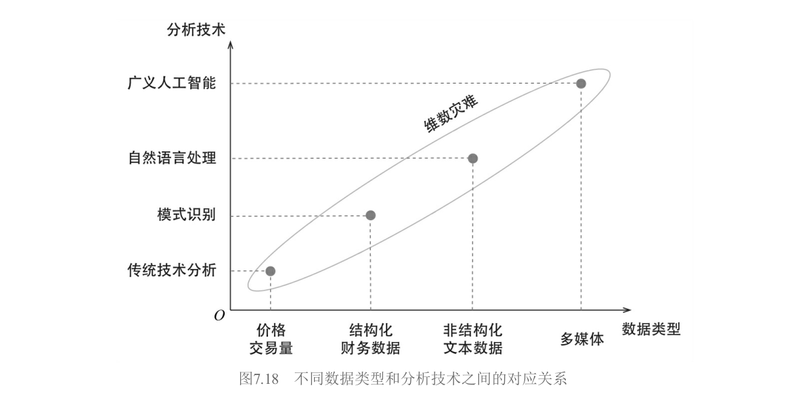

在泼完冷水之后，作者也给了建设性的总结。目前另类数据的四大主流来源包括：**网络抓取数据**（职位发布、公司评价、产品排名，Greenwich Associates研究表明这是使用最广泛的类别）、**情绪数据**（社交媒体、新闻流、财报电话会议记录的语言分析）、**卫星数据**（追踪船只、监测农作物、探测港口油田活动、推断大宗商品库存）以及**消费数据**（信用卡和借记卡交易记录，可追踪零售收入，但获取门槛极高且昂贵）。海外买方在另类数据上的支出逐年增长，这个趋势会继续。但关键在于：**保持正确预期，掌握专业知识，用科学方法检验**。

### 7.8.2 用因子实现大类资产配置

因子投资的最后一个前沿，是把"因子"这个概念从股票市场推广到整个资产配置的版图。

这个范式转移的底层信念是：虽然金融市场里有股票、债券、商品、外汇、房地产等看起来完全不同的资产类别，但它们收益率的波动背后，都是由**少数几个底层公共因子**驱动的。以前人们把债券当作一类资产去配置；现在，债券被视作在利率（rates）、信用（credits）和通货膨胀（inflation）这些更本质的收益驱动力上有不同暴露的组合。配置最底层的因子，比配置表面的资产类别更能实现真正的多样化。

在具体落地时有两个关键问题。第一，**构建因子模拟组合**（Factor Mimicking Portfolios）。很多底层因子——比如实际利率、信用利差、通货膨胀——本身不是可以直接买卖的资产。你需要找到对它们最敏感的资产组合，通过这些资产的收益率来"代理"因子的收益率。**表7.28** 给出了示例。

**表7.28 不同因子的因子模拟投资组合示例**

| 底层因子 | 因子模拟投资组合 |
|----------|-----------------|
| 发达市场股票 | MSCI World指数 |
| 新兴市场股票 | MSCI Emerging Markets指数 |
| 大宗商品 | 彭博大宗商品指数（BCOM） |
| 实际利率 | 长期国债收益率变化 |
| 通货膨胀 | TIPS Breakeven收益率 / 大宗商品指数 |
| 信用 | 投资级公司债利差 |
| 房地产 | REITs指数 |
| 非流动性 | Amihud（2002）非流动性指标 |

*注：仅为示例，实际应用时应根据具体情况精细构建*

第二个问题更为紧迫：**抵御因子的尾部风险**。分散化投资的本意是通过配置不同底层资产，让组合能适应不同的经济周期。但最近几年一个令人不安的趋势是——无论是不同大类资产还是更底层的因子，它们之间的相关性，尤其是**下行时的相关性**（尾部相关性），变得越来越高。每当发生冲击全球经济的黑天鹅事件，几乎没有什么资产或因子能独善其身。2020年的全球市场就是血淋淋的教训。

面对尾部相关性的激增，贝莱德提出了**防御性因子择时（Defensive Factor Timing）** 的理念。这与传统因子择时有根本不同：传统择时是为了预测收益率，防御性择时关注的是**风险**——具体说，是因子协方差矩阵。它是一个低频事件触发机制，唯一目的是规避巨大的市场风险，降低黑天鹅事件的冲击。

防御性因子择时监测三个指标：

- **风险容忍指标（RTI，Risk-Tolerance Indicator）**：用因子收益率和因子波动率的秩相关系数来衡量。当风险偏好高时，高风险因子应该有高收益，秩相关系数为正；当风险偏好骤降时，这种一致性被打破。RTI在2008年全球金融危机和2010、2012年欧洲主权债务危机时都给出了明确的危险信号。

- **多样化比例（DR，Diversification Ratio）**：$DR = \sum w_k \sigma_k / \sigma_p$。DR越大说明因子间相关性越低，分散效果越好；DR越小意味着相关性越高，分散化正在失效。

- **因子估值**：某些因子变得极度昂贵，暗示大量资金涌入，拥挤度高。

作者举了两个成功案例。2012年第二季度，希腊和西班牙问题引发欧洲主权债务危机，RTI从4月底的20%骤降至6月中旬的-60%。防御性因子择时在2012年5月将仓位降低20%，直到8月RTI恢复到0%才重新提仓。2013年夏天，伯南克宣布美联储将削减购债规模引发"减码恐慌（Taper Tantrum）"，RTI没有反应但DR指标急跌，显示因子相关性迅速提升，触发减仓20%抵御风险，直到9月DR恢复才重新加仓。这两个例子说明了**从多维度度量风险的价值**——单一风控指标总有盲区，同时使用多个低相关的风控指标才能构建可靠的防御体系。

如今，使用因子进行大类资产配置已逐渐成为海外市场的主流做法。除了构建因子模拟组合和抵御尾部风险这两个关键外，传统因子投资中的各种要素——是否以及如何预测因子收益率、计算因子的风险、配置因子——也依然至关重要。**和传统因子投资一样，成功的关键也在各种细节之中。**

---

> **全书回望**：第七章把"因子"从学术论文变成了可操作的完整产业链——造收益模型（7.1）、造风险模型（7.2）、做组合优化（7.3）是机构玩家的三板斧；Smart Beta是散户的入场券（7.4）；因子择时美好但艰难（7.5）；风格分析（7.6）和风险归因（7.7）让你看懂收益从哪来、风险从哪来；另类数据（7.8.1）和因子化资产配置（7.8.2）则是未来的方向。全书七章的脉络由此清晰可辨：第1章搭建统一框架，第2章教你怎么发现因子，第3章盘点主流定价模型，第4章深入多因子模型的方法论，第5章用行为金融学解释异象的来源，第6章讨论因子投资的当前困境（发表偏误、过度挖掘、因子失效、拥挤度），第7章则把我们带到交易室和资产配置的实战现场。从理论到实证，从发现到解释，从投资到归因，从股票到多资产——这是一条完整的因子投资知识图谱。
