# 第6章 因子研究现状：从因子动物园到机器学习

> 本文整理自我们对《因子投资方法与实践》第6章的逐节讨论。写法以学习笔记为主，强调故事性、概念首次出现时的解释、章节之间的因果关系，以及如何把这些内容用于判断一个因子是否值得相信。  
> 配图均为 PDF 整页导出，未裁剪，统一放在 `images/ch6/` 目录下。文中的 Markdown 表格是对原书表格和我们讨论内容的结构化整理。

## 阅读路径

1. 6.1 p-hacking 和因子动物园：为什么历史上会冒出这么多因子
2. 6.2 从因子动物园到因子大战：模型比较为什么会变成擂台赛
3. 6.3 行为金融学解释异象和因子：错误定价从哪里来，为什么不消失
4. 6.4 投资者情绪：把分散的行为偏差合成一个市场状态变量
5. 6.5 风险补偿、错误定价还是数据窥探：如何判断因子收益来源
6. 6.6 因子样本外失效风险：真因子为什么也会变弱
7. 6.7 因子投资难以取代基本面分析：财务指标不是公司理解本身
8. 6.8 机器学习与因子投资：更强的预测工具，也更高级的过拟合风险

## 导读：这一章在回答什么

第6章不是在继续介绍某个具体因子，而是在训练一种更重要的能力：看到一个因子或多因子模型时，知道应该怎样怀疑它、检验它、理解它，以及决定它是否能进入投资实践。

这章的故事可以这样展开。最开始，学术界发现了大量因子，数量多到像动物园。可是这些因子未必都是真实规律，很多可能只是低 p-值崇拜、发表偏差、多重检验和数据挖掘共同制造出来的幻觉。接着，研究者不再只拼单个因子，而开始拼多因子模型，形成所谓因子大战。但模型能解释更多异象，也不等于它更理解市场。

随后，作者把视角转向行为金融学。传统金融学通常把因子收益解释为风险补偿；行为金融学则认为，许多因子可能来自投资者系统性犯错造成的错误定价。投资者情绪进一步把各种行为偏差合成一个市场状态变量，解释为什么异象会在某些时期更强。之后，作者给出一个实用检验框架：一个异象到底是风险补偿、错误定价，还是数据窥探？即使是真因子，样本外也会因为曝光、拥挤和交易成本而衰减。最后两节提醒我们，基本面因子不能替代真正的基本面分析，机器学习也不能替代经济逻辑和样本外纪律。

一句话说，这章真正关心的不是“哪些因子过去赚钱”，而是“为什么赚钱、还能不能赚钱、扣除成本后是否值得交易，以及背后是否有经得住时间检验的解释”。

---

## 6.1 p-hacking 和因子动物园

第6章从一个尖锐的问题开始：为什么学术界发现了那么多有效因子？这些因子真的都有效吗？

所谓**因子**，在这里可以理解为某种能解释或预测股票收益差异的变量或组合规则，比如价值、动量、规模、盈利能力等。所谓**异象**，则是指传统模型难以解释、但在历史数据中看起来能预测收益的现象。作者在本章里经常把二者放在一起讨论。

### 6.1.1 p 值：先别把“显著”误读为“真实”

要理解因子动物园，先要理解**p-值**。在因子研究里，常见的原假设是：

$$
H_0:\ \mathbb{E}[R_{\text{factor}}]=0
$$

如果某个因子的 p-值很低，意思是：在“这个因子其实无效”的前提下，我们观察到现在这么极端、甚至更极端结果的概率很低。p-值越低，说明当前数据和“因子无效”这个原假设越不相容。

但 p-值最容易被误读。它不是“因子无效的概率”，也不是“因子真实有效的概率”。它回答的是：

$$
P(D\mid H_0)
$$

而投资者真正关心的是：

$$
P(H_0\mid D)
$$

原书用公式6.1强调了这点：

$$
p\text{-value}=P(D\mid H_0)\ne P(H_0\mid D)
$$

这就是全节的第一层警惕：低 p-值只是线索，不是判决书。一个因子回测显著，只说明它值得进一步检查，还没有证明它真实有效。

p-值还有右尾、左尾和双尾之分。右尾检验关心结果是否显著大于 0，左尾检验关心结果是否显著小于 0，双尾检验关心结果是否显著不等于 0。因子投资里，很多时候投资者直觉上关心正收益，所以接近右尾问题；学术检验中也常用双尾检验，因为它不预设方向。

### 6.1.2 p-hacking：先有结果，再补故事

**p-hacking** 指的是研究者为了得到更低 p-值，在数据处理、样本选择、变量定义、排序方法、回测窗口等方面不断尝试，直到结果足够显著。

金融因子研究特别容易出现这种问题，因为研究自由度太高。研究者可以选择不同市场、不同样本期、不同调仓频率、不同异常值处理方式、不同股票池、不同中性化方式。每个选择单独看都可能合理，但如果真实过程是“不断试，直到显著”，那最后得到的可能只是历史数据噪音。

正常研究应当是先有经济假设，再用数据检验。p-hacking 则容易变成先在数据里找到结果，再补一个看起来合理的解释。故事可以事后编得很圆，但它未必代表真实规律。

这背后还有发表偏差。期刊更偏好显著、新奇、p-值低的结果，研究者也更愿意投入时间寻找能发表的有效因子，而不是严谨报告无效因子。于是文献里更容易留下成功案例，失败案例则被隐藏。这会让读者误以为有效因子远多于真实数量。

书中还用“硬科学”和“软科学”的区别解释为什么金融因子研究容易 p-hacking。金融研究不是数学定理那种单一路径证明，而是涉及样本选择、变量定义、异常值处理、组合构建、回归方法等大量人为判断。自由度越高，越容易无意中把历史噪音调成显著结果。

### 6.1.3 多重假设检验：试得越多，越容易碰巧成功

**多重假设检验** 指的是用同一批数据同时检验许多假设。因子投资中，用同一段历史数据测试几百个甚至上千个变量，本质上就是多重假设检验。

一个直观例子是猜硬币。一个人连续猜对20次，看起来很神奇；但如果三亿人同时猜，最后总会有一些人全猜对。这些人不是有预测能力，只是样本太多，总会有人靠运气胜出。

因子研究也是如此。如果只检验一个因子，t 值达到 2.0 可能看起来显著；但如果同时检验 100 个因子，再挑出 t 值最高的那个，那么 t 值 2.0 就没有那么有说服力。因为大量尝试本身会制造“看起来显著”的结果。

#### 图表参考：表6.1 真发现和伪发现

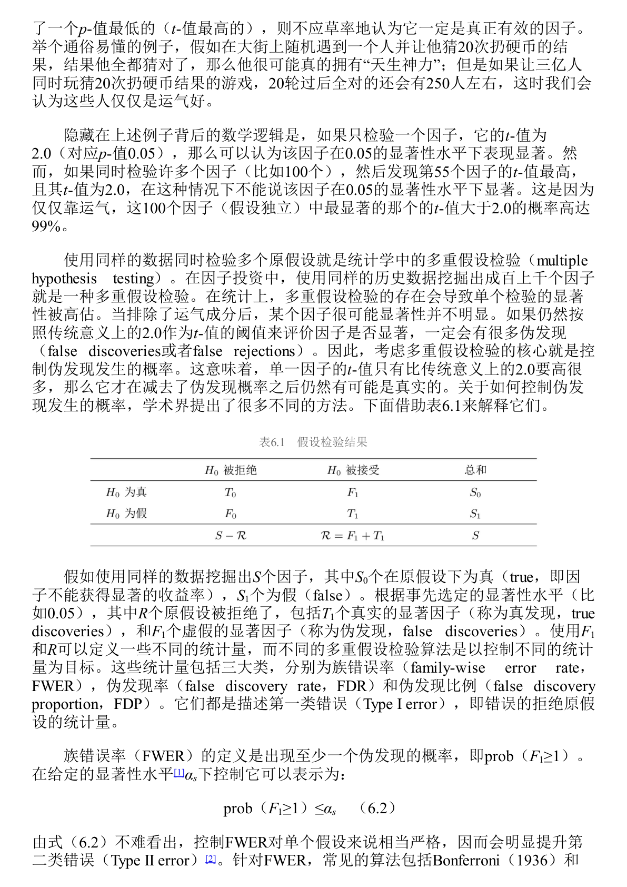

表6.1的意义，是把所有被检验的因子分成“真实状态”和“检验结果”两层。我们真正想控制的是：被我们发现的显著因子里，有多少其实是假货。

| 真实状态 / 检验结果 | 拒绝原假设：被认为显著 | 不拒绝原假设：未被认为显著 | 合计 |
|---|---:|---:|---:|
| 原假设为真：因子其实无效 | F1，伪发现 | T0，正确未发现 | S0 |
| 原假设为假：因子其实有效 | T1，真发现 | F0，遗漏发现 | S1 |
| 合计 | R | S - R | S |

围绕表6.1，书中介绍了三类控制伪发现的指标。

| 指标 | 英文 | 直觉解释 | 特点 |
|---|---|---|---|
| FWER | Family-wise Error Rate | 至少出现一个伪发现的概率 | 很严格，容易把真因子也挡掉 |
| FDR | False Discovery Rate | 被发现的因子中伪发现的平均比例 | 比 FWER 温和，适合大量因子检验 |
| FDP | False Discovery Proportion | 某次研究中伪发现比例超过阈值的概率 | 与 FDR 接近，更关注单次研究结果 |

传统上，很多论文用 t 值 2.0 作为显著门槛。但在因子动物园背景下，这个门槛太低。Harvey 等研究认为，考虑多重检验后，t 值可能至少要超过 3.0；其他研究甚至认为应达到 3.4 或 3.8，才更能排除运气因素。

### 6.1.4 先验：因子要先讲得通

**先验** 指的是在看到数据结果之前，我们根据经济学、金融学和常识，对某个因子是否可能有效形成的初始判断。

如果有人说“盈利能力强的公司未来收益更高”，这个想法至少有基本面逻辑。即使要继续检验，它的先验不低。但如果有人说“股票代码听起来更悦耳的公司收益更高”，即便样本内 p-值很低，也应保持怀疑，因为它缺乏强先验。

书中用音乐家辨识乐谱、老妇人辨别奶茶先加奶还是先加茶、酒馆老板靠酒精预测硬币三个例子说明：同样是低 p-值，不同说法的可信度取决于先验概率。一个想法本身越荒唐，低 p-值越不足以让我们相信它。

因此，6.1 给出的判断原则是：低 p-值、多重检验修正和经济先验要放在一起看。一个因子不能只在历史样本中显著，还要有可解释、可复现、可样本外验证的经济逻辑。

这一节还引入了贝叶斯 p-值。传统 p-值回答 $P(D\mid H_0)$，而贝叶斯框架试图借助先验概率和样本证据，更接近投资者真正关心的 $P(H_0\mid D)$。例如“聪明股票代码因子”原始 p-值很低，但因为先验概率很低，经贝叶斯修正后就不再可信。市场因子、盈利因子这类有较强经济逻辑的因子，修正后更可能保留可信度。

---

## 6.2 从因子动物园到因子大战

6.1 讨论的是“为什么会发现这么多单个因子”。6.2 把问题推进一步：既然因子这么多，应该用哪个多因子模型来解释股票收益？

**多因子模型** 是用多个因子共同解释资产收益的模型。一个好的多因子模型至少要回答两个问题：第一，股票收益背后的驱动力是什么；第二，这些驱动力为什么存在。模型不是为了做排行榜，而是为了加深我们对市场的理解。

### 6.2.1 因子大战：解释更多异象就一定更好吗

作者把近年来多因子模型之间互相比较、互相击败的现象称为**因子大战**。许多模型的比较方式变成了：谁能解释更多异象，谁就更强。

这种比较有意义，但不能成为唯一目标。因为解释更多异象，不等于更理解市场。一个模型可能通过加入更多历史上表现好的变量来提升解释力，但这可能只是更高层次的数据挖掘。

### 6.2.2 形同意不同的投资因子

6.2.1 用 Fama-French 五因子模型和 Hou-Xue-Zhang 四因子模型里的投资因子做例子。两个模型都用过去一年总资产变化率构造投资因子，表面上很像，但经济解释不同。

| 模型 | 投资因子的来源 | 核心含义 |
|---|---|---|
| Hou-Xue-Zhang 四因子模型 | 实体投资经济学 | 控制盈利后，过去投资越多，未来预期收益越低 |
| Fama-French 五因子模型 | 股息贴现模型 | 用过去投资代理未来预期投资，并推导其与预期收益的关系 |

Hou 等人质疑 Fama-French 投资因子的理论基础，认为如果关注未来单期预期收益，股息贴现模型可能推出相反关系。作者倾向认为 Hou 的解释更合理，但也提醒：同一个变量可以被不同理论讲出不同故事，这正是因子大战让人不安的地方。

### 6.2.3 q5 模型：加入预期投资增长

6.2.2 介绍 q5 模型。它是在 Hou-Xue-Zhang 四因子模型基础上，加入第五个因子：**预期投资增长因子**。

这里要区分两个概念。过去投资水平与预期收益通常是负相关，未来投资增长与预期收益则可能是正相关。q5 模型想表达的是：股票收益不仅与盈利和历史投资有关，还与未来投资增长有关。

实际构造时，预期投资增长不是现成财务指标，需要用历史数据建立预测模型，再预测下一期投资与总资产之比的增长率。它理论上更贴近“预期投资增长”，但也引入了模型设定和参数估计误差。

### 6.2.4 因子大战的局限

6.2.3 梳理了 Hou-Xue-Zhang、Stambaugh-Yuan、Daniel-Hirshleifer-Sun、q5 等模型之间的比较。q5 在一些研究中能解释最多异象，暂时显得最强。但作者提醒，将来一定还会有新模型击败它。如果目标只是打赢上一代模型，研究就会变成无限擂台赛。

Fama and French 2018 年的 Choosing factors 更冷静。它强调，模型比较不应只是看解释异象数量，还要看模型是否有理论支撑，是否解释股票收益的共同运动，是否帮助理解风险和收益的关系。

6.2 的核心结论是：不要把模型比较变成解释异象数量的比赛。因子模型的价值在于解释市场，而不只是赢得历史样本中的比赛。

---

## 6.3 用行为金融学解释异象和因子

6.3 开始把因子收益的解释从传统风险补偿转向行为金融学。

**行为金融学** 是研究投资者有限理性、心理偏差、非理性交易以及这些行为如何影响资产价格的学科。传统金融学常说，因子收益代表某种系统性风险补偿；行为金融学则说，许多因子收益可能来自错误定价。

**错误定价** 指价格偏离内在价值。行为金融学要回答两个问题：第一，价格为什么会偏离价值；第二，既然价格错了，为什么理性投资者不马上把它纠正。

### 6.3.1 行为金融学的两大支柱

#### 图表参考：图6.1 与图6.2

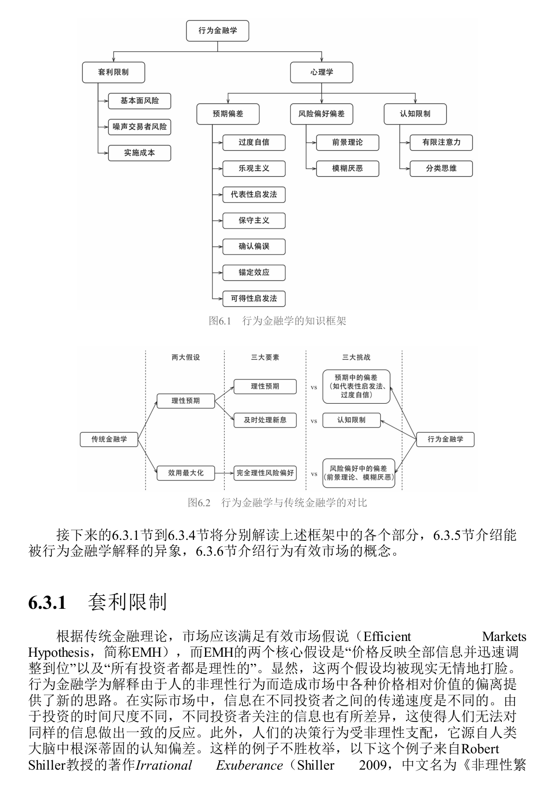

图6.1展示了行为金融学的知识框架。它有两大支柱：**心理学**和**套利限制**。

心理学解释价格为什么会错。投资者会过度自信、锚定、保守、外推、损失厌恶，也会因为注意力有限而处理不好信息。套利限制解释价格为什么不会马上回归价值。即使有理性投资者，他们也可能因为风险、资金约束、做空成本和职业压力而无法充分套利。

图6.2则把传统金融学和行为金融学进行对比。传统金融学假设投资者有理性预期、能及时处理全部信息、风险偏好理性。行为金融学逐一挑战这些假设：预期会偏，信息处理能力有限，风险偏好也会偏。

### 6.3.2 套利限制：价格错了，也未必能轻松赚钱

**套利限制** 指理性投资者无法无成本、无风险地利用错误定价。书中把套利者面临的风险分为三类。

| 套利限制来源 | 含义 | 为什么会阻碍价格回归 |
|---|---|---|
| 基本面风险 | 被低估股票仍可能遭遇真实基本面坏消息 | 很难找到完美对冲标的 |
| 噪声交易者风险 | 错误定价可能在短期变得更严重 | 基金经理可能在价格回归前被赎回或被迫平仓 |
| 实施成本 | 手续费、价差、冲击成本、做空费用、研究成本 | 套利收益可能被成本吃掉 |

这点对因子投资很重要。即使一个因子捕捉到错误定价，也不代表收益是免费午餐。价格可以长期错下去，套利者也可能等不到修正。

书中用阪神大地震后的市场反应说明，重大信息并不总是被价格立刻、理性、完整地吸收。它还引入了噪声交易者概念：噪声交易者把噪声误认为信息，或者只是喜欢交易。噪声制造错误定价，而套利限制让错误定价得以持续。

### 6.3.3 预期中的偏差：投资者如何形成错误判断

**预期偏差** 指投资者对未来的判断并不理性。它影响投资者对公司盈利、股价走势和风险的看法。

| 偏差 | 第一次解释 | 投资中的表现 |
|---|---|---|
| 过度自信 | 人高估自己判断的准确性 | 交易量过大，投资者都觉得自己比市场更懂 |
| 乐观主义 | 人倾向高估好结果发生概率 | 牛市中把好运气误认为能力 |
| 代表性启发法 | 用“像不像”代替概率判断 | 把短期高增长公司误认为长期伟大公司 |
| 小数定律偏误 | 用很少样本推断长期规律 | 十几个样本点就总结“某月效应” |
| 外推信念 | 把最近趋势延伸到未来 | 近期上涨就认为还会涨，近期增长就认为会持续增长 |
| 保守主义 | 观点形成后更新很慢 | 新财报出现后价格反应不足 |
| 确认偏误 | 只找支持自己观点的信息 | 买入后只看利好，忽略反面证据 |
| 锚定效应 | 过度依赖初始数字 | 买入价、历史高点、目标价成为判断锚 |

这些偏差解释了为什么价格会慢慢反应、过度反应，或者在一段时间内沿着错误方向走。

### 6.3.4 风险偏好中的偏差：前景理论和模糊厌恶

**前景理论** 是 Kahneman 和 Tversky 提出的行为决策理论，用来描述人在不确定性下面对收益和亏损时如何做选择。它的核心不是最终财富，而是相对某个参考点的盈利或亏损。

#### 图表参考：图6.3

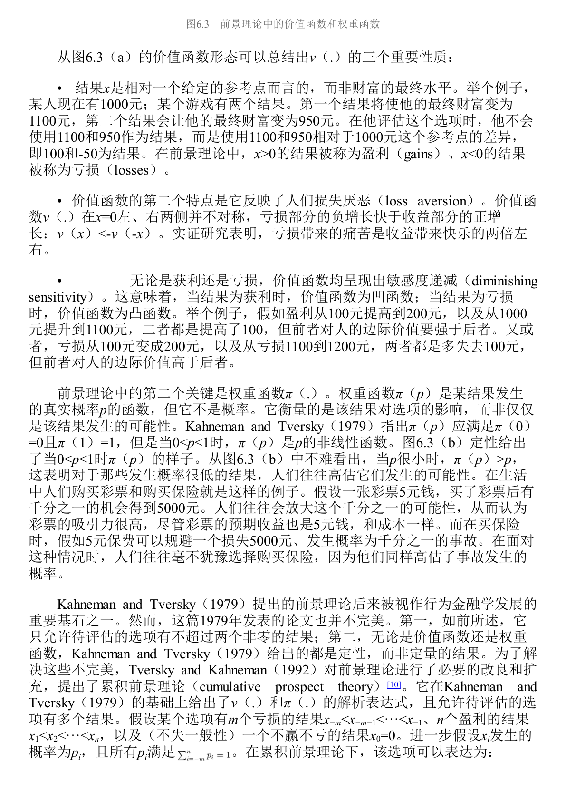

图6.3展示了前景理论的两个核心部件：价值函数和权重函数。

| 部件 | 含义 | 投资含义 |
|---|---|---|
| 价值函数 | 人根据参考点判断盈利或亏损，而不是看最终财富 | 买入价、历史高点会影响投资者行为 |
| 损失厌恶 | 同等金额亏损的痛苦大于盈利的快乐 | 投资者不愿止损，亏损股票拿得久 |
| 敏感度递减 | 离参考点越远，边际感受越弱 | 小亏变中亏比大亏继续扩大更痛 |
| 权重函数 | 人对概率的主观权重不等于真实概率 | 高估小概率暴涨，偏好彩票股，也愿意买保险 |

**累积前景理论** 是对前景理论的扩展，允许一个选项有多个盈利和亏损结果，并给出更完整的函数形式。

#### 图表参考：图6.4

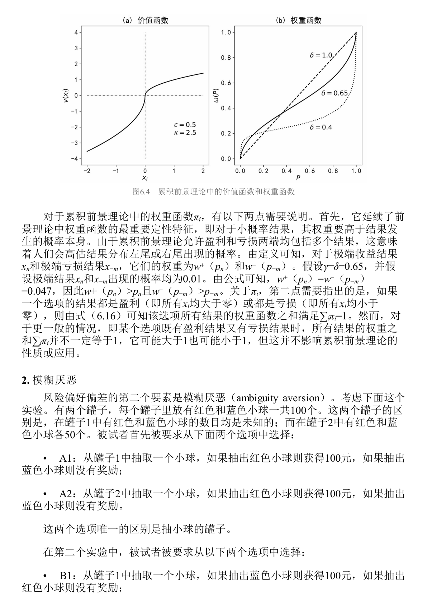

图6.4延续了前景理论的核心直觉：人会放大小概率尾部事件。这解释了为什么投资者喜欢右偏收益股票，也就是所谓彩票股。彩票股有小概率暴涨的想象空间，被追捧后价格过高，未来收益反而可能偏低。

**模糊厌恶** 指人不只是厌恶风险，也厌恶概率分布不清楚的风险。面对已知概率的风险和未知概率的模糊，人通常更喜欢前者。投资中，这表现为偏好熟悉行业、本国股票和看得懂的公司。但“自认为熟悉”也可能被过度自信和确认偏误放大。

### 6.3.5 认知限制：信息公开不等于价格立刻反映

**认知限制** 指人脑处理信息的能力有限。市场信息即使公开，也需要投资者注意到、理解、相信并交易，价格才会反映。

**有限注意力** 说明投资者无法处理全部信息，只能优先处理最显眼、最重要、最容易获得的信息。这可以解释盈余惯性：公司发布超预期盈利后，价格没有立刻调整到位，而是在公告后继续漂移。

**分类思维** 指人为了降低认知负担，会把股票分成成长、价值、小盘、科技、指数成分股等类别。分类有助于理解市场，但也会让投资者忽略个体差异，并导致同一类别股票被一起买卖，从而强化共同运动。

### 6.3.6 行为金融学如何解释市场异象

6.3.5 把前面的心理机制接到具体异象上。

| 异象 | 行为金融解释 |
|---|---|
| 盈余惯性 PEAD | 有限注意力和保守主义导致市场对财报信息反应不足 |
| 短期动量 | 信息扩散慢，投资者逐步修正预期 |
| 长期反转 | 投资者过度外推短期好消息，价格被推得过高后回落 |
| 价值异象 | 市场对坏公司过度悲观、对成长故事过度乐观 |
| 彩票股 / 偏度异象 | 投资者高估小概率暴涨，推高右偏股票价格 |
| 低波动异象 | 亏损投资者偏好高波动股票翻本，导致高波动股票被高估 |
| 处置效应 | 投资者过早卖出盈利股票、迟迟不卖亏损股票 |

其中，盈余惯性解释了“好财报之后还会继续涨、坏财报之后还会继续跌”；动量和长期反转可以放在同一条心理链条里理解：投资者先因保守主义反应不足，随后又因代表性启发和小数定律过度外推。前景理论则解释了彩票股、偏度异象、低波动异象和处置效应；人在盈利区间倾向落袋为安，在亏损区间反而更愿意赌一把。

### 6.3.7 行为有效市场：价格会错，但市场仍难被打败

6.3.6 用**行为有效市场**收束。它把市场有效拆成两层含义：第一，价格等于价值；第二，市场难以被战胜。

行为金融学认为，第一层经常不成立。价格可能偏离价值。但第二层仍然可能成立。即使价格错了，普通投资者也很难知道真实价值、修正时间和交易成本，更可能在价格回归前承受亏损、赎回或平仓压力。

因此，市场可以不完全有效，但仍然没有免费午餐。

这也是 Fischer Black 关于噪声观点的含义：噪声让市场不够有效，但也阻止投资者轻松利用这种无效性。市场会错，不代表普通投资者能稳定、低成本地从错误中赚钱。

---

## 6.4 投资者情绪

6.3 把行为偏差拆开讲。6.4 问的是：现实市场里偏差交织在一起，有没有一个综合指标能描述市场整体处在兴奋还是低落状态？

这个指标就是**投资者情绪**。它可以理解成投资者对未来的系统性乐观或悲观。情绪高涨时，投资者更愿意相信好故事、追逐成长、小盘、年轻、难估值、投机性强的股票；情绪低迷时，投资者更偏好成熟、稳健、可估值的股票。

### 6.4.1 投资者情绪为什么重要

书中用资产定价公式6.17引出情绪：

$$
p_t=\mathbb{E}_t\left[m_{t+1}x_{t+1}\right]
$$

当前价格由未来现金流和随机折现因子共同决定。Shiller 的研究发现，股票价格波动远大于基本面波动。如果基本面无法解释如此大的价格波动，那么折现因子的剧烈变化就很重要。行为金融学认为，投资者情绪正是造成折现因子波动的重要来源之一。

### 6.4.2 Baker-Wurgler 投资者情绪指标

#### 图表参考：表6.2

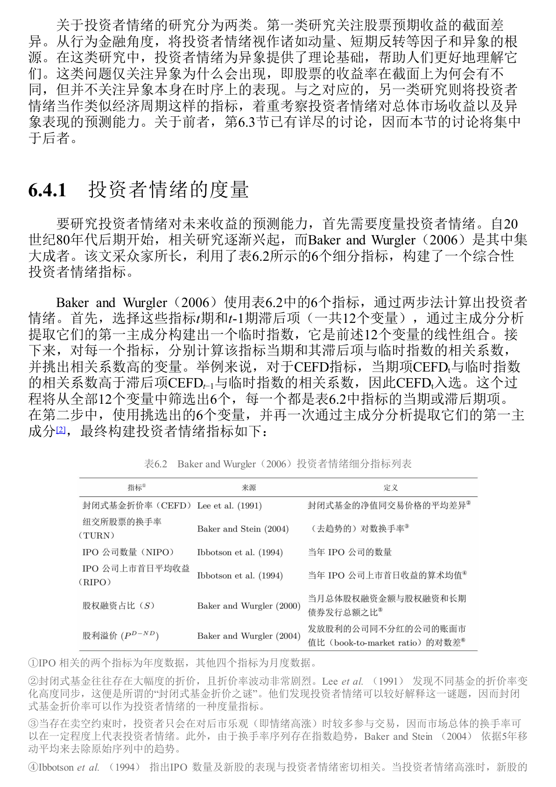

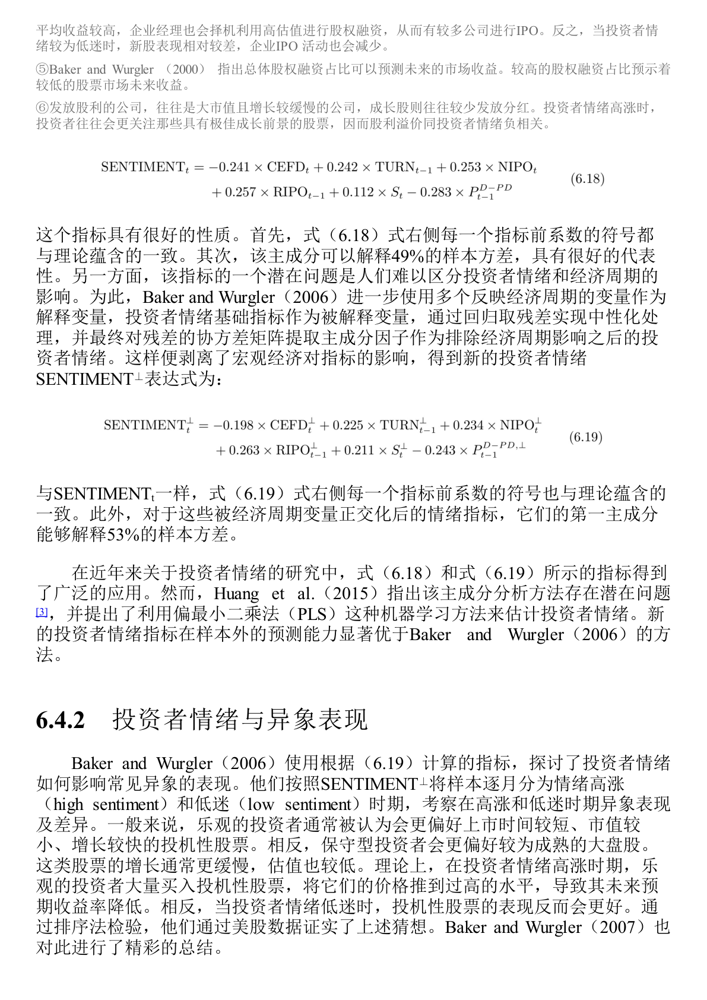

Baker and Wurgler 使用多个市场行为指标合成投资者情绪。因为情绪不能直接观察，只能通过市场留下的痕迹来推断。

| 指标 | 含义 | 为什么能反映情绪 |
|---|---|---|
| 封闭式基金折价率 | 基金价格相对净值的折价 | 折价同步变化可反映噪声交易者情绪 |
| 市场换手率 | 市场整体交易活跃程度 | 情绪高涨时投资者更愿意交易 |
| IPO 数量 | 新上市公司数量 | 情绪热时企业更愿意趁高估值上市 |
| IPO 首日收益 | 新股上市首日表现 | 情绪热时新股更受追捧 |
| 股权融资占比 | 企业融资中股权融资比例 | 高估值时期企业更倾向发行股票 |
| 股利溢价 | 分红公司相对不分红公司的估值差异 | 情绪高涨时投资者更偏好成长股，分红股相对不受追捧 |

Baker-Wurgler 方法用主成分分析提取这些指标的共同成分，得到综合情绪指标。之后又用宏观经济变量正交化，剥离经济周期影响，得到更接近“纯情绪”的 $\mathrm{SENTIMENT}^{\perp}$。

### 6.4.3 投资者情绪与异象表现

投资者情绪高涨时，投机性强、难估值、难套利的股票更容易被高估，未来收益更低。情绪低迷时，这些股票反而可能表现更好。

Stambaugh 等研究进一步发现，许多异象在不同情绪状态下的表现差异，主要来自**空头端**。也就是说，情绪高涨时，那些本来应该被做空的股票被市场推得更贵，未来收益更差；多头端的表现差异反而不明显。

这很重要。很多因子收益不是因为好股票在高情绪时特别好，而是坏股票在高情绪时特别贵。

这部分也解释了为什么情绪指标更像一个“状态变量”。它不是单个心理偏差，而是把过度乐观、外推、风险偏好变化、投资者结构变化等因素合在一起。高情绪环境下，空头端更容易被推到过高价格，因此许多异象的多空收益在高情绪之后更明显。

### 6.4.4 投资者情绪与市场表现

投资者情绪还会影响整个市场的风险收益关系。Yu and Yuan 发现，情绪低迷时，市场更符合传统金融学：高风险对应高预期收益。情绪高涨时，风险收益关系被破坏，因为投资者愿意追逐风险，不再要求足够补偿。

其他研究还发现，情绪可以跨资产传播。股票、债券、大宗商品、地产、货币市场之间，不只是基本面和利率相连，情绪也会互相影响。

管理者情绪也是一个重要扩展。通过公司公告和电话会议文本可以提取管理层情绪。管理者情绪高时，市场未来收益往往较低，可能因为企业部门也在情绪高涨时过度扩张。

---

## 6.5 风险补偿、错误定价还是数据窥探

6.5 是全章的方法论核心。一个异象样本内有效，可能有三种原因：风险补偿、错误定价、数据窥探。

**风险补偿** 是传统金融学解释：投资者赚到高收益，是因为承担了某种系统性风险。  
**错误定价** 是行为金融学解释：投资者犯错造成价格偏离价值，套利限制让偏离持续。  
**数据窥探** 是更冷酷的解释：这个因子不是真的，只是在样本内过拟合。

### 6.5.1 风险补偿检验

如果异象来自风险补偿，高收益端应当承担更高风险。风险补偿检验主要看三件事。

| 检验角度 | 逻辑 | 如果不成立意味着什么 |
|---|---|---|
| 常识检验 | 高收益股票是否真的更危险 | 若基本面更强的股票收益更高，很难说是风险补偿 |
| beta 与特征比较 | 若变量代表风险，风险暴露 beta 应比特征本身更能预测收益 | 若特征更强，可能是错误定价 |
| 宏观状态检验 | 真风险补偿应在宏观风险状态中体现 | 若衰退期不差，风险解释变弱 |

例如盈余惯性中，好消息公司未来跑赢坏消息公司。如果说这是风险补偿，就等于说好消息公司比坏消息公司更危险，这在常识上很难成立。

### 6.5.2 错误定价检验

如果异象来自错误定价，收益应当表现出价格逐步修正的特征。

| 检验方法 | 第一次解释 | 错误定价含义 |
|---|---|---|
| 业绩公告期检验 | 看因子收益是否集中在财报公告窗口 | 财报释放新信息，帮助纠正原先错误定价 |
| SUE 检验 | SUE 是标准化预期外盈利 | 若因子能预测未来 SUE，说明它捕捉了尚未反映的基本面信息 |
| 有限注意力检验 | 用小市值、低分析师覆盖、少媒体报道等代理低关注度 | 若低关注股票中异象更强，支持错误定价 |
| 套利成本检验 | 用特质波动率、做空难度、机构持股低等代理套利成本 | 若高套利成本股票中异象更强，说明错误定价难被消除 |

错误定价检验的核心不是问“这个因子有没有收益”，而是问收益是否来自市场逐步理解和修正价格。

### 6.5.3 数据窥探检验

**数据窥探** 是指研究者在同一批历史数据中反复测试变量，最终挑出样本内表现最好的结果。它与 6.1 的 p-hacking 和多重假设检验一脉相承。

Harvey 等人研究 316 个异象后发现，排除多重检验影响后，绝大多数异象无法保持显著。

#### 图表参考：表6.3 36个会计类异象的样本外检验

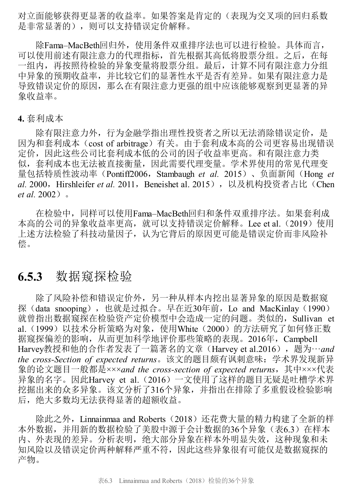

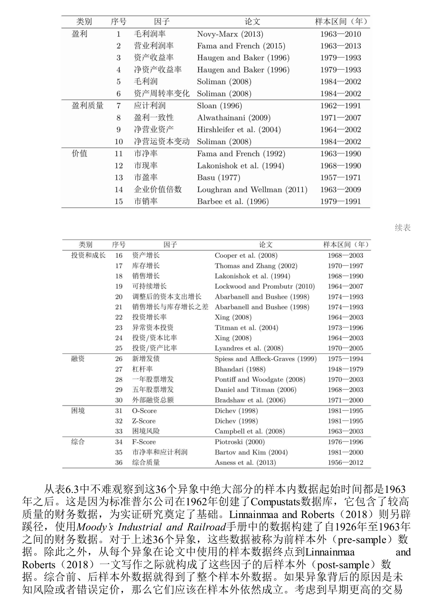

Linnainmaa and Roberts 使用新构建的样本外数据检验 36 个会计类异象。许多异象原本用 1963 年后的 Compustat 数据发现。他们又用 Moody’s 手册重建 1926 到 1963 年财务数据，形成前样本外数据，并用论文发表后的时期形成后样本外数据。

| 检验阶段 | 含义 | 发现 |
|---|---|---|
| 样本内 | 原论文使用的数据区间 | 36 个异象普遍显著 |
| 前样本外 | 原样本之前、未被发现过程使用的数据 | 显著异象大幅减少 |
| 后样本外 | 论文发表后的新数据 | 显著异象也大幅减少 |

如果异象真来自风险补偿或错误定价，它在样本外应当大体成立。大面积失效更像数据窥探。

6.5 的总原则是：一个因子要先过来源检验，再谈投资价值。

这一节的实用价值在于建立检验顺序。先用常识和资产定价模型看风险补偿是否合理，再用业绩公告期、未来基本面、有限注意力和套利成本检验错误定价，最后用前样本外、后样本外、跨市场数据排除数据窥探。一个因子即使样本内收益很高，如果过不了这些检验，也不应被轻易用于实盘。

---

## 6.6 因子样本外失效风险

6.5 已经说明，很多因子样本内有效可能只是数据窥探。6.6 进一步讨论：即使一个因子是真的，为什么样本外表现仍然会变差。

样本外表现变差有三个主要原因：**曝光导致错误定价减弱、因子拥挤、交易成本**。

### 6.6.1 曝光导致错误定价减弱

如果一个因子收益来自错误定价，那么它被发现、发表、传播之后，就不再是少数人的秘密。聪明资金会开始交易这个因子，原来的错误定价被压缩，未来收益自然下降。

McLean and Pontiff 研究 97 个因子后发现，因子样本外表现比样本内下降，发表后表现下降更明显。两者差额可以理解为“发表本身”带来的收益衰减。逻辑链很直接：因子被公开，交易者变多，错误定价被修正，因子收益下降。

Bowles 等研究从财务信息时效性角度补充了这个结论。传统学术回测常用年度再平衡，容易让财务因子看起来有较长有效期。但如果使用记录财务指标真实更新时间的数据库，许多财务因子的收益主要集中在信息更新后的前 120 天，尤其是前 30 天。信息被市场吸收得越快，错误定价窗口就越短。

### 6.6.2 因子拥挤

**因子拥挤** 指太多资金交易相似因子、持有相似股票。某个因子过去表现好，资金追入，相关股票被买贵，未来预期收益下降。

| 拥挤指标 | 含义 | 拥挤时的信号 |
|---|---|---|
| 估值价差 | 因子多空两端估值差异 | 多头变贵或多空估值差被压缩 |
| 配对相关性 | 因子组合内股票特质收益同步性 | 同一组合股票越来越一起涨跌 |
| 因子波动率 | 因子收益本身的波动 | 资金进出加剧波动 |
| 因子反转 | 因子过去几年累计收益过高后反转 | 过去太强可能意味着未来收益被透支 |

拥挤不只是降低未来收益，还会带来流动性冲击。2007 年 8 月，美股一些量化基金短期大亏，就是因为许多管理人持有相似头寸，一旦有人平仓，其他人也被迫卖出，流动性压力迅速放大。

### 6.6.3 交易成本

许多学术因子展示的是纸面毛收益，没有充分考虑手续费、买卖价差、市场冲击、做空费用和做空限制。现实中，很多因子的收益来自小市值、低流动性、难做空股票，扣除成本后可能大幅缩水。

| 成本类型 | 影响 |
|---|---|
| 手续费和税费 | 直接降低组合收益 |
| 买卖价差 | 高频调仓和低流动性股票中特别重要 |
| 价格冲击 | 大资金交易会推高买入价、压低卖出价 |
| 做空成本 | 多空因子若依赖空头端，现实收益可能被高估 |
| 换手率 | 调仓越频繁，成本侵蚀越严重 |

Novy-Marx 和 Velikov 提出降低交易成本的三个思路：只用交易成本低的股票构建组合，降低再平衡频率，交易时加入更严格的价差约束。

Chen and Velikov 研究 120 个因子后发现，考虑交易成本后，许多因子样本外收益非常低，甚至接近随机因子的表现。经验贝叶斯修正选择偏差后，即便排名靠前的因子，发表后收益也明显缩水。

6.6 的结论不是因子没有价值，而是要对样本外收益有现实预期。真因子也会被公开、被拥挤、被成本侵蚀。只有具备强先验、能承受拥挤周期、并且扣除交易成本后仍有净收益的因子，才更值得长期使用。

作者最后保留了审慎乐观。像价值、动量这类有充分先验基础的因子，长期仍可能有效。原因是：若其来自真实风险，风险补偿不会凭空消失；若其来自行为偏差，只要投资者的动物精神、有限注意力和认知偏差仍存在，错误定价也不会完全消失。但“知道一个因子”不等于“懂这个因子”，“懂”也不等于能长期坚持执行。

---

## 6.7 因子投资难以取代基本面分析

6.7 讨论一个实际问题：很多因子都来自财务报表，比如 BM、ROE、ROA、盈利质量、资产增长。既然如此，因子投资能不能替代传统基本面分析？

作者的答案是不能。原因不是基本面因子没有价值，而是几个财务指标只是对公司内在价值的粗略近似，无法完整理解公司业务、行业变化、会计处理、盈利可持续性和财报背后的真实经济含义。

### 6.7.1 基本面分析与基本面量化投资

**基本面分析** 源自 Graham 和 Dodd 的《证券分析》，目标是通过定量和定性分析估计证券内在价值。它关心未来现金流、现金流质量、竞争格局、管理层行为、会计质量和风险。

**基本面量化投资**，也常称 quantamental，是把一部分基本面判断转化为可计算、可排序、可回测的因子。例如用 BM 表示价值，用 ROE 或 ROA 表示质量，用资产增长率表示投资，用盈利变化表示盈利能力。

这种方法有巨大优点：低成本、可规模化、可分散、可纪律化执行。但它也有天然缺陷：它看到的是财务指标结果，不一定理解这些结果的来源。

### 6.7.2 质量因子指数的粗糙性

#### 图表参考：表6.4

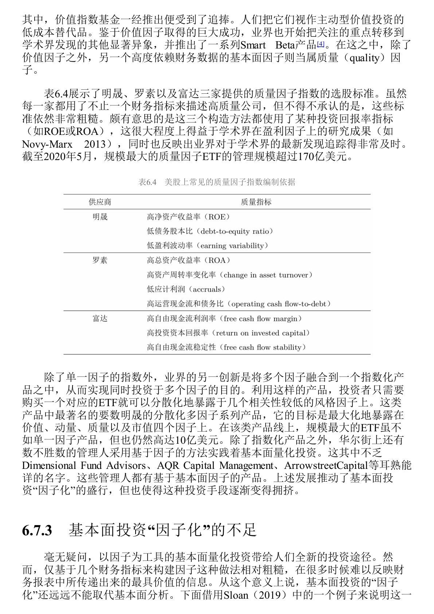

表6.4展示了不同机构如何构造质量因子指数。它们通常使用 ROE、ROA、杠杆、盈利稳定性等指标。这些指标有用，但仍然粗糙。ROE 高不等于真实质量高，低杠杆不等于风险低，现金流好也可能来自一次性因素或会计处理。

### 6.7.3 BIG5 案例

#### 图表参考：表6.5

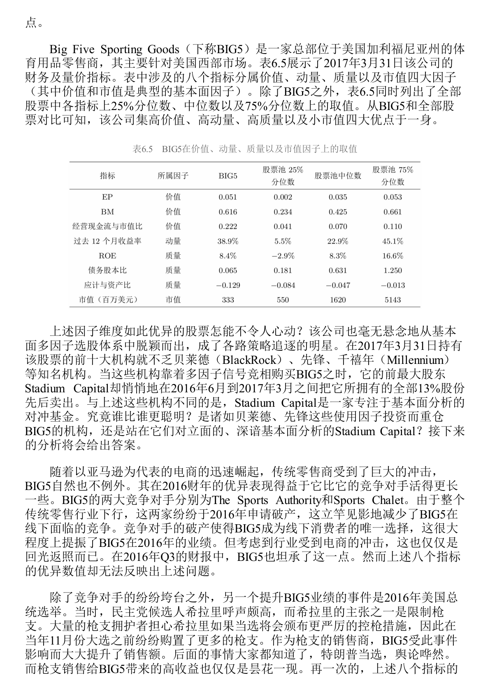

Big Five Sporting Goods 是一家美国体育用品零售商。按表6.5，2017 年 3 月 31 日，它在价值、动量、质量和市值维度都很优秀。一个多因子模型很容易把它选出来。

但基本面分析揭示了另一面。BIG5 的好业绩来自两类短期事件。第一，主要竞争对手破产，让它短期受益；第二，2016 年美国总统选举前，控枪预期刺激枪支购买，推高销售。这些都不是长期竞争优势。

更重要的是，ROE 也有会计扭曲。BIG5 的 PP&E 账面净值因折旧被压低，导致账面权益偏低，从而机械抬高 ROE。Sloan 调整后，ROE 从 8.4% 降到 3.9%，债务股本比也从低杠杆变成高杠杆。也就是说，因子模型看到高质量，基本面分析看到的是不可持续业绩和财务陷阱。

这个案例说明：因子能筛出“看起来像好股票”的股票，基本面分析才判断它到底是不是好公司。

BIG5 案例的关键不是否定量化，而是说明财务指标必须被解释。价值因子看到便宜，质量因子看到 ROE，动量因子看到近期表现；基本面分析则继续追问：销售增长来自可持续竞争优势，还是竞争对手破产和大选前枪支需求？ROE 来自真实盈利能力，还是资产账面价值被折旧压低？现金流来自经营质量，还是应付账款带来的暂时改善？

### 6.7.4 ROA 分解

#### 图表参考：表6.6

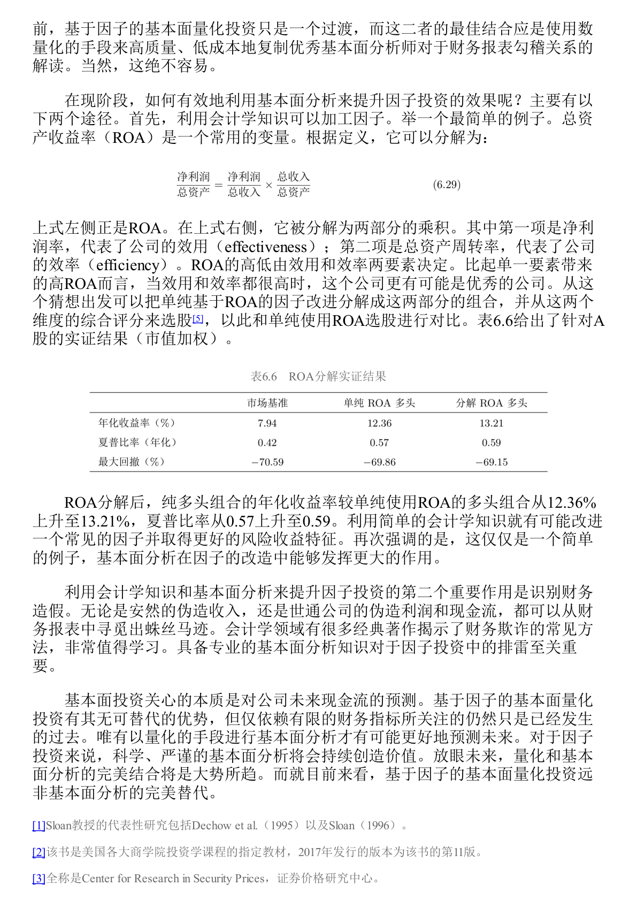

作者没有否定因子投资，而是主张把基本面分析和量化方法结合。一个简单例子是 ROA 分解：

$$
\mathrm{ROA}
=\frac{\text{净利润}}{\text{总资产}}
=\frac{\text{净利润}}{\text{销售收入}}
\times
\frac{\text{销售收入}}{\text{总资产}}
=\text{净利润率}\times\text{总资产周转率}
$$

净利润率代表公司的效用，即赚钱能力；总资产周转率代表公司的效率，即资产使用速度。两个公司 ROA 一样，质量可能完全不同。如果一家公司同时有较高利润率和较高周转率，它可能比单纯 ROA 高的公司更优。

表6.6显示，在 A 股实证中，把 ROA 拆成净利润率和总资产周转率综合评分，能比单纯 ROA 因子取得更好的风险收益特征。提升并不夸张，但意义很清楚：哪怕只是加入一点会计学理解，也可能改进一个普通因子。

6.7 的结论是：基本面因子是基本面分析的一种简化表达，但不是完整替代。未来更好的方向，是用量化方法低成本复制优秀基本面分析师对财务报表、行业结构和盈利可持续性的理解。

因此，基本面量化投资适合用概率和分散化取胜，不适合假装每一个被选出的股票都是真正好公司。它的优势是规模化、低成本、纪律化；基本面分析的优势是理解个案、识别会计陷阱和判断未来现金流。二者最佳关系不是替代，而是融合。

---

## 6.8 机器学习与因子投资

6.8 是本章最后一节。它讨论机器学习如何进入因子投资，也提醒机器学习不是万能答案。

**机器学习** 在这里可以理解为一系列服务于统计预测的高维模型，以及相应的模型选择、正则化和防过拟合方法。放到因子投资里，它主要做两件事：预测收益和选择特征。

### 6.8.1 线性模型：从 OLS 到正则化

**OLS** 是普通最小二乘回归。它简单、直观，但在因子投资这种高维、噪音大、变量多的场景里，很容易过拟合。

因此，机器学习中的线性模型通常会做改进。

| 方法 | 第一次解释 | 作用 |
|---|---|---|
| 稳健回归 | 降低极端值对估计的影响 | 适应金融收益肥尾分布 |
| Ridge | 加 L2 惩罚的回归 | 压缩参数，降低过拟合 |
| LASSO | 加 L1 惩罚的回归 | 可把部分变量系数压到 0，起到特征筛选作用 |
| Elastic Net | 同时加入 L1 和 L2 惩罚 | 兼顾压缩和筛选 |
| PCR / PLS | 降维后再回归 | 从高维变量中提取稳定信息 |
| 广义线性模型 | 允许非线性变换或分类目标 | 可预测是否跑赢、收益分组等 |
| 混合预测 | 对多个模型预测取平均 | 平滑单一模型误差 |

线性模型的重点不是普通 OLS，而是通过稳健、惩罚、降维和混合预测来控制过拟合。

### 6.8.2 非线性模型：捕捉交互，但更要防过拟合

非线性模型用于捕捉公司特征和未来收益之间更复杂的关系。很多特征单独看可能不强，但组合起来有意义。例如“小市值 + 高盈利”和“小市值 + 低盈利”可能是完全不同的股票。

| 模型 | 第一次解释 | 优点 | 风险 |
|---|---|---|---|
| 决策树 / 回归树 | 用一系列规则切分样本 | 自然捕捉变量交互 | 单棵树容易过拟合 |
| Boosting / GBDT / XGBoost | 逐步训练弱模型修正前一步残差 | 预测能力强，能处理复杂非线性 | 参数多，需正则化 |
| Bagging / 随机森林 | 并行训练多棵树后平均 | 降低单棵树过拟合 | 可解释性下降 |
| SVM | 用核函数映射到高维空间再分割 | 可形成非线性边界 | 在现代实践中常不如树模型和神经网络常用 |
| 神经网络 | 多层非线性变换拟合复杂函数 | 灵活、预测能力强 | 黑箱、参数多、极易过拟合 |

非线性模型的价值在于捕捉复杂关系；风险也来自这种灵活性。模型越强，越要严格检验样本外表现。

### 6.8.3 模型评估：样本外才是真考场

因子投资中，模型样本内拟合好并不稀奇。真正重要的是样本外预测能力。

书中介绍了样本外可决系数 $R^2_{\mathrm{OOS}}$。它比较模型预测误差和基准预测误差。若模型比基准更准，样本外 $R^2_{\mathrm{OOS}}$ 为正；若还不如基准，则为负。

Gu et al. 认为，对个股收益预测，不应使用历史均值作为基准，因为个股历史均值本来就很差。更合理的基准是 $0$。个股收益预测中，样本外 $R^2_{\mathrm{OOS}}$ 超过 $0.5\%$ 就已经有价值，因为股票收益噪音极大。

Gu et al. 使用 1957 到 2016 年美股数据，考虑 94 种公司特征、8 个宏观变量及交互项、74 个行业分类，共 920 个特征，比较 13 类模型。结论大致是：

| 模型类型 | 表现 |
|---|---|
| 普通 OLS | 很差，尤其在大盘股中 |
| 带约束线性模型 | 明显优于 OLS |
| 树模型 | 表现不错 |
| 神经网络 | 通常最好，尤其 3 层隐藏层模型 |
| 特征重要性 | 美股中趋势类特征最重要；A 股中交易摩擦和流动性特征更重要 |

机器学习有效，不是因为模型复杂本身，而是因为高维特征、正则化、防过拟合、非线性建模和严格样本外评估共同发挥作用。

这里还要注意基准选择。对市场整体收益预测，历史均值可以作为基准；但对个股收益预测，历史均值本身很差，Gu et al. 建议使用 $0$ 作为基准。个股收益预测的样本外 $R^2_{\mathrm{OOS}}$ 即使只有 $0.5\%$ 以上，也可能有实际价值，因为股票收益噪音极大。

### 6.8.4 PCA、IPCA 和 PR-PCA：从数据中发现隐性因子

**PCA** 是主成分分析，用来从大量变量中提取共同变化方向。它属于无监督学习，不直接用未来收益作为标签，而是从数据结构里寻找潜在因子。

传统多因子模型要先指定市场、规模、价值、动量等因子。但真实定价因子未必是我们能直接观察的变量。**隐性因子模型** 的思路是：真实因子隐藏在股票收益共同运动背后，PCA 可以从协方差矩阵中提取这些共同波动方向。

| 方法 | 核心思想 | 意义 |
|---|---|---|
| PCA | 从收益协方差矩阵提取主成分 | 不必事先指定全部真实因子 |
| 稀疏 PCA | 从大量宏观变量中提取可解释主成分 | 兼顾降维和经济解释 |
| IPCA | 用公司特征作为因子暴露的工具变量 | 处理动态条件资产定价 |
| PR-PCA | 在 PCA 中加入平均收益信息 | 不只解释共同运动，也解释截面收益差异 |

这些方法给因子投资带来新方向：不只是人工定义因子，也可以从数据中提取隐性因子。不过它们要真正转化为投资策略，还需要解决可解释性、可交易性、卖空约束和稳健性问题。

IPCA 的重要性在于把公司特征和动态因子暴露联系起来。经典模型常把 beta 当成相对固定的暴露，而 IPCA 允许暴露随公司特征变化。PR-PCA 的重要性在于提醒我们，因子不仅要解释共同波动，也要解释平均收益差异；只解释协方差结构还不够。

### 6.8.5 机器学习的问题

机器学习强，但有两个核心问题：黑箱和过拟合。

**黑箱** 指模型给出预测，但难以解释为什么。投资不是图像识别。真实资金要承受亏损、交易成本和失效风险，因此模型不能只给信号，还要能解释哪些特征重要、为什么与收益有关、什么时候可能失效。

**过拟合** 在金融里尤其严重。真实资产价格路径只有一条，月度样本很短，金融数据有自相关和异方差，普通交叉验证容易信息泄漏。反复调模型、调参数、调特征，本质上也可能变成更高级的 p-hacking。

| 问题 | 表现 | 应对思路 |
|---|---|---|
| 黑箱 | 难以解释模型为何预测 | 分析特征重要性，寻找经济逻辑 |
| 样本短 | 美股月度数据完整历史也只有数百个月 | 严格样本外检验，降低模型复杂度 |
| 数据泄漏 | 训练集信息进入测试集 | 使用严格时间切分 |
| 多次尝试 | 最好模型可能只是幸运 | 使用平减夏普比率、模拟多路径 |
| 交易约束 | 模型预测不等于可交易收益 | 加入成本、容量、换手、做空限制 |

6.8 的结论是：机器学习会在因子投资中越来越重要，但最佳路径不是替代经典多因子模型，而是与经济逻辑、基本面分析、样本外检验和交易约束结合。

机器学习的最大风险，是把 6.1 中的 p-hacking 升级为更复杂的模型搜索。前向回测能避免未来数据，但不能避免研究者根据多次回测结果不断调模型。普通交叉验证也可能因金融时间序列自相关而泄漏信息。因此，机器学习模型必须同时接受样本外、经济逻辑、交易成本和可解释性的约束。

---

## 全章最终复盘

第6章的核心不是“找到更多因子”，而是建立一套判断因子的审查框架。

| 问题 | 对应章节 | 判断原则 |
|---|---|---|
| 因子是不是统计幻觉 | 6.1 | 看 p-hacking、多重检验、先验 |
| 模型是不是只是赢了历史比赛 | 6.2 | 看是否真正解释收益驱动力 |
| 因子为什么可能有效 | 6.3 | 看心理偏差和套利限制 |
| 市场状态如何影响异象 | 6.4 | 看投资者情绪及空头端高估 |
| 收益来源是什么 | 6.5 | 区分风险补偿、错误定价、数据窥探 |
| 样本外为什么衰减 | 6.6 | 看曝光、拥挤、交易成本 |
| 财务因子是否足够 | 6.7 | 因子不能替代基本面分析 |
| 机器学习是否可靠 | 6.8 | 看样本外、解释性、防过拟合 |

如果以后看到一个新因子，可以按下面顺序检查：

1. 它是不是经过大量尝试后挑出来的？
2. 它的显著性有没有考虑多重检验？
3. 它在看到数据前是否就有经济逻辑？
4. 它的收益更像风险补偿，还是错误定价？
5. 它在样本外、跨市场、跨时期是否仍有效？
6. 它是否已经被曝光、拥挤或交易成本侵蚀？
7. 它是否能通过基本面或行为金融解释？
8. 如果用了机器学习，模型是否可解释、是否严格防止过拟合？

这就是本章真正要传达的投资纪律：因子投资不是寻找历史上最漂亮的信号，而是不断追问信号为什么存在、什么时候会失效、现实中能不能交易，以及长期是否有足够坚实的逻辑支撑。
